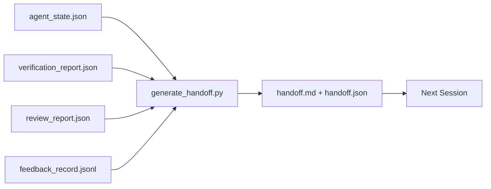

# Çoklu Sessiyonlar

> Bu iş bitmek üzere. İş bitmeyecek. Bu teslim paket "Ajent bir saat çalıştı" kelimesini "Bir sonraki seans ilk dakika verimli" kelimesine dönüştüren bir eserdir.

**Type:** Build
**Languages:** Python (stdlib)
**Prerequisites:** Phase 14 · 34 (Repo Memory), Phase 14 · 38 (Verification), Phase 14 · 39 (Reviewer)
**Time:** ~50 minutes

## Öğrenme Hedefleri

- Her teslimat paketinin ihtiyaç duyduğu yedi alanı belirleyin.
- El yazısı olmayan eserlerden bir el uzatma oluşturun.
- Büyük geri bildirim kayıtlarını bir teslimat boyutunda bir özetleyiciye ayırın.
- Bir sonraki seansın ilk hareketi belirleyici olsun.

## Sorun

Sessiyon sona erer. Ajan "iyi, ilerleme kaydettik". der. Bir sonraki seans açılır. Bir sonraki ajan "Nerede bıraktık?" sorar. Birinci ajanın cevabı kaybolur. Bir sonraki ajan aynı emirleri yeniden keşfeder, tekrar çalışır, aynı soruları tekrar insanına sorar ve önceki seansın son otuz saniyesini geri kazanmak için otuz dakika yakar.

Bu işlemin sonuna kadar her seansda yanlış bir teslimatın maliyeti ödenir. Düzeltme, oturum sonunda otomatik olarak oluşturulan bir pakettir: ne değişti, neden, ne denedi, ne başarısız oldu, ne kaldı, bir sonraki sefer ilk ne yapılması.

## Anlaşım



### Her bir elbise yedi alan taşır.

| Field | Question it answers |
|-------|---------------------|
| `summary` | One paragraph of what was done |
| `changed_files` | The diff at a glance |
| `commands_run` | What was actually executed |
| `failed_attempts` | What was tried and why it did not work |
| `open_risks` | What could bite next session, with severity |
| `next_action` | The first concrete step next session takes |
| `verdict_pointer` | Path to the verification + review reports |

- Evet .`next_action`Bu da bir yük taşıyan bir alan.`next_action`Bu bir durum raporu, bir elverme değil.

### Elveriler yazılı değil, oluşturulur.

El yazılı bir teslimat, zor bir günde atlanmayan bir teslimatdır. Generatör masaüstü eserlerini okuyor ve paketleri yayar. Ajanın görevi, masaüstüyi jeneratörün özetleyebileceği bir durumda bırakmak, özetlemeyi yazmak değil.

### İki biçim: insan okuyabilir ve makine okuyabilir

`handoff.md`İnsan okuduğu şey bu.`handoff.json`Bu da bir sonraki ajanın yüklediği şey. her ikisi de aynı kaynak eserlerinden geliyor. Eğer farklılık gösterirlerse JSON kazanır.

### İsteğe bağlılık kayıtları

Tam olarak .`feedback_record.jsonl`Bu sayede, bir sonraki seansda, tüm kayıtlar yüklenir, ancak paket küçük kalır.

### Temiz bir durum bırakın.

Bir el uzatma işi tanımlar temiz bir durum işi tekrar başlatabilir yapar.`handoff.md`Bir sonraki seans yarı uygulanan bir fark, ajanın unuttuğu bir geçici dosya, bir sapık dal ve hataları çalıştırmadan önce test ederse değersiz olur.

Bu nedenle, seans işlev çalışınca bitmez. İş masası jeneratörün özetleyebileceği ve sonraki seansın güvendiği bir durumda olduğunda biter. Temizlik kendi aşamasıdır, teslimattan önce çalıştırılır ve bir kontroldür, alışkanlık değil, çünkü bir alışkanlık zor bir günde atılan şeydir.

| Check | Clean means | Dirty blocks because |
|-------|-------------|----------------------|
| Working tree | Every change committed or explicitly stashed with a note | A half-applied diff looks like intentional work to the next agent |
| Temp artifacts | No `*.tmp`, scratch dirs, debug prints, or commented-out blocks left behind | Stray files pollute the diff and the next agent's mental model |
| Tests | Green, or red with the failure named in `open_risks` | A silent red test is a trap the next session steps in |
| Feature board | `feature_list.json` status reflects reality (Phase 14 · 36) | A stale board sends the next session to work that is already done |
| Branch | On the expected branch, no detached HEAD, no orphan branches | Wrong branch means the next session's first commit lands in the wrong place |

Temizlik aşamasında bir `clean_state.json`Bu iki eseri çiftleştirir: temizlik iş destiği güvenli olduğunu kanıtlar, teslimat bir sonraki oturum nerede başlayacağını biliyor olduğunu kanıtlar.

```figure
wb-handoff-packet
```

## Yapın

`code/main.py`Uygulamaları:

- Bir devlete, hüküm, inceleme ve geri bildirim toplayan bir yüklemeci.`WorkbenchSnapshot`- Evet .
- A.`generate_handoff(snapshot) -> (markdown, payload)`fonksiyon.
- Son K geri bildirim girişlerini ve tüm sıfır dışı çıkışları seçen bir filtre.
- Yazan bir demo çalıştırma`handoff.md`ve `handoff.json`Senaryoya yan yana.

Çek şunu:

```
python3 code/main.py
```

Çıktı: basılı bir teslimat vücudu, artı iki dosya da diskte.

## Doğada üretim biçimleri

Codex CLI, Claude Code ve OpenCode her biri farklı bir sıkıştırma hikayesi gönderir; yapılandırılmış teslim paketleri üçünün üstünde yer alır.

**Compaction strategies vary; the packet schema does not.**Codex CLI'nin POST /v1/response/compact'i, sunucu tarafındaki bir çürük AES blobudur (OpenAI modelleri için hızlı yol); geri dönüşü, bir  olarak eklenen yerel bir "handoff özet"tir.`_summary`Claude Code, bağlamın %95'inde beş aşamalı ilerleyici sıkıştırmayı çalışır. OpenCode, zaman damgasına dayalı mesaj saklama ve 5 başlıklı bir LLM özetini yapar. Aynı ihtiyaç olan üç farklı mekanizma: sıkıştırmayı sağlayanları taşınabilir bir eser olarak seriyeleştirmek. Paket o eserdir.

**Fresh-session handoff is not compaction.**Kompaksiyon bir seansı uzatır; el uzatma birini temiz bir şekilde kapatır ve bir sonraki seansı başlar. Hermes Soru #20372 çerçevesinde (Epril 2026) doğru: yerleşik sıkıştırma azalmaya başladığında, ajan kompakt bir el uzatma yazmalı, oturumunu sona erdirmeli ve yeni bir bağlamda devam etmeli. Bu geçişin ucuz olmasını paket sağlıyor. Hata, kalite çökene kadar sıkıştırmaya devam etmektir; çözüm, erken, temiz bir teslim için bütçe yapmaktır.

**One active handoff per branch and topic.**Çoklu ajan koordinasyonu, kötü model çıkışından daha fazla eski teslimatlarda bozulur.`branch`- Evet .`last_known_good_commit`, ve bir `status``active | superseded | archived`- Stajı elveriler arşivlenir; sadece aktif olan sonraki oturumları yönlendirir.

**Wrap up before 50-75% context, not at the wall.**El yazılı desen oyun kitabı (CLAUDE.md + HANDOVER.md) oturumun %95 yerine %50-75% bağlam bütçesi ile sona ermesinde en iyi sonuçları bildirir. Sıkıştırma eserleri kaynak durumunu kirletmeden önce paket jeneratörü temiz çalışır. Bağlam sağlamken yazmak ucuz; model zaten yerini kaybederken pahalı.

## Kullan

Üretim biçimleri:

- **Session-end hook.**Kullanıcı sohbetini kapatırken çalıştırma zamanı jeneratörü çalıştırır.`outputs/handoff/<session_id>/`- Evet .
- **PR template.**Generatörün belirlenmesi de bir PR kurumu.
- **Cross-agent handoff.**Bir ürünle inşa edin (Claude Code), bir başka ile devam edin (Codex).

Paket küçük, düzenli ve ucuz üretilir.

## Gönder

`outputs/skill-handoff-generator.md`projeyi çalıştırmak için bir projeyi düzenleyen bir jeneratör, bir seans sonu hok ve`handoff.json`Bir sonraki ajanın başlangıçta okuduğu bir schema.

## Egzersizler

1. Bir ekle`assumptions_to_validate`Bu alan, inşaatçı tarafından kaydedilen her varsayımın üstündeki bir puanı içerir.
2. Geçerlilerle karşılaştırıldığında başarısız koşular için geri bildirim özetini farklı bir şekilde kes.
3. Bir sorunun bir sohbet mesajına karşı paketine girmesi için hangi sınır vardır?
4. Generatörü idempotent yapın: iki kez çalıştırmak aynı paket üretir.
5. Bir sonraki seansın hareket etmeden önce yüklemesi gereken eserlerin tam olarak listelendiği "kötü seans ön ön önlemleri" bölümünü ekleyin.

## Anahtar Terimler

| Term | What people say | What it actually means |
|------|----------------|------------------------|
| Handoff packet | "Session summary" | Generated artifact carrying the seven fields, both markdown and JSON |
| Next action | "What to do first" | The one concrete step that starts the next session |
| Feedback trim | "Log summary" | Last K records plus every non-zero exit |
| Status report | "What we did" | A document missing `next_action`; useful, but not a handoff |
| Verdict pointer | "Receipt" | Path to the verification + review reports for traceability |

## Daha Fazla Okumak

- [Anthropic, Effective harnesses for long-running agents](https://www.anthropic.com/engineering/effective-harnesses-for-long-running-agents)
- [OpenAI Agents SDK handoffs](https://openai.github.io/openai-agents-python/handoffs/)
- [Codex Blog, Codex CLI Context Compaction: Architecture, Configuration, Managing Long Sessions](https://codex.danielvaughan.com/2026/03/31/codex-cli-context-compaction-architecture/) POST /v1/response/compact ve yerel geri dönüş
- [Justin3go, Shedding Heavy Memories: Context Compaction in Codex, Claude Code, OpenCode](https://justin3go.com/en/posts/2026/04/09-context-compaction-in-codex-claude-code-and-opencode) Üç satıcı kompaktasyon karşılaştırması
- [JD Hodges, Claude Handoff Prompt: How to Keep Context Across Sessions (2026)](https://www.jdhodges.com/blog/ai-session-handoffs-keep-context-across-conversations/) CLAUDE.md + HANDOVER.md, bağlam bütçesi %50-75
- [Mervin Praison, Managing Handoffs in Multi-Agent Coding Sessions: Fresh Context Without Losing Continuity](https://mer.vin/2026/04/managing-handoffs-in-multi-agent-coding-sessions-fresh-context-without-losing-continuity/) Değişken sistemlerin çerçevesini oluşturmak
- [Hermes Issue #20372 — automatic fresh-session handoff when compression becomes risky](https://github.com/NousResearch/hermes-agent/issues/20372)
- [Hermes Issue #499 — Context Compaction Quality Overhaul](https://github.com/NousResearch/hermes-agent/issues/499) Codex CLI'de el ele yönelik çağrılar
- [Microsoft Agent Framework, Compaction](https://learn.microsoft.com/en-us/agent-framework/agents/conversations/compaction)
- [OpenCode, Context Management and Compaction](https://deepwiki.com/sst/opencode/2.4-context-management-and-compaction)
- [LangChain, Context Engineering for Agents](https://www.langchain.com/blog/context-engineering-for-agents)
- Fase 14 · 34  jeneratör okuyan durum dosyası
- Ekipman ve diğer gruplar,
- Ekipman: Ekipman: Ekipman: Ekipman: Ekipman: Ekipman: Ekipman: Ekipman: Ekipman: Ekipman: Ekipman: Ekipman: Ekipman: Ekipman: Ekipman: Ekipman: Ekipman: Ekipman: Ekipman: Ekipman: Ekipman: Ekipman: Ekipman: Ekipman: Ekipman: Ekipman: Ekipman: Ekipman: Ekipman: Ekipman: Ekipman: Ekipman: Ekipman: Ekipman: Ekipman: Ekipman: Ekipman: Ekipman: Ekipman: Ekipman: Ekipman: Ekipman: Ekipman: Ekipman: Ekipman: Ekipman: Ekipman: Ekipman: Ekipman: Ekipman: Ekipman: Ekipman: Ekipman: Ekipman: Ekipman: Ekipman: Ekipman: Ekipman: Ekipman: Ekipman: Ekipman: Ekipman: Ekipman: Ekipman: Ekipman: Ekipman: Ekipman: Ekipman: Ekipman: Ekipman: Ekipman: Ekipman: Ekipman: Ekipman: Ekipman: Ekipman: Ekipman: Ekipman: Ekipman: Ekipman: Ekipman: Ekipman: Ekipman: Ekipment: Ekipment: Ekipment: Ekipment: Ekipment: Ekipment: Ekipment: Ekipment: Ekipment: Ekipment: Ekipment: Ekipment: Ekipment: Ekipment: Ekipment: Ekipment: Ekipment: Ekipment: Ekipment: Ekipment: Ekipment: Ekipment: Ekipment: Ekipment:
