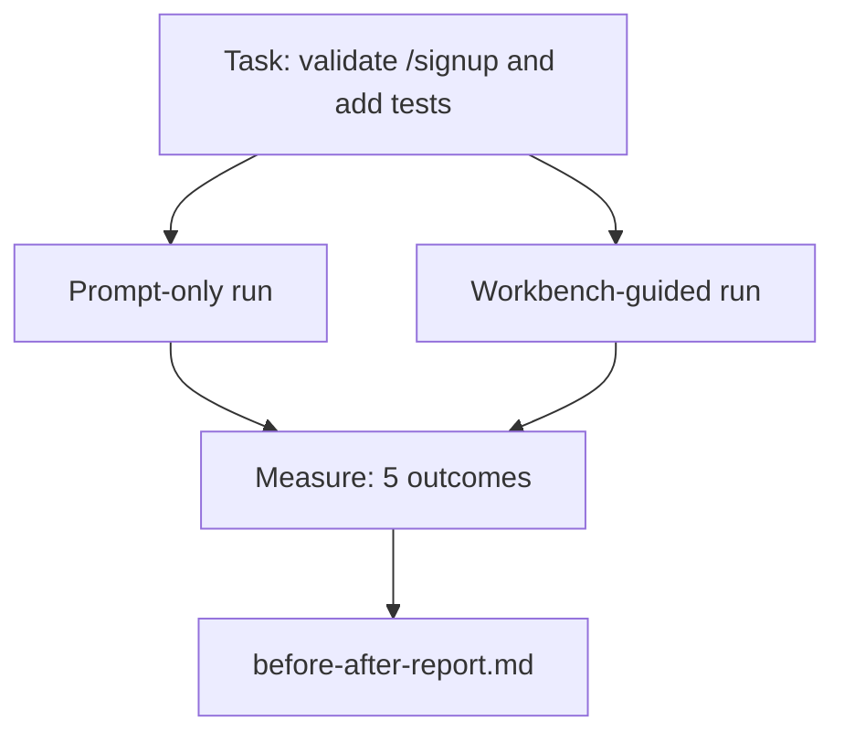

# Gerçek bir Repo'da Çalışma Masaları

> 11 yüzey dersi gerçek bir kod tabanı ile temas yapmadan hayatta kalmazsa hiçbir değeri yoktur. Bu ders küçük bir örnek uygulamada iki kez aynı görevi yerine getirir: sadece istekle yönlendirilmiş ile masa üzerinde yönlendirilmiş.

**Type:** Build
**Languages:** Python (stdlib)
**Prerequisites:** Phases 14 · 32 to 14 · 40
**Time:** ~60 minutes

## Öğrenme Hedefleri

- Yedi çalışma masaya yüzeyini küçük bir uygulamaya birleştirin.
- Aynı görevi iki kez (sadece çabuk ve masa üzerinde çalışarak) yapın ve beş sonuç ölçün.
- Ön/dönüş raporu okuyun ve hangi yüzeylerin en fazla kaldıraç verdiğini belirleyin.
- "Ama benim modelim yeterince iyi" tepkisine karşı çalışma tahtasını savun.

## Sorun

Oyuncak görevleri üzerinde bir demo kimseyi ikna etmez. İş masası için durum gerçek hisseden bir repo görevinin daha az başarısızlık, daha az geri dönüş ve bir sonraki oturumda kullanabileceği bir paket ile üretime girdiğinde yapılır.

Bu ders gerçek bir repo hissini gönderir ve her iki boru hattı boyunca aynı görevi yürütür.

## Anlaşım



### Örnek uygulaması

FastAPI tarzında en az bir işlemci .`sample_app/`- ...

- `app.py`- Evet .`/signup`(Hâlâ onaylanmamış).
- `test_app.py`Bir mutluluk yolu testi ile.
- `README.md`ve `scripts/release.sh`yasak bölgedeki yem olarak.

### Görev

>  Giriş doğrulama ekle`/signup`: 8 karakterden kısa şifreleri reddet, 422'yi yazılmış hata zarfıyla geri gönder. Yeni davranışı kanıtlayan bir test ekle.

### İki boru hattı

Sadece hemen:

1. README'yi oku.
2. Oku `app.py`- Evet .
3. Dosyaları düzenle.
4. İddia bitti.

İş stolundan yönlendirilmiş:

1. Başlangıç metni çalıştır (Denevi 35).
2. Sözleşmenin kapsamını okuyun (36 ders).
3. Okuyun (Düşünme 34).
4. Sadece izinli dosyaları düzenle.
5. İstihbarat koşucusu üzerinden kabul komutunu çalıştır (Deneyim 37).
6. Verifikasyon kapısını çalıştır (Deneyim 38).
7. İdare eleştirmeni (Deneyim 39).
8. El uzatma (Denevi 40)

### Ölçülen beş sonuç

| Outcome | Why it matters |
|---------|----------------|
| `tests_actually_run` | Most "tests passed" claims are unverifiable |
| `acceptance_met` | The test that proves the goal must be the test that ran |
| `files_outside_scope` | Scope creep is the dominant silent failure |
| `handoff_quality` | The next session pays for or benefits from this |
| `reviewer_total` | Qualitative judgment on top of the gate |

```figure
wb-ab-runs
```

## Yapın

`code/main.py`Bu nedenle, ölçüm yeniden üretilebilir. Skenar karşılaştırmayı `before-after-report.md`ve `comparison.json`- Evet .

Çek şunu:

```
python3 code/main.py
```

Çıktı: her boru hattı sonucu bir konsol tablosu, senaryoya yakın kaydedilen işaretleme raporu ve onu çizmek isteyen herkes için JSON.

## Doğada üretim biçimleri

Şüpheci sorusu, "iş masası gerçekten ne kadar yardımcı olur?" 2026 rakamları açıklamadan çok daha fazlasını söylüyor.

**Terminal Bench Top-30 to Top-5 on the same model.**LangChain'in *Anatomy of an Agent Harness* (April 2026): Bir kodlama ajanı sadece harness değiştirerek ilk 30'dan dışarı atladı ve Terminal Bench 2.0'da beşinci sıraya yükseldi. Aynı model. Farklı yüzeyler.

**Vercel 80% to 100% by deleting tools.**Vercel, ajanının araçlarının %80'ini sildiğini ve başarının oranını %80'den %100'e taşıdığını bildirdi.

**Harvey 2x accuracy via harness alone.**Hukuk ajanları, model değişimleri olmadan, harman optimizasyonu yoluyla doğruluğunu ikiye katlamışlar.

**88% of enterprise AI agent projects fail to reach production.**preprints.org *Harness Engineering for Language Agents* makalesi (Mart 2026) başarısızlıkları akıl yürütme değil, çalıştırma süresine kadar takip ediyor: eski durum, kırılgan geri denemeler, aşırı büyümüş bağlam, ortalama hatalardan kötü bir iyileşme.

**Long-context collapse.**WebAgent'in başlangıç çizgisi uzun bağlamlı koşullarda %40-50'lik başarının %10'a düşmesi, çoğunlukla sonsuz döngüler ve gol kaybından kaynaklanır.

**False negatives still exist.**Tek adımlı gerçek görevler, tek satırlı lints, formatör çalışmalar, modelin sözde hatırlarken hatırladığı her şey  bunlar sadece anında daha hızlı çalışmalıdır. Benchmark onları dürüstçe saymalıdır, böylece çalışma masası aşırılık olarak çerçevelendirilmez.

Bu yüzden, "harness forever wins" değil, "harness wins forever" demek.

## Kullan

Bu ders , şu dava dosyasını anlatırken:

- Birisi her PR'de neden bir şey olduğunu soruyor .`agent-rules.md`Ve bir kapsam sözleşmesi.
- Bir ekip, "sadece bu sprint için" doğrulama kapısını düşürmek istiyor.
- Yeni bir ajan ürünü başlatılır ve zaman tasarrufu olup olmadığını görmek için taşınabilir bir referans değerine ihtiyacınız var.

Sayılar açıklamadan daha ileri gidiyor.

## Gönder

`outputs/skill-workbench-benchmark.md`her iki boru hattı boyunca herhangi bir ajan ürünü bir projenin kendi örnek uygulaması ile karşılaştırarak ve beş sonucu raporlayan taşınabilir bir değerlendirme harnesidir.

## Egzersizler

1. Altıncı sonuç ekleyin: zaman-birinci-mahiz düzenleme.
2. İşleme tabanında ikinci gün için gerçek bir görevi karşılaştır.
3. "Yalan negatif" geçit ekleyin: sadece isteklenme daha hızlı olabileceği ve çalışma masası genel maliyeti gerçek maliyet olan görevler.
4. Senaryolu "ajan"ı gerçek bir LLM çağrısı ile değiştir.
5. Mühendis olmayan bir kişiye yönelik bir sayfa özet yazarı.

## Anahtar Terimler

| Term | What people say | What it actually means |
|------|----------------|------------------------|
| Sample app | "Toy repo" | Small but realistic enough to exercise all seven surfaces |
| Pipeline | "Workflow" | Ordered sequence of surface reads/writes the agent follows |
| Before/after report | "The receipts" | The artifact you hand to a skeptic |
| False negative | "Workbench overkill" | Tasks where prompt-only is faster; useful to enumerate honestly |
| Workbench benchmark | "Reliability score" | Portable harness that runs the comparison on your codebase |

## Daha Fazla Okumak

- [LangChain, The Anatomy of an Agent Harness](https://blog.langchain.com/the-anatomy-of-an-agent-harness/) Terminal Bench Top-30'dan Top-5'e kadar makbuz
- [MongoDB, The Agent Harness: Why the LLM Is the Smallest Part of Your Agent System](https://www.mongodb.com/company/blog/technical/agent-harness-why-llm-is-smallest-part-of-your-agent-system) Vercel + Harvey sayıları
- [preprints.org, Harness Engineering for Language Agents](https://www.preprints.org/manuscript/202603.1756) 88% işletme başarısızlığı oranı, çalıştırma süresi kök nedenleri
- [HN: Improving 15 LLMs at Coding in One Afternoon. Only the Harness Changed](https://news.ycombinator.com/item?id=46988596) 15 modelde tekrarlanmıştır
- [Cloudflare, Orchestrating AI Code Review at Scale](https://blog.cloudflare.com/ai-code-review/) 131k inceleme süresi / 30 gün üretim
- [Anthropic, Building Effective Agents](https://www.anthropic.com/research/building-effective-agents)
- 14 · 32 ila 14 · 40  bu ders boyunca tüm yüzeyler
- Eğitimsel değerler için bu ders tamamlanır.
- Fase 14 · 30  eval yönlendirilmiş ajan geliştirme aynı harnes bağları içine
