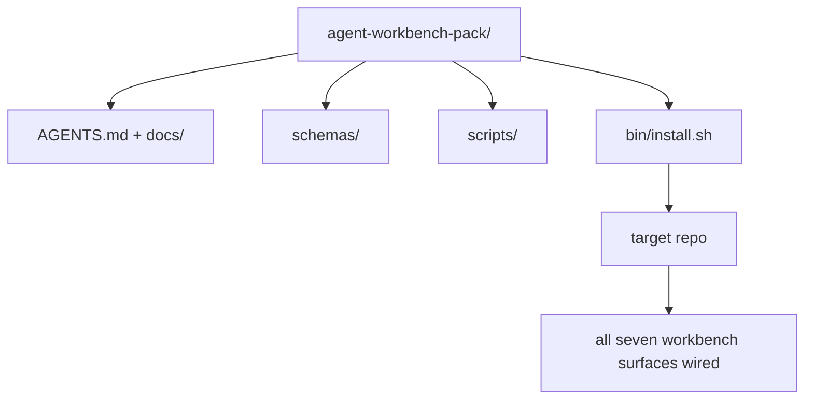

# Kapstone: Bir Yeniden Kullanılabilir Ajan Çalışma Masa Paketi Gönder

> Mini-track, her repo'ya bırakılan bir paketle sona erer.`cp -r`Bu ders programının eseri bu taş.

**Type:** Build
**Languages:** Python (stdlib)
**Prerequisites:** Phases 14 · 31 to 14 · 41
**Time:** ~75 minutes

## Öğrenme Hedefleri

- Yedi çalışma masası yüzeyini tek bir drop-in dizinine paketleyin.
- Şemaları, senaryoları ve şablonları sıkıştırın böylece yeni bir repo bilinen bir temel çizgiye sahip olur.
- Paketi idempotently yere koyacak tek bir yükleme senaryounu ekleyin.
- Her biri için kesikliği savunarak, pakete ne kalır ne de ne kalmaz karar verin.

## Sorun

Google Doküman'da, sohbet geçmişinde ve üç yarı hatırlanan senaryoda yaşayan bir çalışma deski, her çeyrekte yeniden inşa edilen bir çalışma deski. Tedavi bir versiyon paketidir: yüzeyler, şemalar, senaryolar ve tek komut yükleyici olan bir repo veya dizin.

Bu dersi bitireceksin .`outputs/agent-workbench-pack/`Diskte ve bir `bin/install.sh`Bu da onu hedef repo'ya düşürür.

## Anlaşım



### Paket düzenlemesi

```
outputs/agent-workbench-pack/
├── AGENTS.md
├── docs/
│   ├── agent-rules.md
│   ├── reliability-policy.md
│   ├── handoff-protocol.md
│   └── reviewer-rubric.md
├── schemas/
│   ├── agent_state.schema.json
│   ├── task_board.schema.json
│   └── scope_contract.schema.json
├── scripts/
│   ├── init_agent.py
│   ├── run_with_feedback.py
│   ├── verify_agent.py
│   └── generate_handoff.py
├── bin/
│   └── install.sh
└── README.md
```

### Ne kalır, ne kalır.

İçinde:

- Üst planları, sözleşme.
- Yukarıdaki dört senaryo, bu da çalışmanın zamanı.
- Dört belge, kural ve kural.

Dışarıda:

- Projeye özel görevler, görevler hedef repo tahtasına ait, paketlere değil.
- Satıcı SDK çağrıları.
- Toplu takımın içinde değil, mevcut grubun yanında yaşıyor.

### Kurulucu

Kısa bir ...`bin/install.sh`(veya `bin/install.py`):

1. Var olan bir paket üzerinde yüklemeyi reddeder.`--force`- Evet .
2. Paketi hedef repo'ya kopyalar.
3. İK ile bağlantı kurulur`.github/workflows/`var.
4. Sonraki adımları yazdırır: tabloyu doldurun, kabul komutlarını ayarlayın, init metnini çalıştırın.

### Versiyonlama

Paket bir `VERSION`-Skype'de değişiklikler ve senaryo değişiklikleri, göç gerektirir.`agent_state.json`hangi paket versiyonuna karşı başlatılmış olduğunu kaydeder.

```figure
wb-pack-install
```

## Yapın

`code/main.py`paketleri bir araya getirir.`outputs/agent-workbench-pack/`Dersin yanında, bu mini-track'deki önceki derslerin planları ve senaryoları ve zaten yazdığın belgeleri yerleştirilmiş.

Çek şunu:

```
python3 code/main.py
```

Senaryo yüzeyleri kopyalar ve penler, README yazır, paket ağacını yazdırır ve sıfırdan çıkıyor.

## Doğada üretim biçimleri

Bir paket sadece çatal, güncelleştirme ve akıntıdan uzak kalırsa değerlidir.

**`VERSION` is the contract, not the marketing.**Büyük çatlaklar bir devlet göçü gerektirir. Küçük çatlaklar bir kontrol tekrar çalıştırmak gerekir. Çizgi çatlaklar sadece belge. Kurulucu yazar`.workbench-version`Her yükleme için hedef repo 'ya; `lint_pack.py`Eğer hedefinin kilitli anahtarı paketle aynı fikirde değilse göndermeyi reddeder `VERSION`- İşte böyle .`npm`- Evet .`Cargo`ve`pyproject.toml`10 yıl süren bir savaşta hayatta kalmak için. Ajanlar hakkında hiçbir şey kuralları değiştirmez.

**Single source for cross-tool distribution.**Nx gemileri bir .`nx ai-setup`Bu da bir şey.`AGENTS.md`- Evet .`CLAUDE.md`- Evet .`.cursor/rules/`- Evet .`.github/copilot-instructions.md`Bu paket aynı şeyi yapmalıdır; kurulucu simge bağlantıları yayar (`ln -s AGENTS.md CLAUDE.md`Bu yüzden her kodlama ajanına tek bir gerçek kaynağı yayılır.

**`uninstall.sh` that refuses on non-trivial state.**Paketi kaldırmak kullanıcıların adreslerini silmemelidir `agent_state.json`- Evet .`task_board.json`veya`outputs/`- İndirme cihazı, şemaları, senaryoları, belgeleri ve `AGENTS.md`(Bütün bu`--keep-agents-md`Bu durumun bir diğer nedeni de, devlet dosyalarının herhangi bir değişikliğe sahip olmasıdır.

**Skill-as-publishable. SkillKit-style distribution.**Paketler SkillKit yeteneği olarak gemiye gönderilir: `skillkit install agent-workbench-pack`Bu, 32 AI ajanı bir tek kaynaktan oluşturur. Paket repo gerçeğin kaynağıdır; SkillKit dağıtım kanalıdır. Satıcı kilitleme çöker; yedi yüzey aynı kalır.

## Kullan

Paket gemileri üç yere:

- **As a directory you drop into a repo.** `cp -r outputs/agent-workbench-pack /path/to/repo`- Evet .
- **As a public template repo.**Kork ve özelleştir,  ile`VERSION`Akıntı kontrolü.
- **As a SkillKit skill.**Ajanın ürünüyle bağlantılı, böylece tek bir komut onu belirler.

Her paket bir resept, her kurulum bir porsiyon.

## Gönder

`outputs/skill-workbench-pack.md`proje ayarlı bir paket oluşturur: takım tarihine göre kurallar, repo ile eşleşen kapsam küpleri, bir alan özel giriş ile genişletilmiş rubrik boyutları.

## Egzersizler

1. Hangi beşinci dokümenin kanonik grupta terfi edilmeye layık olduğuna karar verin.
2. Kurulucuyu Python olarak yeniden yaz `--dry-run`Ergonomiyi bash ile karşılaştır.
3. Bir ekle`bin/uninstall.sh`Bu, paketi güvenli bir şekilde çıkarır ve devlet dosyalarının önemsiz geçmişi varsa reddeder.
4. Bir ekle`lint_pack.py`Paketin çıkışında başarısız olur.`VERSION`- Topluğun kendi repo için bilgi kaynağına gönder.
5. Bu paketle birlikte elden yuvarlanan bir masaüstüden hareket eden bir yolcu defteri yazarı.

## Anahtar Terimler

| Term | What people say | What it actually means |
|------|----------------|------------------------|
| Workbench pack | "The starter kit" | A versioned directory carrying all seven surfaces |
| Installer | "Setup script" | `bin/install.sh` that lays the pack down idempotently |
| Pack version | "VERSION" | Major bumps for schema/script changes, patch for doc-only |
| Drop-in pack | "cp -r and go" | Pack works without per-repo customization on day one |
| Forkable template | "GitHub template" | Public repo that GitHub's "Use this template" can clone from |

## Daha Fazla Okumak

- 14 · 31 ila 14 · 41  Bu paket her yüzeyi toplar
- [SkillKit](https://github.com/rohitg00/skillkit) 32 AI ajanına bu beceriyi yükle
- [Nx Blog, Teach Your AI Agent How to Work in a Monorepo](https://nx.dev/blog/nx-ai-agent-skills) 6 alet üzerinde tek kaynaklı jeneratör
- [agents.md — the open spec](https://agents.md/) paketinizin yönlendirici neyi uygulamalı
- [HKUDS/OpenHarness](https://github.com/HKUDS/OpenHarness) Paket eşdeğerinin referans uygulanması
- [andrewgarst/agentic_harness](https://github.com/andrewgarst/agentic_harness) Evaluation Suite ile Redis desteklenmiş referans
- [Augment Code, A good AGENTS.md is a model upgrade](https://www.augmentcode.com/blog/how-to-write-good-agents-dot-md-files) paket belgeler kaliteli çubuğu
- [Anthropic, Effective harnesses for long-running agents](https://www.anthropic.com/engineering/effective-harnesses-for-long-running-agents)
- [Anthropic, Harness design for long-running application development](https://www.anthropic.com/engineering/harness-design-long-running-apps)
- Ekipmanın doğrulama kapısını tüketen değerlendirme yöntemiyle çalışan ajan geliştirme aşaması 14 · 30 
- EY 14 · 41  bu paket ön/sonu referans değerini
