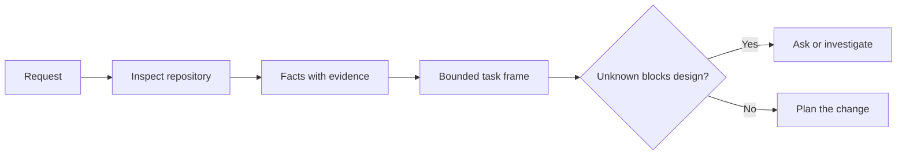

# Ajan kod yazmadan önce görevi çerçeve et

> Bir kodlama ajanı net bir görevi hızlı bir şekilde uygulayabilir. Aynı zamanda net olmayan bir görevi de hızlı bir şekilde uygulayabilir. Hız aynı. Maliyet aynı değil.

**Type:** Learn + Build
**Languages:** Python (stdlib)
**Prerequisites:** Phase 14 lessons 31 and 36
**Time:** ~60 minutes

## Öğrenme Hedefleri

- Düzenleme yapmadan önce bir istekyi sınırlı bir görev çerçevesine çevirin.
- Depolama gerçeklerini varsayımlardan ve açık sorulardan ayır.
- İzin verilen yolları, yasak yolları ve kabul kanıtı tanımlayın.
- İş başlamak için keşif ne zaman yeterli karar verin.

## Pahalı Başarısızlık

Duplikat e-posta koruma eklemek özel görünüyor. Bu değil. Eşsizlik API, alan hizmetine veya veritabanına ait mi? karşılaştırma durumlara duyarlı mı? Hangi hata şekli zaten kamuoyuna açık mı? Göçmenlik izin veriliyor mu? Hangi test davranışı kanıtlıyor?

Bu tehlikeli bir durumdur çünkü uygulama temiz, test edilebilir ve hala sistemle uyumsuz olabilir.

Bu nedenle kodlama ajanı çalışmasının ilk birimi bir düzenleme değil, deposu kanıtları tarafından desteklenen bir görev çerçevesi.

## Görev Çerçeve

Bir kullanışlı çerçeve altı alanı vardır:

| Field | Question |
|---|---|
| Goal | What observable behavior must change? |
| Repository facts | What did you verify in code, tests, config, or history? |
| Allowed paths | Where may the change land? |
| Forbidden paths | What must remain untouched? |
| Acceptance evidence | Which commands or observations prove the goal? |
| Unknowns | Which decisions still need evidence or human judgment? |

Gerçekler onaylara ihtiyaç duyar. API, 409'u kopyalar için kullanır.  mevcut test veya işlemeciyi gösterebilene kadar gerçek değildir. Dosya yolu ve satırı yeterlidir. Davranış önemli olduğunda komut sonucu daha iyidir.



## Tanışmak Zorlukları Aramak

Tüm deposu okumayın. Değişimi kısıtlayan yüzeyleri arayın:

1. Şu anki davranış ve çağrıcısı.
2. - En yakın test.
3. Kamu sözleşmesi veya serileşmiş şekli.
4. Yolu yönlendiren proje talimatları.
5. Yapım ve doğrulama komutları.
6. Yerel düzenleri ortaya çıkaran benzer tamamlanmış değişiklikler.

Planlanan her kararın ya kanıtlarla desteklendiği, açıkça delegasyon edildiği ya da bilinmeyen olarak listelendiği zaman durun.

## Bilinmeyenler Başarısızlık Değildir

Bilinmeyen bir boşluk kontrol edilir. Bir varsayım bu boşluğa kontrolsüz bir cevap.

Bilinmeyen her birini sınıflandır:

- **Discoverable:**deposu veya çalıştırma sistemi cevap verebilir.
- **Decidable:**Görev sözleşmesi, ajanın seçme yetkisini verir.
- **Human:**seçim ürün davranışını, maliyetini, riskini veya kamu uyumluluğunu değiştirir.
- **Deferred:**Seçim bu parçadan dışarıda ve hedefsizler arasında yer alıyor.

Ajan keşfedilebilir ve delegasyonlanmış bilinmeyenler üzerinden devam etmeli.

## Uygulama Öncesinde Kabul

Parçadan önce kanıt yaz.

- odaklanmış birim veya entegrasyon test komutası;
- Adlı bir görüntüleme limanı ve beklenen durumlu bir tarayıcı yolculuğu;
- bir tel istek ve tam cevap sözleşmesi;
- Bir eşiğin değerini belirleyen bir performans ölçümü;
- ilgili olmayan dosyaların değiştirilmediğini doğrulayan bir kapsam kontrolü.

Tests pass bir kanıt planı değildir.

## Yapın

Laboratuvar bir `TaskFrame`, sınırlarını ve kanıtlarını doğruluyor ve yazıyor `outputs/task-frame.md`- Evet .

Bu ders dizininden çalıştır:

```bash
python3 code/main.py
python3 -m unittest discover code/tests -v
```

Örnekyi dört şekilde kırın: hedefi kaldırın, bir gerçek kaydını çıkarın, izin verilen ve yasaklanan bir yolu örtüşün ve kabul komutunu kaldırın.

## Gerçek Bir Depoda Kullanın

Bir ajanı düzenlemesini istemekten önce:

1. Hedefi bir davranış olarak yaz, dosya değişikliği değil.
2. İki ya da üç gerçek, tam kanıtla yaz.
3. En küçük izin verilen yol setiyi isimlendirin.
4. Negatif alanı açıkça isimlendirin.
5. Görevin sonunu belirten komut ya da gözlem yaz.
6. Henüz kazanmadığın kararları listele.

Çerçeve bir ekrana sığmalıdır. Eğer yapılmazsa, görev bağımsız olarak doğrulanabilir birden fazla değişiklik içerebilir.

## Egzersizler

1. Çözümü önermeden deposu birinden gerçek bir hata çerçeve.
2. Çerçeve içinde bir iddia bul ki aslında bir varsayımdır ve onu kanıtlarla değiştir.
3. Cevabı açık sözleşmeyi değiştirecek bir bilinmeyen insan ekleyin.
4. En küçük güvenli setiye geniş yol açın.
5. Kabul kanıtına bir kapsam risit ekleyin.

## Daha Fazla Okumak

- [Nuseibeh and Easterbrook, Requirements Engineering: A Roadmap](https://www.cs.toronto.edu/~sme/papers/2000/ICSE2000.pdf), uygulamayı gerçek dünya hedeflerine ve gelişmekte olan kısıtlamalara bağlamak için.
- [Yang et al., SWE-agent: Agent-Computer Interfaces Enable Automated Software Engineering](https://arxiv.org/abs/2405.15793), bir kodlama ajanının çevresindeki arayüzün etkinliğini değiştirdiğini kanıtlamak için.

## Neyi Saklarsın

- Tutun .`outputs/task-frame.md`. Bir sonraki dersin girişidir, çerçeve kanıtlara dayalı bir yürütme planı haline gelir.
