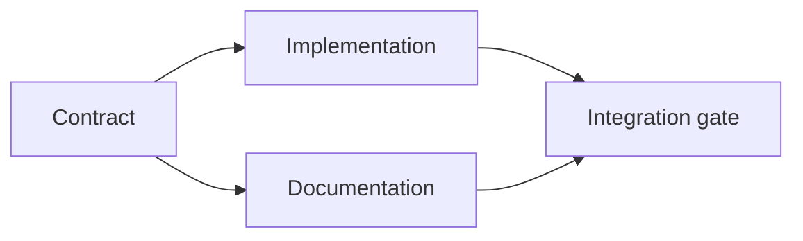

# Kanıtlara Dayalı Bir İnfaz Planı Yapın

> Bir plan daha güzel bir yapılacak listesi değil, her değişimin bir nedeni ve her terminal düğümün bir kanıtı olan bir bağımlılık grafiği.

**Type:** Learn + Build
**Languages:** Python (stdlib)
**Prerequisites:** Phase 14 lesson 43
**Time:** ~65 minutes

## Öğrenme Hedefleri

- Bir görev çerçevesini kanıt ve kanıt ile iş öğelerine dönüştürün.
- Model sıralama, proza sırası yerine bağımlılıklar olarak.
- Düzenleme yapmadan önce eksik olan gerçekleri, bilinmeyen bağımlılıkları ve döngüleri tespit edin.
- Birlikte yürüyebilecek ayrı adımlar beklemek zorunda kalan adımlardan.

## Ajanların Planları Neden Başarısız Oldu?

Zayıf planlar gelecekte tekrarlanır:

1. API'yi güncelle.
2. Testler ekle.
3. Belgeleri güncelle.

Bu listede ne bulduğumu, bu dosyaların neden doğru olduğunu, hangi sözleşmenin ilk olarak değiştiğini ya da aynı anda neler olabileceğini söyleyen bir şey yoktur.

Güçlü bir plan her bir çalışma noktası için beş taahhüt içerir:

| Commitment | Purpose |
|---|---|
| Identifier | Stable reference for dependencies and handoff |
| Change | The smallest behavior or contract change |
| Evidence | Repository facts that justify the change |
| Dependencies | Work that must be true first |
| Proof | The exact check that closes the item |

## Sözleşmeyi Başlatmadan Önce Planlayın

Birden fazla yüzey aynı davranışa bağlı olduğunda, önce davranışı tanımlayın. Testler, uygulama, belge ve entegrasyon, dört versiyonu icat etmek yerine bir sözleşmeyi paylaşabilir.



Grafik güvenli bir eşzamanlılığı ortaya çıkarır. Uygulama ve belgeleşme sözleşme sabitlenince birlikte devam edebilir.

## Kanıt Planı Değiştirir

Depo kanıtları dekorasyon değildir.

- Var olan bir yardımcı planlanan yeni bir soyutlamayı kaldırır.
- Uygunluk testi bir göç adımını zorlar.
- Bir dağıtım kısıtlaması bir schema değişikliğini başka bir göreve taşıyor.
- Kamu tepkisi türü uygulamanın ve belgelendirme sırasını değiştirir.

Eğer kanıtlar planı değiştiremezse, bu kararın bir kanıtı olmayabilir.

## Kesinti için tasarlanmıştır

Programlama ajanı seansları beklenmedik şekilde sona erer. Yeniden başlatılabilir bir plan, başka bir seansın belirleyebileceği kadar küçük iş öğelerini içerir:

- hangi madde tamamlanmıştır;
- Hangi kanıt çıktı;
- hangi eserler değişti;
- hangi bağımlılıkların şimdi engellendiği;
- Bir sonraki güvenli eşya ne olacak?

Sadece sohbet içindeki işaretleme kutusu içinde durum kodu koyma.

## Planı Doğrulama

Planı, uygulanmadan önce reddetmek için:

- bir kimlik numarası ikili olarak kullanılır;
- bir iş parçası için kanıt bulunmaz;
- bir iş parçası için kanıt yoktur;
- bir bağımlılık, bilinmeyen bir öğeye isimlendirilir;
- Grafik bir döngü içerir;
- İlk geri dönüşü olmayan eylem, ilgili belirsizlik çözülmeden önce gerçekleşir.

İlk beş kontrol mekanik, sonuncusu da açıkça yapılmalı.

## Yapın

`code/main.py`modeller çalışmak öğeleri, onların alınanları doğruladı, topolojik bir tür ile yürütme dalgaları hesaplar ve yazıyor `outputs/evidence-plan.json`- Evet .

Çık:

```bash
python3 code/main.py
python3 -m unittest discover code/tests -v
```

Örnek üç dalga üretir. Sözleşme tanımı önce çalışır. Uygulama ve belge bir arada çalışır. Entegre kapısı sonuncu.

## Bir Kodlama Ajansı ile Kullan

Dosyaları değiştirmeden önce ajanın planı hazırlamasını iste.

1. Her yol ve davranış iddiası bir depo makbuzu var.
2. Her bir şeyin tamamlanmasının bir kanıtı vardır.
3. Grafik, bağlı olduğu belirsizlik çözülene kadar pahalı veya geri dönüşü olmayan çalışmayı geciktirir.

Planı onayla, dikkatli olmayı belirsiz bir söz değil.

## Egzersizler

1. Açıkça insan onayını gerektiren bir göç öğesi ekleyin.
2. Bir döngü oluşturun ve arkasındaki gizli ürün anlaşmazlığını açıklayın.
3. İki kanıt komutuna sahip bir öğeyi bölün.
4. İkinci dalga ile mevcut herhangi bir dalı dokunmadan çalışabilecek bir iş öğesini ekleyin.
5. Planı Markdown olarak göster ve JSON'u gerçek kaynağı olarak tut.

## Daha Fazla Okumak

- [Nuseibeh and Easterbrook, Requirements Engineering: A Roadmap](https://www.cs.toronto.edu/~sme/papers/2000/ICSE2000.pdf), hedefler, özellikler, anlaşma ve evrim arasındaki tekrarlayıcı ilişki için.
- [Barry Boehm, A Spiral Model of Software Development and Enhancement](https://dl.acm.org/doi/10.1145/12944.12948), sabit bir çizgilik sırayla değil, risk çözümü etrafında gelişmeyi düzenlemek için.

## Neyi Saklarsın

- Tutun .`outputs/evidence-plan.json`Bir sonraki dersde delegasyon sözleşmesi olacak.
