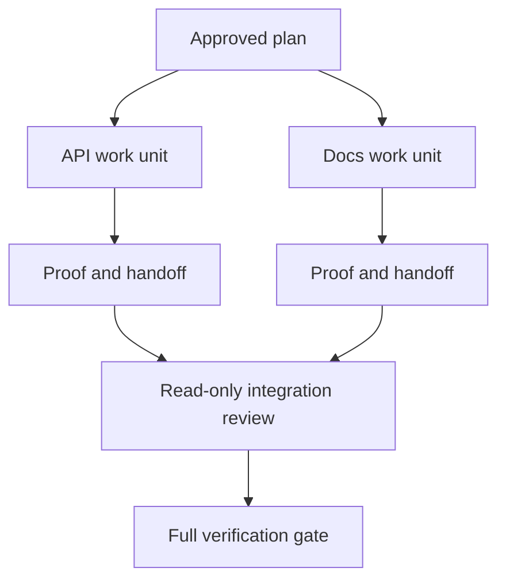

# Delege Agent İzolasyon ve Birleştirme Sözleşmeleri ile Çalışır

> Paralel ajanlar, iş bağımsız olduğunda duvar zamanını tasarruf eder. Aksi takdirde, net bir görevi daha hızlı bir başarısızlık oranı ile bir koordinasyon soruna dönüştürürler.

**Type:** Learn + Build
**Languages:** Python (stdlib)
**Prerequisites:** Phase 14 lessons 39 and 44
**Time:** ~70 minutes

## Öğrenme Hedefleri

- Delegasyonun gerçek bağımsızlık ile haklı olup olmadığını karar verin.
- Her işçiye özel bir dosya sahibilik ve açık bir kanıt ver.
- Bilgisayarın işlevsel dalgaları bağımlılıklardan.
- Birleştirme sözleşmesini tasarlayın.

## Paralellik Denemesi

Daha fazla ajan olduğu için delegasyon yapmayın.

- İki soruşturma farklı bilinmeyen konulara bağımsız olarak cevap verebilir.
- iki uygulama, birbirinden ayrı dosya ve sözleşme yapmaktadır;
- bir incelemeci tamamlanmış bir eseryi değiştirmeden kontrol edebilir;
- Yerel iş devam ederken yavaş bir dış kontrol yapılabilir.

Ajanların aynı dosyalara, aynı çözülmemiş kararlara ya da aynı değişen ortamlara ihtiyaç duyduğu zaman çalışmayı seri tutun.

## Bir İş Birliği Bir Sözleşme

Her birim için aşağıdaki ihtiyaçlar vardır:

| Field | Meaning |
|---|---|
| Goal | One observable result |
| Owner | One accountable worker |
| Paths | Exclusive write ownership |
| Dependencies | Completed units required before starting |
| Proof | Exact evidence returned to the integrator |
| Handoff | Files changed, decisions made, remaining risk |

Backend'i kullanmak  iş birimi değildir. Duplikat kontrolü uygulayın `app/accounts.py`ve odaklı hesap testi ile kanıtlayın.

## Tekrarlık Üç Katmanlı

1. **Filesystem isolation:**Ayrı çalışma ağaçları veya kum kutuları, kazara paylaşılmış düzenlemeleri önler.
2. **Ownership isolation:**Sözleşmeler iki işçinin aynı yolun kasıtlı olarak düzenlenmesini engeller.
3. **State isolation:**Ayrı kayıtlar ve çıkışlar bir çalışanın diğer çalışanın kanıtlarını üst yazmasını engeller.

Dosya sisteminin izole edilmesi mülkiyetin çözülmesini sağlamaz. İki temiz iş ağacı hala çelişkili tasarımlar üretebilir. Birleştirme sözleşmesi iş başlamadan önce paylaşılan arayüzleri çözmelidir.



## Birleştiren İşleri Yeniden Yapmaz

Entegreci:

1. Her teslimatın belirlenmiş alanına uygun olduğunu onaylayın;
2. Sadece işçinin özetini değil, kanıt çıkışını okuyun.
3. bağımlılık sırasındaki değişiklikleri birleştirir;
4. Tüm çapraz birim kapısını çalıştırmak;
5. Gizli alan genişlemesini reddetmek;
6. Çatışmaları yeni kararlar olarak kaydetmek, sessiz düzenlemeler değil.

Eğer entegrasyon bir işçinin sonuçlarının çoğunu yeniden yazmak gerektiriyorsa, orijinal parçalanma yanlış olmuştur.

## İnsan ve ajan rolü

Delegasyon insan yargılarını ortadan kaldırmaz. İnsan hala kamu davranışını, riskini, yetkiyi veya geri dönüşü olmayan maliyetleri değiştiren seçimlere sahip. Ajanlar sınırlı araştırma, uygulama, doğrulama ve inceleme sahip olabilir.

Bu kalibrli bir özerkliktir: kanıt ve geri dönüş güçlü olduğu yerlerde sistem özgürlük sağlar ve sonuçları yüksek olduğu yerlerde kontrol noktası gerektirir.

## Yapın

Laboratuvar yol üst üstelik kontrol eder, bağımlılıkları doğruluyor, güvenli yürütme dalgalarını hesaplar ve yazıyor `outputs/delegation-plan.json`- Evet .

Çık:

```bash
python3 code/main.py
python3 -m unittest discover code/tests -v
```

Doktora ait birimi değiştir .`app/`Planın engellenmesi gerekir çünkü ana yol API birimiyle örtüşüyor.

## Egzersizler

1. Gerçek bir değişimi iki bağımsız çalışma birimine ve bir entegratöre ayırın.
2. Tekrar bağımsız görünen bir paralel bölünme bul.
3. Sadece bir gerçek tablosu olan okuma-yalnız araştırma çalışanını ekleyin.
4. Son değiştirilmiş dosya seti ile tüm birim sözleşmelerini kontrol eden bir birleşme kapısı ekleyin.
5. Bağımlılığı geçersiz olan bir işçi için iptal kuralı tanımlayın.

## Daha Fazla Okumak

- [Reid Smith, The Contract Net Protocol](https://doi.org/10.1109/TC.1980.1675516), dağıtılmış görev dağılımı ve sonuç raporlamalarının erken bir şekilde resmi olarak değerlendirilmesi için.
- [Eric Horvitz, Principles of Mixed-Initiative User Interfaces](https://dl.acm.org/doi/10.1145/302979.303030), otomasyonun ne zaman harekete geçmesi ve kontrolü bir kişiye ne zaman geri vermesi gerektiğine karar vermek için.

## Neyi Saklarsın

- Tutun .`outputs/delegation-plan.json`- Bölünmenin neden güvenli olduğunu, her yolun kimin sahip olduğunu ve birleştirmenin ne kanıt alması gerektiğini kaydeder.
