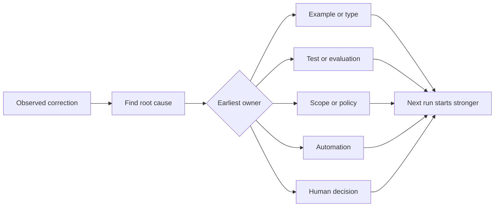

# Her Ajan Düzeltmesini Sistem İyileştirmesine Değiştirin

> Sadece sohbette yaşayan bir düzeltme bir atışı düzeltir. Bir test, sınırı, örnek veya araç olarak geliştirilen bir düzeltme, sonraki atışların her birinde iyileşir.

**Type:** Learn + Build
**Languages:** Python (stdlib)
**Prerequisites:** Phase 14 lessons 37 to 41
**Time:** ~65 minutes

## Öğrenme Hedefleri

- Ajan düzeltmelerini dayanıklı kontrollere dönüştürün.
- Her kontrolü tekrarlanmasını önleyebilecek en erken katmanlara yerleştirin.
- Dönüştürülmüş dersleri sabit parmak izi ile kopyalan.
- Artık gerçek bir risk korumayan kontrolleri geri çek.

## Düzeltmeler Kanıt

Bir ajanı diyelim dosyayı düzenlemeyin dediğinizde,  boyut sınırının yürütülebilir olmadığını öğrenmiş olursunuz. Bu çıkış şekli yanlış olduğunu söylediğinizde,  bir örneğin veya testin eksik olduğunu öğrenmiş olursunuz. Kurulum tekrar başarısız olduğunda, çevre bilgisinin otomasyona ait olduğunu öğrenmiş olursunuz.

Düzeltmeyi iş sistemiyle ilgili bir gözlem olarak gör, bir yazma başarısızlığı olarak değil.

## En erken etkili katman için ilerleyin

Bu sırayı kullan:

| Recurring failure | Durable destination |
|---|---|
| Wrong result or regression | Test or evaluation |
| Off-scope or unsafe action | Scope or permission policy |
| Repeated setup or command mistake | Automation or tool |
| Repeated output-format mistake | Canonical example plus validator |
| Ambiguous local convention | Instruction with a scenario check |
| Product disagreement | Human decision record |

Daha önce kontrol edilen yöntemler daha ucuz. Geçersiz bir durumun önlenmesi için yapılan bir test, daha sonra ele alınan bir yorumdan daha güçlüdür.



## Ratchet Kaydı

Yakalama:

- semptom;
- kök neden;
- sonuç;
- tekrar sayısı;
- Seçilen kontrol;
- kontrol için doğrulama;
- sahibi;
- Bu, bir gözden geçirme veya emeklilik tarihi.

Tekrar oluştuğu veya sonuçları kalıcı karmaşıklığı haklı çıkarırsa, her tek tercih için teşvik etmeyin.

## Sebep ve semptom ayrı

Agent edit README bir semptomdur.

- görev depo kökü izin verdi;
- Dokümanlar dolaylı olarak güvenli olarak kabul edildi;
- planın birlikte uygulanması ve belgelenmesi;
- İki işçinin sahipliği üst üsteydi.

Her neden farklı bir kontrolüne aittir. Sadece semptomları tekrarlayan bir kural bir sonraki farklı durumda başarısız olur.

## Kontroller de Kırıyor

Eski kontroller çatışmaya, bağlamı şişmeye ve artık var olmayan bir sistemi kodlamaya neden olabilir.

- Altyapı mimarisi değiştirildi;
- Daha güçlü bir yürütülebilir kontrol yerine getirildi;
- Başarısızlık anlamlı bir pencerede tekrarlanmamıştır;
- Kontrol, engellediği riskten daha fazla sürtünme yaratır.

Amaç en uzun talimat dosyası değil, zor kazanılmış yargılamayı koruyan en küçük sistem.

## Yapın

Laboratuvar düzeltmeleri sınıflandırır, kontrollere teşvik eder, parmak izlerini kopyalar ve yazar.`outputs/feedback-ratchet.json`- Evet .

Çık:

```bash
python3 code/main.py
python3 -m unittest discover code/tests -v
```

Aynı nedenle iki farklı şekildeki düzeltme ekleyin.

## Egzersizler

1. Son bir kodlama seansından beş düzeltme alın ve gerçek sahipleri sınıflandırın.
2. Bir proza kuralını, uygulanabilir bir testle değiştir.
3. Sonuc ağırlığını ekleyin, böylece ciddi bir ilk ortaya çıkış hemen teşvik edilebilir.
4. Laboratuvar çıkışına bir sahibi ve emeklilik tarihi ekleyin.
5. Var olan bir ajan talimatını gözden geçirin ve daha güçlü bir kontrol varlığını kanıtladıktan sonra silin.

## Daha Fazla Okumak

- [Basili, Caldiera, and Rombach, The Goal Question Metric Approach](https://www.cs.toronto.edu/~sme/CSC444F/handouts/GQM-paper.pdf), hedefleri soru ve operasyonel ölçümlere dönüştürmek için.
- [Shinn et al., Reflexion](https://arxiv.org/abs/2303.11366), model ağırlıklarını değiştirmeden daha sonraki kararları iyileştirmek için geri bildirim izlerini kullanmak için.
- [Madaan et al., Self-Refine](https://arxiv.org/abs/2303.17651), bir görev döngüsü içinde tekrarlı geri bildirim ve revizyona.

## Neyi Saklarsın

- Tutun .`outputs/feedback-ratchet.json`Bu, ajan yardımlı mühendislik yolunun kalıcı sonu ve gelecek çalışma masalarında değişiklikler için girişdir.
