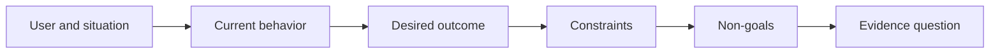

# Çıktıranı Seçmeden Önce Sonuçları Tanımayın

> Hızlı uygulamalar yanlış bir sorun seçtiğiniz için cezanı arttırır.

**Type:** Learn + Build
**Languages:** Python (stdlib)
**Prerequisites:** None
**Time:** ~60 minutes

## Öğrenme Hedefleri

- Çözümün adını vermeden bir sonuç çerçevesini yaz.
- Kullanıcıyı, durumu, mevcut davranışını ve istenen değişimi tanımlayın.
- Sınırları ve hedefleri açıkça belirtin.
- Çözümün kapsamına sertleşmeden önce sızıntısını tespit edin.

## Sonuç Sonuç değildir

Bir olay asistanı oluşturun bir çıkışın adını verir.

Sonuç çerçevesinde şöyle yazıyor:

> Üretim uyarısı geldiğinde, çağrıda bulunan mühendis, başarısız hizmetin ve güvenli bir sonraki eylemin iki dakika içinde tespit edilmesini sağlarken, teşhis sadece okunur ve denetlenir.

Bu cümle, bir yazılım, bir çalışma kitabı, bir veri onarımı veya daha küçük bir arayüz değişikliği ile tatmin edilebilir.

## Altı Bölümlü Çerçeve

| Part | Question |
|---|---|
| User | Who experiences the problem directly? |
| Situation | When and where does it occur? |
| Current behavior | What happens today, including workarounds? |
| Desired outcome | What observable state should improve? |
| Constraints | Which safety, policy, cost, or compatibility limits are fixed? |
| Non-goals | What tempting adjacent work is excluded? |



## Çözüm Çıkanışı Bul

Sonuç açıklamaları, kanıtlarla kazanılmamış bir ürün formu, arayüz, model seçimi, çerçeve veya mimari içerdiği zaman çözümler sızdırır.

- Kullanıcılar haftalık bir AI özetini alır özet ve kadenci sızdırır.
- Kullanıcılar hesap değişikliklerini onaylamadan önce anlarlar sonuç belirtilir.
- Vector veritabanı uygula  altyapı sızıntıları.
- Düşünme sırasında ilgili politika kanıtları mevcuttur bir yetenek belirtir.

Uyumluğun gerçekten onu düzelttiği zaman kısıtlamalar teknolojiyi adlandırabilir.

## Sınırlar Sonuçları Korur

Sınırlar uygulamanın ayrıntıları değil, gerçek dünya hedefinin bir parçasıdır:

- teşhis sırasında hiçbir üretim yazmaz;
- olay zamanı bütçesi içinde cevap;
- mevcut denetim etkinlikleri yetkili olarak kalır;
- yeni bir çalışma süresi bağımlılığı yoktur;
- Erişilebilirlik davranışları sağlam kalır.

Bir kısıtlama ihlal ederek sonuca ulaşan bir inşaat sonuca ulaşmamıştır.

## Hedefsiz Bir Sınır Oluşturur

Amaçlar olmayanlar, yararlı bir parçaların bir platform haline gelmesini engeller. İyi hedefler, işten uzak durmak için yeterince somuttur:

- otomatik bir iyileştirme yapılmamıştır;
- Yeni bir uyarı yönlendirme sistemi yoktur;
- olay komutanının yerini alma;
- Bu parçada hiçbir tarihsel analiz yok.

## Yapın

Laboratuvar bir `OutcomeFrame`Ve yazıyor.`outputs/outcome-frame.json`- Evet .

```bash
python3 code/main.py
python3 -m unittest discover code/tests -v
```

İsteyen sonucu incident asistanı kullanın ile değiştirin. Validör önerilen çıkışın sonuca sızdığını işaretlemesi gerekir.

## Egzersizler

1. Arka kaydınızdaki bir özellik istekini sonuç çerçevesine yeniden yazın.
2. Hangi çözümlerin mümkün olduğunu değiştiren bir kısıtlama ekleyin.
3. İlk parça küçükken iki hedef olmayan ekleyin.
4. İstediğiniz sonucu inkâr edecek en erken gözlem belirleyin.
5. Aynı sonucu tatmin edebilecek üç farklı çıkış yazın.

## Daha Fazla Okumak

- [Nuseibeh and Easterbrook, Requirements Engineering: A Roadmap](https://www.cs.toronto.edu/~sme/papers/2000/ICSE2000.pdf), gerçek dünya hedeflerini yazılım işinin demircisi olarak ele almak için.
- [Dardenne, van Lamsweerde, and Fickas, Goal-Directed Requirements Acquisition](https://doi.org/10.1016/0167-6423(93)90021-G), yüksek düzeyde hedeflerin kısıtlamalara ve operasyonel gereksinimlere dönüştürülmesi için.

## Neyi Saklarsın

- Tutun .`outputs/outcome-frame.json`Bir sonraki ders bunu insanların iş akışına karşı test eder.
