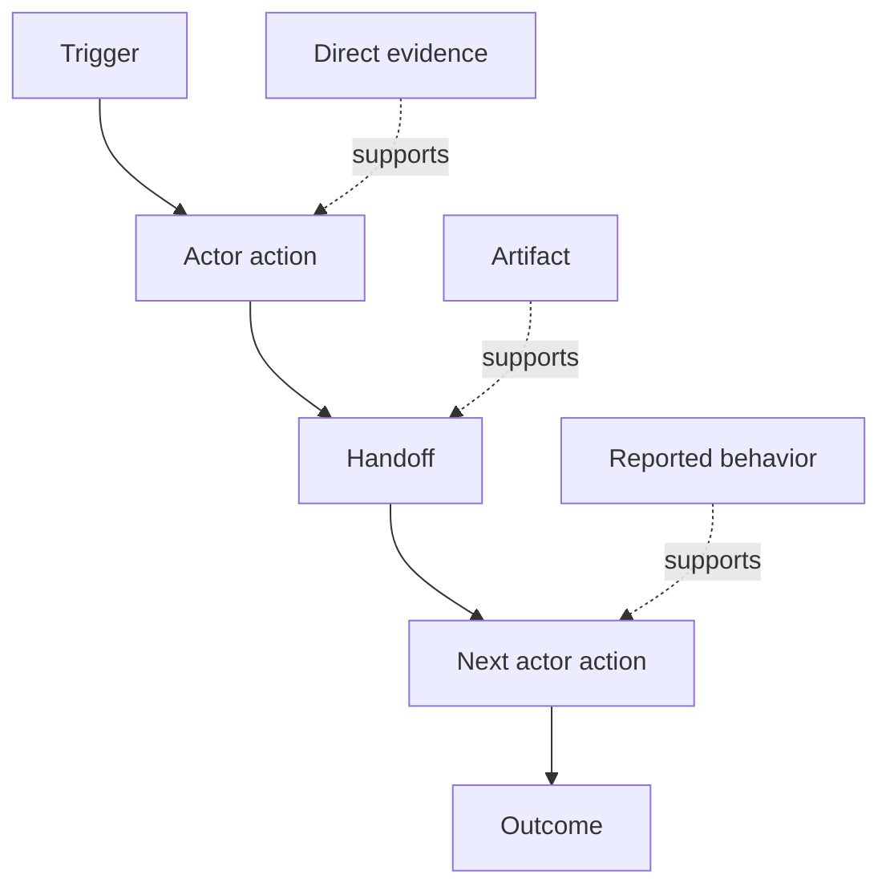

# İnsanların Gerçekte Ne Yaptığı Bilin

> Gereksinimler bir toplantıda toplanmak için beklemiyor.

**Type:** Learn + Build
**Languages:** Python (stdlib)
**Prerequisites:** Phase 14 lesson 47
**Time:** ~70 minutes

## Öğrenme Hedefleri

- Mevcut iş akışını kanıtlarla düzenli eylemler olarak modellendir.
- Kaydedilen veya çıkarılan davranışlardan doğrudan gözlem ayrı.
- Çelişkiyi, elverileri, otoriteye ve gizli duruma bak.
- Kesin olmayan iddiaları gerekliliklere dönüştürmek yerine görülebilir tutun.

## Şu anki Sistemle Başlayın

İnsanların ne tür özellikleri istediğini sorarak değil, şimdi olanları yeniden yapılandırarak başlayın.

Her adım için kayda:

| Field | Example |
|---|---|
| Actor | On-call engineer |
| Trigger | Production alert arrives |
| Action | Opens alert, then searches dashboards |
| Input | Alert payload and deployment record |
| Output | Candidate service and owner |
| Friction | Context switching across three tools |
| Authority | Incident commander approves a write |
| Evidence | Screen recording, incident log, runbook |

İş akışı ekranın daha büyüktür. Bekleme, kopya yapıştırma, yan kanallar, onay, hata kurtarma ve insanların fark etmesini bıraktığı adımlar içerir.

## Kanıt Güçlüdür

Basit bir kanıt merdivenini kullan:

1. **Direct behavior:**gözlem, izleme, kaydetme veya sistem olayı.
2. **Artifact:**bilet, runbook, log, form veya tamamlanmış çıkış.
3. **Reported behavior:**bir kişi ne yaptığını anlatır.
4. **Inference:**Takım muhtemelen olanları buldu.

Dörtü de yararlı olabilir. Sadece ilk ikisi mevcut davranışları doğrudan kanıtlar.



## Dört Şey Arayın

- **Friction:**Sürekli çaba, gecikme, tekrar giriş veya iyileşme.
- **Hidden state:**hafıza, sohbet veya kişisel notlarda taşıyan gerçekler.
- **Authority:**sonuçta bir değişiklik yapmasına izin verilen kişi veya sistem.
- **Exceptions:**Normal iş akışı normal olmaktan çıkıyorsa.

AI özellikleri genellikle teslimatlarda ve istisnalarda başarısız olur çünkü mutlu yol şekillendirilmiş tek yoldu.

## Anlaşmazlıkları Yukarı Bir Yere Akıldan Atmayın

İki kullanıcı farklı iş akışlarını iyi nedenlerle gerçekleştirebilir.

- farklı roller;
- farklı risk seviyeleri;
- Geçmiş ve mevcut süreç;
- Uzmanlık farklılıkları;
- Gerçek bir politik anlaşmazlık.

Ortalama bir iş akışı kimseyi tanımlayamaz.

## Yapın

Laboratuvar her iş akışının aşamasında kanıt kaydediyor, sipariş ve güven doğruluğunu doğruluyor, doğrudan kanıt oranını hesaplıyor ve yazıyor `outputs/workflow-evidence.json`- Evet .

```bash
python3 code/main.py
python3 -m unittest discover code/tests -v
```

Deployment kayıtlarının eksik olduğu bir istisna yolu ekleyin. Ana düzenin saklı kalmasını ve dalın başladığı yeri kaydetin.

## Egzersizler

1. Bir kişiyle röportaj yapmadan bir iş akışını bir günlükten yeniden oluşturun.
2. Bir kullanıcıyla röportaj yapın ve hala doğrudan kanıt eksik olan her iddiayı işaretleyin.
3. Bir yetki sınırı ve bir başarısızlık kurtarma adımı ekleyin.
4. Birleştirmeden iki iş akışı variansı modeli.
5. Görülebilir bir adımı kaldırırken gizli bir işi dokunmadan bırakan önerilen bir özelliği belirleyin.

## Daha Fazla Okumak

- [Nuseibeh and Easterbrook, Requirements Engineering: A Roadmap](https://www.cs.toronto.edu/~sme/papers/2000/ICSE2000.pdf), özellikle de sadece yakalama yerine yorumlama, modellerleme ve onaylama olarak ortaya çıkaran davranış.
- [Gotel and Finkelstein, An Analysis of the Requirements Traceability Problem](https://doi.org/10.1109/ICRE.1994.292398), talepler ile kaynakları arasındaki ilişkiyi korumanın zorluğu için.

## Neyi Saklarsın

- Tutun .`outputs/workflow-evidence.json`Gözlemli sürtünme ve belirsizlikleri bir sonraki dersdeki bir varsayım haritasına dönüştürür.
