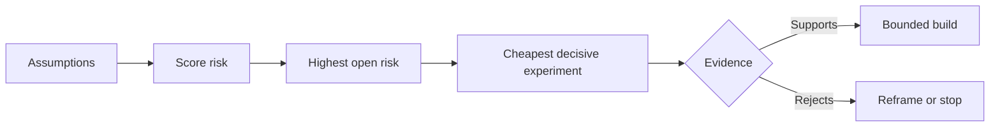

# Karte Düşünüyor ve En Riskli Düşünü Önce Çözüyor

> Bir yol haritası, belirtilerin içinde belirsizlikleri gizler. Bir varsayım haritası, bu belirtilerin var olmayı hak etmeden önce neyin doğru olması gerektiğini ortaya çıkarır.

**Type:** Learn + Build
**Languages:** Python (stdlib)
**Prerequisites:** Phase 14 lesson 48
**Time:** ~65 minutes

## Öğrenme Hedefleri

- Önerilen çalışmaları açık varsayımlara dönüştürün.
- Skor etkisi, belirsizlik ve geri dönüşü olmayanlık ayrı ayrı.
- Bir sonraki deneyi hevesle değil riskle seç.
- Denetlenmiş varsayımları kanıt ve kararlarla değiştirin.

## Her Binanın Bahisleri Var

Bir olay aracı bunların hepsinin doğru olması üzerine bağlı olabilir:

- Uyarı bağlamı, bir hizmeti tanımlamak için yeterli bilgi içerir;
- Mühendisler kendileri elde etmediği bir tavsiyeye güveniyorlar.
- istenen cevap süresi operasyonel olarak önemlidir;
- Gerekli verilere güvensiz yetki olmadan erişilebilir;
- iş akışı, bakımı haklı çıkarmak için yeterince sıklıkla gerçekleşir.

Bu uygulama görevleri değil, inşaatın değerli, kullanılabilir, uygulanabilir ve güvenli olması için şartlar.

## Varsayım sınıfları

| Class | Question |
|---|---|
| Value | Will the outcome matter enough? |
| Usability | Can the user understand and act on it? |
| Feasibility | Can the system produce it with available data and constraints? |
| Viability | Can the organization sustain cost, ownership, and operation? |
| Safety | Can it fail without unacceptable consequence? |

Varsayımları sahte ifadeler olarak yazın. Faktör yararlıdır test edilemez. On call on ten sekiz mühendis doğru hizmeti sadece okuma sonucu ile daha hızlı belirler

## Risk Tek Bir Sayıdır

Laboratuvar birden beşe kadar üç boyut kullanıyor:

- **Impact:**Eğer varsayım yanlışsa zarar.
- **Uncertainty:**mevcut kanıtların zayıflığı.
- **Irreversibility:**Bağlılık sonrası öğrenme maliyeti.

Örnek puanı etkisi ve belirsizlikleri katlayıp sonra geri dönüşü olmayan bir şekilde ekler.



## Bir Tesdiq Ritualı Olmayan Bir Deneyim Yapın

Bir yararlı test:

- yanlış olabilecek bir iddia;
- bir nüfus veya gerçekçi bir örnek;
- gözlemlenebilir bir sonuç;
- Sonuçtan önce belirlenen bir eşiği;
- Bir sonraki karar, geçiş, başarısızlık ve belirsiz kanıtlar için.

Takımın fikri geliştirebileceğini gösteren testlerden kaçının.

## Geri Dönüştürülebilirlik Düzenini Değiştirir

Yüksek sonuçlı, geri dönüşü olmayan seçimler daha önceki kanıtlara ihtiyaç duyar. Sadece okunur bir tekrarlama üretim entegrasyonuna öncülük edebilir. Geçici bir adaptör veri göçüne öncülük edebilir. İnsan tarafından onaylanan bir önerme otomatik eylemden önce gelebilir.

Yapının şekli belirsizlik şeklini takip etmelidir.

## Yapın

Laboratuvar varsayımları sıralar, test edilenleri açık iddialardan ayırır, en yüksek açık riskleri seçer ve yazar `outputs/assumption-map.json`- Evet .

```bash
python3 code/main.py
python3 -m unittest discover code/tests -v
```

En yüksek riskli varsayımla ilgili kanıtları değiştirin ve bir sonraki deneyin nasıl değiştiğini gözlemleyin.

## Egzersizler

1. Yapmak istediğiniz bir özellik için beş varsayım yazın.
2. Özellik listenizde eklenmiş bir güvenlik varsayımı ekleyin.
3. İnşaatın durdurulmasına neden olacak bir eşiği belirleyin.
4. Büyük bir deneyi daha ucuz bir kararlı testle değiştirin.
5. Risk sıralamasını yol haritası önceliği ile karşılaştırın ve eşleşme eksikliğini açıklayın.

## Daha Fazla Okumak

- [Barry Boehm, A Spiral Model of Software Development and Enhancement](https://dl.acm.org/doi/10.1145/12944.12948), daha derin bir taahhütten önce belirsizlikleri çözen risk odaklı bir gelişme döngüsü için.
- [Dardenne, van Lamsweerde, and Fickas, Goal-Directed Requirements Acquisition](https://doi.org/10.1016/0167-6423(93)90021-G), engeller ve kısıtlamaların ortaya çıkmasıyla birlikte hedefleri geliştirmek için.

## Neyi Saklarsın

- Tutun .`outputs/assumption-map.json`Bir sonraki ders, onu, kesin kanıtlar sağlayabilecek en küçük parça seçmek için kullanır.
