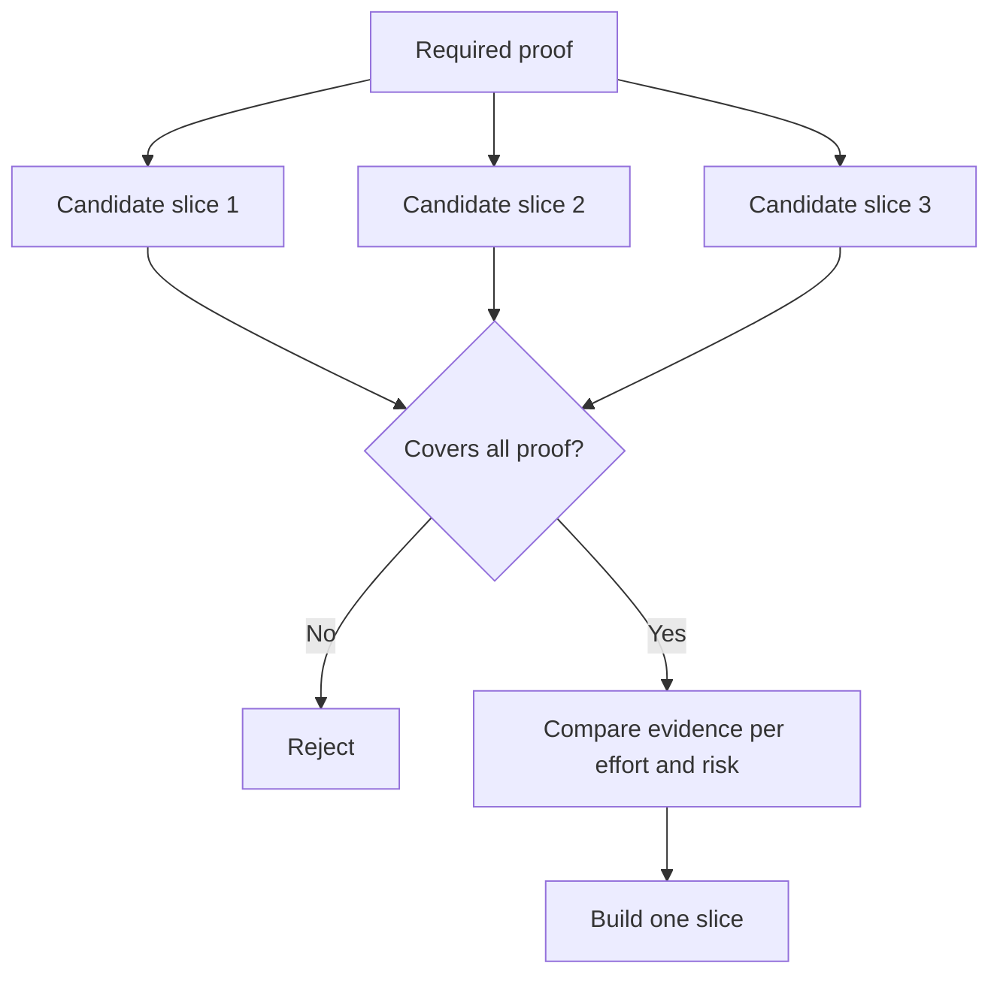

# Kararı Dönükçe En Küçük Bölümünü Seç

> Küçük bir şey önemli bir şey olduğunu kanıtlarsa yararlıdır. Bir sonraki kararı değiştiremeyecek küçük bir yapı sadece eksiktir.

**Type:** Learn + Build
**Languages:** Python (stdlib)
**Prerequisites:** Phase 14 lesson 49
**Time:** ~65 minutes

## Öğrenme Hedefleri

- Bir parçayi kanıtladığı varsayımlara göre tanımla.
- Sonuç değerini, belirsizlikleri azaltmayı, çaba ve sonuçları dengeleyin.
- Erken üretim taahhütü yerine tersine kanıtlar tercih edilir.
- İş akışının riskli kısmını atlayan parçaları reddet.

## Dönüşlü Deliller

Bir sonuç gözlemlemek için gerekli olan en az gerçek çalışma akışını geçerken, yararlı bir parça kullanıcısı, verileri, süresi ve kapasite konusunda dar olabilir. Test etmek istediğiniz kesin olmayanlığı ortadan kaldırarak dar olmamalıdır.

Örnekler:

- On gerçek olayın üzerinde sadece okuyucu bir tekrarlama, servis kimliğini ve operatör güvenini test eder.
- Sentetik verilere dayalı bir polise edilmiş bir kontrol tablosu, anlayışını test edebilir, ancak verilerin uygulanabilirliğini test edemez.
- Bir üretim otomatik yargıcısı kabul edilemez sonuçlarla her şeyi bir anda test eder.

## Önce Gerekli Kanıtları Define Et

En yüksek riskli açık varsayımları alın ve onları gerekli bir kanıt kümesine dönüştürün.

Daha sonra uygun kesikleri aşağıdaki konularda karşılaştırın:

| Dimension | Direction |
|---|---|
| Outcome value | More is better |
| Uncertainty reduced | More is better |
| Effort | Less is better |
| Consequence | Less is better |
| Reversibility | More is better |

Laboratuvar puanı kasten basit.



## Yaygın Sahte Minimumlar

- **The UI-only minimum:**verileri ve operasyonsal belirsizlikleri ortadan kaldırır.
- **The infrastructure-only minimum:**Kullanıcı değeri olmayan teknik bir olasılık kanıtlıyor.
- **The happy-path minimum:**En fazla risk yaratan istisna atlatılır.
- **The demo minimum:**İkna edici bir eser üretir ama tekrarlanabilir bir ölçüm yoktur.
- **The platform minimum:**Bir iş akışı kazanmadan önce tekrar kullanılabilir makineler inşa eder.

## Bir Durma Kuralı Ekle

Uygulama öncesi, kesim başarısız olursa ne olacağını yazın:

- sonuçtan vazgeçmek;
- hedef kullanıcı veya durum değişimi;
- farklı bir mekanizma test etmesi;
- Daha iyi kanıtlar toplamak;
- Daha da dar bir yetki.

Eğer her sonuç keep building'a yol açarsa, slice bir deney değildir.

## Yapın

Laboratuvar adayları gerekli kanıtlara göre filtreliyor, uygun parçaları puanlıyor ve yazıyor `outputs/slice-decision.json`- Evet .

```bash
python3 code/main.py
python3 -m unittest discover code/tests -v
```

Sadece bir varsayımı kanıtlayan daha ucuz bir aday ekleyin.

## Egzersizler

1. Farklı sonuç seviyelerinde aynı sonucu elde etmek için üç dilim tasarlayın.
2. Not almaktan önce gerekli kanıtları belirtin.
3. Kesin kanıtları korurken bir yeteneği kaldırın.
4. Başarısız bir pilot için bir durma kuralını ekleyin.
5. Parçalanmadan sonra bekleyecek tekrar kullanılabilir bir platform bileşenini belirleyin.

## Daha Fazla Okumak

- [Barry Boehm, A Spiral Model of Software Development and Enhancement](https://dl.acm.org/doi/10.1145/12944.12948), her gelişme döngüsünü çözmesi gereken risklere uyumlandırmak için.
- [Lenarduzzi and Taibi, MVP Explained: A Systematic Mapping Study on the Definitions of Minimal Viable Product](https://arxiv.org/abs/1609.07592), minimum ve viable ile ilgili belirsizlikler için yazılım ürünleri uygulamalarında.

## Neyi Saklarsın

- Tutun .`outputs/slice-decision.json`Bu kısım neden kararı değiştirebilecek en küçük kısım olduğunu kaydeder.
