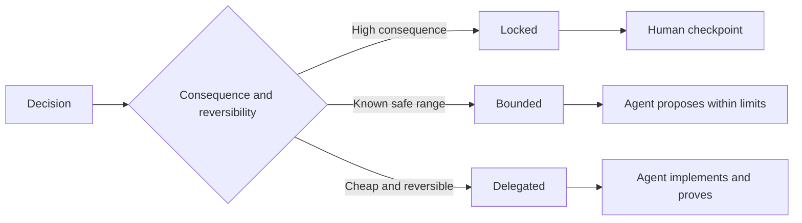

# Yargılamayı Koruyacak Özellikleri Yazmın

> Bir yararlı spesifikasyon, geri dönüşümlü uygulama seçeneklerini açık bırakırken değişkenleri ve kanıtları düzeltir.

**Type:** Learn + Build
**Languages:** Python (stdlib)
**Prerequisites:** Phase 14 lesson 50
**Time:** ~75 minutes

## Öğrenme Hedefleri

- Ayrı sonuç, değişmezler, örnekler, hedefsizler ve kanıtlar.
- Kararları kilitli, sınırlı veya görevlendirilmiş olarak işaretleyin.
- Seçimlerin ucuz ve geri dönüşü mümkün olduğu yerlerde ajan yargısını koruyun.
- Sonuç veya kamu davranışının değişmesi için insan kontrol noktaları gereklidir.

## İki Kötü Aşırı

Bir az belirtilen görev bir ajanı sistemin tahminini yapmasını ister.

Faydalı orta bir sözleşme:

| Surface | Purpose |
|---|---|
| Outcome | The observable result |
| Invariants | Conditions that must always remain true |
| Examples | Concrete cases that reveal intent |
| Non-goals | Adjacent behavior intentionally excluded |
| Decision policy | Which choices are locked, bounded, or delegated |
| Proof | Evidence required before completion |

## Üç Karar Mode

- **Locked:**Agent seçemez. Kamu uyumluluğu, yetki, güvenlik, geri dönüşü olmayan maliyet veya bir ürün taahhüdü için kullanılır.
- **Bounded:**Bu seçenekler, arama bütçeleri, tekrar deneme sayıları, izin verilen bağımlılıklar veya bilinen bir arayüz ailesi için kullanılabilir.
- **Delegated:**Bu seçenekleri kullanmak için yerel yapı, isimler, geri dönüşümlü refaktörler ve uygulama detayları kullanmak gerekir.



## Örneklerle Davranışları Açıklayın

Örnekler, özelliğinden daha iyi niyetleri sıkıştırır. Yardımcı,  sağlam, ve üretime hazır  yürütülemez. Normal, kenar, başarısız ve yasak örneklerin küçük bir kümesi hem inşaatçı hem de doğrulayıcıya somut bir şey verir.

Örnekler değişken olmayanları değiştirmez. Bir geçiş vakası evrensel bir güvenlik kuralı kanıtlayamaz.

## İddia ile İlgili Kanıtlar

- Birim testi yerel bir fonksiyon sözleşmesini kanıtlar.
- Bir tel testi serileşmeyi ve taşıma davranışını kanıtlar.
- Bir tarayıcı yolculuğu bir arayüz yolu kanıtlıyor.
- Bir tekrarlama seti temsilci durumlar üzerinde davranışları kanıtlar.
- Denetim kayıtları yetki sınırlarının korunduğunu kanıtlar.

Daha düşük katman, daha yüksek katman iddialarının kanıtı olarak kabul edilmez.

## Bilinmeyenleri Kasten Koruyun

Bir spesifikasyon, gelirme, zaman bütçesinde geri kalan tüm okunur kaynakları seçebilir. Bu belirsizlik değil.

Belgeler değişirken özellikler gelişmelidir. Kilitli ve sınırlı seçimlerin arkasındaki nedenleri korumak böylece daha sonraki ekipler arkeoloji olmadan onları gözden geçirebilir.

## Yapın

Laboratuvar her sözleşme yüzeyini doğruluyor, karar biçimlerini kontrol ediyor ve yazıyor.`outputs/executable-specification.json`- Evet .

```bash
python3 code/main.py
python3 -m unittest discover code/tests -v
```

Üretim yazma kararı kilitlenmişten deleged'e taşı. Şema neden değer kabul eder ama ürün riski kabul etmez.

## Egzersizler

1. Bir geriye kalan biletini altı spesifikasyon yüzeyine dönüştürün.
2. Üç uygulama talimatını bir değişken ve iki örnekle değiştirin.
3. Her kararı işaretle ve her kararın kısıtlı ya da sınırlı olduğunu haklı çıkar.
4. Her değişken için bir kanıt kvitesi ekleyin.
5. Kanıt veya risk gerekçesi olmayan bir kısıtlama kaldırın.

## Daha Fazla Okumak

- [Nuseibeh and Easterbrook, Requirements Engineering: A Roadmap](https://www.cs.toronto.edu/~sme/papers/2000/ICSE2000.pdf), hedefler arasındaki ilişki, kesin özellikler, doğrulama, anlaşma ve evrim için.
- [Zave and Jackson, Four Dark Corners of Requirements Engineering](https://doi.org/10.1145/267895.267896), çevresel varsayımları, gereklilikleri ve özellikleri ayırmak için.
- [Gotel and Finkelstein, An Analysis of the Requirements Traceability Problem](https://doi.org/10.1109/ICRE.1994.292398), bir talebin neden var olduğunu ve nereden geldiğini korumak için.

## Neyi Saklarsın

- Tutun .`outputs/executable-specification.json`Bu, kodlama ajanlarının ve insan inceleyicilerinin paylaştığı bir sözleşme haline gelir.
