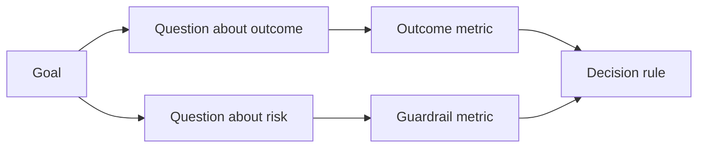

# Sonuçlar Olmadan Önce Başarılılık Metrikleri Tasarımla

> Ölçüm bir kararın cevabını vermesi, bir takla dekorasyonunu değil. Hedefle başlayın, soruları çıkarın, sonra cevap veren en küçük ölçümleri seçin.

**Type:** Learn + Build
**Languages:** Python (stdlib)
**Prerequisites:** Phase 14 lessons 47 and 51
**Time:** ~70 minutes

## Öğrenme Hedefleri

- Sonuç hedefiyle soru ve ölçümleri çıkarın.
- Sonuçları gözlemlemeden önce eşiğin, pencerenin, kaynakların ve yönlerin belirlenmesini sağlayın.
- Sonuç ölçümlerini koruma ve karşı ölçümlerle eşleştir.
- Değerlendirme kanıtları, inşaatın desteklemesi gereken kararla uyumludur.

## Hedef, Soru, Metrik

Bir hedefle başla:

> Etkili hizmetin belirlenmesi için zaman azaltın, güvenli olmayan eylemleri artırmadan.

Sorular:

- Doğru hizmet ne kadar hızlı belirlenir?
- Tanıdığımız servis ne sıklıkta doğru?
- Teşhis sadece okuma yoluyla mı yapılıyor?
- İş akışı uyarı atılmasını veya operatörün iş yükünü arttırır mı?

Sonra bu soruları uygulayan ölçümleri seçin.



## Bir Metrik Sözleşme Gerektirir

Her metrik ihtiyacın var:

| Field | Example |
|---|---|
| Name | `median_identification_seconds` |
| Direction | at most |
| Threshold | 120 |
| Window | ten incident replays |
| Source | replay event log |
| Population | on-call engineers in the pilot |
| Kind | outcome or guardrail |

Kaynak ve pencere olmadan bir sayı yeniden üretilemez.

## Sonuç, Gardail ve karşı-metrik

- **Outcome metric:**istenen durum iyileşti mi?
- **Guardrail:**sabit bir kısıtlama gerçek miydi?
- **Counter-metric:**Yerel iyileştirme değişikliği başka bir yere zarar mı verdi?

Bir olay iş akışı için hız yeterli değildir. Doğrulık, üretim yazıları, operatör çalışma yükü ve kayıp uyarılar hızlı ama güvenli olmayan bir sonuçtan korur.

## Çevrimiçi ve Çevrimiçi Kanıtlar

Offline tekrarlama tekrarlanabilirlik ve kenar kapsamı için yararlıdır. Sınırlı bir pilot gerçek davranış, güven ve iş akışı etkileri için yararlıdır.

Geçerli kararı cevaplayabilecek en ucuz kanıtları kullanın.

## Ölçmeden Önce Karar Ver

Sonuçları görmeden önce geçiş, başarısızlık ve belirsiz yolları yazın.

Örnek:

- Geçit: en az 0,9 saniye doğru servis hızı ve en fazla 120 saniye ortalama süresi;
- Başarısız: üretim yazısı veya düzeltme oranı 0,75'ten aşağı;
- belirsiz: geniş bir çeşitlilikle küçük bir gelişme, daha büyük bir tekrarlama seti gerektirir.

## Yapın

Laboratuvar bir ölçüm planını doğruluyor, kapsamlı eşiği değerlendiriyor, eksik değerleri kaydediyor ve yazıyor `outputs/measurement-report.json`- Evet .

```bash
python3 code/main.py
python3 -m unittest discover code/tests -v
```

Koruma metriklerini kaldırın ve sonuç metrikleri kalırken bile planın neden geçersiz olduğunu gözlemleyin.

## Egzersizler

1. Bir sonuç hedefiyle üç soru çıkar.
2. Başka bir rolye taşındığı maliyeti yakalayan bir karşı-metrik ekleyin.
3. Her metrik için kaynağı, nüfus ve pencereyi tanımlayın.
4. Değerler oluşturmadan önce geçerli, başarısız ve belirsiz kararlar yazın.
5. Toplamak kolay ama kararı değiştiremeyecek bir metrik belirleyin.

## Daha Fazla Okumak

- [Basili, Software Modeling and Measurement: The Goal/Question/Metric Paradigm](https://drum.lib.umd.edu/items/8119803a-362b-42ec-b6ce-2311713e7236), açık hedeflerden operasyonel ölçümleri çıkarmak için.
- [Basili, Caldiera, and Rombach, The Goal Question Metric Approach](https://www.cs.toronto.edu/~sme/CSC444F/handouts/GQM-paper.pdf), yöntemi geri bildirim ve geliştirme sistemi olarak kullanmak için.

## Neyi Saklarsın

- Tutun .`outputs/measurement-report.json`. Prototip, pilot veya üretim aşamasında kanıt kapısı tanımlanır.
