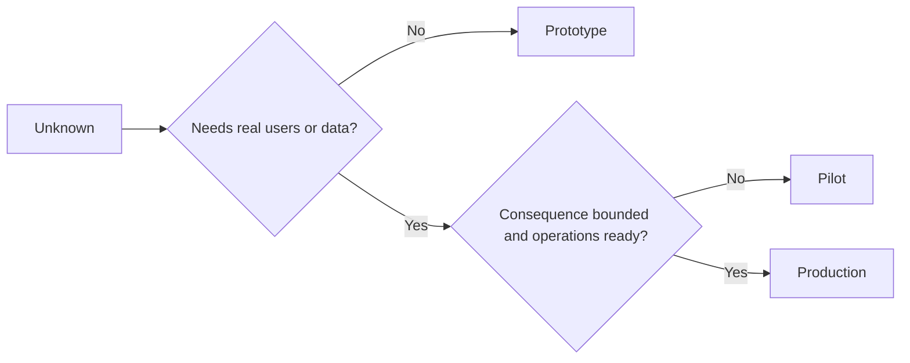

# Bilerek Bir Prototip, Pilot veya Üretim Seçin

> Bu farklı öğrenme ortamları, polish seviyeleri değil.

**Type:** Learn + Build
**Languages:** Python (stdlib)
**Prerequisites:** Phase 14 lessons 50 to 52
**Time:** ~70 minutes

## Öğrenme Hedefleri

- Bilinmeyen, izleyiciler, veriler, sonuçlar ve hazırlıklardan bir inşa aşamasını seçin.
- Etap-sözlü kontroller ve çıkış kriterlerini tanımlayın.
- Prototyplerin sessizce üretim sistemleri haline gelmesini engelleyin.
- Gerçek yetkiyi kanıt ve operasyonlar haklı çıkarana kadar ertele.

## Üç Farklı Soru

| Stage | Primary question |
|---|---|
| Prototype | Can this mechanism produce the evidence at all? |
| Pilot | Does it work safely with a bounded real audience and real conditions? |
| Production | Can we own it continuously at the promised reliability and risk level? |

Bir prototip teknik olarak tamamlanmış olabilir ve hala bir kullanım için kullanılabilir. Bir pilot, izleyiciler ve yetki sınırlı kalırken üretim verilerini kullanabilir.

## Prototyp

Bilinmeyen gerçek kullanıcıları veya gerçek verileri gerektirmediğinde bir prototip kullanın.

- Çıkarılabilir;
- izole edilmiş;
- davranışta dar;
- Öğrenme sorusu hakkında açıkça;
- Sahte operasyonel garantilerden uzak.

Mekanizm bir sonraki aşama kazanmadan önce mimarlığı optimize etmeyin.

## Pilot

Bilinmeyen gerçek bir davranış, gerçekçi veriler veya gerçek bir iş akışı gerektirdiğinde, ancak sonuç veya hazırlık hala geniş yayımla uyumlu olmadığı zaman pilot kullanın.

Pilot:

- Adlı bir kitle;
- bir insan sahibi;
- sınırlı süre ve yetki;
- denetim ve geri dönüş;
- Çıkış ve koruma eşiği değerleri;
- genişletmek, gözden geçirmek veya durdurmak için çıkış kriterleri.

## Üretim

Üretim, yerleştirmekten fazlasına ihtiyaç duyar:

- hizmet düzeyi hedefi;
- Çağrı ve olay sahibi olmak;
- Güvenlik ve gizlilik incelemesi;
- maliyet ve kapasite kontrolü;
- Geri dönüş ve geri kazanım;
- Sürekli izleme;
- Emeklilik yolu.



## Etap Drift

Prototyp kodu, sahipliği kazanmadan kullanıcıları, verileri veya yetkiyi elde ettiğinde tehlikeli hale gelir.

Bu aşama sistemin kendisinden gözlemlenebilir olmalıdır.

## Yapın

Laboratuvar karar bağlamından bir aşama seçer, gerekli kontrolleri geri verir ve yazar `outputs/stage-decisions.json`- Evet .

```bash
python3 code/main.py
python3 -m unittest discover code/tests -v
```

Pilot örneği operasyon hazırlığı ile düşük sonuçlara değiştirin.

## Egzersizler

1. Şu anki üç projeyi, görev durumuna değil, öğrenme aşamasına göre sınıflandırın.
2. Durdurma kararı içeren pilot çıkış kriterlerini yazın.
3. Bir prototipin üretim verilerine ulaşmasını engelleyen teknik bir kontrol ekleyin.
4. İnşaat üretimini yapan ilk operasyonel sorumluluğu belirleyin.
5. Sınırlı pilot için bir geri dönüş makbuzu tasarlayın.

## Daha Fazla Okumak

- [Barry Boehm, A Spiral Model of Software Development and Enhancement](https://dl.acm.org/doi/10.1145/12944.12948), her iterasyonun çözülmüş riskle ilişkili olması için.
- [Fagerholm et al., Building Blocks for Continuous Experimentation](https://doi.org/10.1145/2601248.2601276), deneylerin sürekli olarak yürütülmesi için gerekli örgütsel ve teknik koşullar için.

## Neyi Saklarsın

- Tutun .`outputs/stage-decisions.json`Her aşamasın neden haklı olduğunu ve sonraki aşamada hangi kontrollerin olması gerektiğini kaydeder.
