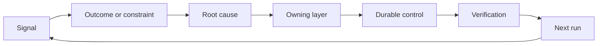

# Sahiplik ve Emeklilik ile Bir Geri Dönüş Ratseti Yap

> Gönderiş bir yapı döngüsünü kapatır ve öğrenme döngüsünü açar.

**Type:** Learn + Build
**Languages:** Python (stdlib)
**Prerequisites:** Phase 14 lessons 46 and 53
**Time:** ~75 minutes

## Öğrenme Hedefleri

- Olayları, değerlendirmeleri, kullanıcı davranışlarını ve düzeltmeleri kendi eylemlerine dönüştürün.
- Her sinyali bağlam, değerlendirme, politika, çalıştırma zamanı veya geriye kalanına yönlendirin.
- Dönüşme şiddet ve sıklık açısından öncelik verin.
- Her kontrolü emeklilik şartıyla ayarlayın.

## İsteğe bağlılık altyapıdır

Bir ekip, izleri, değerlendirmeleri, destek biletleri ve olay kayıtlarını hiçbirinden öğrenmeden toplayabilir.

Bu da bir şapka:

1. Beton bir sinyal izlemek;
2. bir sonuca, kısıtlamaya veya varsaymaya bağlamak;
3. En erken sistem katmanının nedeni belirlenmesi;
4. sınırlı bir değişim yaratmak;
5. tekrarlanma olasılığının azalmasını doğrulayacaklar;
6. kontrolün devam etmesi gerektiğini gözden geçirir.

## Sahiplik Yolu

| Signal | Destination |
|---|---|
| False positive, regression, wrong result | Evaluation or test |
| Missing context, duplicate work, stale fact | Context source or retrieval route |
| Unsafe action or authority gap | Policy or permission boundary |
| Timeout, retry storm, unavailable dependency | Runtime control |
| New product need or unresolved tradeoff | Shaped backlog item |

Bir test veya izin başarısızlığı imkansız hale getirebilirse, bir sonraki paragraf eklemeyin.



## Sahiplik Kontrolün Bir Parçasıdır

Her bir çöpçü eyleminde:

- tek bir sahibi;
- Sonuç ve tekrar üzerine kurulan bir öncelik;
- Değişirilecek eser;
- Değişimi kanıtlayan doğrulama;
- bir gözden geçirme veya sona erme penceresi;
- Emeklilik şartı.

Kendiliğinden gelişmeyen bir gelişme daha iyi biçimlendirilmiş bir gözlemdir.

## İptal edilmiş Kontroller

Bu politika çelişkili ve pahalı olabilir.

- mimarlık veya iş akışı değişiklikleri;
- Daha düşük düzeyde bir invariant, daha yüksek düzeyde bir talimat yerine geçirir;
- Korunan hatalılık seçilen pencerede görünmedi;
- Kontrol, zararın önlenmesinden çok meşru işi engeller.

Emeklilik için de kanıt gereklidir.

## Bağlantı Oluştur ve Kodlama Ajanı İzleyici

Aynı çubuk her iki pistte de geçer:

- Ürün kanıtları sonuç çerçevesini, varsayımları, parçaları veya ölçüm planını değiştirir.
- Kodlama ajanı düzeltmeleri testleri, bağlamı, kapsamını, otomasyonu veya teslimatı değiştirir.
- Olaylar hem ürün sınırını hem de ajan çalışma masasını değiştirebilir.

Bu yüzden yapılandırma, kodlama öncesi biten bir aşama değil. Kabul edilen her değişim boyunca devam eder.

## Yapın

Laboratuvar sinyalleri sınıflandırır, kendi işlevlerini oluşturur, önceliklerini belirler ve yazar.`outputs/feedback-backlog.json`- Evet .

```bash
python3 code/main.py
python3 -m unittest discover code/tests -v
```

Bir runtime timeout sinyali ekleyin ve genel geriye kalanın yerine runtime'ye yönlendirdiğini onaylayın.

## Egzersizler

1. Bir olayı ve bir kullanıcı şikayetini bir iş yapma eylemine dönüştürün.
2. Her tekrarın önlenebileceği en erken katmanı isimlendirin.
3. Laboratuvar çıkışına doğrulama komutları veya gözlemleri ekleyin.
4. Bir polis kuralının emeklilik koşulunu tanımlayın.
5. Birinci iz kabul edilen düzeltmeyi bir sonraki görev çerçevesine geri getir.

## Daha Fazla Okumak

- [Basili, Caldiera, and Rombach, The Goal Question Metric Approach](https://www.cs.toronto.edu/~sme/CSC444F/handouts/GQM-paper.pdf), hedef odaklı ölçüm yoluyla örgütsel öğrenme için.
- [Fagerholm et al., Building Blocks for Continuous Experimentation](https://doi.org/10.1145/2601248.2601276), kanıtları ürün geliştirme süreci ile bağlantılı olan teknik ve örgütleyici döngü için.
- [Nuseibeh and Easterbrook, Requirements Engineering: A Roadmap](https://www.cs.toronto.edu/~sme/papers/2000/ICSE2000.pdf), sistem yaşam döngüsü boyunca gelişen gereksinimlerle ilgilenmek için.

## Neyi Saklarsın

- Tutun .`outputs/feedback-backlog.json`. Ürün Yargılama ve Teslimat Yolunun son eseri ve bir sonraki sonuç çerçevesine girişdir.
