# İletişim Protokolleri

> Aynı dili konuşamayan ajanlar bir takım değil, boşluğa bağırıp duran yabancılar.

**Type:** Build
**Languages:** TypeScript
**Prerequisites:** Phase 14 (Agent Engineering), Lesson 16.01 (Why Multi-Agent)
**Time:** ~120 minutes

## Öğrenme Hedefleri

- MCP araç keşif ve çağrı uygulaması, böylece ajanlar dış sunucuların ortaya koyduğu araçları kullanabilirler.
- Bir A2A ajan kartı ve bir ajanın HTTP üzerinden çalışmayı başka birine devretmesine izin veren görev son noktasını oluşturun
- MCP (alışa erişim), A2A (astadan-astaneye), ACP (işletme denetimi) ve ANP (merkezi olmayan güven) ile karşılaştırın ve hangi protokolün hangi sorunu çözdüğünü açıklayın.
- Bir sistemde birden fazla protokolü kablolamak , bu sistemde ajanlar MCP üzerinden araçları keşfeder ve A2A üzerinden görevleri delegeder

## Sorun

Sisteminizi birden fazla ajanlara ayırıyorsunuz bir araştırmacı, bir kodlayıcı, bir eleştirmen.

İlk deneme açıktır: ipler geçin. Araştırmacı bir metin parçasını gönderir, kodlayıcı onu nasıl yapabilirse öyle analiz eder. Programcı bir araştırma özetini yanlış yorumlayana kadar çalışır, ya da iki ajan birbirini bekleyen bir çıkışsızlık veya farklı ekipler tarafından oluşturulan ajanların işbirliği yapması gerekir.

Bu iletişim protokolü sorunu. ajanların bilgi alışverişini nasıl yapacağı hakkında ortak bir sözleşme olmadan, çoklu ajan sistemleri kırılgan, dinlenemez ve kişisel olarak yazdığınız bir avuç ajanın ötesinde ölçeklendirme imkansızdır.

Yapay zeka ekosisteminin yanıtları dört protokol ile, her biri farklı bir sorunun çözümüyle olmuştur:

- **MCP**Araçlara erişim için
- **A2A**ajan-ajen işbirliği için
- **ACP**Kurumsal denetim için
- **ANP**Merkezsiz kimlik ve güven için

Bu ders derinlere gidiyor. Her bir özellikten gerçek tel biçimlerini okuyacak, çalışacak uygulamaları inşa edecek ve dörtünü de tek bir sisteme bağlayacaksınız.

## Anlaşım

### Protokol Manzarası

Bu dört protokolü farklı bir soruya cevap veren katman olarak düşünün:

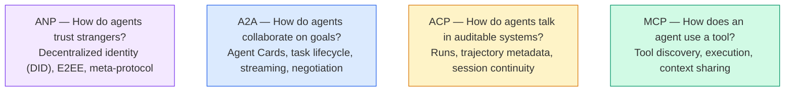

Onlar rekabetçi değiller. Farklı seviyelerde farklı sorunları çözüyorlar.

### MCP (Yedekleme)

MCP'nin derinlemesine kapsamlı olduğu 13. aşamada.**client-server**Bir sunucu tarafından açıklanan araçları ajanın (klientin) keşfetmesi ve çağrısı yapan protokol.

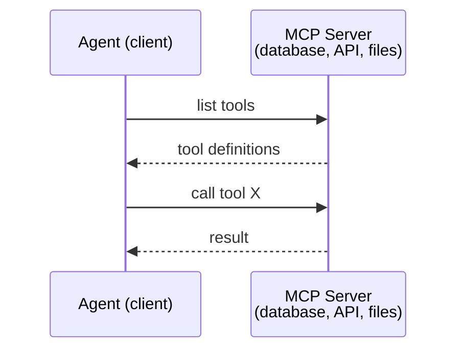

MCP **agent-to-tool**Bu ajanların birbirleriyle konuşmasına yardımcı olmaz.

### A2A (Agent2Agent Protokolü)

**Created by:**Google (şimdi Linux Vakfı altında `lf.a2a.v1`)
**Spec version:**1.0.0
**Problem:**Özerk ajanlar nasıl işbirliği yaparlar, müzakere ederler ve görevleri birbirlerine nasıl delegelerler?

A2A , protokolün bir parçasıdır .**peer-to-peer agent collaboration**MCP bir ajanı araçlara bağladığında, A2A bir ajanı diğer ajanlara bağlar.**Agent Card**Bilinen bir URL'de, diğer ajanlar görevleri keşfeder, müzakere eder ve ona devreder.

#### A2A Nasıl Çalışır

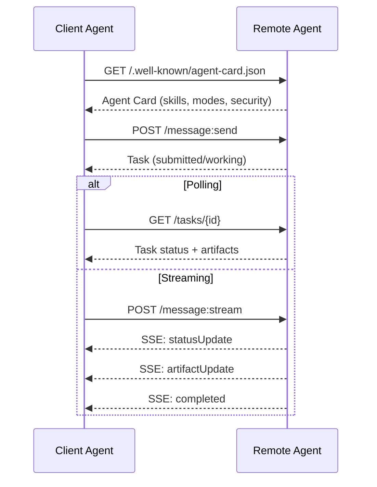

#### Gerçek Ajan Kartı

A2A ajan kartı doğada böyle görünüyor.`GET /.well-known/agent-card.json`- ...

```json
{
  "name": "Research Agent",
  "description": "Searches documentation and summarizes findings",
  "version": "1.0.0",
  "supportedInterfaces": [
    {
      "url": "https://research-agent.example.com/a2a/v1",
      "protocolBinding": "JSONRPC",
      "protocolVersion": "1.0"
    },
    {
      "url": "https://research-agent.example.com/a2a/rest",
      "protocolBinding": "HTTP+JSON",
      "protocolVersion": "1.0"
    }
  ],
  "provider": {
    "organization": "Your Company",
    "url": "https://example.com"
  },
  "capabilities": {
    "streaming": true,
    "pushNotifications": false
  },
  "defaultInputModes": ["text/plain", "application/json"],
  "defaultOutputModes": ["text/plain", "application/json"],
  "skills": [
    {
      "id": "web-research",
      "name": "Web Research",
      "description": "Searches the web and synthesizes findings",
      "tags": ["research", "search", "summarization"],
      "examples": ["Research the latest changes in React 19"]
    },
    {
      "id": "doc-analysis",
      "name": "Documentation Analysis",
      "description": "Reads and analyzes technical documentation",
      "tags": ["docs", "analysis"],
      "inputModes": ["text/plain", "application/pdf"],
      "outputModes": ["application/json"]
    }
  ],
  "securitySchemes": {
    "bearer": {
      "httpAuthSecurityScheme": {
        "scheme": "Bearer",
        "bearerFormat": "JWT"
      }
    }
  },
  "security": [{ "bearer": [] }]
}
```

Dikkat edilmesi gereken önemli şeyler:
- **Skills**Bu, bir istemci ajansının isteklerini ele alabilmeyeceğini belirler.
- **supportedInterfaces**Tek bir ajan aynı anda JSON-RPC, REST ve gRPC konuşabilir.
- **Security**Müşteri tek bir talebi yapmadan önce neye ihtiyacı olduğunu bilir.

#### Görev Yaşam Çeviri

Görevler A2A'nın temel çalışma birimidir.

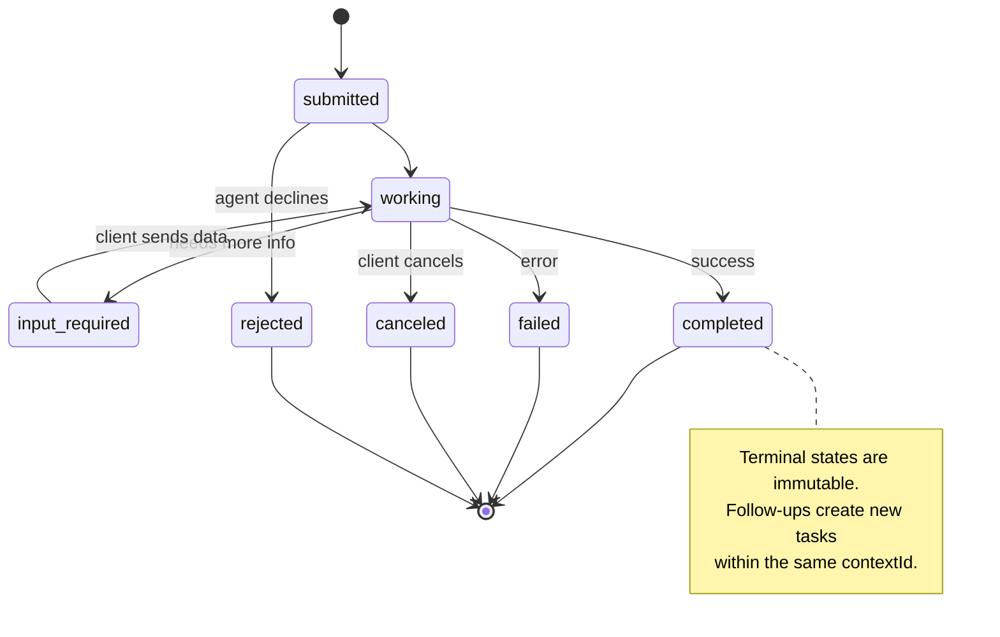

Tüm 8 devlet (spektrin aynı zamanda tanımladığı `UNSPECIFIED`Burada atılan bir bekçi olarak:

| State | Terminal? | Meaning |
|---|---|---|
| `TASK_STATE_SUBMITTED` | No | Acknowledged, not yet processing |
| `TASK_STATE_WORKING` | No | Actively being processed |
| `TASK_STATE_INPUT_REQUIRED` | No | Agent needs more info from client |
| `TASK_STATE_AUTH_REQUIRED` | No | Authentication needed |
| `TASK_STATE_COMPLETED` | Yes | Finished successfully |
| `TASK_STATE_FAILED` | Yes | Finished with error |
| `TASK_STATE_CANCELED` | Yes | Canceled before completion |
| `TASK_STATE_REJECTED` | Yes | Agent declined the task |

Bir görev son durumuna ulaştığında değişmez. Daha fazla mesaj yok. Takipler aynı görev içinde yeni bir görev oluşturur.`contextId`- Evet .

#### Kablo Formatı

A2A JSON-RPC 2.0 kullanıyor. Gerçek mesaj değişimi nasıl görünüyor:

**Client sends a task:**
```json
{
  "jsonrpc": "2.0",
  "id": 1,
  "method": "SendMessage",
  "params": {
    "message": {
      "messageId": "msg-001",
      "role": "ROLE_USER",
      "parts": [{ "text": "Research React 19 compiler features" }]
    },
    "configuration": {
      "acceptedOutputModes": ["text/plain", "application/json"],
      "historyLength": 10
    }
  }
}
```

**Agent responds with a task:**
```json
{
  "jsonrpc": "2.0",
  "id": 1,
  "result": {
    "task": {
      "id": "task-abc-123",
      "contextId": "ctx-xyz-789",
      "status": {
        "state": "TASK_STATE_COMPLETED",
        "timestamp": "2026-03-27T10:30:00Z"
      },
      "artifacts": [
        {
          "artifactId": "art-001",
          "name": "research-results",
          "parts": [{
            "data": {
              "findings": [
                "React 19 compiler auto-memoizes components",
                "No more manual useMemo/useCallback needed",
                "Compiler runs at build time, not runtime"
              ]
            },
            "mediaType": "application/json"
          }]
        }
      ]
    }
  }
}
```

**Streaming via SSE:**
```text
POST /message:stream HTTP/1.1
Content-Type: application/json
A2A-Version: 1.0

data: {"task":{"id":"task-123","status":{"state":"TASK_STATE_WORKING"}}}

data: {"statusUpdate":{"taskId":"task-123","status":{"state":"TASK_STATE_WORKING","message":{"role":"ROLE_AGENT","parts":[{"text":"Searching documentation..."}]}}}}

data: {"artifactUpdate":{"taskId":"task-123","artifact":{"artifactId":"art-1","parts":[{"text":"partial findings..."}]},"append":true,"lastChunk":false}}

data: {"statusUpdate":{"taskId":"task-123","status":{"state":"TASK_STATE_COMPLETED"}}}
```

### AKT (Agent İletişim Protokolü)

**Created by:**IBM / BeeAI
**Spec version:**0.2.0 (OpenAPI 3.1.1)
**Status:**Linux Vakfı altında A2A'ya birleşme
**Problem:**Ajanlar tam denetim, seans devamlılığı ve yörenin takip edilmesi ile nasıl iletişim kurarlar?

ACP'dir.**enterprise protocol**Birçok özetin iddia ettiği aksine, ACP'nin yaptığı **not**JSON-LD kullanın. Bu açık API'den açık bir REST/JSON API'dir.**TrajectoryMetadata**: her ajan cevabı, onu üreten akıl yürütme adımlarının ve araç çağrılarının ayrıntılı bir günlük taşıyabilir.

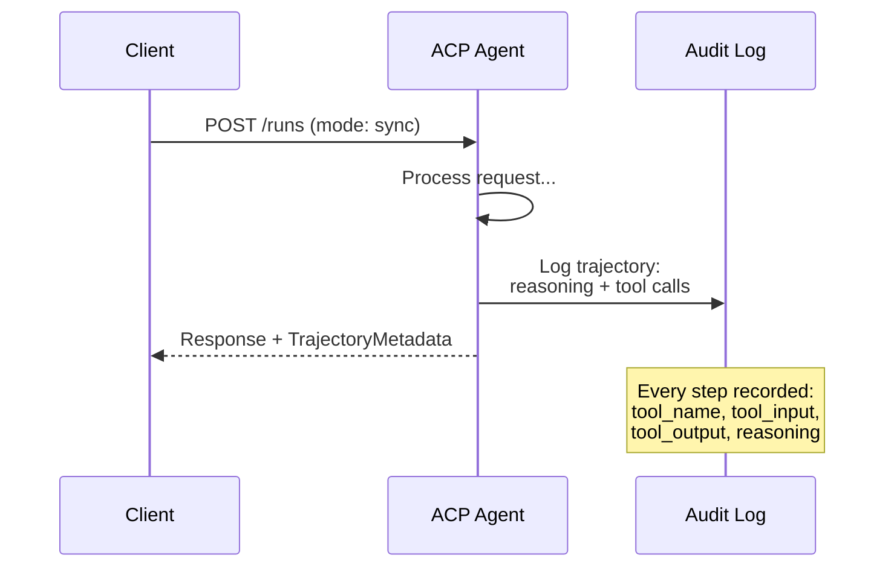

#### AKC'de bulunan Ajan Discovery

ACP dört keşif yöntemini tanımlar:

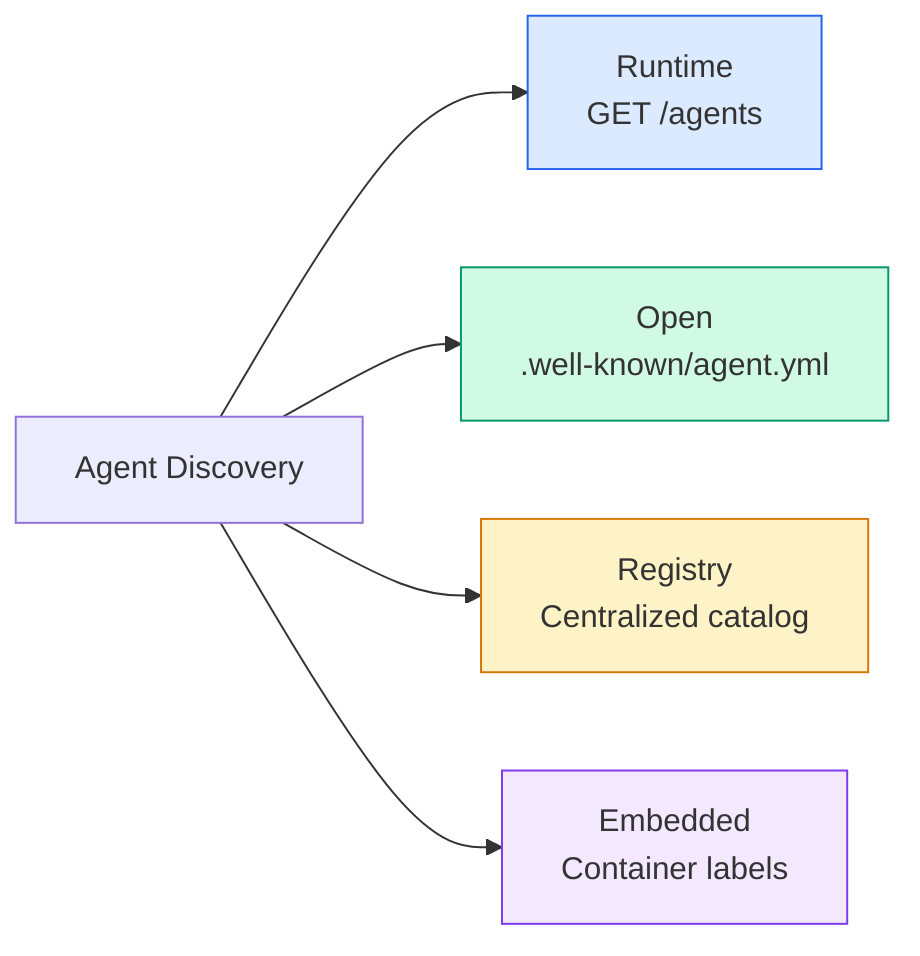

- Evet .**AgentManifest**A2A'nın ajan kartından daha basit:

```json
{
  "name": "summarizer",
  "description": "Summarizes documents with source citations",
  "input_content_types": ["text/plain", "application/pdf"],
  "output_content_types": ["text/plain", "application/json"],
  "metadata": {
    "tags": ["summarization", "RAG"],
    "framework": "BeeAI",
    "capabilities": [
      {
        "name": "Document Summarization",
        "description": "Condenses long documents into key points"
      }
    ],
    "recommended_models": ["llama3.3:70b-instruct-fp16"],
    "license": "Apache-2.0",
    "programming_language": "Python"
  }
}
```

#### Yaşam Dönemi

ACP, "Taşlar" yerine "Runs" kullanır.

| Mode | Behavior |
|---|---|
| `sync` | Blocking. Response contains the complete result. |
| `async` | Returns 202 immediately. Poll `GET /runs/{id}` for status. |
| `stream` | SSE stream. Events fire as the agent works. |

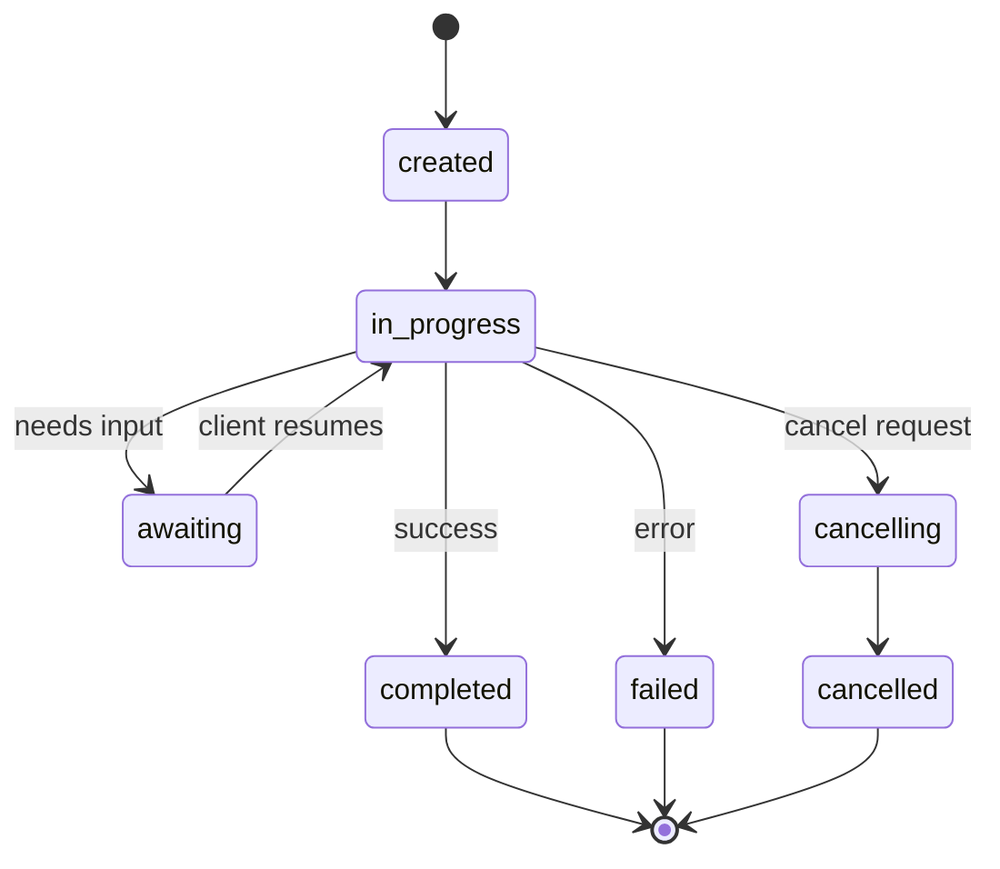

#### YoluMetadata (Audit Yolları)

Bu ACP'nin temel farkı. Her mesaj parçası, ajanın tam olarak ne yaptığını gösteren metadataları içerebilir:

```json
{
  "role": "agent/researcher",
  "parts": [
    {
      "content_type": "text/plain",
      "content": "The weather in San Francisco is 72F and sunny.",
      "metadata": {
        "kind": "trajectory",
        "message": "I need to check the weather for this location",
        "tool_name": "weather_api",
        "tool_input": { "location": "San Francisco, CA" },
        "tool_output": { "temperature": 72, "condition": "sunny" }
      }
    }
  ]
}
```

Düzenlenmiş endüstriler için bu altın. Her cevap kanıtlanabilir bir mantık zinciri ile gelir: hangi araçlar çağrıldı, hangi girişler kullanıldı, hangi çıkışlar alındı.

ACP ayrıca **CitationMetadata**Kaynak atıfı için:

```json
{
  "kind": "citation",
  "start_index": 0,
  "end_index": 47,
  "url": "https://weather.gov/sf",
  "title": "NWS San Francisco Forecast"
}
```

### ANP (Agent Ağ Protokolü)

**Created by:**Açık kaynaklı topluluk (GaoWei Chang tarafından kurulmuştur)
**Repo:** [github.com/agent-network-protocol/AgentNetworkProtocol](https://github.com/agent-network-protocol/AgentNetworkProtocol)
**Problem:**Farklı kuruluşların ajanları merkezi bir yetki olmadan nasıl birbirlerine güvenirler?

ANP'nin adı **decentralized identity protocol**W3C Merkezi Tanımlayıcıları (DID) ve uçtan sona şifreleme kullanarak güven oluşturur. A2A'nın aksine, bilinen uç noktaları üzerinden ajanları keşfetmek için, ANP ajanların kimliklerini kriptografik olarak kanıtlamalarını sağlar.

ANP üç katmanlı:

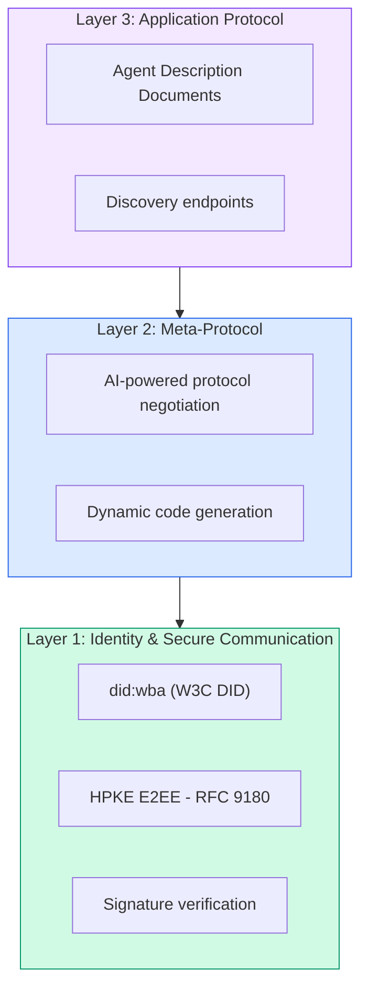

#### DID belgeleri (gerçek yapı)

ANP ,  adı verilen özel bir DID yöntemi kullanır .`did:wba`(Web Temel Ajan)`did:wba:example.com:user:alice`karar verir `https://example.com/user/alice/did.json`- ...

```json
{
  "@context": [
    "https://www.w3.org/ns/did/v1",
    "https://w3id.org/security/suites/jws-2020/v1",
    "https://w3id.org/security/suites/secp256k1-2019/v1"
  ],
  "id": "did:wba:example.com:user:alice",
  "verificationMethod": [
    {
      "id": "did:wba:example.com:user:alice#key-1",
      "type": "EcdsaSecp256k1VerificationKey2019",
      "controller": "did:wba:example.com:user:alice",
      "publicKeyJwk": {
        "crv": "secp256k1",
        "x": "NtngWpJUr-rlNNbs0u-Aa8e16OwSJu6UiFf0Rdo1oJ4",
        "y": "qN1jKupJlFsPFc1UkWinqljv4YE0mq_Ickwnjgasvmo",
        "kty": "EC"
      }
    },
    {
      "id": "did:wba:example.com:user:alice#key-x25519-1",
      "type": "X25519KeyAgreementKey2019",
      "controller": "did:wba:example.com:user:alice",
      "publicKeyMultibase": "z9hFgmPVfmBZwRvFEyniQDBkz9LmV7gDEqytWyGZLmDXE"
    }
  ],
  "authentication": [
    "did:wba:example.com:user:alice#key-1"
  ],
  "keyAgreement": [
    "did:wba:example.com:user:alice#key-x25519-1"
  ],
  "humanAuthorization": [
    "did:wba:example.com:user:alice#key-1"
  ],
  "service": [
    {
      "id": "did:wba:example.com:user:alice#agent-description",
      "type": "AgentDescription",
      "serviceEndpoint": "https://example.com/agents/alice/ad.json"
    }
  ]
}
```

Dikkat edilmesi gereken önemli şeyler:
- **Key separation**İmza anahtarları (secp256k1) şifrelenme anahtarlarından (X25519) ayrıdır.
- **`humanAuthorization`**Bu anahtarlar kullanmadan önce açık bir insan onayına (biometrik, şifre, HSM) ihtiyaç duyar.
- **`keyAgreement`**HPKE uçtan uç şifreleme için anahtarlar kullanılır (RFC 9180).
- - Evet .**service**Bölümde ajan tanımlama belgesine bağlantılar bulunmaktadır.

#### ANP'de Güven Nasıl Çalışır

ANP yapıyor.**not**Güvenin web-of-trust veya onaylama grafikini kullanın. Güven iki taraflı ve etkileşime göre doğrulanır:

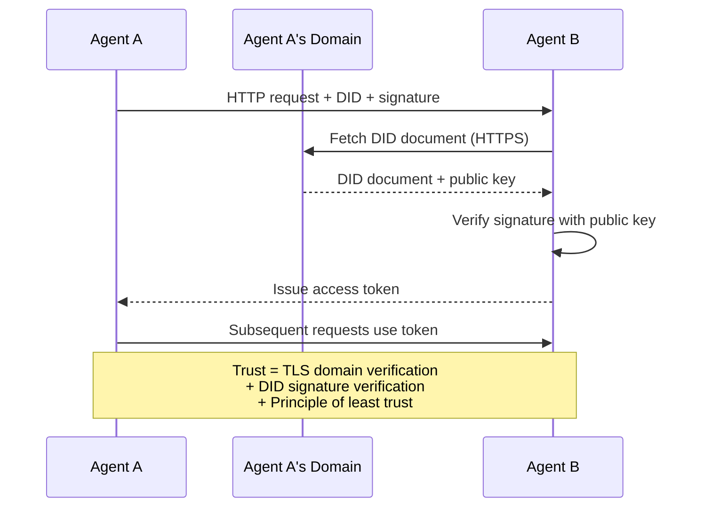

Güven üç kaynaktan gelir:
1. **Domain-level TLS**DID belgesinin ev sahibi doğrulanır
2. **DID cryptographic signatures**ajanın kimliğini doğrula
3. **Principle of least trust**Sadece en az izinler verir.

İpuçlara dayalı güven yayımı ya da PageRank puanlaması yok.

#### Meta-Protokol müzakere

Bu ANP'nin en yeni özelliği. Farklı ekosistemlerden iki ajan buluştuğunda, önceden anlaşılmış veri biçimlerine ihtiyaçları yoktur.

```json
{
  "action": "protocolNegotiation",
  "sequenceId": 0,
  "candidateProtocols": "I can communicate using:\n1. JSON-RPC with hotel booking schema\n2. REST with OpenAPI 3.1 spec\n3. Natural language over HTTP",
  "modificationSummary": "Initial proposal",
  "status": "negotiating"
}
```

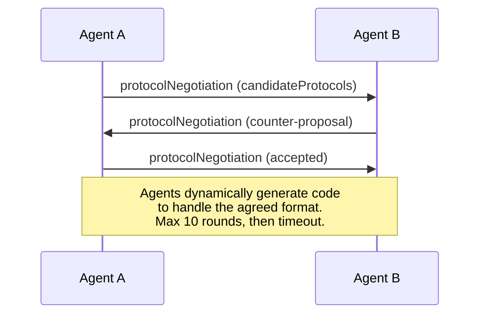

Ajanlar bir biçim üzerinde anlaşıncaya kadar ileri-geri (maksimum 10 atış) giderler, sonra da onu yönetmek için dinamik bir kod oluştururlar.`negotiating`- Evet .`rejected`- Evet .`accepted`- Evet .`timeout`- Evet .

Bu, daha önce hiç görüşmemiş iki ajanın, ortak bir şema önceden tanımlamadan nasıl iletişim kuracağını anlayabilmeleri anlamına gelir.

### Karşılaştırma (Düzeltilmiş)

| | MCP | A2A | ACP | ANP |
|---|---|---|---|---|
| **Created by** | Anthropic | Google / Linux Foundation | IBM / BeeAI | Community |
| **Spec format** | JSON-RPC | JSON-RPC / REST / gRPC | OpenAPI 3.1 (REST) | JSON-RPC |
| **Primary use** | Agent to Tool | Agent to Agent | Agent to Agent | Agent to Agent |
| **Discovery** | Tool listing | `/.well-known/agent-card.json` | `GET /agents`, `/.well-known/agent.yml` | `/.well-known/agent-descriptions`, DID service endpoints |
| **Identity** | Implicit (local) | Security schemes (OAuth, mTLS) | Server-level | W3C DID (`did:wba`) with E2EE |
| **Audit trail** | N/A | Basic (task history) | TrajectoryMetadata (tool calls, reasoning) | Not formally specified |
| **State machine** | N/A | 9 task states | 7 run states | N/A |
| **Streaming** | N/A | SSE | SSE | Transport-agnostic |
| **Unique feature** | Tool schemas | Agent Cards + Skills | Trajectory audit trail | Meta-protocol negotiation |
| **Best for** | Tools & data | Dynamic collaboration | Regulated industries | Cross-org trust |
| **Status** | Stable | Stable (v1.0) | Merging into A2A | Active development |

### Birlikte Nasıl Çalışırlar

Bu protokoller birbirini kapsaymaz. Gerçekçi bir işletme sistemi birden fazla kullanır:

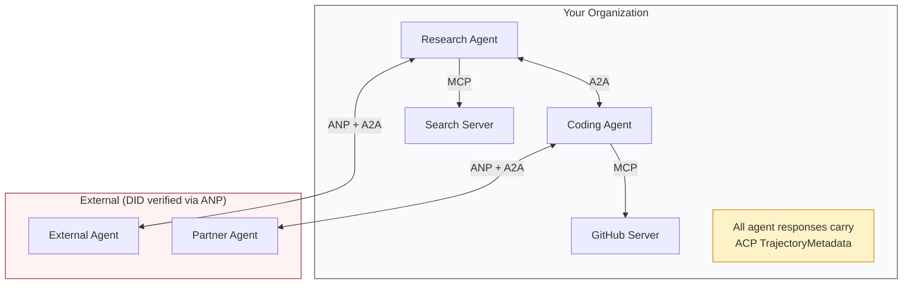

- **MCP**Her ajanı aletlerine bağlar.
- **A2A**(İçi ve dış) ajanlar arasındaki işbirliğiyi ele alır.
- **ACP**Denetim edilebilirlik için cevapları trajektör metadatalarında sarar
- **ANP**Kontrol etmediğiniz ajanlar için kimlik doğrulama sağlar.

```figure
swarm-message-bus
```

## Yapın

### Adım 1: Temel Mesaj Türleri

Her çoklu ajan sistemi bir mesaj biçimi ile başlar. Gerçek protokollerin kullandığı harita türlerini tanımlarız:

```typescript
import crypto from "node:crypto";

type MessageRole = "user" | "agent";

type MessagePart =
  | { kind: "text"; text: string }
  | { kind: "data"; data: unknown; mediaType: string }
  | { kind: "file"; name: string; url: string; mediaType: string };

type TrajectoryEntry = {
  reasoning: string;
  toolName?: string;
  toolInput?: unknown;
  toolOutput?: unknown;
  timestamp: number;
};

type AgentMessage = {
  id: string;
  role: MessageRole;
  parts: MessagePart[];
  trajectory?: TrajectoryEntry[];
  replyTo?: string;
  timestamp: number;
};

function createMessage(
  role: MessageRole,
  parts: MessagePart[],
  replyTo?: string
): AgentMessage {
  return {
    id: crypto.randomUUID(),
    role,
    parts,
    replyTo,
    timestamp: Date.now(),
  };
}

function textMessage(role: MessageRole, text: string): AgentMessage {
  return createMessage(role, [{ kind: "text", text }]);
}
```

Not: `MessagePart`A2A ve ACP özellikleri gibi multimodal (metin, yapılandırılmış veriler, dosyalar) `TrajectoryEntry`AKT'in TrajectoryMetadata'sına eşleşen akıl zinciri yakalar.

### Adım 2: A2A Ajan Kartı ve Kayıt

Gerçek A2A özelliklerine uyan bir ajan keşfi yapın:

```typescript
type Skill = {
  id: string;
  name: string;
  description: string;
  tags: string[];
  inputModes: string[];
  outputModes: string[];
};

type AgentCard = {
  name: string;
  description: string;
  version: string;
  url: string;
  capabilities: {
    streaming: boolean;
    pushNotifications: boolean;
  };
  defaultInputModes: string[];
  defaultOutputModes: string[];
  skills: Skill[];
};

class AgentRegistry {
  private cards: Map<string, AgentCard> = new Map();

  register(card: AgentCard) {
    this.cards.set(card.name, card);
  }

  discoverBySkillTag(tag: string): AgentCard[] {
    return [...this.cards.values()].filter((card) =>
      card.skills.some((skill) => skill.tags.includes(tag))
    );
  }

  discoverByInputMode(mimeType: string): AgentCard[] {
    return [...this.cards.values()].filter(
      (card) =>
        card.defaultInputModes.includes(mimeType) ||
        card.skills.some((skill) => skill.inputModes.includes(mimeType))
    );
  }

  resolve(name: string): AgentCard | undefined {
    return this.cards.get(name);
  }

  listAll(): AgentCard[] {
    return [...this.cards.values()];
  }
}
```

Bu basit bir isim-ya da yetenek haritasından daha zengin. A2A özelliklerinin desteklediği gibi yetenek etiketleri, giriş MIME türleri veya isimle ajanları keşfedebilirsiniz.

### Adım 3: A2A Görev Yaşam Dönemi

Tam görev durum makinesini oluştur:

```typescript
type TaskState =
  | "submitted"
  | "working"
  | "input-required"
  | "auth-required"
  | "completed"
  | "failed"
  | "canceled"
  | "rejected";

const TERMINAL_STATES: TaskState[] = [
  "completed",
  "failed",
  "canceled",
  "rejected",
];

type TaskStatus = {
  state: TaskState;
  message?: AgentMessage;
  timestamp: number;
};

type Artifact = {
  id: string;
  name: string;
  parts: MessagePart[];
};

type Task = {
  id: string;
  contextId: string;
  status: TaskStatus;
  artifacts: Artifact[];
  history: AgentMessage[];
};

type TaskEvent =
  | { kind: "statusUpdate"; taskId: string; status: TaskStatus }
  | {
      kind: "artifactUpdate";
      taskId: string;
      artifact: Artifact;
      append: boolean;
      lastChunk: boolean;
    };

type TaskHandler = (
  task: Task,
  message: AgentMessage
) => AsyncGenerator<TaskEvent>;

class TaskManager {
  private tasks: Map<string, Task> = new Map();
  private handlers: Map<string, TaskHandler> = new Map();
  private listeners: Map<string, ((event: TaskEvent) => void)[]> = new Map();

  registerHandler(agentName: string, handler: TaskHandler) {
    this.handlers.set(agentName, handler);
  }

  subscribe(taskId: string, listener: (event: TaskEvent) => void) {
    const existing = this.listeners.get(taskId) ?? [];
    existing.push(listener);
    this.listeners.set(taskId, existing);
  }

  async sendMessage(
    agentName: string,
    message: AgentMessage,
    contextId?: string
  ): Promise<Task> {
    const handler = this.handlers.get(agentName);
    if (!handler) {
      const task = this.createTask(contextId);
      task.status = {
        state: "rejected",
        timestamp: Date.now(),
        message: textMessage("agent", `No handler for ${agentName}`),
      };
      return task;
    }

    const task = this.createTask(contextId);
    task.history.push(message);
    task.status = { state: "submitted", timestamp: Date.now() };

    this.processTask(task, handler, message).catch((err) => {
      task.status = {
        state: "failed",
        timestamp: Date.now(),
        message: textMessage("agent", String(err)),
      };
    });
    return task;
  }

  getTask(taskId: string): Task | undefined {
    return this.tasks.get(taskId);
  }

  cancelTask(taskId: string): boolean {
    const task = this.tasks.get(taskId);
    if (!task || TERMINAL_STATES.includes(task.status.state)) return false;
    task.status = { state: "canceled", timestamp: Date.now() };
    this.emit(taskId, {
      kind: "statusUpdate",
      taskId,
      status: task.status,
    });
    return true;
  }

  private createTask(contextId?: string): Task {
    const task: Task = {
      id: crypto.randomUUID(),
      contextId: contextId ?? crypto.randomUUID(),
      status: { state: "submitted", timestamp: Date.now() },
      artifacts: [],
      history: [],
    };
    this.tasks.set(task.id, task);
    return task;
  }

  private async processTask(
    task: Task,
    handler: TaskHandler,
    message: AgentMessage
  ) {
    task.status = { state: "working", timestamp: Date.now() };
    this.emit(task.id, {
      kind: "statusUpdate",
      taskId: task.id,
      status: task.status,
    });

    try {
      for await (const event of handler(task, message)) {
        if (TERMINAL_STATES.includes(task.status.state)) break;

        if (event.kind === "statusUpdate") {
          task.status = event.status;
        }
        if (event.kind === "artifactUpdate") {
          const existing = task.artifacts.find(
            (a) => a.id === event.artifact.id
          );
          if (existing && event.append) {
            existing.parts.push(...event.artifact.parts);
          } else {
            task.artifacts.push(event.artifact);
          }
        }
        this.emit(task.id, event);
      }
    } catch (err) {
      task.status = {
        state: "failed",
        timestamp: Date.now(),
        message: textMessage("agent", String(err)),
      };
      this.emit(task.id, {
        kind: "statusUpdate",
        taskId: task.id,
        status: task.status,
      });
    }
  }

  private emit(taskId: string, event: TaskEvent) {
    for (const listener of this.listeners.get(taskId) ?? []) {
      listener(event);
    }
  }
}
```

Bu gerçek A2A görev yaşam döngüsünü uyguluyor: gönderilen, çalışan, girme-gerekli, terminal durumları. İşleştiriciler SSE akış modeli ile eşleşen olayları (istatis güncellemeleri ve artefakt parçaları) üreten asink jeneratörlerdir.

### 4. Adım: AKT tarzı denetim yolu

Yolu izleme ile iletişim kurmak:

```typescript
type AuditEntry = {
  runId: string;
  agentName: string;
  input: AgentMessage[];
  output: AgentMessage[];
  trajectory: TrajectoryEntry[];
  status: "created" | "in-progress" | "completed" | "failed" | "awaiting";
  startedAt: number;
  completedAt?: number;
  sessionId?: string;
};

class AuditableRunner {
  private log: AuditEntry[] = [];
  private handlers: Map<
    string,
    (input: AgentMessage[]) => Promise<{
      output: AgentMessage[];
      trajectory: TrajectoryEntry[];
    }>
  > = new Map();

  registerAgent(
    name: string,
    handler: (input: AgentMessage[]) => Promise<{
      output: AgentMessage[];
      trajectory: TrajectoryEntry[];
    }>
  ) {
    this.handlers.set(name, handler);
  }

  async run(
    agentName: string,
    input: AgentMessage[],
    sessionId?: string
  ): Promise<AuditEntry> {
    const entry: AuditEntry = {
      runId: crypto.randomUUID(),
      agentName,
      input: structuredClone(input),
      output: [],
      trajectory: [],
      status: "created",
      startedAt: Date.now(),
      sessionId,
    };
    this.log.push(entry);

    const handler = this.handlers.get(agentName);
    if (!handler) {
      entry.status = "failed";
      return entry;
    }

    entry.status = "in-progress";
    try {
      const result = await handler(input);
      entry.output = structuredClone(result.output);
      entry.trajectory = structuredClone(result.trajectory);
      entry.status = "completed";
      entry.completedAt = Date.now();
    } catch (err) {
      entry.status = "failed";
      entry.trajectory.push({
        reasoning: `Error: ${String(err)}`,
        timestamp: Date.now(),
      });
      entry.completedAt = Date.now();
    }
    return entry;
  }

  getFullAuditLog(): AuditEntry[] {
    return structuredClone(this.log);
  }

  getAuditLogForAgent(agentName: string): AuditEntry[] {
    return structuredClone(
      this.log.filter((e) => e.agentName === agentName)
    );
  }

  getAuditLogForSession(sessionId: string): AuditEntry[] {
    return structuredClone(
      this.log.filter((e) => e.sessionId === sessionId)
    );
  }

  getTrajectoryForRun(runId: string): TrajectoryEntry[] {
    const entry = this.log.find((e) => e.runId === runId);
    return entry ? structuredClone(entry.trajectory) : [];
  }
}
```

Her ajan çalışması tam bir denetim girişini oluşturur: ne girdi, ne çıktı ve araç çağrılarının ve bunun arasında düşünme adımlarının tüm trajektörünü.

### Adım 5: ANP-Stil Kimlik Doğrulama

DID tabanlı kimlik ve doğrulama oluşturmak:

```typescript
type VerificationMethod = {
  id: string;
  type: string;
  controller: string;
  publicKeyDer: string;
};

type DIDDocument = {
  id: string;
  verificationMethod: VerificationMethod[];
  authentication: string[];
  keyAgreement: string[];
  humanAuthorization: string[];
  service: { id: string; type: string; serviceEndpoint: string }[];
};

type AgentIdentity = {
  did: string;
  document: DIDDocument;
  privateKey: crypto.KeyObject;
  publicKey: crypto.KeyObject;
};

class IdentityRegistry {
  private documents: Map<string, DIDDocument> = new Map();

  publish(doc: DIDDocument) {
    this.documents.set(doc.id, doc);
  }

  resolve(did: string): DIDDocument | undefined {
    return this.documents.get(did);
  }

  verify(did: string, signature: string, payload: string): boolean {
    const doc = this.documents.get(did);
    if (!doc) return false;

    const authKeyIds = doc.authentication;
    const authKeys = doc.verificationMethod.filter((vm) =>
      authKeyIds.includes(vm.id)
    );

    for (const key of authKeys) {
      const publicKey = crypto.createPublicKey({
        key: Buffer.from(key.publicKeyDer, "base64"),
        format: "der",
        type: "spki",
      });
      const isValid = crypto.verify(
        null,
        Buffer.from(payload),
        publicKey,
        Buffer.from(signature, "hex")
      );
      if (isValid) return true;
    }
    return false;
  }

  requiresHumanAuth(did: string, operationKeyId: string): boolean {
    const doc = this.documents.get(did);
    if (!doc) return false;
    return doc.humanAuthorization.includes(operationKeyId);
  }
}

function createIdentity(domain: string, agentName: string): AgentIdentity {
  const did = `did:wba:${domain}:agent:${agentName}`;
  const { publicKey, privateKey } = crypto.generateKeyPairSync("ed25519");

  const publicKeyDer = publicKey
    .export({ format: "der", type: "spki" })
    .toString("base64");

  const keyId = `${did}#key-1`;
  const encKeyId = `${did}#key-x25519-1`;

  const document: DIDDocument = {
    id: did,
    verificationMethod: [
      {
        id: keyId,
        type: "Ed25519VerificationKey2020",
        controller: did,
        publicKeyDer,
      },
      {
        id: encKeyId,
        type: "X25519KeyAgreementKey2019",
        controller: did,
        publicKeyDer,
      },
    ],
    authentication: [keyId],
    keyAgreement: [encKeyId],
    humanAuthorization: [],
    service: [
      {
        id: `${did}#agent-description`,
        type: "AgentDescription",
        serviceEndpoint: `https://${domain}/agents/${agentName}/ad.json`,
      },
    ],
  };

  return { did, document, privateKey, publicKey };
}

function signPayload(identity: AgentIdentity, payload: string): string {
  return crypto
    .sign(null, Buffer.from(payload), identity.privateKey)
    .toString("hex");
}
```

Bu gerçek ANP kimlik modelini yansıtır: ajanlar ayrı kimlik doğrulama, anahtar anlaşma ve insan yetkisi anahtarları ile DID belgelerine sahiptir.`IdentityRegistry`DID çözünürlüğünü simüle eder (prodüksiyonda bu, ajanın alanına HTTP getirir).

### Adım 6: Protokol Geçidi

Dört protokolü de tek bir sisteme bağlayın:

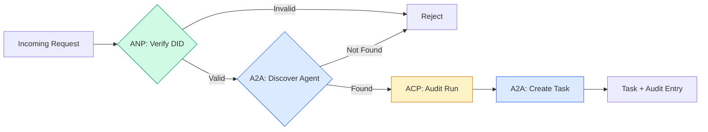

```typescript
class ProtocolGateway {
  private registry: AgentRegistry;
  private taskManager: TaskManager;
  private auditRunner: AuditableRunner;
  private identityRegistry: IdentityRegistry;

  constructor(
    registry: AgentRegistry,
    taskManager: TaskManager,
    auditRunner: AuditableRunner,
    identityRegistry: IdentityRegistry
  ) {
    this.registry = registry;
    this.taskManager = taskManager;
    this.auditRunner = auditRunner;
    this.identityRegistry = identityRegistry;
  }

  async delegateTask(
    fromDid: string,
    signature: string,
    targetAgent: string,
    message: AgentMessage,
    sessionId?: string
  ): Promise<{ task: Task; audit: AuditEntry } | { error: string }> {
    if (!this.identityRegistry.verify(fromDid, signature, message.id)) {
      return { error: "Identity verification failed" };
    }

    const card = this.registry.resolve(targetAgent);
    if (!card) {
      return { error: `Agent ${targetAgent} not found in registry` };
    }

    const audit = await this.auditRunner.run(
      targetAgent,
      [message],
      sessionId
    );
    const task = await this.taskManager.sendMessage(targetAgent, message);

    return { task, audit };
  }

  discoverAndDelegate(
    fromDid: string,
    signature: string,
    skillTag: string,
    message: AgentMessage
  ): Promise<{ task: Task; audit: AuditEntry } | { error: string }> {
    const candidates = this.registry.discoverBySkillTag(skillTag);
    if (candidates.length === 0) {
      return Promise.resolve({
        error: `No agents found with skill tag: ${skillTag}`,
      });
    }
    return this.delegateTask(
      fromDid,
      signature,
      candidates[0].name,
      message
    );
  }
}
```

Kapı bir çağrıda dört şey yapar:
1. **ANP**: DID imzası ile arayanın kimliğini doğruluyor
2. **A2A**: Hedef ajanı keşfeder ve yeteneklerini kontrol eder
3. **ACP**: İcracılığı bir denetim izine çevirir ve bir yoldur
4. **A2A**: Tam yaşam döngüsü izleme ile bir görev oluşturur

### 7 . Adım: Her şeyi bir arada yapın

```typescript
async function protocolDemo() {
  const registry = new AgentRegistry();
  registry.register({
    name: "researcher",
    description: "Searches and summarizes findings",
    version: "1.0.0",
    url: "https://researcher.local/a2a/v1",
    capabilities: { streaming: true, pushNotifications: false },
    defaultInputModes: ["text/plain"],
    defaultOutputModes: ["text/plain", "application/json"],
    skills: [
      {
        id: "web-research",
        name: "Web Research",
        description: "Searches the web",
        tags: ["research", "search", "summarization"],
        inputModes: ["text/plain"],
        outputModes: ["application/json"],
      },
    ],
  });
  registry.register({
    name: "coder",
    description: "Writes code from specs",
    version: "1.0.0",
    url: "https://coder.local/a2a/v1",
    capabilities: { streaming: false, pushNotifications: false },
    defaultInputModes: ["text/plain", "application/json"],
    defaultOutputModes: ["text/plain"],
    skills: [
      {
        id: "code-gen",
        name: "Code Generation",
        description: "Generates code",
        tags: ["coding", "generation"],
        inputModes: ["text/plain", "application/json"],
        outputModes: ["text/plain"],
      },
    ],
  });

  const taskManager = new TaskManager();
  const auditRunner = new AuditableRunner();

  const researchTrajectory: TrajectoryEntry[] = [];

  taskManager.registerHandler(
    "researcher",
    async function* (task, message) {
      yield {
        kind: "statusUpdate" as const,
        taskId: task.id,
        status: { state: "working" as const, timestamp: Date.now() },
      };

      researchTrajectory.push({
        reasoning: "Searching for React 19 documentation",
        toolName: "web_search",
        toolInput: { query: "React 19 compiler features" },
        toolOutput: {
          results: ["react.dev/blog/react-19", "github.com/react/react"],
        },
        timestamp: Date.now(),
      });

      researchTrajectory.push({
        reasoning: "Extracting key findings from search results",
        toolName: "doc_analysis",
        toolInput: { url: "react.dev/blog/react-19" },
        toolOutput: {
          summary:
            "React 19 compiler auto-memoizes, no manual useMemo needed",
        },
        timestamp: Date.now(),
      });

      yield {
        kind: "artifactUpdate" as const,
        taskId: task.id,
        artifact: {
          id: crypto.randomUUID(),
          name: "research-results",
          parts: [
            {
              kind: "data" as const,
              data: {
                findings: [
                  "React 19 compiler auto-memoizes components",
                  "No more manual useMemo/useCallback needed",
                  "Compiler runs at build time, not runtime",
                ],
                sources: ["react.dev/blog/react-19"],
              },
              mediaType: "application/json",
            },
          ],
        },
        append: false,
        lastChunk: true,
      };

      yield {
        kind: "statusUpdate" as const,
        taskId: task.id,
        status: { state: "completed" as const, timestamp: Date.now() },
      };
    }
  );

  auditRunner.registerAgent("researcher", async () => ({
    output: [
      textMessage("agent", "React 19 compiler auto-memoizes components"),
    ],
    trajectory: researchTrajectory,
  }));

  const identityRegistry = new IdentityRegistry();

  const coderIdentity = createIdentity("coder.local", "coder");
  const researcherIdentity = createIdentity("researcher.local", "researcher");

  identityRegistry.publish(coderIdentity.document);
  identityRegistry.publish(researcherIdentity.document);

  const gateway = new ProtocolGateway(
    registry,
    taskManager,
    auditRunner,
    identityRegistry
  );

  console.log("=== Protocol Demo ===\n");

  console.log("1. Agent Discovery (A2A)");
  const researchAgents = registry.discoverBySkillTag("research");
  console.log(
    `   Found ${researchAgents.length} agent(s):`,
    researchAgents.map((a) => a.name)
  );

  console.log("\n2. Identity Verification (ANP)");
  const message = textMessage("user", "Research React 19 compiler features");
  const signature = signPayload(coderIdentity, message.id);
  const verified = identityRegistry.verify(
    coderIdentity.did,
    signature,
    message.id
  );
  console.log(`   Coder DID: ${coderIdentity.did}`);
  console.log(`   Signature verified: ${verified}`);

  console.log("\n3. Task Delegation (A2A + ACP + ANP)");
  const result = await gateway.delegateTask(
    coderIdentity.did,
    signature,
    "researcher",
    message,
    "session-001"
  );

  if ("error" in result) {
    console.log(`   Error: ${result.error}`);
    return;
  }

  console.log(`   Task ID: ${result.task.id}`);
  console.log(`   Task state: ${result.task.status.state}`);
  console.log(`   Artifacts: ${result.task.artifacts.length}`);

  console.log("\n4. Audit Trail (ACP)");
  console.log(`   Run ID: ${result.audit.runId}`);
  console.log(`   Status: ${result.audit.status}`);
  console.log(`   Trajectory steps: ${result.audit.trajectory.length}`);
  for (const step of result.audit.trajectory) {
    console.log(`     - ${step.reasoning}`);
    if (step.toolName) {
      console.log(`       Tool: ${step.toolName}`);
    }
  }

  console.log("\n5. Full Audit Log");
  const fullLog = auditRunner.getFullAuditLog();
  console.log(`   Total runs: ${fullLog.length}`);
  for (const entry of fullLog) {
    const duration = entry.completedAt
      ? `${entry.completedAt - entry.startedAt}ms`
      : "in-progress";
    console.log(`   ${entry.agentName}: ${entry.status} (${duration})`);
  }
}

protocolDemo().catch((err) => {
  console.error("Protocol demo failed:", err);
  process.exitCode = 1;
});
```

## Sorun Ne?

Protokoller mutlu yolları çözüyor.

**Schema drift.**A ajanı bir kart reklamı yayınlıyor .`application/json`Bu, bir diğer diğer özelliktir. ama JSON şeması sürümler arasında değişir. Ajan B eski biçimi analiz eder ve çöp alır. Düzelt: sürüm becerilerinizi ve çıkış şemelerini. A2A spesifikasyonu destekler `version`Bu nedenle Ajan Kartlar'a.

**State machine violations.**Bir ajanı yöneten bir `completed`Bu işlem, yeni bir program oluşturmak için, bir program oluşturmak için, bir program oluşturmak için, bir program oluşturmak için, bir program oluşturmak için, bir program oluşturmak için, bir program oluşturmak için, bir program oluşturmak için, bir program oluşturmak için, bir program oluşturmak için, bir program oluşturmak için, bir program oluşturmak için, bir program oluşturmak için, bir program oluşturmak için, bir program oluşturmak için, bir program oluşturmak için, bir program oluşturmak için, bir program oluşturmak için, bir program oluşturmak için, bir program oluşturmak için, bir program oluşturmak için, bir program oluşturmak için, bir program oluşturmak için, bir program oluşturmak için, bir program oluşturmak için, bir program oluşturmak için, bir program oluşturmak için, bir program oluşturmak için, bir program oluşturmak için, bir program oluşturmak için, bir program oluşturmak için, bir program oluşturmak için, bir program oluşturmak için, bir program oluşturmak için, bir program oluşturmak için, bir program oluşturmak için, bir program oluşturmak için, bir program oluşturmak için, bir program oluşturmak için, bir program oluşturmak için, bir program oluşturmak için, bir program oluşturmak için, bir program oluşturmak için, bir program oluşturmak için, bir program oluşturmak için, bir program oluşturmak için, bir program oluşturmak için, bir program oluşturmak için, bir program oluşturmak için, bir program oluşturmak için, bir program oluşturmak için, bir program oluşturmak için, bir program, bir program oluşturmak için, bir program, bir program oluşturmak için, bir program, bir program, oluşturmak için,`TaskManager`Bu konuda bir karar verildi.`break`Terminali durumlardan sonra.

**Trust resolution failures.**A ajanı B ajanının DID'ini doğrulamaya çalışıyor, ancak B ajanının alanı çökmüştür. DID belgesini alamazsınız. Açmayı başarısız mı ediyorsunuz (anlatılmamış ajanları kabul ediyor musunuz) veya kapatmayı başarısız mı ediyorsunuz (her şeyi reddediyorsunuz)? ANP en az güven ilkesine uygun olarak kapatmayı önerir.

**Trajectory bloat.**ACP yörüngesi kaydesi güçlü ama pahalıdır. Bir çalışmada 200 araç çağrısı yapan karmaşık bir ajan, büyük denetim girişleri üretir. Düzeltme: yapılandırılabilir sözcüklülik seviyelerinde kayıt yörüngesi. Uyumlulık için araç isimlerini ve IO'yu kaydedin, düzenlenmeyen iş yükleri için mantık adımlarını atın.

**Discovery thundering herd.**50 ajan tüm sorgu `GET /agents`TTL ile cache Agent Kartları, aşamalı keşif aralıkları veya seçim yerine push tabanlı kayıt kullanın.

## Kullan

### Gerçek Uygulamalar

**A2A**Google'ın en olgun.[official spec](https://github.com/google/A2A)Eğer ajanlarınız dinamik keşif ve işbirliğine ihtiyaç duyarsanız buradan başlayın.

**ACP**A2A'ya birleşiyor. IBM'in [BeeAI project](https://github.com/i-am-bee/acp)Bu nedenle, A2A'nın kullanımı için A2A'nın kullanılması gereken araçlar ve araçlar için A2A'nın kullanılması gereken araçlar ve araçlar için A2A'nın kullanılması gereken araçlar ve araçlar için A2A'nın kullanılması gereken araçlar ve araçlar için A2A'nın kullanılması gereken araçlar ve araçlar için A2A'nın kullanılması gereken araçlar ve araçlar için A2A'nın kullanılması gereken araçlar için de A2A'nın kullanılması gerekmektedir.

**ANP**En deneysel.[community repo](https://github.com/agent-network-protocol/AgentNetworkProtocol)Meta-protokol müzakere konsepti gerçekten yeni.

**MCP**Eğer ajanların araç kullanmasını istiyorsanız, MCP standarttır.

### Doğru Protokolü Seçmek

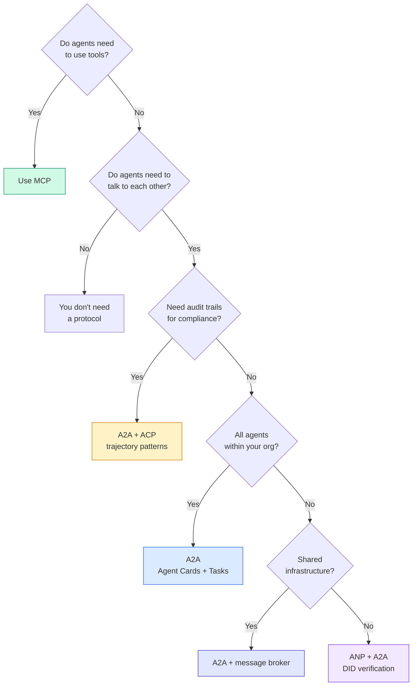

## Gönder

Bu ders şunları ortaya çıkarır:
- `code/main.ts`-- Dört protokol modelinin tamamı
- `outputs/prompt-protocol-selector.md`-- sisteminiz için protokoller seçmenize yardımcı olan bir istek.

## Egzersizler

1. **Multi-hop task delegation.**`TaskManager`Bu nedenle bir ajan yöneticisi alt görevleri diğer ajanlara delegede edebilir. Araştırmacı bir görev alır, alt görevleri iki uzman ajanına "arşiv" ve "cümlelendirir", her ikisinin tamamlanmasını bekler, sonra sonuçları kendi eserlerine birleştirir.

2. **Streaming audit trail.**Değiştir `AuditableRunner`Tam sonuç beklemek yerine, ver `AuditEntry`Trajektör girişleri eklendiğinde gerçek zamanlı güncelleştirmeler.

3. **DID rotation.**Anahtar dönüşümünü ekle `IdentityRegistry`Bir ajan , yeni bir DID belgesini güncelleştirilmiş anahtarlarla yayınlayıp bir `previousDid`Verifiyeciler, bir süre içinde hem mevcut hem de önceki anahtarın imzalarını kabul etmelidir.

4. **Protocol negotiation.**ANP'nin meta-protokolu kavramını uygula.`protocolNegotiation`İhtiyaclı biçimlerde mesajlar (örneğin, "JSON-RPC konuşabilirim" vs. "REST'i tercih ederim"). Maksimum 3 turdan sonra, bir biçim veya zaman kesimi konusunda anlaşırlar. Anlaşılmış biçim hangisini belirler `TaskManager`veya `AuditableRunner`- Kullanıyorlar.

5. **Rate-limited discovery.**Bir ekle`RateLimitedRegistry`Bu kartı aramaya göre, bir TTL ile kaydedilir ve bir saniye başına bir ajan için keşif sorgularını sınırlandırır.

## Anahtar Terimler

| Term | What people say | What it actually means |
|------|----------------|----------------------|
| MCP | "The protocol for AI tools" | A client-server protocol for agents to discover and use tools. Agent-to-tool, not agent-to-agent. |
| A2A | "Google's agent protocol" | A peer-to-peer protocol for agent collaboration under the Linux Foundation. Discovery via Agent Cards, 9-state task lifecycle, streaming via SSE. Supports JSON-RPC, REST, and gRPC bindings. |
| ACP | "Enterprise agent messaging" | IBM/BeeAI's REST API for agent runs with TrajectoryMetadata: every response carries the full chain of reasoning and tool calls. Merging into A2A. |
| ANP | "Decentralized agent identity" | A community protocol using `did:wba` (DID) for cryptographic identity, HPKE for E2EE, and AI-powered meta-protocol negotiation for agents that have never seen each other. |
| Agent Card | "An agent's business card" | A JSON document at `/.well-known/agent-card.json` describing skills, supported MIME types, security schemes, and protocol bindings. |
| DID | "Decentralized ID" | W3C standard for cryptographically verifiable identities hosted on the agent's own domain. ANP uses `did:wba` method. |
| TrajectoryMetadata | "The audit receipt" | ACP's mechanism for attaching reasoning steps, tool calls, and their inputs/outputs to every agent response. |
| Meta-protocol | "Agents negotiating how to talk" | ANP's approach where agents use natural language to dynamically agree on data formats, then generate code to handle them. |
| Task | "A unit of work" | A2A's stateful object tracking work from submission through completion. Immutable once terminal. |

## Daha Fazla Okumak

- [Google A2A specification](https://github.com/google/A2A)-- resmi özellikler ve SDK'lar (v1.0.0, Linux Foundation)
- [IBM/BeeAI ACP specification](https://github.com/i-am-bee/acp)-- OpenAPI 3.1 özellikleri ajan çalışmalar ve yörüngeler için metadata
- [Agent Network Protocol](https://github.com/agent-network-protocol/AgentNetworkProtocol)-- DID tabanlı kimlik, E2EE, meta-protokola müzakere
- [Model Context Protocol docs](https://modelcontextprotocol.io/)-- Anthropic'in MCP özellikleri (Faz 13'te kapsamlı)
- [W3C Decentralized Identifiers](https://www.w3.org/TR/did-core/)-- ANP'nin temelinde bulunan kimlik standardı
- [RFC 9180 (HPKE)](https://www.rfc-editor.org/rfc/rfc9180)-- ANP'nin E2EE için kullandığı şifreleme sistemi
- [FIPA Agent Communication Language](http://www.fipa.org/specs/fipa00061/SC00061G.html)- Modern ajan protokollerinin akademik öncü.
