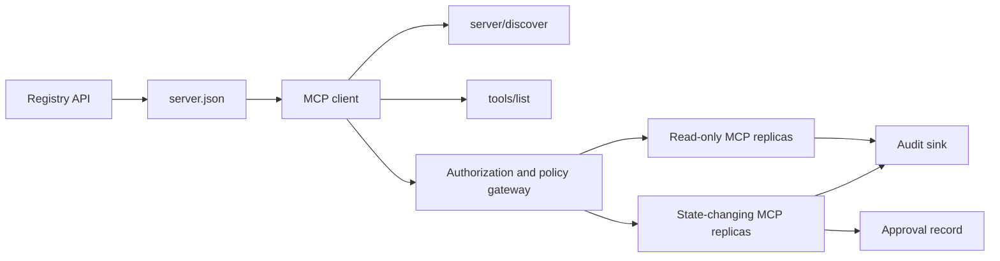

# Kapstone 13: Kayıt ve yönetim ile İletişimsiz MCP Server

> Üretim MCP bir sunucu işlem değil, bir zincir sözleşme: yayınlanabilir metadata, canlı keşif, devletsiz bir talep zarfı, yetki, politika, denetim ve dağıtım kanıtı.

**Type:** Capstone
**Languages:** Python and TypeScript reference models; any production language
**Prerequisites:** Phase 11, Phase 13, Phase 14, Phase 17, and Phase 18
**Required MCP deep dives:** [Lesson 28: Tool Contracts](../../../13-tools-and-protocols/28-mcp-tool-contracts-and-content/docs/en.md)- Evet .[Lesson 29: Reliability](../../../13-tools-and-protocols/29-mcp-reliability-cancellation-and-flow-control/docs/en.md)- Evet .[Lesson 30: Registry Supply Chain](../../../13-tools-and-protocols/30-mcp-registry-supply-chain-and-drift/docs/en.md)ve[Lesson 31: Conformance Operations](../../../13-tools-and-protocols/31-mcp-conformance-versioning-and-operations/docs/en.md)
**Protocol target:**MCP `2026-07-28`
**Time:** ~25 hours

## Öğrenme Hedefleri

- Devletsiz MCP talebi ve sonuç zarfını uygulayın.
- Kayıt metadatalarını canlı protokol keşifinden ayrı tutun.
- Deterministik, önbelleğe dikkat eden bir araç keşfi oluşturun.
- Her araç çağrısı için yayıncı, izleyici, kapsam ve onay politikasını uygulayın.
- Sesyon yakınlığı olmadan Akışlanabilir HTTP'yi dağıtın.
- Tel, yetki, politika, kayıt ve denetim sınırlarında davranışları kanıtlayın.

## Gerekli MCP Ön Gerekli Yol

Bu temel taşın üretime hazır olarak değerlendirilmeden önce, bağlantılı dört 13. aşama dersini sırayla tamamlayın:

1. [Lesson 28](../../../13-tools-and-protocols/28-mcp-tool-contracts-and-content/docs/en.md)Bu sunucu tarafından açıklanması gereken araç, şema, içerik, sayfalama, tamamlama, yönlendirme ve hata sözleşmelerini tanımlar.
2. [Lesson 29](../../../13-tools-and-protocols/29-mcp-reliability-cancellation-and-flow-control/docs/en.md)iptal yarışlarını, tarihlerini, idempotency'yi, geri baskıyı, yeniden denemeyi ve yeniden bağlantı kurmayı tanımlar.
3. [Lesson 30](../../../13-tools-and-protocols/30-mcp-registry-supply-chain-and-drift/docs/en.md)isim alanını, kökenini, giriş çubuğunu, kayıt durumunu, sürüklemeyi, büyüklüğü ve geri dönüş kanıtlarını tanımlar.
4. [Lesson 31](../../../13-tools-and-protocols/31-mcp-conformance-versioning-and-operations/docs/en.md)Altın ve negatif transkriptleri, sıkı sürüm çağları, SDK farklılık kontrolleri, vekil kanıt, düzenleme, sağlık ve serbest bırakma kaplamaları tanımlar.

Kap taşı bu eserleri birleştirir. Onları bir mutlu yol SDK testi ile değiştirmez.

## Sorun

İç bir platformda sadece okunur veri araçları ve küçük bir set durum değişken araçlar gerekir. Geliştiriciler sunucuyu keşfedebilmeli, nasıl bağlanacağını anlayabilmeli, canlı özelliklerini kontrol etmeliydi ve sadece kullanma yetkisi olan işlemleri çağırabilmelidirler.

Zor kısmı bir fonksiyonu kaydetmektir. Zor kısmı altı farklı gerçeği bir arada tutmaktır:

1. `server.json`Sunucunun nerede yüklenebileceği veya ulaşılabileceği belirtildi.
2. `server/discover`canlı sürecin şimdi desteklediğini söylüyor.
3. Her istek hangi protokol değişikliklerini ve istemci yeteneklerini kullanıyor.
4. Yetki, bir arayanı doğru yayıncı, kaynak ve kapsamlara bağlar.
5. Bu özel eylemin yürütülebilir mi, politikası karar verir.
6. Denetim kanıtları, sırları ve hassas yükleri sızdırmadan sınırı geçenleri kaydeder.

Bu tür hareketlerden herhangi biri geçerse, platform erişilemez bir sunucu listesi, uyumsuz bir istemci yönlendirme, başka bir kaynak için yapılan bir token kabul veya beklenen inceleme olmadan yıkıcı bir eylem ortaya koyabilir.

## İki keşif katmanı

Kayıt ve canlı MCP sunucusu farklı sorulara cevap verir.

| Layer | Contract | Question it answers |
|---|---|---|
| Publication | `server.json` and Registry API | What is this server, where is its package or remote endpoint, and how is it configured? |
| Runtime | `server/discover` | Which protocol versions, capabilities, extensions, and server identity does this process support? |

Resmi Kayıt , bir versiyonu kullanıyor `server.json`Uzak giriş, Akışlanabilir HTTP URL'nin adını verebilir:

```json
{
  "$schema": "https://static.modelcontextprotocol.io/schemas/2025-12-11/server.schema.json",
  "name": "com.example/internal-readonly",
  "title": "Internal Read-Only Tools",
  "description": "Read-only incident and data lookup tools.",
  "version": "1.0.0",
  "remotes": [
    {
      "type": "streamable-http",
      "url": "https://mcp.internal.example.com/readonly"
    }
  ]
}
```

Registry şema sürümü ve MCP protokolü revizyoni bağımsızdır.Bir tarihini diğerine eşleştirmek için yeniden yazmayın. Her belgeyi kendi sözleşmesine göre doğrulayın.

Şema geçerliliği isim alanı sahipliğini kanıtlamaz.`example.com`Ters DNS isim alanını kullanıyor `com.example/*`Registry doğrulama akışı bu mülkiyetini kanıtlar.

Stdlib modelinin `validate_registry_document`Bu işlevi amaçlı olarak kısmi bir uzaktan profil doğrulayıcıdır.`name`- Evet .`description`ve`version`alanlar; seçmeli `title`; yayınlanan isim ve uzunluk kısıtlamaları; beton versiyon şekli; ve her `streamable-http`veya `sse`Uzak mesafenin HTTP(S) URL şekli.`remotes`Çünkü bu kap taşı her zaman uzaktan bir izleyiciyi canlı izler.`validate_publisher_namespace`Adı doğrulanmış yayıncı alanına karşı ayrı olarak kontrol ederken `validate_runtime_alignment`Yayın adı ve versiyonu canlı ile karşılaştırır `serverInfo`Resmi şema ayrıca paket kayıtlarını ve daha uzaktaki alanları da destekler. Yayınlanmadan önce tüm belgeyi resmi JSON Şema ile onaylayın veya `mcp-publisher`; bu bağımlılıktan uzak alt kümeni tam schema doğrulama olarak sunmayın.

Sunucu uygulamalıdır `server/discover`Bu capstone istemcisi, son noktayı çözünce bunu yapar ve mevcut protokol gözden geçirme ve canlı özellikleri alır:

```json
{
  "resultType": "complete",
  "supportedVersions": ["2026-07-28"],
  "capabilities": {
    "tools": {
      "listChanged": false
    }
  },
  "_meta": {
    "io.modelcontextprotocol/serverInfo": {
      "name": "com.example/internal-readonly",
      "version": "1.0.0"
    }
  },
  "ttlMs": 3600000,
  "cacheScope": "public"
}
```

Özel bir katalog ek mülkiyet, inceleme veya yaşam döngüsü verilerini indeksleyebilir, ancak bu verileri MCP tel alanları veya kök olarak icat edemez.`server.json`Yayınlanan kayıtların yanında kurumsal politikaları saklayın.`_meta.io.modelcontextprotocol.registry/publisher-provided`Genişleme ve 4 KB sınırının içinde kalmak.

## Ülkesiz MCP Core

MCP revizi `2026-07-28`protokol seanslarını ve `initialize`- Ne ?`notifications/initialized`El sıkışması.`Mcp-Session-Id`- Evet .

Her talebinin protokol bağlamı vardır .`params._meta`- ...

```json
{
  "io.modelcontextprotocol/protocolVersion": "2026-07-28",
  "io.modelcontextprotocol/clientCapabilities": {},
  "io.modelcontextprotocol/clientInfo": {
    "name": "internal-platform-client",
    "version": "1.0.0"
  }
}
```

Versiyon ve özellikler bağlantı gerçekleri değil, talep gerçekleri. Bir yük dengeleyici, farklı sağlıklı kopyalara ardı ardına talep gönderebilir, çünkü her iki kopya da mesajın kendisinden istekleri doğrulayabilir.

Sıradan sonuçlar `resultType: "complete"`.Serverler kimliklerini yerleştirmelidir .`_meta.io.modelcontextprotocol/serverInfo`Kayıp veya ipsiz protokol versiyonu geçersiz parametrelerdir.`-32602`- Hata .`-32022`Sadece desteklenmeyen bir satır için, tam olarak `{"supported": ["2026-07-28"], "requested": "..."}`Verileri olarak.

### Gizlenebilir keşif

`tools/list`Aynı etkili araç seti için belirleyici olmalıdır.

- `ttlMs`, müşterinin tazeliği için bir ipucu;
- `cacheScope`- Ya da ...`public`veya `private`- ...
- Aynı listelerin hızlı önbellekleri yeniden kullanabilmesi için sabit bir araç sırası;
- `resultType: "complete"`ve sunucu kimliği metadataları.

Kullanıcı başına izin normalde üretmek gerekir `cacheScope: "private"`. Kullanıcıya özel araç görünürlüğünü paylaşılmış bir kamu önbelleği arkasına koyma.

## Akışlanabilir HTTP

Bir ağ sunucusu, POST kabul eden bir MCP son noktasını ortaya çıkarır. Her JSON-RPC talebi veya bildirim kendi POST'unu alır.

Bir istek için sunucu, bir JSON nesnesi veya bu istek için kapsamlı bir SSE akışı gönderir.`subscriptions/listen`Başvuruda seçilen değişiklik bildirimleri bulunur.`Last-Event-ID`Geçerli taşımacılıkta tekrar oynayın.

Her talebinde şunlar yer alır:

- `MCP-Protocol-Version`, vücut metadataları ile eşleşir;
- `Mcp-Method`, JSON-RPC yöntemine eşleşir;
- `Mcp-Name`için`tools/call`- Evet .`resources/read`ve`prompts/get`- ...
- `Accept: application/json, text/event-stream`- Evet .

Belirtilen ile eşleşmeyen ayna başlıkları reddet `-32020`hata. doğrulama`Origin`, yerel geliştirme sunucularını loopback'e bağlamak, uzaktan istemcileri doğrulama ve kapalı istek skoplu SSE cevabını iptal olarak ele almak.



```figure
cf-mcp-gate
```

## Yetki ve politika

Transport metadataları yetki değil.

Uzak sunucular için:

1. Korunan kaynak metadatalarını keşfet.
2. Bu kaynak için yetki sunucusu seçin.
3. Müşteri Kayıtı için Müşteri Kimliği Metadata Belgeleri tercih edin.
4. Yetkililik sırasında kaynak göstergesini gönder.
5. Geri gönderilen bir veriyi doğrulayın `iss`Akış için kaydedilen yetki sunucusuna karşı değer.
6. Emitent tarafından anahtar müşteri kimlikleri.
7. MCP sunucusunda token emiten, kitle veya kaynak, sona erme ve kapsamı doğrulanmalıdır.
8. Konkreti araç ve argümanlara ikinci bir politika kararı uygula.

 gibi araç açıklamaları`readOnlyHint`ve `destructiveHint`Müşterilerin risk göstermesine yardımcı olmak.

### Onaylama bir kayıt, sihirli bir alan değil

Bir durum değişken çağrı, oyuncu, araç, normalleştirilmiş argümanlar veya sindirim, hedef ortam, sona erme ve bir kez veya tekrar kullanma politikasına bağlı bir onay kaydı gerekir.

Python modeli, kanonik JSON'u sıralanmış anahtarlarla hash eder, sonra bu işlemin işareti konusu, araç adı, sunucu URL'si ve sona ermesi ile bağlanır. İşletmeci çalışmadan önce bir argüman bile değiştirdikten sonra kaydı tekrar oynatmak başarısız olur. Onaylama erişim işareti için eklenmiş bir alan değil, ayrı bir kanıttır.

Yüksek riskli araçları patlama radyusunu önemli ölçüde azaltırken ayrı olarak gözden geçirilebilir bir yüzey üzerinde tutun. İtiraflar, politika, dağıtım kimliği ve denetim kontrolleri de ayrı ise ayrılık yararlıdır.

## Yapın

### 1. Model yayın metadataları

Şema oluştur ve onayla `server.json`. Yayıncı için doğrulanmış isim alanında sabit bir isim ekle, ek olarak versiyon, açıklama, resmi `repository`veya `packages`Metadata ve uzaktan veya stadio taşımacılığı.

### 2. Canlı keşif uygulaması

Uygulama`server/discover`RPC'den önce herhangi bir özellik. Desteklenen protokol sürümlerini, özelliklerini, uzantıları ve sunucu kimliğini reklam edin.`-32022`- Evet .

### 3. İttifaksiz zarfı uygula

Her istek için protokol versiyonu ve istemci özelliklerini gerektirir.`resultType`Başlangıç durumunu, bağlantı ölçülü kapasite önbelleğini ve seans kimliklerini kaldırın.

### 4. Araç yüzeyini oluştur

İki sadece okuma araç ve bir durum değiştirme aracı ile başlayın. Her birine sınırlı bir JSON Şeması, kesin bir açıklama, belirleyici sonuç şekli ve dürüst notlar verin. Müşteriler yapılandırılmış sonuçlara güvendiğinde çıkış şemelerini ekleyin.

### 5. Önbellek bilgisi listesini ekle

Dönüş aletleri `ttlMs`ve `cacheScope`. Kayıtlı kaydın sona ermesi ve listesi değiştirme bildirimlerini ayrı ayrı kullanın.

### 6. Yetki ve politika ekle

Emitent, kitle, sonlama ve kapsamı doğrulayın. Her araç çağrısı için politika kararını yürütün. Onayları yüksek riskli eylemlere bağlayın. Bir yöneticini yürütmeden önce eksik veya eskisine sahip onayları reddedin.

### 7. Ayrı kayıt ve çalıştırma süresi doğrulama

Statik değerini doğrulayın `server.json`Kaydet, sonra uzak uç noktasını araştır `server/discover`. Yayınlanan uzaktan, kimlik, sürüm veya gerekli özellikler canlı işlemle aynı fikirde olmadığında rapor sürüşü.

### 8. Denetim kanıtlarını ekle

Aktör, emiten, kaynak, araç, politika kararı, talep kimliği, iz bağlamı, gecikme ve sonuç kaydını kaydedin. Dayanmadan önce hassas argümanları ve sonuçları yeniden yazın veya sindirin. Denetim sinkini model görünür bağlamdan dışarıda tutun.

### 9. Düzsel ölçekleme uygulanması

Bir yük dengeleyici arkasına iki stateless kopya koyun. En az 100 eşzamanlı istek gönderin. Doğruluğunun yakınlığa bağlı olmadığını gösterin. Bir araçın çapraz çağrı durumuna ihtiyacı varsa, açık bir açık bir açıklama olmayan bir eldiven hazırlayın ve paylaşılmış dayanıklı bir sistemde saklayın.

### 10. Gerçek telin üzerinden geç .

Gerçek sunucu ikili ile uyumluluk kontrollerini çalıştırın. Sadece SDK nesneleri değil, istek başlıklarını ve JSON bedenlerini yakalayın. Yanlış sürüm, başlık eşleşmezliği, eksik alan, yanlış kitle, yanlış biçimlendirilmiş argümanlar, işlemci başarısızlığı, iptal ve önbelleğin sona ermesi.

## Gerekli Kanıt Paketi

Bir ifade, beş kanıt sınıfını da içermeden eksiktir:

| Evidence | Minimum proof | Source lesson |
|---|---|---|
| Wire | Redacted raw headers and JSON-RPC bodies for golden and negative cases, including metadata type failure, header mismatch, unsupported version, missing or unknown `resultType`, notification no-response, and response ID matching | [Lesson 31](../../../13-tools-and-protocols/31-mcp-conformance-versioning-and-operations/docs/en.md) |
| Proxy | The same stable case run directly and through the deployed intermediary, with ingress, origin, and egress status and body digests; prove protocol errors are not collapsed into generic 500 responses and streaming is not buffered | [Lessons 29](../../../13-tools-and-protocols/29-mcp-reliability-cancellation-and-flow-control/docs/en.md) and [31](../../../13-tools-and-protocols/31-mcp-conformance-versioning-and-operations/docs/en.md) |
| Admission | Verified publisher namespace, immutable Registry record digest, artifact or remote provenance, live `server/discover` identity and capability observation, descriptor pin, current Registry status, and admission-ledger event | [Lesson 30](../../../13-tools-and-protocols/30-mcp-registry-supply-chain-and-drift/docs/en.md) |
| Retry | A cancellation-versus-completion race, explicit timeout, safe read retry, mutation idempotency key, reconnect refetch, and proof that request cancellation cannot silently become durable task cancellation | [Lesson 29](../../../13-tools-and-protocols/29-mcp-reliability-cancellation-and-flow-control/docs/en.md) |
| Rollback | Exact previous version, admission and artifact digests, descriptor pin, active Registry status, current health window, route restoration result, and redacted decision evidence | [Lessons 30](../../../13-tools-and-protocols/30-mcp-registry-supply-chain-and-drift/docs/en.md) and [31](../../../13-tools-and-protocols/31-mcp-conformance-versioning-and-operations/docs/en.md) |

Edit edilen paketin bir parçacığını yayınla birlikte saklayın. Eğer herhangi bir sınıf eksikse, yayınlanmasını tutun. İşlem içindeki bir dispatcherden, kayıt kayıt varlığından kabulden, yeni bir JSON-RPC kimliğinden güvenlikten yeniden deneme veya önceki dağıtımdan geri dönüş hazırlığından proxy davranışı çıkarmayın.

## Yerel İpuç Modelleri

Python modeli, kayıt metadatalarını, ters DNS yayıncı isim alanı doğrulamalarını, yayınlama-işleme zamanı kimlik kontrollerini, canlı keşif, belirleyici araç listesi, talep başına metadata, güvenilir yayıncı, kitle, sona erme ve kapsam kontrollerini, eylem bağlı onayları, belgelenmiş bir kısmi kayıt onaylayıcısı, politika ve bir ağ soketi açmadan denetimlerini gösterir:

```bash
cd phases/19-capstone-projects/13-mcp-server-with-registry
python3 code/main.py
python3 -m unittest discover -s code/tests -v
```

TypeScript projesi, statesiz JSON-RPC şeklini bir MCP SDK olmadan studio üzerinden ortaya çıkarır.`tools/call`yol , `tools/list`Bilinen bir araç için geçersiz argümanlar , `isError: true`İcracıyı çağırmadan:

```bash
cd phases/19-capstone-projects/13-mcp-server-with-registry/code/ts
npm install
npm run typecheck
npm test
npm run demo
```

Bu modeller yerel sözleşme mantığını kanıtlar. HTTP başlıklarını, OAuth değişimini, kayıt yayınını, OPA entegrasyonunu, yük dengelemesini veya koleksiyon makbuzunu kanıtlamaz.

## Tel örneği

```http
POST /mcp HTTP/1.1
Host: mcp.internal.example.com
Content-Type: application/json
Accept: application/json, text/event-stream
MCP-Protocol-Version: 2026-07-28
Mcp-Method: tools/call
Mcp-Name: postgres.readonly
Authorization: Bearer REDACTED

{
  "jsonrpc": "2.0",
  "id": 42,
  "method": "tools/call",
  "params": {
    "name": "postgres.readonly",
    "arguments": {"sql": "SELECT 1"},
    "_meta": {
      "io.modelcontextprotocol/protocolVersion": "2026-07-28",
      "io.modelcontextprotocol/clientCapabilities": {},
      "io.modelcontextprotocol/clientInfo": {
        "name": "internal-platform-client",
        "version": "1.0.0"
      }
    }
  }
}
```

## Gönder

Aşağıdakileri içeren bir deposu gönderin:

- bir şema geçerli`server.json`- ...
- Sadece okunur ve durum değişken sunucu yüzeyleri;
- `server/discover`, Deterministik `tools/list`, ve politika kapalı `tools/call`- ...
- İki değişken kopya ile akışlı HTTP dağıtım;
- yetki ve onay entegrasyonu;
- Bir kayıt yayıncısı veya özel kayıt API adaptörü;
- politika tanımları ve eylemle ilgili onay kayıtları;
- denetim sonuçları ve iz yayılması düzenlenmiş;
- Kablo ve vekillik başarısızlığı kanıtları;
- kabul, yeniden deneme, sağlık ve geri dönüş kanıtları, düzenlenmiş paketlerin bir parçacığı ile.

| Weight | Criterion | Evidence |
|---:|---|---|
| 25 | Protocol correctness | Stateless request metadata, discovery, results, headers, and negative cases |
| 20 | Authorization | Issuer, audience, expiry, scope, and action-bound approval cases |
| 15 | Registry integrity | Valid `server.json`, publication record, live discovery probe, and drift report |
| 15 | Policy and safety | Allow, deny, malformed, stale approval, and sensitive-data cases |
| 15 | Scale and reliability | Two replicas, no affinity dependency, cancellation, timeout, and recovery |
| 10 | Auditability | Redacted receiver-side audit and trace evidence |

## Egzersizler

1. Yaşam sunucusunu değiştirmeden yayınlanan uzaktan URL'yi değiştirin.
2. Gönder .`tools/list`Aynı girişlerle iki kez ve bayt-stabil araç sırasını kanıtlayın.`ttlMs`Ve tazeleş.
3. Geçerli bir vücut gönder .`MCP-Protocol-Version`Başlık.`-32020`Ve politika veya aracı kullanmayın.
4. Sadece okunur sunucu için bir token hazırlayın ve durumu değiştiren sunucuya sunun.
5. Bir onayı bir normal argüman harcamalarına bağlayın. Bir alanı değiştirin ve onayın tekrarlanamayacağını kanıtlayın.
6. Ardından gelen çağrıları alternatif kopyalara yönlendirin. İş akışı devamlılığa ihtiyaç duyan her yerde gizli işlem belleğini açık bir paylaşılan eldivenle değiştirin.
7. İstekle ölçülen bir SSE bağlantısını kes ve yeni bir JSON-RPC istek kimliği ile tekrar dene.`Last-Event-ID`kurtarma yolu kullanılır.

## Anahtar Terimler

| Term | What people say | What it actually means |
|---|---|---|
| Stateless MCP | "No state anywhere" | No protocol session; cross-call state is explicit and server-managed |
| `server.json` | "The tool manifest" | Registry metadata for naming, packaging, configuration, and transports |
| `server/discover` | "The handshake" | A normal mandatory RPC for live versions and capabilities, not a session initializer |
| Cache scope | "Can I cache it?" | Whether a cacheable result is safe for shared or private reuse |
| Policy decision | "The token allows it" | A separate decision over actor, tool, target, arguments, and context |
| Approval record | "A human clicked yes" | Evidence bound to one actor and consequential action under an expiry policy |
| Explicit handle | "A session ID" | Ordinary application data for named server-managed state, not protocol connection state |

## Daha Fazla Okumak

- [MCP 2026-07-28 key changes](https://modelcontextprotocol.io/specification/2026-07-28/changelog)
- [Streamable HTTP](https://modelcontextprotocol.io/specification/2026-07-28/basic/transports/streamable-http)
- [Server discovery](https://modelcontextprotocol.io/specification/2026-07-28/server/discover)
- [MCP authorization](https://modelcontextprotocol.io/specification/2026-07-28/basic/authorization)
- [Official Registry server.json requirements](https://github.com/modelcontextprotocol/registry/blob/main/docs/reference/server-json/official-registry-requirements.md)
- [Official Registry OpenAPI contract](https://registry.modelcontextprotocol.io/openapi.yaml)
