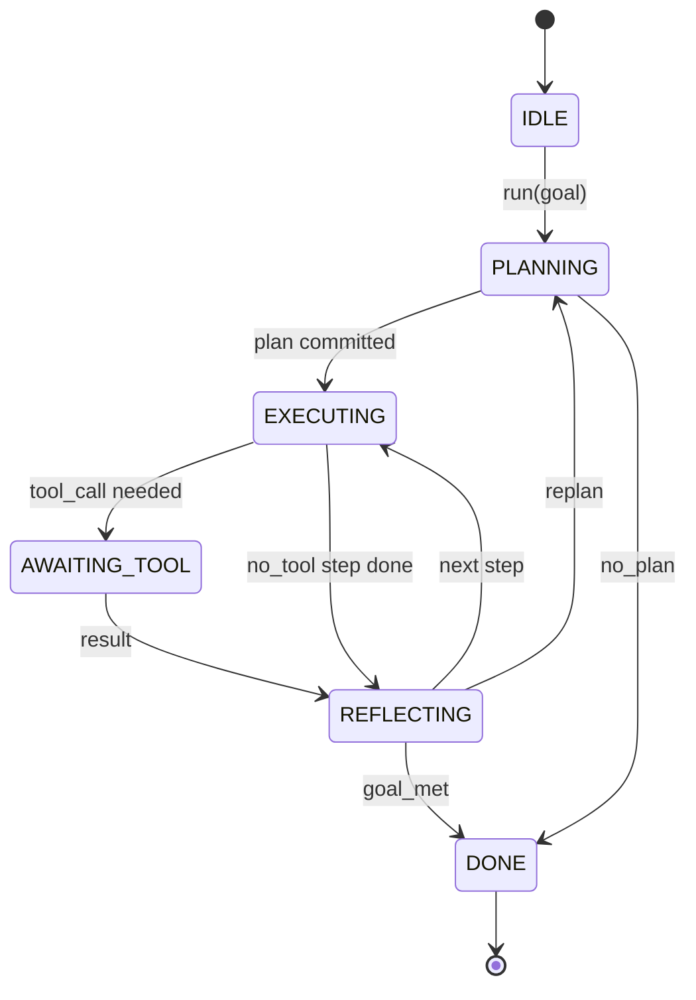

# Ajan Harness Loop Sözleşmesi

> Harness ajanı, model bir koprosesördür, bu ders herhangi bir modeli bağlayabileceğiniz döngü kontratını donduruyor.

**Type:** Build
**Languages:** Python
**Prerequisites:** Phase 13 lessons 01-07, Phase 14 lesson 01
**Time:** ~90 minutes

## Öğrenme Hedefleri
- Açık geçişlerle belirleyici bir durum makinesi olarak bir ajan harness döngüsünü belirtin.
- Operatörlerin politika, telemetri ve koruma sistemlerini etkileyen on yaşam döngüsü hok teması uygulanmalıdır.
- Çapın kontrolü tekrar çağıran kişiye verdiği ve yeni bir giriş üzerine yeniden başlatıldığı iki çekme noktasını tanımlayın.
- Oturumlar için bütçeleri (turns, tool calls, wall-clock) uygulamak, aşırılıkta kısmi durumdan kaçınmak.
- On bir olay tipi tipi tipi tipi bir tipi yayınlayın, böylece aşağıdaki UI ve izleyiciler döngüyü doğrudan incelemeden abone olabilir.

```figure
cf-loop-contract
```

## Çerçeve

40 dönüş boyunca gözden geçirilmemiş bir kodlama ajanı sohbet döngüsü değildir. Bu, operatörün küreklerini kapsayabileceği ve operatörün kenarlarını denetebileceği bir devlet makinesi. Sözleşmeyi yazdıktan sonra, modelleri, araçları veya politikaları değiştirmek bir refactor olmaktan çıkar. Bir kayıt çağrısı olur.

Bu ders bu sözleşmeyi oluşturur. 6 eyaleti, 10 hok konu, 2 çekme noktası, 11 etkinlik türü ve bütçe zarfı adlandıracağız.

## Eyaletler

Çubuk altı durumdan oluşur, beş aktif, biri terminal.



`IDLE`Bu, yasal giriş noktası.`DONE`Bu tek yasal çıkış.`AWAITING_TOOL`Bu, çekim noktasını veren tek durumdur.

Bu durum makinesi belirleyici. Aynı olay günlüğünü göz önüne alarak, harness aynı durumuna geri döner. Bu özellik, modelini tekrar çağrılmadan debugging seanslarını tekrar oynama olanağı sağlar.

## Hak konuları

Haklar, operatörün döngüye bir dikiştirmesi. Harnes on konuyu ateşler. Her konu herhangi bir sayıda abone kabul eder. Abone kayıt sırasıyla ateş eder. Bir abone yararlı yükü mutate edebilir, dönüşü iptal etmek için yükseltebilir veya bir sonraki adımı atlamak için bir bekçiyi geri verebilir.

```text
before_plan         after_plan
before_tool_call    after_tool_call
before_step         after_step
on_error
on_pause
on_budget_exceeded
on_complete
```

Şekil, Claude Code, Cursor ve OpenCode'nin 2025 yılının ortalarında birleştiklerini yansıtır.`rm -rf``before_tool_call`OpenTelemetry uzantısını taşıyan bir kanca , içinde yaşıyor .`after_step`Durgun bir seansta tekrar başlayan bir kanca ,`on_pause`- Evet .

## Çekme noktaları

Çubuk iki kez kontrol verir.`AWAITING_TOOL`Bir araç sonucu olmadan ilerleme kaydedemediği zaman.`on_pause`bütçe bitmiş veya bir kurşun açıkça insan denetimi istediğinde.

Çekme noktası istisna değil, dönüştürülür.`resume(payload)`Bu bir Python jeneratörü ile aynı şekildedir. Çekme noktası üzerinde taşıma sizin seçiminiz.`tools/call`Bir sıra üzerinde iş anketleri.

## Olay akışı

Çubuk, sözleşmenin belirli noktalarında yazılan bir akışa olayları ekler. Akış sadece ekler ve aboneler herhangi bir ofsetten tekrar oynayabilir.

- `session.start` bir kez yayılmış`run(goal)`Adı:
- `plan.draft` Planlamacı bir taslak planı gönderdiğinde yayınlanır
- `plan.commit` Ekiptif plan olarak taslak kabul edildikten sonra yayınlanan
- `step.start` Her yürütme aşamasının başında yayınlanan
- `step.end` Her yürütme aşamasının sonunda yayınlanan
- `tool.call` Bir araç gerektiren adım, çağıran kişiye kontrolü verince yayılır
- `tool.result` Resume ile bir araç sonucu ile yayınlanmıştır
- `tool.error` Bir hatayla veya bir hakka bağlı olarak bir arama sırasında yayınlanan
- `budget.warn` Bir bütçe sınırının ulaştığı zaman yayınlanan
- `session.pause` Çaplık bir duraklama (budget veya kanca) sırasında verildiğinde yayılır
- `session.complete` Çubuk ulaştığında bir kez yayılır `DONE`

Olaylar, hak yüklerini çoğaltmaz. Haklar zorunludur (mutate, abort).

## Bütçe zarfı

Bir oturum üç sınır taşıyor. Dönüş sayısı, araç çağrı sayısı, duvar saati saniyeler. Her dönüş artışları bir birle döner. Her araç çağrı artışları araç çağrıları bir. Duvar saati her durum geçişinde kontrol edilir. Her bir sınırın ulaştığında, döngü ateşlenir.`on_budget_exceeded`, yayıyor`budget.warn`, sonra `IDLE`Bir sonraki çekim noktasında bütçeden fazla bir sebeple.

Bütçe bir ölüm anahtarı değil, bir verimdir.

## Bu ders neyi yapmaz

Bu bir model çağırmaz, gerçek araçları kaydetmez, bir taşımacılığı uygulamıyor. Bunlar sonraki dört ders. Bu ders sözleşmeyi çiviyor, böylece sonraki dört kişi yeniden yazmadan içine bağlanabilir.

Deterministik planlamacı `main.py`Bu, üç adımdan oluşan bir sabit kodlanmış planı gönderir, bunlardan ikisi bir araç sonucu gerektirir.

## Şifreyi nasıl okuyabilirsiniz

`HarnessLoop`Devlet, ateş açan, etkinlik yayımlayan.`Budget`- Yolu sınırları.`Event`Akışta yazılmış zarf. `HookRegistry`- Bu da gönderme masası.`_transition`Bu, durum değişikliğini yapan tek fonksiyon. Yani durum makinesi değişkenleri tek bir yerde yaşıyor.

Oku `main.py`Yukarıdan aşağıya.`code/tests/test_loop.py`Testler her geçiş ve her kanca ateşleme sırasını belirler.

## Daha ileri gitmeye çalışıyorum .

Bir harness üretimi en zor kısmı devlet makinesi değil. Bu sözleşmeyi uygulanabilir yapıyor. Sözleşme planlayıcının sıcak bir yeniden yükleme hayatta kalmak zorunda.`before_tool_call`Bu dersdeki testler bu başarısızlık modlarını kullanıyor, çalıştırıyor, kırıyor, vakalar ekliyor.

Bir sonraki ders, araç kayıtlarını ekler. Bundan sonra JSON-RPC nakliye. Bundan sonra, göndericisi. Ders yirmi dördüncü tarafından, bu dosyadaki döngü gerçek bütçelerle gerçek araçlara karşı gerçek bir plan çalıştırır.
