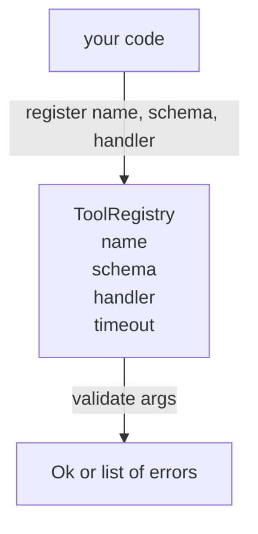

# Şema Doğrulama ile Araç Kaydı

> Ajanın onaylayamadığı bir araç, Ajanın çağrısı yapamayacağı bir araçtır. Aygıtları oluşturmadan önce kayıt ve şema kontrolcüsü oluşturun.

**Type:** Build
**Languages:** Python
**Prerequisites:** Phase 13 lessons 01-07, Phase 14 lesson 01
**Time:** ~90 minutes

## Öğrenme Hedefleri
- Depoyucu bir kez sorabileceği bir araç adı → schema → yöneticisi için bir kayıt kaydını yazıp sonra güven.
- Araç çağrılarının yüzde dokuzunu kaplayan bir JSON Schema 2020-12 alt kümesini uygulayın.
- Model bir dönüş yolculuğunda kendi kendini düzeltirken, doğru, json-pointer şeklinde hata yollarını geri gönderin.
- Açık bir iptal olmadan yeniden kayıt reddet, çünkü sessiz iptal üretim araçları kataloglarının sürüklenmesidir.
- Validatörü saf tutun (I/O, zaman yok, küresel yok) böylece tekrar oynatma günlüğünde tekrar çalıştırılabilir.

```figure
cf-registry-validate
```

## Neden kayıt aracından önce gelir

2026'da bir kodlama ajanının, modelin tek bir bağlam penceresinde yer alabileceğinden daha fazla kayıtlı aracı vardır. Küçük olmayan bir harman 200 alet kaydetir ve her dönüşte 10 ila 40'a kadar yüzeyin üzerinde olur. Kayıt, "ne tür araçlar var", "argümanlarının nasıl bir şekli var" ve "neyi yöneten diyorum" için gerçeklerin kaynağıdır.

Bu hata, düzensiz yolcuları veya onaysız yolcuları göndermek. Her ikisi de ortak. Her ikisi de bir sonraki katmanı (hizmetteki dispatcher) tek başarısızlık modunun, yöneticiden bir yığın iz olduğu bir tahmin oyuna dönüştürür.

## Bir araç kaydı nasıl görünüyor

```text
ToolRecord
  name        : str          (unique, lowercase alphanumeric and underscore segments separated by dots, e.g., snake_case.segment.case)
  description : str          (one line, shown to the model)
  schema      : dict         (JSON Schema 2020-12 subset)
  handler     : Callable     (async or sync, returns Any)
  idempotent  : bool         (dispatcher uses this for retry decisions)
  timeout_ms  : int          (override per-tool dispatcher default)
```

Şema, onaylayıcı tarafından dokunan tek alandır. Yöneticisi ona açık değildir. Onları kasıtlı olarak ayırırız. Şema veridir. Yöneticisi koddur. Onları karıştırmak, kontrol edenin içine doğrulama mantığını koymayı teşvik eder, bu da durdurduğumuz hata.

## JSON Schema 2020-12 alt kümesi

2020-12'nin tam özellikleri bir makaledir. Sekiz anahtar kelime ihtiyacımız var.

```text
type           string / number / integer / boolean / object / array / null
properties     map of property name -> schema
required       list of property names
enum           list of allowed primitive values
minLength      integer, applies to strings
maxLength      integer, applies to strings
pattern        ECMA-262-compatible regex, applies to strings
items          schema applied to every array element
```

Bu, bir araç API'nin aslında ne ihtiyacı olduğunu karşılamak için yeterli. Eklemediğimiz anahtar kelimeler (oneOf, anyOf, allOf, $ref, şartlı) üretim şemelerinde geçerlidir ancak onaylayıcıyı döngülerle bir ağaç yürüyüşçüsü haline getirir. JSON Şema motoru değil bir kayıt yapıyoruz.

## Json işaretçi hata yolları

Validasyon başarısız olduğunda, validator hataların bir listesini gönderir. Her hata girişine bir json-pointer yolu taşır. Bir işaretçi, özellik isimlerinin ve dizis indekslerinin bir çizgi prefiksli bir dizisidir.

```text
{"a": {"b": [1, 2, "x"]}}
                    ^
                    /a/b/2
```

Model hata yollarını cümlelerden daha iyi okuyor. Eğer bir şema gerektiriyorsa `args.user.email`ve model tam bir rakam geçmiştir, hatası olmalıdır `/user/email`- Evet .`expected_type: string`Model, bir sonraki çağrıda doğal bir dil kullanmadan bunu düzeltir.

## Kayıt ve iptal

`register(name, schema, handler, **opts)`Default olarak yeniden kayıt reddediyor.`override=True`Bu işlevsel hijyen. iki bölümde aynı araç adı sessiz olarak kaydedilen kod tabanı bir hafta süren bir hata türüdür.

Kayıt üç okuma yöntemini ortaya çıkarıyor.`get(name)`Kayıtı geri verir veya artırır. `validate(name, args)`bir `Ok`Ya da hataların listesi.`names()`araç isimlerini kayıt sırasıyla gönderir.

## Validatörün ne olduğu ve olmadığı

Bu bir tek geçiş, schema ağacı, rekürsiv. saf.`"42"`Bir sayı şeması geçmez.

Bu güvenlik sınırı değil. Kötü bir yöneticinin doğrulama geçtikten sonra da yanlış davranması mümkündür.

## Şekil



## Şifreyi nasıl okuyabilirsiniz

`code/main.py`tanımlar `ToolRegistry`- Evet .`ToolRecord`- Evet .`ValidationError`Validatör, `schema["type"]`(veya bir şema ile ilgileniyor)`enum`Her tip doğrulayıcısı ya boş bir liste veya `ValidationError`En üst düzey yürüyüşçü hataları bağlar ve aşağı inerken yol segmentlerini önleştiriyor.

`code/tests/test_registry.py`Kayıt, geçersiz kılmak, doğrulama başarısı, yollarla doğrulama başarısızlığı ve alt kümedeki her anahtar kelimeyi kapsar.

## Daha ileri gitmeye çalışıyorum .

Bu ders yerleştikten sonra isteyeceğiniz iki ekleme`$ref`Yerel tanımlar blokuna karşı bir karar verildi ve `additionalProperties: false`Bu iki dosya da küçüktür. Her ikisi de eklenir. Bu dosyaların sayısı 50'den fazla.

Bir sonraki ders (iyirmi iki) bu kayıtları bir model istemcisine açan JSON-RPC stadio taşımacılığını oluşturur.
