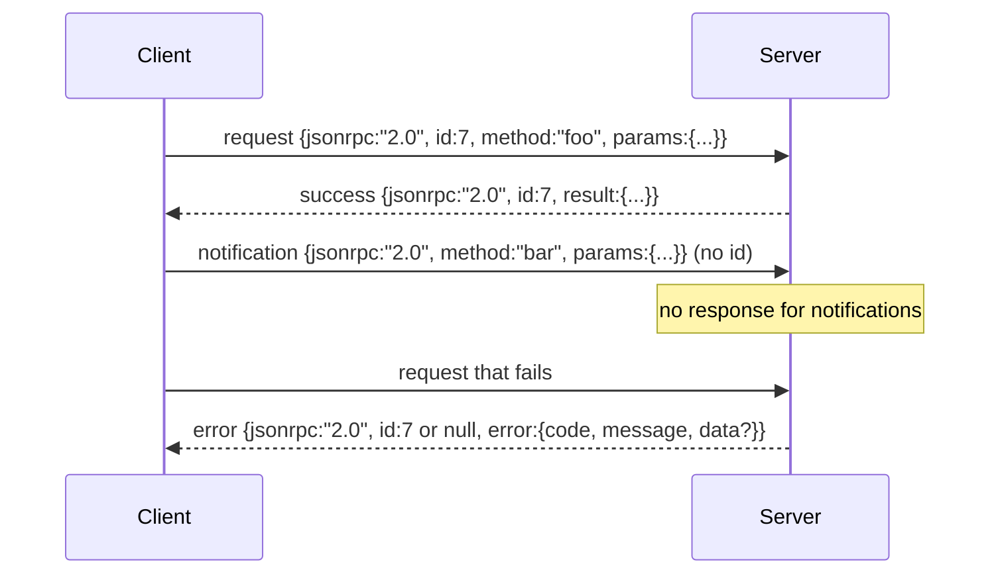

# JSON-RPC 2.0 Yeni Satır-Sınırlandırılmış Stdio üzerinden

> Bir model istemci ile bir araç sunucusu arasındaki nakliye studio üzerinden JSON-RPC'dir. Bir kez elle yuvarlamak size her çerçeve katmanının ne için ödediğini öğretir.

**Type:** Build
**Languages:** Python
**Prerequisites:** Phase 13 lessons 01-07, Phase 14 lesson 01
**Time:** ~90 minutes

## Öğrenme Hedefleri
- JSON-RPC 2.0'ı yeni satır sınırlı JSON olarak çerçevelemek stdin ve stdout üzerinde.
- Beş standart hata kodunu (-32700, -32600, -32601, -32602, -32603) haritada ve doğru semantikle yüzeyde.
- Yeni zarf anahtarları icat etmeden, istekleri, cevapları, bildirimleri ve serileri ayırt et.
- Akışın geri kalanını zehirlemeden her satırda bir analiz hatası ile başa çıkın.
- io.BytesIO kullanarak kendi kendini yok eden bir demo oluşturun böylece ders çocuk süreci doğurmadan yürür.

```figure
cf-jsonrpc-frames
```

## JSON-RPC neden dil olarak kalıyor

2026'da bir kodlama ajanı bir seansta belki on iki araç sunucusuyla konuşur. Her sunucu ayrı bir süreç veya uzaktan bir son noktasıdır. Kablo biçimi 2013'ten beri aynı. JSON-RPC 2.0 iki sayfalık bir özellik. Bu hayatta kalır çünkü alternatifler (gRPC, HTTP per call, özel ikili) hepsi bir ticaret yaptırır JSON-RPC yapmaz: ya akış ya da seri veya nakliye-kabloyu seçerler. JSON-RPC stdio, soket, websocket ve HTTP'de simetriktir ve bir istemci her ikisi de spesifikasyonu onurlandırırsa hiç görmediği bir sunucu kullanabilir.

Bu ders stdio variansını oluşturur. Yeni satır sınırlı JSON. Her istek bir satır. Her cevap bir satır.`\n`- Evet .

## Kablo şekli

Dört zarf şekli var, iki kişi müşteri tarafından konuşuluyor, iki kişi ise sunucu tarafından konuşuluyor.



Bir bildirim yok .`id`Bir sunucu bir bildirime bir cevap gönderirse, istemcinin onu bir arama sitesine bağlamasına hiçbir yol yoktur. Bu tek kural çerçeveleme matematikini basit tutar.

Bir parti, JSON istekler veya bildirimler dizisi. Sunucu herhangi bir sırada, bildirim olmayan giriş başına bir cevap dizisi ile yanıt verir.

## Beş hata kodu

```text
-32700  Parse error      JSON could not be parsed
-32600  Invalid Request  Envelope shape is wrong
-32601  Method not found
-32602  Invalid params
-32603  Internal error
```

-32000 ve -32099 arasındaki kodlar sunucu tanımlı hatalar için rezerve edilmiştir. Diğer her şey uygulama tanımlıdır. Ders beşe yapışır. Eğer işleyiciniz kaldırırsa, nakliye sınıf adı hariç olarak -32603 olarak sarılır `data.exception`- Evet .

Parse hatası için özel bir kural vardır.`id`Cevap olarak `null`, çünkü talebimiz kimlik çıkarmak için yeterince analiz edilmedi.

## Yeni çizgi çerçeveleme ve BytesIO demo

Transport bir seferde bir satır okuyor.`\n`Bir hat analiz edilemezse, nakliye bir -32700 cevabı yazar.`id: null`Akıntı zehirlenmedi, sonraki satır da taze analiz edildi.

Ders için bir paket yapıyoruz.`io.BytesIO`Bu işlemler, bir sunucu tarafından yapılan bir işlem için kullanılır. bu işlemler, bir sunucu tarafından yapılan bir işlem için kullanılır.`io`Ara yüzü aynı şekilde gösterir `.readline()`ve `.write()`Sözleşme.

## Metod Gönderi

- Taşımacı, hangi yöntemlerin olduğunu bilmiyor.`handler(method, params)`Bu durumda, bir harmanın sağladığı bir harmanın kullanıcısı bir sonuç gönderir veya yükseltir.

```text
MethodNotFound -> -32601
InvalidParams  -> -32602
Anything else  -> -32603 with exception name in data
```

Transport asla bir araç kayıt görmez. kayıt işlemcinin arkasında oturur. Bu biz istediğimiz katmanlama. Transport JSON-RPC konuşur. kayıt araç şekilleri konuşur. dispatcher ( ders yirmi üç) onları bir araya dikiyor.

## Hatalar üzerinde akış davranışları

```text
client writes              server reads             server writes
---------------            -----------              -------------
{...valid request...}      parses ok                {...response, id matches...}
{...broken json...         parse fails              {id:null, error: -32700}
{...valid request...}      parses ok                {...response, id matches...}
{...missing method...}     invalid envelope         {id:X, error: -32600}
```

Kırık bir JSON satırı döngüyü durdurmaz.`method`Bu, bir işlemci istisna ile yapılan işlemin sonucunu belirler.

## İletişimler ve asimetrik akışlar

Bir bildirim ateşleme ve unutma. Harnes ilerleme olayları, iptal sinyalleri ve günlük hatları için bildirimler kullanır. İletiler uzun süredir çalışan bir araç için her biri için geri dönüş yapmadan durum güncellemelerini nasıl aktarabileceğidir.

Ders bir çıkış bildirim yardımcısı uyguluyor.`write_notification`.Server, bir istek uçanken ilerlemeyi yaymak için kullanır. Demo örneği gösterir: bir istek gelir, işleyicisi iki ilerleme bildirimi gönderir, sonra son cevabı yazar.

## Şifreyi nasıl okuyabilirsiniz

`code/main.py`tanımlar `StdioTransport`, analiz yardımcıları (`parse_request`(), üç yazar yardımcıları (`write_response`- Evet .`write_error`- Evet .`write_notification`), ve gönderme döngüsü `serve`Hata kodı sabitleri modül kapsamında canlıdır.

`code/tests/test_transport.py`Beş hata kodunu, bildirimleri (yazılı cevap yoktur), serileri (aray in, array out, bildirimleri atlatmak), kırık JSON'u (parse hatası sonra devam eder) ve bir işlemci çağrı ortasında bir bildirim yazırken asimetrik akışı kapsar.

## Daha ileri gitmeye çalışıyorum .

Bu nakliye, sonraki dersler için yeterlidir. Üretim nakliyeleri üç şeyi ekler.`id`Bu zaten bu, ama bir ağda dış iz kimliği de gerekir.`$/cancelRequest`Bu da bir içerik türü müzakere el sıkışması, böylece aynı soket JSON-RPC ve Streamable HTTP konuşuyor.
