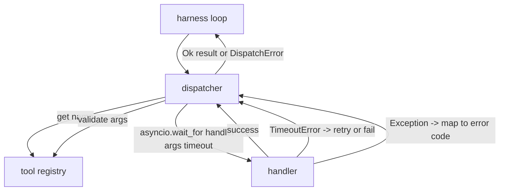
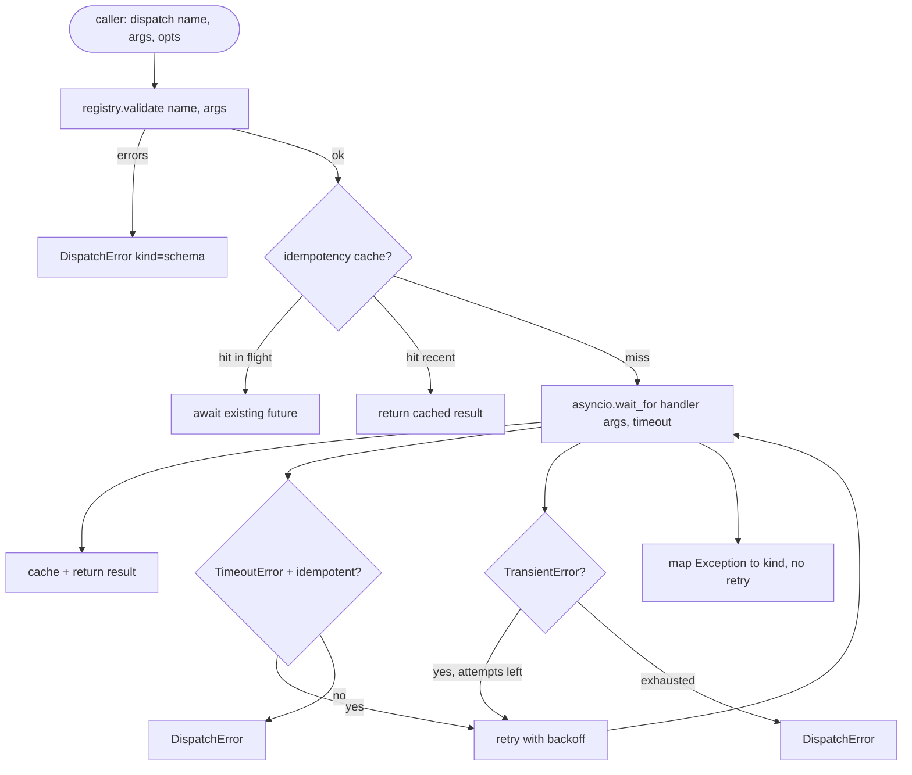

# Fonksiyon Arama Çözücü

> Dispatcher, harmanın yaptığı her söz için ödediği yer, zamanlama, tekrar deneme, dedupe, hata haritası, hepsi tek bir şekilde.

**Type:** Build
**Languages:** Python
**Prerequisites:** Phase 13 lessons 01-07, Phase 14 lesson 01
**Time:** ~90 minutes

## Öğrenme Hedefleri
- Bir arama için bir zaman çıkışında bir araç yöneticisini sarın ve bu davalı asmak yerine bir yazma hatasını gönderir.
- Eksponansiyel geri çekim tekrarlamasını jitter ile uygulayın ve maksimum girişim sayısını yapın.
- Bir idempotency anahtarı üzerinde tekrar tekrar denemek için yavaş bir orijinal ile yarışan bir tekrar denemek iki kez çalışmaz.
- Harita işleyicisi istisnaları ve tek bir hata kapsamına taşıma hataları, harness döngüsü zaten anlıyor.
- Aynı anda bir sınır ile paralel gönderme bağlanmıştır, böylece kırk araç çağrısı fan-out olay döngüsünü bitirmemiştir.

```figure
cf-dispatch-retry
```

## - Dispatcher'ın oturduğu yer

Harness döngüsü (eğitim yirmi) ve araç kayıtları (eğitim yirmi bir). nakliye (eğitim yirmi iki) döngüyü besler. döngü bir araç çağrısı dispatcher'e verir. dispatcher kayıtları arıyor, işlemci çalıştırır ve ya bir sonuç veya JSON-RPC şeklinde bir hata zarfı gönderir.



Bu, bir süreliğine kadar süreler, tekrar denemeler ve idempotency hakkında bilgi sahibi olan tek katmandır.

## Zamanlamalar

Her araçtan bir öntanımlı zamanlama vardır.`timeout_ms`- Harnel bir sefer geçince, dispatcher onu bir çağrıda geçer.`asyncio.wait_for`Zaman kesildiğinde, iş görevleri iptal edilir ve görevli geri döner.`DispatchError(kind="timeout")`- Evet .

Zamanlama, idempotent olmayan araçlar için varsayılan olarak geri dönüşü yapılabilir bir hata değildir.`db.write`Bu, bir süre sonra yapılan bir işlemin sonuna kadar gerçekleşmiş olması ve tekrar deneme yapılması ile yazıyı tekrarlayarak göndericinin saygısını artırır.`idempotent`Kayıt kayıtlarından gelen bayraklar. İdempotent araçlar tekrar denemek.

## Eksponansiyel geri çekilme ile tekrar deneyler

Tekrar deneme politikası en fazla üç deneme.

```text
attempt 1  -> delay 0
attempt 2  -> delay 0.1s * (1 + random[0..0.5])
attempt 3  -> delay 0.4s * (1 + random[0..0.5])
```

Sadece .`timeout`ve `transient`hatalar tekrar deneyin.`schema`hata, bir `not_found`, veya bir `internal`Bu nedenle, bir programın başarısızlığı, bir programın başarısızlığı ve bir programın başarısızlığı nedeniyle, bir programın başarısızlığı, bir programın başarısızlığı ve bir programın başarısızlığı nedeniyle, bir programın başarısızlığı, bir programın başarısızlığı ve bir programın başarısızlığı nedeniyle, bir programın başarısızlığı, bir programın başarısızlığı ve bir programın başarısızlığı nedeniyle, bir programın başarısızlığı, bir programın başarısızlığı, bir programın başarısızlığı, bir programın başarısızlığı, bir programın başarısızlığı, bir programın başarısızlığı, bir programın başarısızlığı, bir programın başarısızlığı, bir programın başarısızlığı, bir programın başarısızlığı, bir programın başarısızlığı, bir programın başarısızlığı, bir programın başarısızlığı, bir programın başarısızlığı, bir programın başarısızlığı, bir programın başarısızlığı, bir programın başarısızlığı, bir programın başarısızlık, bir programın başarısızlık, bir programın başarısızlık, bir programın başarısızlık, bir programın başarısızlık, bir programın başarısızlık, bir programın başarısızlık, bir programın başarısızlık, bir programın başarısızlık, bir programın başarısızlık, bir programın, bir programın başarısızlık, bir programın sonucu, bir programın, bir programın, bir programın, bir programın, bir programın, bir programın, bir programın, bir programın, bir programı, bir programı, bir programı, bir programı, bir programı, bir program, bir program, bir program, bir program, bir program, bir program, bir program, bir program, bir program, bir program, bu türde, bir program, bir program, bir program, bir program, bir program, bu türde, bir program, bir program, bir program, bir program, bir program, bu, bir program, bir program, bu, bu, bu, bu, bir program, bu, bu, bu, bu, bu, bu, bu, bu, bu, bu, bu, bu, bu, bu, bu, bu, bu, bu, bu, bu, bu, bu, bu, bu, bu, bu, bu, bu, bu, bu, bu, bu, bu, bu, bu, bu, bu,

Yeniden deneme döngüsü, harness'ten gelen bütçeye saygı gösterir. Eğer arayanın bütçesi 0 araç çağrısı kalırsa, göndericisi ilk denemede hızlı bir şekilde başarısız olur ve geri döner.`kind="budget_exceeded"`- Evet .

## İdempotency anahtarı dedupe

Bir yeniden deneme, orijinal hala uçuştayken gerçek bir üretim hatasıdır. İlk çağrı dört noktada dokuz saniye (sadece zaman kesimi altında) asılır.`payments.charge`İki kez para aldın.

- İletişimci seçkin bir seçeneği kabul eder .`idempotency_key`Eğer aynı anahtar bir çağrı geldiğinde uçuşta ise, dispatcher uçuş sırasında gelecekleri bekler ve sonuçlarını iade eder.

Anahtar, arayanın sorumluluğudur.`f"{step_id}:{tool_name}:{hash(args)}"`. Dispatcher anahtarları icat etmez, çünkü bir anahtarı sadece argümanlardan çıkarmak iki anlamca farklı çağrıyı aynı görünebilir.

## Hata zarfı

Başarısız bir gönderme tek bir şekli geri verir.

```text
DispatchError
  kind        : "timeout" | "transient" | "schema" | "not_found" | "internal" | "budget_exceeded"
  message     : str
  attempts    : int
  jsonrpc_code: int   (one of -32601, -32602, -32603)
```

Harness döngüsü haritaları `kind`Bir sonraki eyalete.`schema`ve `not_found`Git .`on_error`Ve bir yeniden planı tetikle.`timeout`ve `transient`Git .`on_error`ve denemelerden dolayı yeniden planlanabilir veya olmayabilir. `budget_exceeded`tetikleyiciler`on_budget_exceeded`- Evet .

## Fan out'a karşı karşılaşma sınırı

`gather(*calls)`Bu program, 40 araç çağrısı ile 40 açık sok veya 40 alt işlem borusu ile birlikte tüm koroutini aynı anda çalıştırır.

- Dispatcher sarılır .`gather`Bir semforda. Öntanımlı eşzamanlılık sınırı sekiz. Her çağrı göndermeden önce semforu edinir ve tamamlandığında serbest bırakır.`gather`- şekilli çıkış ama gerçek programlama sınırlıdır.

## Tek bir çağrı için akış



## Şifreyi nasıl okuyabilirsiniz

`code/main.py`tanımlar `Dispatcher`- Evet .`DispatchError`ve`TransientError`- Dispatcher inşaat kayıtlarını alır.`dispatch(name, args, ...)`Bu, giriş noktası olan tek yer.`_run_with_retries`kullanmak`asyncio.wait_for`- Evet .`gather_bounded(calls)`Aynı anda gönderilen çok sayıda gönderme var.

`code/tests/test_dispatcher.py`Timeout ateşleme, geçici, schema hatası için geri deneyleme, idempotency dedupe (bir işlemci çağrısına aynı anahtarı ile iki eşzamanlı çağrı) ve eşzamanlılık sınırlaması (harekete geçen semaphore) kapsamaktadır.

Testler kullanıyor `asyncio.sleep(0)`ve belirleyici `Counter`-bazlı işlemciler, yani milisaniyede tamamlanırlar ve duvar saatine bağlı değildir.

## Daha ileri gitmeye çalışıyorum .

İki uzantı üretim dispatcher ekler. Birincisi, her geçişte yapılandırılmış kayıtlama (bu da döngünün olay akışı zaten size veriyor, ancak dispatcher aynı zamanda yayımlamalıdır `dispatch.attempt`ve `dispatch.retry`İkinci olarak, devreler kesici: bir pencerede N hatalar sonrasında, bir araç bir soğutma süresi alır ve gönderiler hemen `kind="circuit_open"`İkisi de sözleşmeyi değiştirmeden bu dispatcherin üstüne yerleşti.

Ders 24 dispatcher'ı plan ve yürütme ajanına yapıştırır böylece dört parçayı da hareket ederken görürsün.
