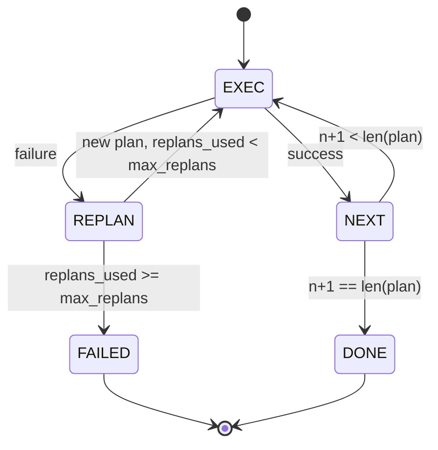

# Planlama ve İcra Kontrol Akışı

> Başarısızlıktan kurtulamayan bir plan bir senaryo.

**Type:** Build
**Languages:** Python
**Prerequisites:** Phase 13 lessons 01-07, Phase 14 lesson 01
**Time:** ~90 minutes

## Öğrenme Hedefleri
- Bir planı, işleyenin ilerleme ve sonuç hakkında düşünmesi için yazılmış adımların düzenli bir listesine göre göster.
- Adımları kontrol edilen bir başarısızlık ile planlayıcıya geri göndererek sıradan olarak yürütün.
- Geçerli kursor'dan önceki hatayı bağlamda yeniden düzenle, böylece bir sonraki plan bilgilendirilir.
- Her revizyona bir plan farkı gönderin, böylece bir aşağı akıntı izleyicisi veya kullanıcı kullanımı planın neden değiştirildiğini gösterebilir.
- İki bütçe uygulanmalıdır: sert bir merdiven tavanı ve sert bir yeniden planlama tavanı.

```figure
cg-plan-replan
```

## Planlama ve yürütme, düşünce zinciri değil

Bir düşünce zinciri ajanı, simgeler gönderir ve döngünün araç çağrısının nerede sona ereceğini tahmin etmesine izin verir. Bir plan-ve-ürdürme ajanı önce yapılandırılmış bir plan gönderir, sonra her adımı belirleyici bir şekilde yürütür. Plan, harnessin içe bakabileceği veridir. İcra etmesi, bu verileri bir dispatcher üzerinden çalıştırmak olan harnesstir.

İki parça. Bir planlamacı bir plan oluşturur. Bir planlamacı planı yürütür. İlginç iş, uygulayıcı bir başarısızlıkta ne olur.

```text
1. Abort         (return failed, surface the error)
2. Skip          (mark step failed, continue with the rest)
3. Replan        (hand the error to the planner, get a new plan from the cursor)
```

Replan bir senaryoyu bir ajan haline getiren.

## Adım şekli

```text
Step
  id              : int           (monotonic within a plan revision)
  tool_name       : str
  args            : dict
  expected_outcome: str           (planner's stated success condition)
  result          : Any | None
  error           : str | None
```

`expected_outcome`Bu, planı yeniden düzenleyen kişi tarafından iki nedenden dolayı kullanılır: planı gözden geçirirken yeniden düzenleyici okuyor; olay akışı bunu yayar, böylece bir izleyici "bu adım X yapması gerekiyordu" diyerek gösterebilir.

## Planlayıcı şekli

```python
def planner(goal: str, history: list[Step], last_error: str | None) -> list[Step]:
    ...
```

Saf bir işlev.`goal`Kullanıcı hedefi. `history`Bu işlemler, zaten gerçekleştirilen adımlardır (sonuclar ve hatalar ile doldurulmuştur).`last_error`İlk çağrıda hiç değil ve sonraki her çağrıda en son başarısızlık mesajı. Planlayıcı, kursordan başlayarak bir sonraki planı gönderir.

Planlamacı, yürütücüden, tekrar denemelerden, çıkış zamanlarından habersiz, bir plan oluşturur.

## Yaptırıcı

Bu nedenle, bir sistemin başarısı, başarısızlık, başarısızlık, başarısızlık, başarısızlık, başarısızlık, başarısızlık, başarısızlık, başarısızlık, başarısızlık, başarısızlık, başarısızlık, başarısızlık, başarısızlık, başarısızlık, başarısızlık, başarısızlık, başarısızlık, başarısızlık, başarısızlık, başarısızlık, başarısızlık, başarısızlık, başarısızlık, başarısızlık, başarısızlık, başarısızlık, başarısızlık, başarısızlık, başarısızlık, başarısızlık, başarısızlık, başarısızlık, başarısızlık, başarısızlık, başarısızlık, başarısızlık, başarısızlık, başarısızlık, başarısızlık, başarısızlık, başarısızlık, başarısızlık, başarısızlık, başarısızlık, başarısızlık, başarısızlık, başarısızlık, başarısızlık, başarısızlık, başarısızlık, başarısızlık, başarısızlık, başarısızlık, başarısızlık, başarısızlık, başarısızlık, başarısızlık, başarısızlık, başarısızlık, başarısızlık, başarısızlık, başarısızlık, başarısızlık, başarısızlık, başarısızlık, başarısızlık, başarısızlık, başarısızlık, başarısızlık, başarısızlık, başarısızlık, başarısızlık, başarısızlık, başarısızlık, başarısızlık, başarısızlık, başarısızlık, başarısızlık, başarısızlık, başarısızlık, başarısızlık, başarısızlık, başarısızlık, başarısızlık, başarısızlık, başarısızlık, başarısızlık, başarısızlık, başarısızlık, başarıyla sonuç, başarısızlık, başarıyla sonuç olarak sonuç olarak, başarıyla sonuç olarak, başarıyla sonuç olarak, başarıyla sonuç olarak, başarıyla sonuç olarak, başarıyla sonuç olarak, başarıyla sonuçlanı, başarıyla sonuç olarak, başarıyla sonuç olarak, başarıyla sonuçlanı, başarıyla sonuç olarak, başarıyla sonuç olarak, başarıyla, başarıyla sonuçlanlanlanı ile sonuç olarak, başarıyla, başarıyla, başarıyla, başarıyla, başarıyla, başarıyla, başarıyla, başarıyla, başarıyla, başarıyla, başarıyla, başarıyla, başarıyla, başarıyla, başarıyla, başarıyla, başarıyla`FAILED`Sessiyon sonucu.



## Planın revizyona göre farklılıkları

Planlamacı başarısızlıktan sonra yeni bir plan gönderdiğinde, uygulayıcı bir `plan.diff`Üç alanlı bir etkinlik.

```text
removed: list of step ids that were in the old plan and are not in the new
added  : list of step ids in the new plan that were not in the old
revised: list of step ids whose tool_name or args changed
```

Bir izleyici veya UI bunu kaldırılan adımlar üzerinde bir çarpışma ve eklenenler üzerinde bir vurgu olarak gösterebilir.

## İki bütçe, ikisi de zor.

`max_steps`Default on iki. İki kez yeniden planlayan ve her seferinde on altı yürütmeyle üç adım ekleyen bir çizgi beş adımlı plan, bütçeden fazla olur. İcracı yeniden planı reddedecek ve FAILED'i geri döndürecek.

`max_replans`Bu, bir planın en önemli sınırıdır. Aynı bozuk planı bir dizi kez geri veren bir plancı, adım bütçesi onu yakalamadan önce bir döngü yapar. Default beş. Bu daha önemli bir sınırdır.

## Bu dersdeki belirleyici planlamacı

Bu derste bir model çağırmıyoruz. dersi bir planı belirleyici bir planı seçen bir planı gönderir.`last_error`- Evet .

```text
last_error is None    -> emit a four-step plan
last_error matches X  -> emit a three-step plan that routes around X
last_error matches Y  -> emit a two-step plan that gives up gracefully
otherwise             -> return [] (signals nothing to replan)
```

Bu, her geçiş yolunda uygulayıcının davranışını test etmek için yeterli: başarı, bir kez yeniden planlama, iki kez yeniden planlama, yeniden planlama ve adım bütçe tüketimi.

## Sonuç şekli

```text
SessionResult
  status      : "completed" | "failed"
  reason      : str     ("goal_met" | "step_budget" | "replan_budget" | "no_plan")
  history     : list[Step]
  revisions   : list[PlanDiff]
  events      : list[Event]
```

Ders yirmi'den harness döngüsü bunu doğrudan okuyabilir. Ders yirmi üçten dispatcher her adımı gerçekleştiren şeydir. Ders yirmi birden kayıt her adımın arg'larını doğruluyor. Ders yirmi ikinciden taşıma, JSON-RPC üzerinden tüm bu akışı bir model istemcisine yüzeyde çıkarır.

## Şifreyi nasıl okuyabilirsiniz

`code/main.py`tanımlar `PlanExecuteAgent`- Evet .`Step`- Evet .`PlanDiff`- Evet .`SessionResult`Bu bir tek kişilik bir düzenlemedir.`run(goal)`bir `SessionResult`Plan farkı , adım kimliklerini ve `(tool_name, args)`- Tüples.

`code/tests/test_agent.py`Düzgün bir başarıyı, bir kez yeniden planlayan orta plan başarısızlığını, tekrar tekrarlayan tükenmeyi kapsar.`failed:replan_budget`, adım bütçe tüketimi ve plan-fark etkinliği biçimi.

## Daha ileri gitmeye çalışıyorum .

Bu, gerçek bir modelde kabloluyorsa isteyeceğiniz iki uzantı. Birincisi, kısmi plan önbelleği: bir plan altı adımdan ilk üçünde başarılı olduğunda ve sonra başarısız olduğunda, ilk üçü tekrar çalıştırmak istemezsiniz. İcracı zaten tarihi korur; planlayıcı sadece okumalıdır. İkincisi, paralel dallar: mevcut uygulayıcı kesinlikle sıralıdır. Bağımsız bir dal yayılan bir planlayıcı (`gather_step`yerine`next_step`) dispatcher üzerinden iki araç çağrısını aynı anda gerçekleştirebilir.

Her ikisi de gerçek karmaşıklığı artırır. Her ikisi de çizgi uygulayıcı sabitlenince eklenmesi daha kolaydır. Bu dersin yaptığı bu.
