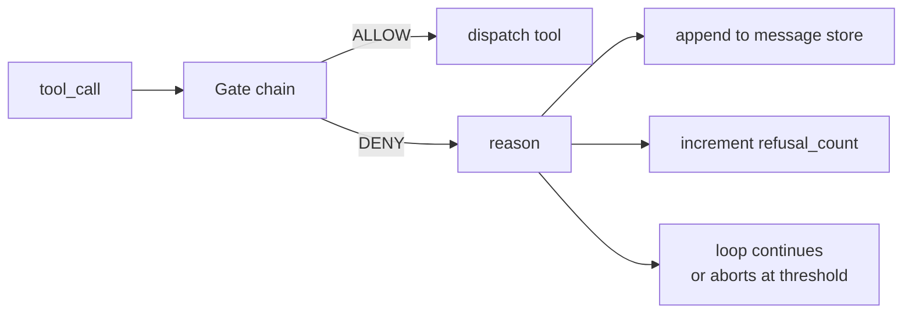
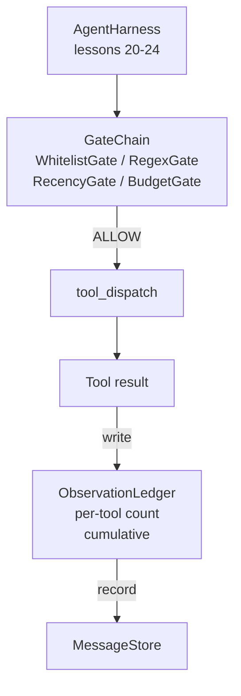

# Capstone Dersi 25: Verifikasyon Kapıları ve Gözlem Bütçesi

> Verifikasyon katmanı olmayan bir ajan harnası, bir trenchcoat'ta bir dileğidir. Bu ders, bir araç çağrısının ateşlenmesine izin verilmediğini, ajandanın çıkışının ne kadarını görmesine izin verildiğini ve ajandanın çok fazla okuduğu için sarmalın ne zaman durması gerektiğini belirleyen belirleyici kapı zincirini oluşturur. Zincir, küçük, isimli kapıların ve modelin gösterilen her simgesini izleyen bir gözlem defterinin bir fonksiyonudur.

**Type:** Build
**Languages:** Python (stdlib)
**Prerequisites:** Phase 19 · 20-24 (Track A1: agent loop, tool registry, message store, prompt builder, model router), Phase 14 · 33 (instructions as constraints), Phase 14 · 36 (scope contracts), Phase 14 · 38 (verification gates)
**Time:** ~90 minutes

## Öğrenme Hedefleri

- Bir tane yapın .`VerificationGate`Deterministik bir protokol`evaluate(call)`- Bu yöntem.
- Bütçe, sonrakiler, beyaz listeler ve regex kapıları kısa devreler semantikası ile bir zincire birleştirin.
- Her gözlemden bir izleme yoluyla`ObservationLedger`Araçla tıklayıp dön.
- Toplam gözlem bütçesi aşıldığı durumlarda araç çağrısını reddetmek.
- Yüzeyde yapılandırılmış bir `GateDecision`Aşağıdaki gözlemselliklerin yutulmasını sağlayan kayıtlar.

## Sorun

Bir ajan harnesinin model aracı serbestçe çağırdığı zaman, gerçek kullanımın ilk saatinde üç sınıf hata ortaya çıkar.

İlk sınırsız gözlemdir. 200K hatlı repo üzerinden bir grep bir sonraki dönüşte yarı milyon token çıkışı atır. model kilobit başına bir maç görür ve diğer bağlam boşa çıkar. token fatura büyük ve ajan şimdi görevde daha kötü, daha iyi değil.

İkinci, eski yeniliktir. Uzun süredir devam eden bir görev elli araç çağrısını biriktirir. Model üçüncü virajdan ilk read_file'i canlı durum gibi yeniden okuyor. Dört yirmi yedi virajda yapılan düzenlemeler hiçbir zaman görünmez çünkü prompt yapıcı ilk gözlemleri serielleştirmiştir.

Üçüncü, ayrıcalık ürperti.`web_search`Sonra da bir şekilde kaçmaya başlar .`shell`Çünkü model bir araç adı icat etti ve harness varsayılan olarak izin vericidir.

Bir doğrulama kapısı, hayır diyen bir harness bileşeni.`(call, history, ledger)`Bu da bir nedenle izin veya reddetmeyi geri verir.

## Anlaşım



Bir kapı , bir kapı ile olan her şeydir .`evaluate(call, ctx) -> GateDecision`Metod. zincir düzenli bir listedir. değerlendirme ilk inkarta kısa devre.

Bu ders dört kapıyı açıyor:

- `WhitelistGate`İzin verilen araç isimleri açık bir set. Dışarıda olan her şey reddedilmektedir. Bu en ucuz kapı ve ilk çalışır.
- `RegexGate`. Araç argümanları bir regex ile eşleşir .`rm -rf`Bu, arama yükü için saf bir şekilde kullanılabilir.
- `RecencyGate`Modeldeki gözlemler sadece son N dönüşlerinden görülebilir. Eski gözlemler maskeli. Kapı, zaten yaşlanmış bir gözlem penceresini uzatmış bir araç çağrısı reddeder.
- `BudgetGate`Modelin oturuma kadar okuduğu toplam tokenlerin bir tavanı vardır.

Gözlem defteri, muhasebeciliktir. Her başarılı araç çağrısı bir satır yazar: araç adı, dönüm, gönderilen tokenler, toplu. Defteri iki soruya cevap verir: modelin toplamı ne kadar gördü ve araç X'in ne kadar gördü. Bütçe kapısı ilkini okuyor. Bir araç başına bir bütçe kapısı, bir egzersiz olarak yazacağınız ikinciyi okuyor.

```figure
cg-gate-chain
```

## Mimarlık



Harness zincire sorar. zincir ya başını kaldırır ya da reddeder. Eğer başını kaldırırsa, araç çalışır, büyüklük kaydı tiklenir ve sonuç mesaj depolarına eklenir. Eğer reddederse, model bir sistem mesajı olarak reddedici verilir ve döngü yeniden denemek veya iptal etmek için karar verir.

## Ne yapacaksın?

Uygulama tek bir yöntemdir.`main.py`Ayrıca testler.

1. `Observation`ve `ToolCall`Veri sınıfları tel şekilleri tanımlar.
2. `ObservationLedger`Kayıtlar`(turn, tool, tokens)`Satırlar ve cevaplar `cumulative()`ve `per_tool(name)`- Evet .
3. `GateDecision`taşıyor`(allow, reason, gate_name)`- Evet .
4. `VerificationGate`Her kapı uygulamayı yapar.`evaluate(call, ctx)`- Evet .
5. `GateChain`Her kapıyı arar, ilk inkarı gönderir veya her kapıyı geçerse izin verir.
6. Demo, küçük bir sentetik ajan döngüsünü çalıştırır. Üç döngü. Üçüncü döngü bütçe kapısını açar ve döngü sıfır olmayan bir reddedilme sayısıyla temiz bir reddedilme raporunu verir.

İşaret sayıcısı kasten aptalca .`len(text) // 4`Bu dersin amacı, tokenizer değil, kapı tesisatıdır.

## Zincir düzeninin neden önemi var

İzin vermekten daha ucuz bir inkâr.`WhitelistGate`O(1) hash arama ile çalışır. `RegexGate`O(pattern * argv) ile çalışır. `RecencyGate`Mesaj mağazasının küçük bir parçası okur.`BudgetGate`Bu yüzden, maliyeti artan bir iş yapmadan önce reddedilen arama kısa devreye girer.

Bu yüzden, bu konuda bir çok şey yapmamalıyız. Bu yüzden, bu konuda bir şey yapmamalıyız. Bu yüzden, bu konuda bir şey yapmamalıyız.

## Bu A'nın geri kalanıyla nasıl birleşti?

Önceki dersler size döngü, araç kayıtları, mesaj depoları, çağrı yazıcıları ve model yönlendiriciyi verdi. Bu ders, model ile araçlar arasındaki katmanı ekler. Ders 26 kapı zinciri izin verdiğinde, dispatcher'ın araç çağrısını verdiği kum kutusu gönderir. Ders 27 reddedilmeyi kaydeten değerlendirme harnesini kalite sinyali olarak sayıyor. Ders 28 kapı kararlarını OpenTelemetry alanlarına bağlar. 29 ders, tümünü çalışan bir kodlama ajanına dikti.

## - Ben çalışıyorum.

```bash
cd phases/19-capstone-projects/25-verification-gates-observation-budget
python3 code/main.py
python3 -m pytest code/tests/ -v
```

Demo, her kapı kararını içeren bir sıra-kaç iz yazdırır ve sıfırdan çıkıyor. Testler büyük kitabı, her kapıyı, zincir kısa devresini ve sentetik döngüyi sonundan sonuna kapsar.
