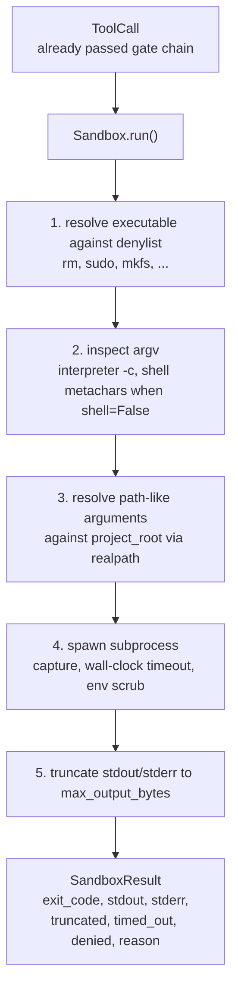
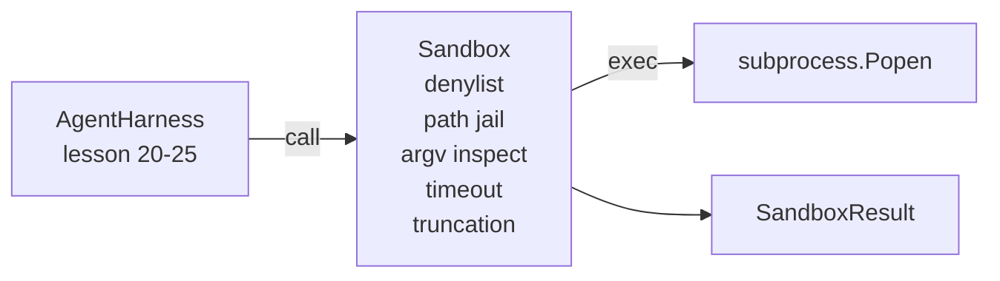

# Capstone Dersi 26: Sandbox Koşucu Denylist ve Path Hapishane

> Verifikasyon kapısı bir araç çağrısı çalıştırılmaya karar verir. Kum kutusu, ne zaman olursa ne olacağını belirler. Bu ders tehlikeli çalıştırılabilir araçları reddeden, tehlikeli argv şekilleri reddeden, proje kökü için her dosya yolunu hapse atmış, büyüklükteki çıkışları kısaltmış ve kaçak süreçleri duvar saatinin zamanlaması ile öldüren bir alt işlemciyi gönderir. Modelle ve işletim sistemi arasında yer alan iki katmandan ikinci.

**Type:** Build
**Languages:** Python (stdlib)
**Prerequisites:** Phase 19 · 25 (verification gates and observation budget), Phase 14 · 33 (instructions as constraints), Phase 14 · 38 (verification gates)
**Time:** ~90 minutes

## Öğrenme Hedefleri

- Bir tane yapın .`Sandbox`sınıfı kaplama `subprocess.run`Zaman kesimi, yakalama ve kesim.
- Denilist'e karşı isimle ve Argv Müfettişine karşı yapı ile bir komut reddet.
- Açıklanan bir proje kökü dışında çözülen herhangi bir yol argümanı reddet.
- Shell modunu kapattığında Shell meta karakteri reddet.
- Yapılandırılmış bir geri dönüş`SandboxResult`Bu aşağıdaki gözlemsellik ve eval harness'in yuttuğu.

## Sorun

Şelleyebilen bir kodlama aracı arka kapıları kurar, anahtarları çıkarır, bir geliştiricinin dizüstü bilgisayarını tuğlalar ve bir kere bulut faturalarını toplar. En ucuz savunma, şel vermemektir.

Ajan izlerinde üç sınıf başarısızlık tekrarlanır.

Birincisi tehlikeli uygulanabilir araçlar.`sudo`- Evet .`chmod -R 777`- Evet .`rm -rf`- Evet .`mkfs`- Evet .`dd`Bunlardan hiçbiri ajanlar tarafından çalıştırılmamış.

İkinci, argv numarası. Hiç bir mermi olmadığını söyleyen bir model bir tercüman aracılığıyla bir saldırıya yol açacak:`python3 -c "import os; os.system('rm -rf /')"`- Evet .`bash -c '...'`- Evet .`node -e '...'`- Evet .`perl -e '...'`Kum kutusu , her tercümanın bir `-c`- Bayrak sadece ekstra adımlarla yapılan bir çağrı.

Üçüncü, yol kaçışıdır.`./src/main.py`Ve bunun yerine okur.`../../etc/passwd`Kum kutusu her yol tartışmasını çözerek hapse atıyor .`os.path.realpath`Ve öncüyi de doğrulayın.

Kum kutusu işletim sistemi anlamında bir güvenlik sınırı değildir. Kod uygulanması ile belirlenmiş bir saldırgan hala patlayabilir. Kum kutusu geliştirme zamanında bir koruma rayıdır: yaygın başarısızlık modlarını yüksek sesle yapar ve ajanın tamamen beceriksizliğinden zarar vermesini engeller.

## Anlaşım



Kum kutusu dört reddetme ekseni vardır: isim, argv, yol, yapı. Her ekseni çağrının saf bir fonksiyonu, henüz bir alt işlem yoktur. Alt işlem sadece her eksenin geçtiğinden sonra doğururur.

- Evet .`SandboxResult`Çıkış kodları geleneksel kodlardır: 0 başarısı, sıfır olmayan başarısızlık, ek olarak üç sentinel kodu redded (-100), timed_out (-101), ve truncated (çıkış kodu gerçek, bir bayrak seti ile).

```figure
cg-path-jail
```

## Mimarlık



Denilist, uygulanabilir temel isimlerin bir frosetidir.`/bin/rm`- Evet .`/usr/bin/rm`Argv denetçisi yorumcu şeklini bilir: argv[0] yorumcu olduğu ve sonraki herhangi bir arg'ın başlangıcı ile başlıyor.`-c`veya `-e`Shell meta karakterleri (`;`- Evet .`|`- Evet .`&`- Evet .`>`- Evet .`<`, sırt çubukları,`$()`) çağrının açıkça bir kabuğu istemediği durumlarda reddedilmeyi neden eder.

Yol hapishanesi en ince parça.`project_root`Bu, bir yol gibi görünen herhangi bir tartışmanın içeriği.`/`(ya da mevcut dosya ile eşleşir) normalleştirildi.`os.path.realpath`Eğer çözülen hedef kök altında değilse, reddedilme. Symlink kaçış girişimleri (önüne işaret eden proje kökünde bir sim bağlantı) gerçek yolu kontrol ederek engellenir, sözcük yolu değil.

## Ne yapacaksın?

Uygulama `main.py`Bir de testler.

1. `SandboxResult`veri sınıfı: exit_code, stdout, stderr, truncated, timed_out, denied, reason, duration_ms.
2. `SandboxConfig`veri sınıfı: project_root, max_output_bytes, timeout_seconds, denylist, interpreter_block.
3. `Sandbox`sınıf: `run(argv, *, shell=False, cwd=None)`bir `SandboxResult`- Evet .
4. İçsel reddetme yardımcıları: `_check_executable_denylist`- Evet .`_check_argv_interpreter`- Evet .`_check_shell_metachars`- Evet .`_check_path_jail`- Evet .
5. Çıkış kesimi net bir şekilde`truncated`Bayrak ve yakaladığı akıntıda bir işaret çizgisi.
6. Aşağıda demo: meşru ve düşmanca çağrıların bir dizi.

Kum kutusu kullanıyor .`subprocess.run`- Evet .`shell=False`Default olarak ve `capture_output=True`Duvar saatinin zamanlaması `timeout`argüman;`TimeoutExpired`, sandbox işlem grubunu öldürür ve SandboxResult'i sentezler.

## Neden bu gerçek bir kum kutusu değil?

Ders kum kutusu isim boşlukları, cgroups, seccomp, gVisor, Firecracker veya herhangi bir çekirdek seviyesindeki izolasyon kullanmaz. Alt işlemin yapabileceği her şeyi kum kutusu yapabilir. Koruma yapısal: ajan en yaygın tehlikeli çağrıları reddedilir ve sessiz çalışmak yerine yüksek sesli reddedilme gözlemlenebilirliğe gider.

Üretim ajanları için üst katman: ayrıcalıklara sahip olmayan bir Docker konteyneri içinde çalıştırın, bir microVM'nin içinde çalıştırın, bırakın yetenekleri, proje kökü sadece okuma ve çizik dir okuma yazısı monte edin, bellek ve CPU'ya sınır koyun, çevreyi bilinen güvenli bir beyaz listeye sürükleyin.

## - Ben çalışıyorum.

```bash
cd phases/19-capstone-projects/26-sandbox-runner-denylist
python3 code/main.py
python3 -m pytest code/tests/ -v
```

Demo bir geçici dizin oluşturur, temiz bir dosya bırakır, sonra bir arama bataryası çalışır. Hukuki aramalar başarılıdır. reddedilen aramalar SandboxResult ile geri gönderir `denied=True`Zamanlamalar geri dönüyor.`timed_out=True`- Çarpıştırma takımları`truncated=True`Demo sonuçların JSON tabloyu basıyor ve sıfırdan çıkıyor.

## Bu A'nın geri kalanıyla nasıl birleşti?

Ders 25 kapı zinciri oluşturdu. Ders 26 bir kapı izininden sonra çalışan uygulayıcıdır. Ders 27'nin eval harness'i kum kutu sonuçlarını görev başına beklenen çıkış koduna karşı karşılaştırır. Ders 28 bir `gen_ai.tool.execution`Her biri etrafında uzanır `Sandbox.run`29 Ders'in sonundan sonuna kadar gösterisi, her iki katman arasında gerçek bir kodlama ajanı ile bağlantılı.
