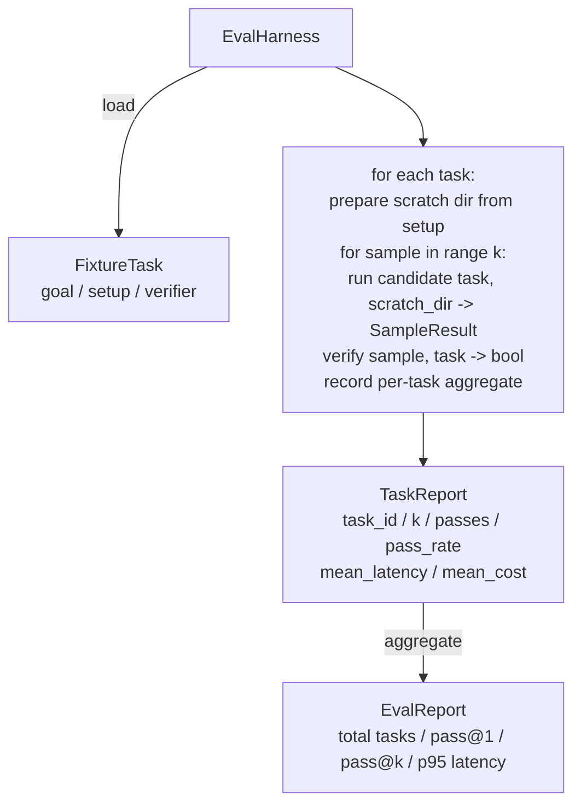

# Kaştağı Ders 27: Düzeltme Görevleriyle Eşdeğer Kullanım

> Bir kodlama ajanı, onu ölçtüğünüz görevler topluluğuyla aynı derecede iyidir. Bu ders, sabitleme görevlerinin bir klasörünü alan, her birini bir aday ajansı üzerinden çalıştıran, puanların bir deterministik doğrulayıcı üzerinden geçmesi veya başarısız olması ve sonuçları pass@1, pass@k, ortalama gecikme ve ortalama maliyet olarak toplayan bir değerlendirme harnesini oluşturur. Harness, bir reaktörden bir gerilemeyi anlamanıza izin veren gerçeğin kaynağıdır.

**Type:** Build
**Languages:** Python (stdlib)
**Prerequisites:** Phase 19 · 25 (verification gates), Phase 19 · 26 (sandbox runner), Phase 14 · 30 (eval-driven agent development), Phase 14 · 19 (SWE-bench and GAIA benchmarks)
**Time:** ~90 minutes

## Öğrenme Hedefleri

- Bir ayar görevini hedef, ayar ve doğrulama üçlü olarak tanımlayın.
- Görev başına birden fazla örnek çalışması puanlayın ve pass@1 ve pass@k hesaplayın.
- Gecikme ve maliyetleri ortalama ve 95'inci yüzde ölçümlerine toplamlayın.
- Kablo belirleyici doğrulayıcıları (file diff, exit code, regex match) tekrar kullanılabilir fonksiyonlara.
- Geri dönüş takip skripti yakalayabilecek yapılandırılmış JSON raporunu gönderin.

## Sorun

Üç başarısızlık modusunda, değerlendirme harnası olmadan inşa edilen bir salgın ajanı referansları.

Birincisi, doğrulanmamış bir geçiş. ajan hatayı düzelttiğini söylüyor, insan farklılıklara bakıyor, takım yeşil olarak işaretleniyor ve üç hafta sonra gerileme testi aynı hatayı ortaya çıkarıyor. ajan hiçbir şeyi düzeltmeden mantıklı bir şekilde akıl yürütmüştü.

İkinci olarak, tespit edilmeyen gerileme. Cevap şablonuna yapılan bir değişiklik, ajanı gürültülü görevde% 4 daha iyi, sessiz görevde% 14 daha kötü hale getirir. Altın set ve görev başına puan olmadan, gerileme ana yöne doğru ilerler ve yalnızca bir müşteri şikayet ettiğinde ortaya çıkar.

Üçüncü, görev başına sürükleme. Bu değerlendirme Pazartesi günü 100 görevle yürütüldü ve Cuma günü ise 95 görevle, çünkü biri beş takımın adını değiştirdi.

Harness, bu hataları gerçeklere dönüştüren bir programdır. Her zaman, tekrarlanabilir bir sırada, bir belirleyici kontrolünde doğru veya yanlış gönderilen bir doğrulayıcıya karşı çalışır.

## Anlaşım

```mermaid
flowchart LR
  F1[fixtures/task_001/<br/>task.json + expected/] --> Harness
  F2[fixtures/task_002/<br/>...] --> Harness
  Harness[Harness<br/>for each task:<br/>setup / run agent k samples /<br/>verify each sample /<br/>record latency, cost]
  Harness --> Report[EvalReport<br/>pass@1 / pass@k<br/>mean ms / p95 ms<br/>mean cost]
```

A.`FixtureTask`küçük bir JSON dosyası ve seçeneği `expected/`JSON bir dizin ilan eder.`id`, a `goal`(Agent'e gönderilen mesaj),`setup`blok (dosyaları sıyrık içine düşmek için dir), ve bir `verifier`Verifiyeci blok, harness'in verifiyeci kayıtlarında bir fonksiyonun adını verir ve argümanlarını sağlar.

Üç doğrulayıcı şekli, yararlı görevlerin çoğunu kapsar.

Birincisi:`file_equals`Agent çalıştırıldıktan sonra, isimli bir dosyayı beklenen bir içeriğe karşı karşılaştırın. Bu "bu hatayı tam olarak bu şekilde düzelt" görevlerini yakalar.

İkincisi de `regex_match`Adlı dosyanın içeriği regex ile eşlenir. Bu, kabul edilebilir çözümlerin olduğu "fonksiyon var olmalı ve X" görevlerini yakalar.

Üçüncü de `shell_exit_zero`. Harness bir shell komutunu ( ders 26'dan kum kutusundan) çalıştırır ve görevyi yalnızca komut sıfırdan çıksa geçer. Bu "testler geçmelidir" görevlerini yakalar.

Her görevi harmanla halleder .`k`- Zaman. Pass@k `1 - (1 - p)^k`Burada p, empiriel geçiş oranıdır; harness aynı zamanda çiğ sayıları rapor eder, böylece varyansiyonu tespit edebilirsiniz. Gecikme, örnek başına duvar saati. Maliyet, ajanın kendi kendine rapor ettiği her şeydir (token sayısı, USD veya her ikisi de); harness, örnekler arasında toplamını yapar ve görev başına ve toplam sayıları sunar.

```figure
pass-at-k
```

## Mimarlık



Başvurucu bir çağrı:`Callable[[FixtureTask, str], SampleResult]`Harness , çizim dizini oluşturur .`tempfile.mkdtemp()`Bu nedenle, bir testin sonuçları, bir testin sonuçları veya bir testin sonuçları ile ilgili olarak, bir testin sonuçları veya sonuçları ile ilgili olarak, bir testin sonuçları ile ilgili olarak, bir testin sonuçları ile ilgili olarak, bir testin sonuçları ile ilgili olarak, bir testin sonuçları ile ilgili olarak, bir testin sonuçları ile ilgili olarak, bir testin sonuçları ile ilgili olarak, bir testin sonuçları ile ilgili olarak, bir testin sonuçları ile ilgili olarak, bir testin sonuçları ile ilgili olarak, testin sonuçları ile ilgili olarak, testin sonuçları ile ilgili olarak, testin sonuçları ile ilgili olarak, testin sonuçları ile ilgili olarak, testin sonuçları ile ilgili olarak, testin sonuçları ile ilgili olarak, testin sonuçları ile ilgili olarak, testin sonuçları ile ilgili olarak, testin sonuçları ile ilgili olarak, testin sonuçları ile ilgili olarak, testin sonuçları ile ilgili olarak, testin sonuçları ile ilgili olarak, testin sonuçları ile ilgili olarak, testin sonuçları ile ilgili olarak, testin sonuçları ile ilgili olarak, testin sonuçları ile ilgili olarak, testin sonuçları ile ilgili olarak, testin sonuçları ile ilgili olarak, testin sonuçları ile ilgili olarak, testin sonuçları ile ilgili olarak, testin sonuçları ile ilgili olarak, testin sonuçları ile ilgili olarak, testin sonuçları ile ilgili olarak, testin sonuçta göre göre göre göre göre görelim, testin.

## Ne yapacaksın?

`main.py`Gemi:

1. `FixtureTask`veri sınıfı.
2. `SampleResult`veri sınıfı: success_self_reported, latency_ms, cost_units, edits.
3. `TaskReport`- Evet .`EvalReport` ile veri sınıfları`to_dict()`- Evet .
4. `VerifierRegistry`Yapılı doğrulayıcılar: file_equals, regex_match, shell_exit_zero.
5. `EvalHarness`Bir adayla ilgili görevler dizini çalıştırır. EvalReport'u gönderir.
6. Beş sabit görev bir araya getiriliyor `tasks/`- ...
   - Birbirinden ayrıldım.`fizzbuzz`
   - Kayıp dönüş .`factorial`
   - Hata mesajında bir yazma hatası
   - boş fonksiyon vücut
   - Bağlı listeler arasında teker teker geçiş
7. Deterministik referans adayı (`apply_known_fixes`) harness temiz bir 1.0 geçiş göstermek için kullanılır.
8. Demo EvalReport JSON'u yazdırır ve sıfırdan çıkıyor.

Yapıştırma görevleri JSON dosyaları olarak birleştirilmiştir `tasks/`ek olarak çift kaynak dosyaları `tasks/<id>/buggy/`ve `tasks/<id>/expected/`Harnes, buggy'yi bir çizik çöpüne kopyalanır, adaylara verir ve beklenenlere karşı doğruluyor.

## Neden sadece pass@k değil de pass@1

Gerçek LLM ajanları stohastiktir. 0.6'nin bir geçişi@1 başarısızlığa benziyor. 0.95'in bir geçişi@5'in de, ajanın çoğu zaman doğru cevabı aldığını ama erken örneklerde yanlış seçtiğini söylüyor. Düzeltme, örnekleme ve sıralama, her zaman daha fazla eğitim değil.

Pass@k, pass@1 ile birlikte bildirilmektedir çünkü pass@k gerçek bir başarısızlık üzerine belgeleri gönderir: model yirmi denemeden bir doğru cevabı alırsa, yararlı bir ajanınız yoktur.

## Bu A'nın geri kalanıyla nasıl birleşti?

Ders 25 kapı zinciri, Ders 26 kum kutusu üretti.`shell_exit_zero`Verifier. Ders 28 her harness çalıştırmayı bir OTel izleyerek sarar. Ders 29 bir paketle donatılmış armatürlerden birine karşı son-son demo çalıştırır ve referans aday için pass@1 = 1.0'u belirler.

## - Ben çalışıyorum.

```bash
cd phases/19-capstone-projects/27-eval-harness-fixture-tasks
python3 code/main.py
python3 -m pytest code/tests/ -v
```

Demo, EvalReport'u JSON'da basar, içinde pass@1, pass@5, ortalama gecikme ve görev başına ayrıntılar bulunur. Çıkış kodu sıfırdır. Testler doğrulayıcı işlevlerini, pass@k matematikini, sabit yüklemeyi ve paketlenmiş referans adayına karşı uçtan sonuna kadar harnesini kapsar.
