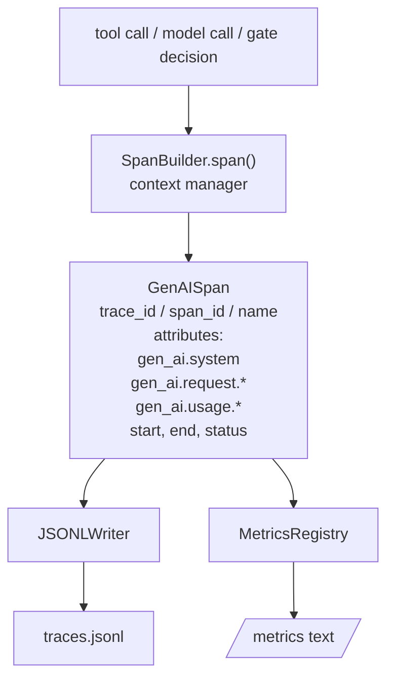
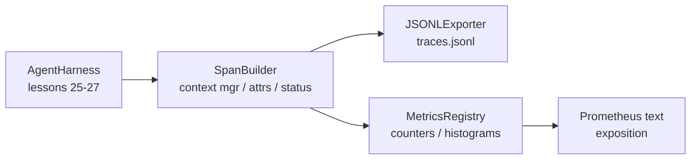

# Capstone Dersi 28: OTel GenAI Spans ve Prometheus Metrics ile Gözlemlilik

> Gözlem yapılmaz bir ajan harness, para harcayan bir kara kutu. Bu ders, OpenTelemetry GenAI semantik sözleşmelerine uygun kayıtlar yayınlayan bir uzantı yapımcısı ile elle oynatılır, onları bir satır başına bir uzantı olan JSON-Lines dosyasına yazar ve Prometheus metin biçiminde sayıcıları ve histogramları ortaya çıkarır. Tüm şey stdlib Python'dur ve çevrimdışı çalışır.

**Type:** Build
**Languages:** Python (stdlib)
**Prerequisites:** Phase 19 · 25 (verification gates), Phase 19 · 26 (sandbox), Phase 19 · 27 (eval harness), Phase 13 · 20 (OpenTelemetry GenAI), Phase 14 · 23 (OTel GenAI conventions)
**Time:** ~90 minutes

## Öğrenme Hedefleri

- OpenTelemetry GenAI semantik konvensiyonlarına göre şekillenen bir uzantı veri sınıfı oluşturun.
- Satır başına bir kendiliğinden uzanan bir JSONL ihracatçısı uygulayın.
- Etiketlerle ve Prometheus metin formatı açıklaması ile hesaplayıcılar ve histogramlar oluşturun.
- Durum, durum ve istisnaları kaydeden bir süre bağlam yöneticisi içinde herhangi bir çağrıyı sarın.
- Çıkarılan çekilenlerin geri dönüş yolculuğunun olup olmadığını kontrol edin .`json.loads`Ve spesifikasyon şekline eşleşir.

## Sorun

Üretimdeki bir kodlama aracı her dönüşte üç sınıf eser üretir: bir model çağrı, bir araç yürütme ve bir doğrulama kapısı kararı.

İlk başarısızlık modu kayıp izdir. Salı günü bir şey yanlış gitti ama tek kayıt 500 satırlık bir sohbet günlüğü. Hangi araç çalıştırıldığını, ne kadar zaman aldığını, kaç tokenin istekle girdiğini veya kapının bir şey reddettiğini kayıt edemiyor.

İkinci başarısızlık modu, aşılmaz izdir. Harness, uzantıları yazdı ancak kendi ad hoc alan isimlerini kullandı. Grafana, Honeycomb, Jaeger veya yerel CLI'de hiçbir şey onları okuyamıyor. Takımın yığınında bulunan her türlü araç, uzantılar standart olmadığı için harcanıyor.

Üçüncü başarısızlık modu, toplanmamış metriktir. İzleme sırasında bir yavaş araç çağrısı görebilirsiniz, ancak "son saatte read_file çağrılarının p95 gecikmesi nedir?" diye cevaplayamazsınız çünkü metrikler yoktur, sadece izler vardır.

OpenTelemetry GenAI semantik sözleşmeleri tam olarak bunun için var. LLM çerçevelerindeki yayımcıların paylaşılan küçük bir standart özelliği seti tanımlar. Eğer harness bu özelliği yazarsa, OTel uyumlu her arka uç onları okuyabilir.

## Anlaşım



Harness'deki her işlem bir uzaya sahiptir. Bir uzaya bir iz kimliği (bütün ajan çağrısı), bir uzaya bir kimliği (bu bir işlem), bir isim (örneğin `gen_ai.chat`- Evet .`gen_ai.tool.execution`GenAI'nin sözleşmelerini takip eden özellikler, başlangıç ve son zaman ve statü.

GenAI'nin sözleşmeleri bu özellik anahtarlarını standartlaştırıyor: `gen_ai.system`(örneğin hangi tedarikçi)`anthropic`- Evet .`openai`), `gen_ai.request.model`(model kimliği), `gen_ai.request.max_tokens`- Evet .`gen_ai.usage.input_tokens`- Evet .`gen_ai.usage.output_tokens`- Evet .`gen_ai.response.model`- Evet .`gen_ai.response.id`- Evet .`gen_ai.operation.name`, ayrıca araç özel anahtarlar `gen_ai.tool.name`ve `gen_ai.tool.call.id`- Evet .

Eksporteur JSONL yazar. Satır başına bir JSON nesnesi. Bu aşağı akımlı araçların akışlayabileceği, alabileceği ve ithal edebileceği en basit biçimdir. Gerçek bir OTel ihracatçısı OTLP gRPC konuşur; dersin JSONL ihracatçısı çevrimdışı eşdeğerdir ve her iş istasyonunda sıfırdan çıkıyor.

Metrikler izlerin yanında yaşıyor. Her araç çağrısında bir karşı artış: `tools_called_total{tool="read_file"}`. Bir histogram gözlemlenen gecikmeyi kaydeder: `tool_latency_ms{tool="read_file"}`Her ikisi de çekim tabanlı ölçümler için gerçek standart olan Prometheus metin açıklama biçimine seriye edilmektedir.

```figure
trace-spans
```

## Mimarlık



- Sapan yapıcı küçük bir sınıf .`span(name, attrs)`Kontext yöneticisi giriş sırasında başlangıç saatini kaydeder, çıkış sırasında son saatini kaydeder, bir istisna kaldırıldığında bir istisna ekler ve sonlandırılmış süreyi ihracatçıya gönderir.

Metrik kayıtları iki dict'ten oluşur.`{(name, frozen_labels): int}`Histogramlar ham örnekleri bir listeye koyup, serialaştırmak için Prometheus histogram kovalarına maruz kalmak için kullanılır.

## Ne yapacaksın?

`main.py`Gemi:

1. `GenAISpan`veri sınıfı: trace_id, span_id, parent_span_id, isim, özellikler, start_unix_nano, end_unix_nano, status, status_message, olaylar.
2. `SpanBuilder`sınıfı `span(name, attrs, parent=None)`bağlam yöneticisi.
3. `JSONLExporter`sınıfı `export(span)`Bu bir satır ekliyor.
4. `Counter`ve `Histogram`sınıflar artı `MetricsRegistry`- Evet .
5. `prometheus_exposition(registry)`Bu metin biçiminde çıkış üretir.
6. `wrap_tool_call(name)`Bir süslemeci, bir süreyi yayar ve ölçümleri güncelleyebilir.
7. Demo: tam bir ajan çağrısını sentez eder (gen_ai.chat tool spans etrafında uzanır), traces.jsonl yazar, Prometheus açıklamasını yazdırır, sıfırdan çıkır.

Uçuş kimliği ve iz kimliği 16 baytlı altıbuçlı iplerdir, `os.urandom`Bu, OTel'in W3C iz bağlamına uyuyor.

Histogram sabit bir kova seti (milisaniyeli gecikme için standart OTel: 5, 10, 25, 50, 100, 250, 500, 1000, 2500, 5000, 10000, +Inf) vardır.

## Neden açık metrik SDK yerine elle fırlatılmış?

OTel Python SDK gerçek bir bağımlılıktır. OTLP ihracatçısı için birkaç bin satır kod, birden fazla işlem ve ders bütçesini dolduran bir çalıştırma süresi maliyetidir. Elden yuvarlanan sürüm tel biçimini öğretir. Üretim sırasında aynı özellikleri gerçek SDK'ye telleştirir ve OTLP ihracatçısını, seri ve kaynak tespitini ücretsiz alırsınız.

Sözleşmeler istikrarlıdır. Dersin yaydığı tel biçimi 2030'da analiz edilmeye devam edecek çünkü OTel GenAI özelliği isimlerini asla kırmaz; sadece yeni isimler ekler.

## Bu A'nın geri kalanıyla nasıl birleşti?

Ders 25 kapı zinciri üretti. Ders 26 kum kutusu üretti. Ders 27 değerlendirme harnesini üretti. Ders 28 üçü de gözlemlenebilir hale getirdi. Ders 29 sonundan sonuna kadar gösterimin her adımı uzanarak ve sonunda Prometheus metnini yazdırır.

## - Ben çalışıyorum.

```bash
cd phases/19-capstone-projects/28-observability-otel-traces
python3 code/main.py
python3 -m pytest code/tests/ -v
```

Demo bir `traces.jsonl`Dersin çalışma dirinde (sonunda temizlenmiş), sonra üç aralığın bir örneğini yazdırır, sonra hesaplayıcılar ve histogramlar için Prometheus ekspozisyonunu yazdırır. Testler, aralığın geri dönüş serilize olduğunu, kanonik GenAI özelliklerinin mevcut olduğunu, çarpma sayısını doğru şekilde saydığını ve histogram ekspozisyonunun beklenen kova sayısını içerdiğini doğruluyor.
