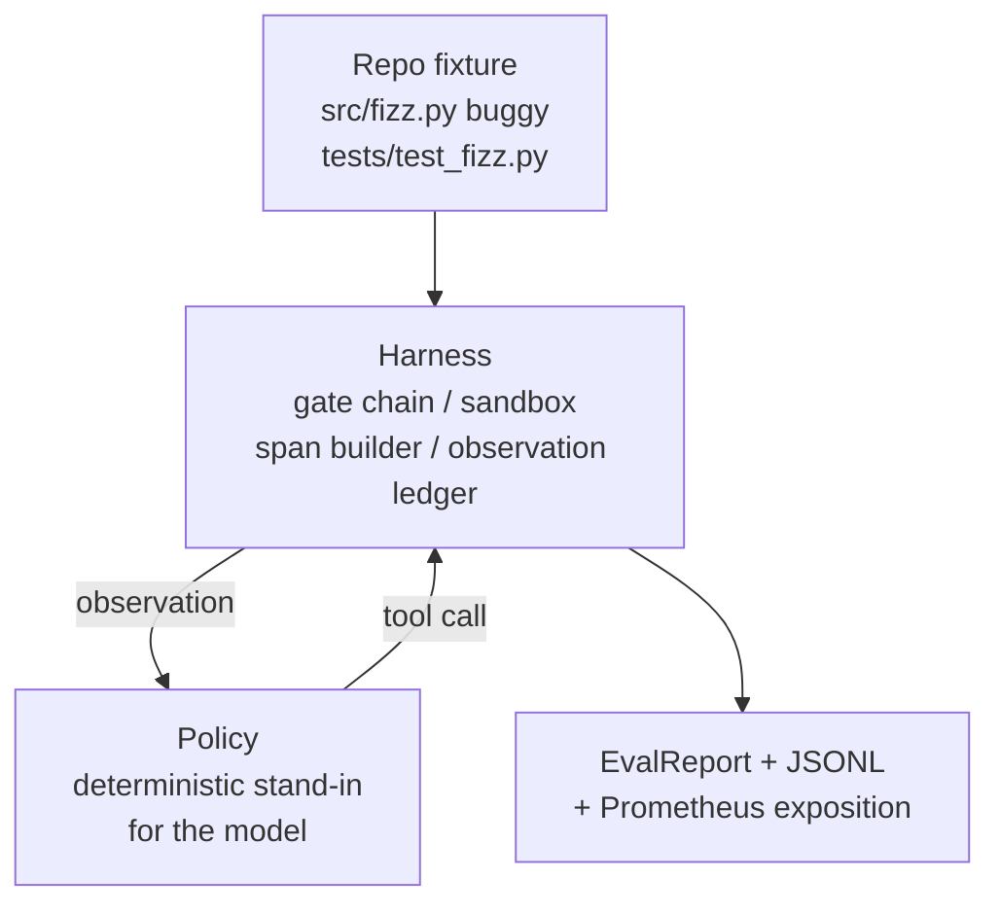
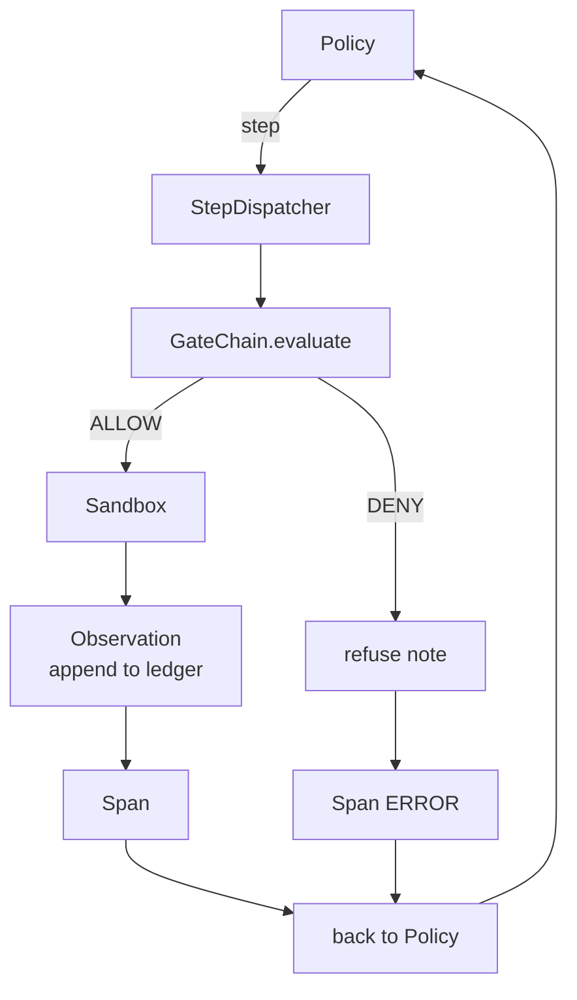

# Capstone Dersi 29: Harnes'te Sonundan Sonuna Koyuş Kodlama Ajanı

> A'nın ödeme. Bu ders, kapı zincirini, kum kutusu, eval harness'i ve OTel'i bir çok dosya Python projesinde gerçek (küçük, sabit ölçekli) bir hata düzeltmek için çalışan bir kodlama ajanına yayar. Ajan bir LLM değil, bir deterministik politika; takas, dersi yeniden üretilebilir hale getirir ve harness'in tüm zaman boyunca ilginç bir parçası olduğunu gösterir. Sözleşme aynıdır: politikaya gerçek bir model bağlanır.

**Type:** Build
**Languages:** Python (stdlib)
**Prerequisites:** Phase 19 · 25 (verification gates), Phase 19 · 26 (sandbox), Phase 19 · 27 (eval harness), Phase 19 · 28 (observability), Phase 14 · 38 (verification gates), Phase 14 · 41 (workbench for real repos), Phase 14 · 42 (agent workbench capstone)
**Time:** ~90 minutes

## Öğrenme Hedefleri

- Kapı zinciri, kum kutusu, eval harness ve span builder'i tek bir ajan döngüsüne birleştirin.
- Bir sabit hata düzeltmek için read_file, run_tests ve write_file kullanan bir belirleyici politikayı uygulayın.
- Bir son-son çalışması boyunca küresel bir adım bütçesi ek olarak bir gözlem token bütçesi uygulanmalıdır.
- Tam bir çalıştırma için OTel GenAI izlerini ve Prometheus ölçümlerini gönderin.
- Verify ajanı yasal araçlar üzerinde sıfır geçit yolculuğu ile 12 adımdan az bir süre içinde ayarları çözüyor.

## Sorun

Çoğu ajan gösterisi izole olarak çalışır: bir kum kutusu kendi başına, bir değerlendirme harnes kendi başına, bir uzantı emiter kendi başına.

Kapı zinciri izin diyor ama kum kutusu, zincir beklemiyen bir nedenle reddediyor. Değerlendirme harnesinin bir geçiş kaydettiği ama OTel kapının kullandığını iddia eden bir araç reddettiğini söylüyor. Prometheus sayıcısı bir kez artırılması gerektiğinde iki kez artırılır. Gözlem bütçesi aşıldı ama ajan devam etti çünkü bütçe zincirde izlenmişti ve kum kutusu bilmiyordu.

Bu ders tüm pist için entegrasyon testidir. Ajanın dört şeyi yapması gerekir: projeyi okuyun, testleri çalıştırın, test başarısızlığından çıkan hatayı tanımlayın, düzeltmeyi yazın, testleri tekrar çalıştırın ve durun. Her işlem kapı zinciri üzerinden geçer. Her araç yürütülmesi kum kutu üzerinden geçer. Her adım bir uzayda sarılır. Evalu harness tüm şeyi sonuna puanlar.

## Anlaşım



Ajanın politikası bir devlet makinesi.

`SURVEY`: ajan proje listesini okuyor.

`RUN_TESTS`Testler geçirse, durum makinesi başarılı bir şekilde durur. Aksi takdirde bir sonraki durum INSPECT olur.

`INSPECT`: ajan başarısız kaynak dosyasını okuyor.

`FIX`- Bu durumda, bir sonraki durum VERIFY.

`VERIFY`Eğer testler geçerse başarıyı durdurun. Aksi takdirde başarısızlıkla durun.

Her durum bir araç çağrısına karşılık gelir. Her araç çağrısı geçit zincirinden geçer. Bir araç çağrısı reddedildiğinde ajan reddedilmeyi izleyerek rapor eder ve durur.

- Bu bir hata .`fizz.py`Deterministik politika, test başarısızlığı mesajından bir regex üzerinden hata tespit eder ve düzeltilen dosyayı gönderir.

```figure
cg-harness-weave
```

## Mimarlık



Her bir önceki ders ilkesi en az ölçekte yeniden uygulanır.`main.py`(gate, sandbox, ledger, span) böylece ders kardeşler içeri aktarmadan yürür. isimler ders 25-28'e tam olarak eşittir böylece kavramsal haritalama belirsiz.

## Ne yapacaksın?

`main.py`Gemi:

1. Minimum harness primitipleri, ders 25-28 ile aynı isimlerle kopyalandı:`GateChain`- Evet .`Sandbox`- Evet .`ObservationLedger`- Evet .`SpanBuilder`- Evet .`MetricsRegistry`- Evet .
2. `CodingAgentPolicy`Sınıf: 5 devletli devlet makinesi.
3. `Repo`yardımcı: paketlenmiş buggy takımı ile bir çizik dir hazırlar.
4. `AgentRun`sınıf: polisini kullanır, harnes üzerinden gönderir, bir `AgentRunReport`- Evet .
5. Birleştirilmiş bir cihaz (`fixture_repo/`) ile src/fizz.py, tests/test_fizz.py ve eval harness için beklenen/ ağaç.
6. Demo: politikaları sonundan sonuna çalıştırır, adım adım izleri basar, geçerli olduğunu belirler, ölçümleri basar.

Toplanmış ayar, ders 27'nin görev yapısı ile aynı şekildedir: bir hata dosyası ve bir test dosyası. Test başarısızlığı mesajı, düzeltmeyi tanımlamak için belirleyici politika için yeterli bilgi içerir. Gerçek bir LLM aynı işi daha yavaş ve daha geniş bir hatırlama ile yapar, ancak bu harness'in beklentilerini değiştirmez.

## Neden politika bir LLM değil

Gerçek bir LLM, bir API anahtarı, bir ağ çağrısı ve doğrulanamayan stochasticity gerektirir. Harness dersin önem verdiği bir şeydir. Deterministik bir politikada Subbing dersi sıfır dış bağımlılıkları olan herhangi bir geliştiriciden dizüstü bilgisayarda çalıştırır ve test süiti tam adım sayısını belirlemesine izin verir.

Dersin politikası, bir LLM ajansının yaptığı şeylerin sıkı bir alt kümesidir. Politikası repo'yu okuyor, başarısız testi görür, çizgiyi tanımlar ve bir düzeltme gönderir. Bir LLM aynı bağ sözleşmesi ile aynı döngüden geçer; muhasebe aynıdır.

## Demo'nun ne söylediğini

Sonundan sonuna kadar gösterim, çıkış zamanı beş şeyi doğruluyor ve test süiti onları programsal olarak yeniden doğruluyor.

Politika, düzeni 12 adımdan daha az bir süre içinde çözdü.

Gözlem bütçesi asla aşılmadı.

Zira kapı reddetmeleri yasal araçlara ateş edildi.

Her adımın izlerdeki uygun bir uzaması vardır.

Prometheus'un gösterisinde bir `tools_called_total{tool="read_file"}`giriş ve bir `tool_latency_ms`- Histogram.

## Bu A'nın geri kalanıyla nasıl birleşti?

Bu ders entegrasyon. 25 ders kapı zinciri yazdı. 26 ders kum kutu yazdı. 27 ders eval harness yazdı. 28 ders gözlemliliği yazdı. 29 ders bir sistem olarak çalıştıklarını kanıtlar. Gerçek bir ajan harness buradan uzanır: bir model için belirleyici politikayı değiştir, paketleşmiş sabitliği gerçek bir repo görevi için değiştir, JSONL ihracatçısını OTLP için değiştir.

## - Ben çalışıyorum.

```bash
cd phases/19-capstone-projects/29-end-to-end-coding-task-demo
python3 code/main.py
python3 -m pytest code/tests/ -v
```

Demo, adım adım iz, son değerleme raporu ve Prometheus açıklaması basıyor. Çıkış kodu sıfırdır. Testler politika durum geçişlerini, sentetik araç çağrılarında kapı reddetmelerini, paketli cihazın sonundan sonuna koşuşmasını ve adım bütçe değişkenlerini kapsar.
