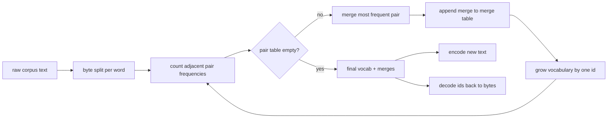
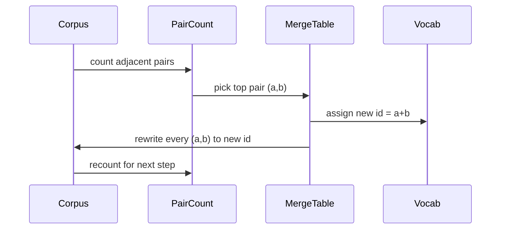

# BPE Tokenizer Baştan Başlangıç

> Bytes'ler girer, idler çıkar, idler aynı byte'lere geri döner.

**Type:** Build
**Languages:** Python
**Prerequisites:** Phase 04 lessons, Phase 07 transformer lessons
**Time:** ~90 minutes

## Öğrenme Hedefleri
- Bir çiğ metin korpusundan en sık bitişik sembol çiftini tekrar tekrar birleştirerek kodlama kelime birikimini eğit.
- Deterministik bir birleşme tablosunu uygulayın ve alt sözcük kimliklerinin akışını oluşturmak için yeni metne uygulayın.
- Dönüş-dönüş keyfi UTF-8 girişleri, bilgi kaybı olmadan kimliklere ve geri.
- Özel tokenleri rezerve edin ve koruyun (`<|endoftext|>`- Evet .`<|pad|>`) böylece eğitim ve çözümü sağ kalabilirler.
- Baye seviyesindeki bir alfabenin genel amaçlı bir tokenizer için doğru zemin olduğunu neden açıklayın.

```figure
cap-bpe-merge
```

## Çerçeve

Bir dil modeli asla metni görmez. Tam sayıları görür. Bir dizilenden tam sayılar listesine giden harita ve geriye bakılan nokta işaretçidir. Bu katmanı yanlış alın ve eğitim sürecinin her kayıp eğri yanlış şeyi ölçüyor.

Genel metin modelleri için alt sözcük işaretleyicilerinin baskın ailesi Byte-Pair Encoding. Fikir küçüktür. Bilinen bir alfabeden başlayın. Eğitim korpusunda en sık görünen bitişik sembol çiftini bulun. Yeni bir sembolye birleştirin. Sözlük hedefli boyutuna ulaşana kadar tekrarlayın. Yeni metin kodlaması aynı birleşme listesini aynı sırada tekrarlar.

Biz byte seviyesindeki variansı oluşturacağız. alfabesi 256 çiğ byte, Unicode kod noktaları değil. Bu seçim, tokenizer'in bilinmeyen bir token'a geri düşmeden herhangi bir UTF-8 girişini yönetmesine izin verir.

## - Boru hattı



Bu paylaşım sözleşme. Eğer birleşme sırasını değiştirirseniz, farklı bir kimlik akışını çözürsünüz.

## Bayt alfabesi

İlk 256 ID'ler 0x00 ile 0xFF arası çiğ baytlar için rezerve edilir. Bu, her giriş hattının bir birleşim gerçekleşmeden önce kelime birikimine ifade edilebilmesini garanti eder. Bayt blokundan sonra özel jetonlar için küçük bir aralığı rezerve ederiz. Eğitim döngüsü bu ID'leri asla birleşim hedefleri olarak önermez çünkü onları tamamen pre-tokenized akıştan uzak tutuyoruz.

BPE birleşim adımları, kelimeler sınırlarını aşan birleşmeleri ve kelime hazinesini bütün ortak ifadelerle dolduracakları öğrenir.

## Eğitim döngüsü

Bu, her bir eğitim adımında üç şeyi yapar. Bu döngü, her sözcükü korpusun içinde yürür ve sözcükün kendisi ne kadar sıklıkla ortaya çıktığı ile ağırlanan, yanındaki her iki akım simgesi ne kadar sıklıkla ortaya çıktığını sayır. Bu çiftin en yüksek sayısını seçer. Bu çiftin her olayını tek bir yeni sembol olarak yeniden yazar.



Her adımın maliyeti, bir simbol dizisi listesinde ifade edilen korpusun boyutunda doğrusaldır. Bir milyon kelime ve on bin kişilik hedef kelime birikimi için, simge dizisi birleşikken azalırken saniyeler içinde tamamlanmaya çalışır.

## Yeni metin kodlaması

İndirim, birleşme sayıcısını çağırmaz. Birleştirme tablosunu öğrendiği aynı sırada uyguluyor. Yeni bir kelime için kodlayıcı bayt bölümü ile başlar. En düşük sıralamalı birleşme için mevcut dizini tarar (en erken uygulanır). Birleştirmeyi yapar. Tekrar tarar.

Renkle sıralama, kodlama belirleyici hale getiren ve aynı giriş üzerinde eğitim davranışına eşleşen özelliğidir. İlk öğrenilen bir birleşim masanın üst kısmında oturur ve önce uygulanır.

## Özel tokenler

Özel tokenler, byte akışı asla üretemeyecek kimliklerdir.

- `<|endoftext|>`Bu, modelin "Yeni bir belge buradan başlar, önceki belgenin bağlamını sızdırma" dediğini söyler.
- `<|pad|>`Bu yüzden bir parti tam köşeli bir tensör olabilir.

Kodlayıcı, girişte özel jetonlar için bir bayrak kabul eder. Bayrak kapatıldığında, ipler `<|endoftext|>`ve `<|pad|>`Bayrak açıkken, kelimenin bir anlamda olan ipler, rezerve edilmiş kimliklerine haritaslanır ve birleştirilmeye tabi değildir.

## Dönüş garanti

Kodlama, daha sonra kodlama giriş baytlarını tam olarak geri göndermelidir. Dekoder, her bir id'in bayt genişlemesini sırayla birleştirir. Her bir id ya ham bayt veya daha önce bilinen iki kimlik genişlemesinin birleştirilmesi olduğundan, geri dönüş genişlemesi her zaman ham baytlarda sona erer.

Bu dersdeki test kümesi bu özelliği görünmeyen bir cümle, bir Unicode emoji ile bir cümle ve bir kelimenin içeren bir cümle üzerinde kontrol eder.`<|endoftext|>`- Bir işaret.

## Bu ders neyi yapmaz

En büyük üretim tokenizörlerinin tarzı ile regex yönlendirilmiş bir pretokenizer üretmez. Burada pre-kenizer küçük bir beyaz boşluk ve nokta bölümü. Küçük bir eğitim korpusunda mantıklı bir birleşme yapmak yeterlidir ve ders zincirinin geri kalanıyla olan sözleşme aynı kalır. Bir sonraki ders, tokenizer'i kara kutu olarak değerlendirir ve üzerinde kaydırıcı pencerenin veri kümesini oluşturur.

Python'da birkaç bin kelimelik bir çerçeve, saniyenin çok azında biter. Büyük korporlar için açık bir hareket, bir kelime için çiftleri paralel olarak saymak ve azaltmaktır.

## Şifreyi nasıl okuyabilirsiniz

`main.py`Dört nesneyi tanımlar.`BPETokenizer`Sözlük, birleşme tablosu ve özel işaretleme tablosu bulunur. `train`Bu eğitim döngüsü.`encode`Bu sonuç yolu.`decode`Altındaki demo, yerleşik bir corpus üzerinde küçük bir tokenizer'i eğitir, bir cümleyi kodlar, kimliklerini geri dekode eder ve her ikisini de yazdırırır.`code/tests/test_bpe.py`Geri dönüş özelliğini, özel jeton rezervasyonunu ve birleşme düzenlemesini belirle.

Demo'yu çalıştırın. Sonra demo'daki hedef kelime birikimi boyutunu 300'den 600'e değiştirin ve beklenen cümlenin kodlanmış uzunluğunun nasıl düştüğünü izleyin.
