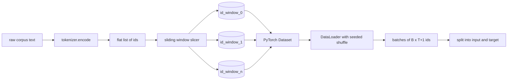
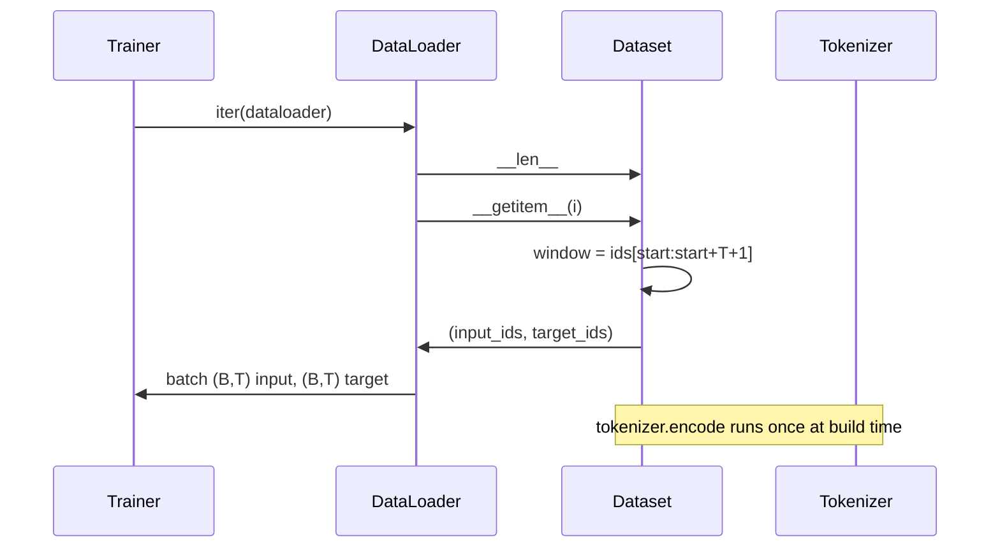

# Kaydırıcı Pencere ile Tokenized Dataset

> Bir önceden eğitim çalışması, simge kimliklerinden gradientlere bir fonksiyon.

**Type:** Build
**Languages:** Python
**Prerequisites:** Phase 04 lessons, Phase 07 transformer lessons, Lesson 30 of this phase
**Time:** ~90 minutes

## Öğrenme Hedefleri
- Bir kez tokenizeciyi arayarak çiğ bir corpus'u bir token kimlik akışına dönüştürün.
- İd akışını yapılandırılabilir bir üst üstelik adımla sabit uzunluklu pencerelere ayırın.
- Bir PyTorch Verim Satısı oluşturun ki bir sonraki belirti tahminleri için giriş ve hedef tenzorları geri gönderir.
- Veriler kümesini bir DataLoader'e, her dönem için tohumlanmış bir deterministik karıştırma ile sarın.
- İlerleme, redundansi ve etkili veri kümesi boyutu arasındaki karıştırma nedenleri.

```figure
cap-sliding-window
```

## Çerçeve

Bir eğitim öncesi çalışması, bir seferde bir parti belirtiler kimliklerini okuyor ve modelini güncelleyebilir. Her partiin şekli eğitim sözleşmesi ile belirlenir.`(B, T)`Giriş kimlikleri ve `(B, T)`hedef idler, hedefi sol tarafta bir tarafından değiştirilen giriş olan. Veri borusunun görevi, bu sözleşmeyi talep üzerine, belirleyici ve yeniden üretilebilir bir şekilde, birkaç gigabayt çiğ metin olabilecek bir korpustan üretmektir.

Bu ders boru hattını oluşturur. Önceki dersdeki tokenizer metni uzun düz bir kimlik listesine dönüştürür. Bir kaydırıcı pencere listeyi eğitim örneklerine keser. Özel bir veri kümesi örnekleri tensör olarak ortaya çıkarır. Bir DataLoader onları toplar ve bilinen bir tohumla karıştırır.

## Şekil sözleşmesi

Bir nedenci LM şekil ID ' lerini tüketir `(B, T)`nerede`B`seri boyutudur ve `T`Konekst uzunluğu.`t`pozisyonda giriş `t+1`Bu da her eğitim örneğinin kapsamını içerir .`T+1`Pencere adımları, ardılı örnekler arasında ne kadar örtüşme olduğunu kontrol eder.



Slicer asla korpus sınırına katılmaz.`T+1`Yırtıcı onu bırakır.`<|pad|>`Bu da geçerli bir seçim ama kayb maskesini karmaşıklaştırır.

## Neden bir kaydırıcı penceresi?

Bir eğitim öncesi korpus, uzun bir kimlik akışıdır. Eğer model sadece üst üste olmayan pencereleri görürse, her eğitim örneği aynı şeyi öğretir.`T`Adjusting the step moves those boundaries around so that the model sees more diverse predict-next-token tasks. adımları ayarlamak bu sınırları etrafına hareket eder böylece model daha çeşitli tahmin-next-token görevleri görür.

Bir adım daha `T`Dönüşümün bir adımını yaparak, üst üste yığılmayan pencereleri üretir.`T // 2`Bu, %50'lik bir örtüşme oluşturur ve etkili veri kümesini ikiye katlar.`1`En fazla örtüşme meydana getirir ve veri kümesini `T`. Maliyet, dönem başına daha fazla hesaplanır. Fayda daha fazla sınır çeşitliliğidir. Çoğu antrenman öncesi koşular bağlam uzunluğuna eşit bir adım kullanır, çünkü korpus zaten bir dönemde tamamlayabilecek modelden çok daha büyüktür, bu nedenle sınır çeşitliliği argümanı daha zayıfdır.

## Veritabeler sınıfı

PyTorch Verim Satısında iki gerekli yöntem bulunur. `__len__`örnek sayısını gönderir. `__getitem__`Bu sayede, bir sürü örnek, bir çift tenzor olarak geri gönderilmektedir.



Birer-birer dönüş içeride oluyor .`__getitem__`- Veri kümesi geri dönüyor .`(input, target)`nerede`input = window[:-1]`ve `target = window[1:]`Her ikisi de PyTorch uzun tenzorları.

## Deterministik karışıklık

 ile bir DataLoader`shuffle=True`PyTorch rastgele jeneratöründen okunuyor.`torch.Generator`Bu özellik, sadece tek bir hiperparametreyle farklı olan iki koşuyu karşılaştırmak istediğinizde önemlidir. bir tohum olmadan, iki koşuyu farklı sırada görüyor ve kayıp eğrilikleri değişikliğe bağlı olmayan nedenlerden dolayı farklılaşır.

Bu dersdeki tohum sözleşmesi basit.`epoch_seed = base_seed + epoch_index`.Baz tohumı inşaat sırasında geçer.Epoha indeksü her dönem başlarında eğitmen tarafından artırılır.Bir tekrar aynı baz tohumla her zaman her dönemde aynı sırayı görür.

## Satır örneklemesi

PyTorch'daki öntanımlı örnekleme cihazı, değişim engellenmiş olarak eşsiz şekilde indeksleri seçer. Bu, önceden eğitim için istediğimiz şeydir. Küçük bir veri kümesi üzerinde ince ayarlama için sözleşme aynıdır. DataLoader bir partiyi aramakla bir araya getirir `__getitem__` `B`Her örnek aynı uzunlukta olduğu için, herhangi bir doldurma mantığı gerekmez.

Ders devam ediyor .`num_workers=0`Bir üretim çalışmasında işçiler,`__getitem__`Bu, çoğu zaman bir işsizlik çünkü iş sadece hafıza içi bir tensörün bir parçası, ama aynı Dataset API çalışanları temiz bir şekilde destekliyor.

## Sayım örnekleri

Uzunluk bir id akışı için `N`, bağlam uzunluğu `T`, ve bir adım atmak .`S`, örnek sayısı `max(0, 1 + (N - (T + 1)) // S)`Ders, bu hesaplamaları, veri kümesinde statik bir yöntem olarak ortaya koyarak, eğitmen, tekrarlamadan, her dönem boyunca toplam adımları hesaplayabilir.

## Bu ders neyi yapmaz

Disk akışı, bir sürü milyon ID'nin bir parçası olarak bir anlık bir tensör olarak tutulur. Bu bir dizi için yüz megabaytın altında ve ders için doğru bir şekildir. Disk akışı, depolama yerini değiştirerek bağlanan ve ancak Dataset sözleşmesini koruyan ayrı bir kaygıdır.

Çoklu belgeleri işlemiyor. Corpus bir sürekli id akışı olarak ele alınır.`<|endoftext|>`Bu model, sınırın etrafında tahmin etmeyi öğrenir.

## Şifreyi nasıl okuyabilirsiniz

`main.py`İki sınıf ve bir yardımcı tanımlar.`SlidingWindowDataset`PyTorch Verim Satısı.`make_dataloader`Seeded generatörü ile yapılandırılmış bir DataLoader gönderir. `_encode_corpus_to_ids`Aşağıdaki demo, küçük bir tokenizer oluşturur, bir içe gömülü bir corpus kodlar, veri kümesini ve veri yükleyicisini oluşturur, bir parti basar ve şekil sözleşmesini onaylar.`code/tests/test_dataset.py`Pencere sayımını, birer-birer değişim özelliğini, belirleyici karışımı ve adım değişimi biçimini belirleyin.

Demo çalıştırın. Sonra bağlam uzunluğunu 16'dan 32'ye değiştirin ve her dönem için örnek sayısının nasıl düştüğünü izleyin.
