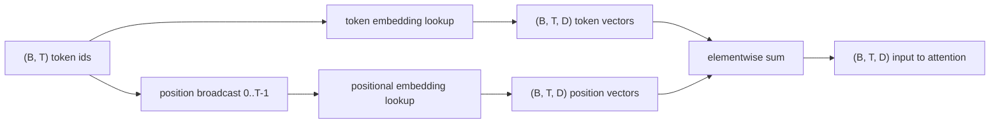
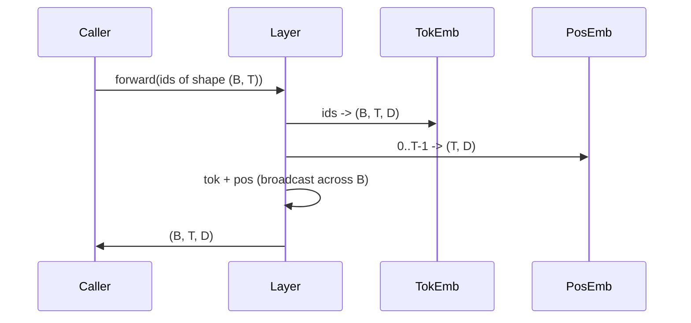

# İşaret ve pozisyon yerleştirmeleri

> İd tamsayılardır. Model vektörler istiyor. İki arama masası aralarında oturur ve konumsal seçeneğin modeli öğrenebilecekleri şeyi şekillendirir.

**Type:** Build
**Languages:** Python
**Prerequisites:** Phase 04 lessons, Phase 07 transformer lessons, Lessons 30 and 31 of this phase
**Time:** ~90 minutes

## Öğrenme Hedefleri
- Sözcük kitlesinin tanımlarını yoğun vektörlere yerleştiren bir simge içeren arama tablosu oluşturun.
- Konumları indeksiyle öğrenilmiş bir pozisyon içeren arama tablosu oluşturun.
- Parametre olmadan pozisyon ile indeksize edilmiş sabit sinusoidal pozisyon yerleşim yapın.
- Bir transformatör bloğu için tek bir giriş içine işaret ve pozisyon yerleştirmeleri oluşturun.
- Uzunluk genelleşmesi ve parametre sayısında kontrast öğrenilen ve sinusoidal yerleşimler.

```figure
cc-embedding-lookup
```

## Çerçeve

Modelin bir token id ile ilk teması, token-embedding matrisindeki bir sıra aramasıdır. Matris'in sözlük id başına bir satırı ve model boyutuna bir sütunu vardır. Arama, modelin geri kalanının id'in anlamı olarak ele aldığı bir vektörü gönderir. Backprop ön geçitinde kullanılan satırları güncelleştirir. Geometri eğitimi sırasında bu satırların yönlerde benzerliği kodlamayı öğrenir.

Sadece simge kimliklerinin sırası yoktur. Modelle, birinci pozisyonun on yedinci pozisyondan farklı olduğunu söyleyen ikinci bir sinyal gerekmektedir. Bu sinyal için iki baskın seçenek öğrenilmiş bir pozisyonsal yerleşim (ikici bir arama tablosu, her pozisyonda bir satır) ve sabit sinusoidal pozisyonsal yerleşim (parametre olmayan bir matematik formülü) dir. Seçimin sonuçları vardır. Öğrenilen bir tablo bir parametredir ve modelin eğitildiği maksimum bağlam uzunluğu ile sınırlıdır. Sinusoidal bir tablo teoride parametre dışı ve formül herhangi bir konuma uzanır.`SinusoidalPositionalEmbedding``max_context_length`ve onun `forward`Bu modüller, bu nedenle burada maksimum bir bağlam uzunluğu zorlar.

Bu ders her ikisini de oluşturur ve bir sonraki ders dikkat bloku için tek bir giriş içine yerleştirilen simge ile oluşturur.

## Şekil sözleşmesi

Ekleme aşamasına girilen giriş , şekil simgesi kimliklerinin bir seri .`(B, T)`Çıktıran bir şekil tensörüdür .`(B, T, D)`nerede`D`Her parti unsuru aynı bağlam uzunluğuna sahiptir.`T`Her pozisyon aynı vektör boyutuna sahiptir .`D`- Evet .



Kompozisyon bir toplam, bir zincir değil.`D`Ağ boyunca sabit ve modelin her katman üzerinde belirtici anlamın veya pozisyonun egemen olup olmadığını belirlemesine izin verir.

## İşaret ekleme matrisi

İşaret ekleme bir parametre şekil tensörüdür `(V, D)`nerede`V`PyTorch onu `nn.Embedding(V, D)`. init'te girişler geleneksel olarak ortalama sıfır ve standart sapma ile küçük bir Gaussian'dan alınır.`0.02`Transformer ölçekli modeller için.

Önceki geçiş tek bir indeksi işlemidir.`(B, T)`int64 kimlikleri`(B, T, D)`Arka geçiş sadece ileri geçişte dokunan sıralara gradientler biriktirir.

Bir ince ayrıntı. Şekil yerleştirme ve modelin sonunda çıkış projeksiyonu genellikle ağırlıkları paylaşır (vez bağlama). Bu olduğunda, her geriye geçiş çıkış tarafı üzerinden yerleştirmenin her satırına dokunur. Buradaki ders her ikisini de ayrı modül olarak ortaya koyar, ancak aynı matris tam bir modelde her iki rolü de oynayabilir.

## Öğrenilen pozisyonsal yerleşim

Öğrenilen pozisyonsal yerleşim ikinci bir `nn.Embedding`şekli ile`(max_context_length, D)`Arama pozisyon kimliği ile belirlenir .`0, 1, 2, ..., T-1`Ön geçit, toplama boyutunda konum vektörünü yayınlar.

Öğrenilen masanın dezavantajı konumunda sorgulamaması.`T`Eğer model sadece pozisyonuna kadar eğitilmişse `T-1`Bu şema kullanan sadece üretim dekoderli modeller, mimariye maksimum bağlam uzunluğunu pişirir ve daha uzun girişleri işlemeyi reddeder.

## Sinusoidal pozisyonal yerleşim

Sinusoidal pozisyonal yerleşim, konumdan vektora bir fonksiyon.`p`ve özellik`i`ürünler

```python
angle = p / (10000 ** (2 * (i // 2) / D))
emb[p, 2k]     = sin(angle)
emb[p, 2k + 1] = cos(angle)
```

Bu fonksiyonun parametre yoktur. Her pozisyonun benzersiz bir vektörü vardır. Dalga uzunluğu özellik boyutları arasında geometrik olarak değişir, bu nedenle daha düşük boyutlar kaba pozisyonu kodlar ve daha yüksek boyutlar ince pozisyonu kodlar.

Seçimden kaynaklanan mülk`sin`ve `cos`birlikte, konumdaki vektördür.`p + k`konumdaki vektörün doğrusal bir fonksiyonu `p`Bu, dikkat katmanına göreceli pozisyon taklitlerini öğrenmek için kolay bir yol sağlar.

Ders, tüm sinusoidal tabloyu bir kere inşa ederken hesaplar ve ileri zaman indeksi eder.

## Kompozisyon

Giriş boru hattı üç şeyi sırayla yapar. İşaret kimliklerini okuyun. İşaret vektörlerini arayın. Yerleşim vektörlerini ekleyin. Toplamı geri verin.



Toplam aşamasında yayınlama `(T, D)`PyTorch, pozisyonal tensörün şekli olduğu için otomatik olarak ele alır.`(1, T, D)`Sıkıştırmadan sonra.

## Karşılaştırıcı analiz

Ders aynı girişleri kullanarak her iki variansı da yürütüyor ve iki teşhis yazıyor.

İlk olarak, parametre sayımı.`max_context_length * D`Sinusoidal varyasyon sıfır ekliyor.

İkincisi, komşu konumlarda yerleştirilen yerler arasındaki kozine benzerliği. Sinusoidal variant, fonksiyonu sürekli olduğu için düzgün ve öngörülebilir bir çöküşe sahiptir. Başlangıçta öğrenilen varyantın, sıralar bağımsız olarak çizildiği için neredeyse rastgele benzerliği vardır. Eğitimden sonra öğrenilen varyant tipik olarak benzer bir düz yapı geliştirir, ancak bu yapıları verilerden keşfetmek zorunda kalır.

## Bu ders neyi yapmaz

Bu, dönüşümlü pozisyon kodlamasını (RoPE) veya AliBi'yi oluşturmaz. Bunlar üretim transformörlerinde modern seçimlerdir. İkisi de burada yerleştirilenlerle aynı şekil sözleşmesini izler (şekil vektörlerine pozisyon bağımlı bir dönüşüm uygulayın `(B, T, D)`Bir sonraki ders dikkat blokunu oluşturur ve seçmeli eklemlerden biri sorgu anahtar projeksiyonlarına rotary olarak katlanmaktır.

Bu eğitim, gömülmeyi eğitmez. Eğitim bir kaybı gerektirir, bu da bir model çıkışı gerektirir, bu da dikkat ve LM başını gerektirir.

## Şifreyi nasıl okuyabilirsiniz

`main.py`Üç modül tanımlıyor.`TokenEmbedding`Çelişkiler`nn.Embedding(V, D)`- Evet .`LearnedPositionalEmbedding`Çelişkiler`nn.Embedding(L, D)`- Evet .`SinusoidalPositionalEmbedding`Tabloyu önceden hesaplar ve tampon olarak ortaya çıkarır.`EmbeddingComposer`Bir simge gömülmesini ve bir pozisyon gömülmesini bir araya getirir. Altındaki demo şekilleri, parametrelerin sayısını ve komşu pozisyon benzerliği teşhisini yazdırır.`code/tests/test_embeddings.py`Çubuk şekli, yayın davranışı, parametrelerin sayımı ve sinusoidal formül.

Demo çalıştırın ve model boyutunu değiştirin.`D`64'ten 32'ye kadar ve sinusoidal dalga boyutları nasıl değiştiğini izle.
