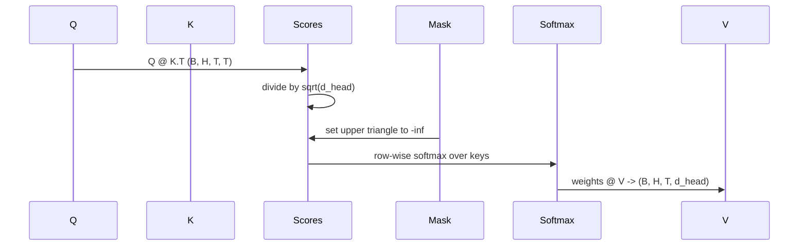

# Çok Başlı Kendine Dikkat

> Bir çizgi projeksiyonu, üç görüş, H paralel başları, bir maske.

**Type:** Build
**Languages:** Python
**Prerequisites:** Phase 04 lessons, Phase 07 transformer lessons, Lessons 30 through 32 of this phase
**Time:** ~90 minutes

## Öğrenme Hedefleri
- Bir tek çizgi katman olarak H başlarına bölünmüş bir partili sorgu/ anahtar/ değer projeksiyonu uygulayın.
- Doğru normalleşme ve dtype yönetimi ile hesaplama ölçekli nokta- ürün dikkat.
- Bir pozisyonun gelecekteki pozisyonlara katılmasını engelleyen bir sebep maskası uygulayın.
- Her başın bakış açısı hakkında sabit bir giriş ve neden için baş başına dikkat ağırlıklarını inceleyin.
- Oyuncak bir görev üzerinde küçük bir dikkat blokunu eğit ve kafaların uzmanlaşması ile kayıpların düşüşünü izle.

```figure
cap-multihead-attention
```

## Çerçeve

Dikkat, bir token'ın temsilinin aynı sırada diğer tokenlerden bilgi çekmesine izin veren işlevi. Kendine dikkat etmek sorgular, anahtarlar ve değerler aynı girişten kaynaklanır. Çoklu baş projeksiyonu H paralel dikkat sorunlarına bölünür.

Verimli uygulama tarzı, `D`- ...`3 * D`Ve üç görünümlü bir parçaya ayırıp, sonra H boyutlu başlara dönüştürülür.`D // H`Matmul, softmax ve ağırlıklı toplam, toplu tenzor işlemleri olarak gerçekleşir.

Bu ders blok oluşturur. Aynı zamanda nedensel maske ekler, böylece aynı kod sadece dekoderli bir dil modelinde dikkat katmanı gibi çalışır. Bir sonraki ders bloku tam bir transformatöre ve sonrasında eğitilen derslere yığar.

## Şekil sözleşmesi

Giriş:`(B, T, D)`- Çıktı .`(B, T, D)`Maske ...`(T, T)`Bu blok içinde orta tenzorlar şekillidir.`(B, H, T, d_head)`nerede`d_head = D // H`- Zorluk şu .`D % H == 0`- Evet .

```mermaid
flowchart LR
    A["(B, T, D) input"] --> B[Linear D -> 3D]
    B --> C["split into Q, K, V"]
    C --> D["reshape to (B, H, T, d_head)"]
    D --> E["scores = Q @ K.T / sqrt(d_head)"]
    E --> F[apply causal mask]
    F --> G[softmax over keys]
    G --> H["context = weights @ V"]
    H --> I["reshape to (B, T, D)"]
    I --> J[output Linear D -> D]
    J --> K["(B, T, D) output"]
```



İki doğrusal katman (QKV projeksiyonu ve çıkış projeksiyonu) bloktaki tek parametrelerdir.

## QKV bölümü

Naif uygulamanın üç ayrı çizgi katmanı vardır, her biri Q, K ve V için bir katman. Verimli olan bir katman vardır ki çıkışlar `3 * D`Bu iki şey matematik açısından eşittir çünkü üç ayrı matris çarpımı `(D, D)`Ağırlıklar tam olarak bir matris çarpımı bir `(3D, D)`Ve onlardan yükler yüklenmiştir.

Versiyon daha hızlıdır çünkü hızlandırıcı üç yerine bir matmul başlatır.

## Baş yeniden şekillendi .

Bölünmeden sonra, her bir Q, K, V `(B, T, D)`Bunu H paralel dikkat sorunlarına dönüştürmek için, yeniden şekillendiriz.`(B, T, H, d_head)`ve `(B, H, T, d_head)`Baş boyutu artık seri boyutunun yanında yer almaktadır . PyTorch , baş başına yapılan dikkatle bir seri olarak işlemi yapar .`B * H`bağımsız durumlar.

D_head boyutu son kalır böylece skor matmul `Q @ K.transpose(-2, -1)`Bu da bir anlaşma.`(B, H, T, T)`Baş başına dikkat puanları.

## Ölçekleme

Notlar bölünür `sqrt(d_head)`Bu ölçeklendirme olmadan nokta ürünleri büyür.`d_head`Bu sistemdeki gradientler küçük ve öğrenme stalllarıdır.`sqrt(d_head)`Baş boyutları boyunca puanların farkı yaklaşık olarak sabit kalır.

## Sebep maskası

Sadece dekodörle yapılan bir dil modeli, sadece bir sonraki simgeyi tahmin ederken geçmişe koşul verebilir.`(T, T)`Bu değerler, değerlerin değerinin en yüksek seviyesinde olduğu bir değerden sonra, değerlerin en yüksek seviyesinde olduğu bir değerden sonra, değerlerin en yüksek seviyesinde olan değerlerin değerinin en yüksek seviyesinde olduğu bir değerden sonra, değerlerin en yüksek seviyesinde olan değerlerin değerinin en yüksek seviyesinde olduğu bir değerden sonra, değerlerin en yüksek seviyesinde olan değerlerin değerinin en düşük seviyesinde olduğu bir değerden oluşur.



Maskeyi inşaat sırasında tampon olarak kaydederek modelle aynı cihaza oturuyor ve gradient grafinin bir parçası değil. Maske blokun gördüğü maksimum bağlam uzunluğunu kapsar. Ön zamanında yukarı sol tarafı keseriz.`(T, T)`Köşe.

## Çıktılık projesi

Başlık bağlam vektörlerinden sonra `(B, H, T, d_head)`, geriye `(B, T, H, d_head)`, yeniden şekillendirildi .`(B, T, D)`, ve son bir `(D, D)`H başları sadece daha sonraki katmanlar üzerinden yeniden birleştirilmiş olur ve blok yapay olarak kısıtlanmış olur.

## Dikkatli ağırlık denetimi

Ders bir `return_weights=True`Ön geçidindeki bayrak. ayarlandığında, blok baş başına dikkat ağırlıklarını şekil gönderir.`(B, H, T, T)`Demo, kısa bir giriş üzerinde bir başın ağırlığının bir sıcaklık haritasını basıyor böylece nedenci üçgen yapısını ve pozisyon odakını görebilirsiniz.

Eğitimli bir modelde, farklı kafalar farklı desenler öğrenir. Bazı kafalar hemen önceki simgeye dikkat eder. Bazı kafalar dizinin başlangıcına dikkat eder. Bazı kafalar dikkatini neredeyse bir şekilde yayır. Denetim kaçağı bu yorumlanabilirlik işinin giriş noktasıdır.

## Eğitim gösterisi

Demo altındaki `main.py`Bu işlem, dikkat blokunu küçük bir LM başına bağlar ve tüm şeyi tekrarlama görevine eğitir. Girişlerin her satırı bağlamda tekrarlanan tek bir rastgele id'dir. Hedef bir tane tarafından kaydırılan girişdir, bu nedenle model sonraki token'in önceki token ile aynı olduğunu öğrenmelidir. Kayıp çapraz entropi. H=4, D=32, T=12 ve 64 kelime birikimi ile, kayıp rastgele (yaklaşık`log(64) ~ 4.16`) aşağıya doğru iyice aşağıya doğru `1.0`CPU'da üç dönemden fazla.

Demo'nun amacı, faydalı bir model eğitmek değil, blokun her parçasındaki eğilimeyi doğrultmak ve cevap açık olduğu bir sorunun cevabını öğrenmek.

## Bu ders neyi yapmaz

Bu, bir ileri dönüşüm bloğu eklemez. Gerçek bir modelde transformatör katmanı dikkat, ardından her birinin etrafında kalan bir bağlantı ve katman normı olan iki katmanlı MLP'dir.

Bu, dönümsel veya AliBi pozisyon kodlamasını uygulanmaz. İkisi de aynı blokta QKV projeksiyon aşamasında uygulanır, ancak ayrı bir öğretim birimidir. Burada inşa edilen blok, matmul'den önce Q ve K'yi dönüştürerek herhangi biriyle uyumludur.

KV önbelleği, sonuçlandırma için KV önbelleği uygulamıyor. Önceki geçitler boyunca önbelleği anahtarları ve değerleri, autoregressive dekodlamayı hızlı yapan optimizasyon. K ve V tenzorlarında şekil sözleşmesini değiştirir, ancak Q'da değil.

## Şifreyi nasıl okuyabilirsiniz

`main.py`tanımlar `MultiHeadSelfAttention`- Evet . Sınıf iki çizgülü katman ve kayıtlı bir maske tamponu taşıyor. Önceki geçiş projeleri, yeniden şekillendirme, puanlama, maskeler, yumuşaklık, ağırlıklar, yeniden şekillendirme ve yeniden projeler. Altındaki demo, dikkatini simge ve pozisyon içe gömülmeleri ve LM başıyla sarıp, üç dönem boyunca kopyalama görevinde eğitilen ve kayıp eğriğini ve baş başına dikkat sıcaklık haritasını yazdırırır. Testler `code/tests/test_attention.py`Şekil kontratını, sebeplilik özelliğini, softmax özelliğini, baş bölünme özelliğini ve gradient akışını belirleyin.

Demo'yu çalıştırın, sonra artın.`n_heads`4 ila 8 (bakım)`d_model=32`- Evet .`d_head=4`) ve sıcaklık haritasının değişmesini izle.
