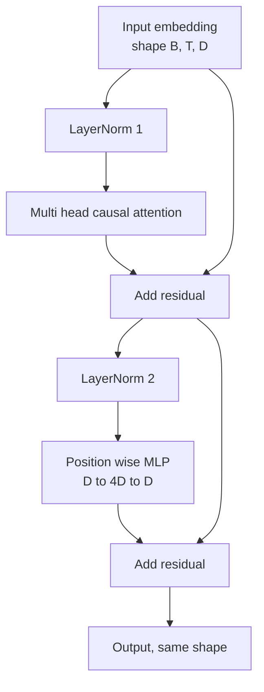
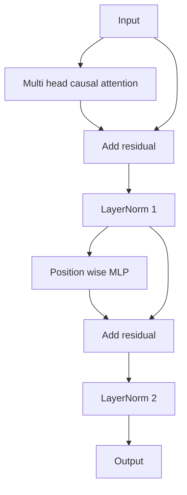

# Transformer Blokı Baştan Başlangıç

> Bir blok, her modern dekodör LLM'nin birimidir. Katman norm, çoklu baş dikkat, kalan, MLP, kalan. LN öncesi variant ısıtmadan sabit bir şekilde trenler. LN sonrası variant orijinal kağıtın gönderdiği şeydir. Bu ders her ikisini de yan yana inşa eder ve hangi biri 12 katlı bir yığında ortak öğrenme hızlarında hayatta kaldığını gösterir.

**Type:** Build
**Languages:** Python
**Prerequisites:** Phase 19 lessons 30 to 33 (tokenizer, embeddings, attention math, batched data loader)
**Time:** ~90 minutes

## Öğrenme Hedefleri

- PyTorch'te dört hareketli parçadan bir transformatör bloğu oluşturun: LayerNorm, çok sayıda kafa nedense dikkat, kalan bağlantılar, pozisyonsal MLP.
- LayerNorms'i iki yapılandırmaya (LN öncesi ve LN sonrası) yerleştirin ve neden bir trenin ısıtmadan sabit olduğunu açıklayın.
- Çok kafa dikkatinin içinde nedensel maskeli uygulama , böylece simgesel `i`İşaretleri göremiyorum .`j > i`- Evet .
- 12 katlı bir yığın üzerinde her iki variansın arasından gradient akışını izleyin ve el sallamadan sonucu okuyun.
- Bir sonraki ders 124 milyon parametre GPT'yi birleştirdiğinde bloku bir drop-in birimi olarak yeniden kullanın.

## Sorun

Bir transformatör bir blok tekrarlanır. Bir kere blokun yanlış olduğunu, 12 kez tekrar et, ve ilk çağda farklılaşan veya kalan süre boyunca ısınma hacklerine ihtiyaç duyan bir model gönderiyorsun. Bu dersde göreceğiniz iki başarısızlık modusu egzotik değildir. Bir öğrenci ilk defa blokları safça yığırken ortaya çıkarlar. Birincisi gelecekle ilgili dikkat tabakalarıdır. Diğer bir de LayerNorm'un kalıntılı sinyalin derinliklerde kontrol edemeyeceği yerlerde yerleştirildiği.

Bu blok tam olarak iki kalıntı yoluna ve tam olarak iki normalleşme pozisyonuna sahiptir.

## Anlaşım

Her dekoder sadece transformatör bloğu bir şekil tensörü alan bir fonksiyon .`(batch, sequence, embedding)`Ve aynı şekilden bir tensor gönderir.



Bu, LN öncesi variandır. LayerNorm, alt katmanın önünde kalan dalın içinde yer alır.

LN sonrası variant, LayerNorm'ı kalan eklenmenin ardından taşıyor.



Form aynıdır. Eğitim davranışları değil. LN sonrası, kalan yol boyunca geri akılan gradient LayerNorm'den geçmelidir.`3e-4`Bu nedenle, pre-LN, geri kalan yolun normalleşmesini engelleyecek kadar hızlı bir şekilde küçülüyor. pre-LN, GPT-2'nin ilerleyen gemiler için yapılandırmasıdır.

### Sebepçi çok kişilik dikkat

Dikkat alt katman girişini soru, anahtar ve değer tensörlerine üç şekilde yansıtır.`(B, T, D)`- ...`(B, H, T, D/H)`nerede`H`Skalalı nokta ürün dikkat hesaplamaları`softmax(Q K^T / sqrt(d_k))`Baş başına, üst üçgenin negatif sonsuzluğa maskeliyor, maskeli softmax üzerinden uyguluyor, sonra çarpı `V`Başlar tek bir zincire bağlanır .`(B, T, D)`Maskeyi nedençi yapan tek parça maskeyi unut ve aldatıcı bir model eğit.

### MLP

Konumsal MLP, her token'e bağımsız olarak aynı iki katlı ağ uyguluyor. Gizli genişlik yerleştirme genişliğinin dört katıdır, etkinleştirme GELU'dur ve ikinci doğrusaldan sonra bir çıkış gerçekleşir. MLP içinde hiçbir token birbirleriyle konuşmuyor. Tüm token karışımı dikkatle gerçekleşir.

### Geri kalan bağlantılar iki şeyi yapar.

Bu, gradient normunu on iki katman boyunca ölçekte tutan derinlik boyunca katılımcı bir şekilde yaparlar. Ayrıca her blokun tamamı değiştirmek yerine çalışmakta olan temsil için katılımcı bir güncelleme öğrenmesine izin verirler.

```figure
cc-transformer-block
```

## Yapın

`code/main.py`Uygulamaları:

- `class LayerNorm`Öğrenilebilir ölçek ve değişim, tarafsız eps, her token vektörü için uygulanır.
- `class MultiHeadAttention`- Evet .`num_heads`- Evet .`head_dim = d_model // num_heads`, birleşik QKV projeksiyonu, kayıtlı nedensel maske, dikkat ve kalan bırakma.
- `class FeedForward`İki çizgi katmanlı, GELU aktivasyonu, çıkış.
- `class TransformerBlock`bir `pre_ln`İki varians arasında değişen bayrak.
- 6 kat ön LN yığın ve 6 kat sonrası LN yığın oluşturan bir demo, (a) çıkış şekli, (b) bir geri geçişten sonra yerleştirmede gradient normı ile aynı giriş ve baskılara sahip.

Çek şunu:

```bash
python3 code/main.py
```

Çıktı: her iki yığın üzerinde şekil kontrolü, gradient normları yan yana.LN öncesi yığının yerleştirme gradienti aynı öğrenme hızında LN sonrası yığının büyüklüğünden büyük bir sıradır.

## Yüküm

- `torch`Tansor matematik, otograd ve `nn.Module`- Temir tesisatı.
- Hayır .`transformers`Blok, ilkellerden uygulanmış.

## Doğada üretim biçimleri

Üç örnektir ders kitabı blokunu gönderebileceğiniz bir şeye dönüştürür.

**Fused QKV projection.**Üç ayrı çizgi katman üç çekirdek başlatma ve üç matmuls maliyetini.`3 * d_model`Bu işlem, bir fırlatmada aynı işi yapar, sonra son eksesi boyunca çıkışı bölür.

**Registered causal mask buffer.**Maske sadece maksimum bağlam uzunluğuna bağlıdır.`register_buffer`Bu maskanı uzun bağlamda bir alımcı sıcak noktasına dönüştürür.

**Dropout in two places, not three.**İptal, dikkat softmax ( dikkat düşüşü) ve MLP (kayıp düşüşü) ikinci doğrusal sonrasına aittir. Geri kalanın üzerinde bir düşüş, gradientin derinliklere akmasına izin veren katkı kimliğini kırar.

## Kullan

- Bu dersdeki blok, ders 35'te doğrudan GPT montajına değiştirilmeden bağlanır.
- LN öncesi varians, her modern açık ağırlık LLM'nin kullandığı şeydir. LN sonrası varians, orijinal 2017 dikkat kağıdından kullanılmıştır. Her ikisini bilmek karşılaştığınız herhangi bir dekoder mimarisini okumak için yeterlidir.
- GELU'yu SiLU'ya değiştirirseniz LLaMA ailesinin etkinleştirilmesi olur LayerNorm'ı RMSNorm'e değiştirirseniz LLaMA ailesinin normalleşmesi olur. Aynı iskelet.

## Egzersizler

1. Bir ekle`bias=False`Modern açık ağırlıklar LLM'ler, doğrusal katmanlarda önyargısız olarak gönderir. 12 katmanlı 768 yumuşak bir modelde kaç parametre kaydettiğinizi ölçer.
2. Değiştir `nn.LayerNorm`RMSNorm'u elle yuvarlanan bir şekilde kullanın ve çıkış şeklinin değişmediğini kontrol edin.
3. İlk baş için dikkat ağırlıklarını geri alan bir bayrak ekleyin.`(B, T, T)`Softmax'den sonra sıfır olduğunu doğrultmak için üst üçgenin çizgisini çiz.
4. Bir akıl kontrolü yapın ki , bir `(2, 16, 384)` ile tensor`H=6`Her iki varians ve ileri çıkışların farklı olduğunu iddia eder (örneğin,`not torch.allclose`) ağırlıkların aynı şekilde başlatıldığı ve çıkış sıfır olarak ayarlandığı zaman.

## Anahtar Terimler

| Term | What people say | What it actually means |
|------|-----------------|------------------------|
| Pre-LN | "Pre norm" | LayerNorm inside the residual branch, before each sublayer; the residual carries the unnormalized signal |
| Post-LN | "Post norm" | LayerNorm after the residual add; what the 2017 paper shipped and what needs warmup |
| Causal mask | "Triangle mask" | The upper triangle of the attention logits set to negative infinity so token i cannot read token j when j is greater than i |
| Fused QKV | "Combined projection" | One linear of width 3D instead of three linears of width D; one kernel, one matmul |
| Residual stream | "Skip connection" | The unnormalized tensor that flows top to bottom through every block; what each block adds to |

## Daha Fazla Okumak

- 7. aşama 02 dersi (kendine sıfırdan dikkat) bu blok altındaki dikkat matematikası için.
- Eğlence 7 ders 05 (tam transformatör) aynı iskeletin kodlayıcı dekoder versiyonu için.
- Bu blokun içine bağlanan eğitim prosedürü için 10. aşama ders 04 (öğrenmeden önce mini GPT).
- Bu bloklardan on iki tanesini GPT modeline yığarak oluşturan Fase 19 Ders 35 (bu parça).
