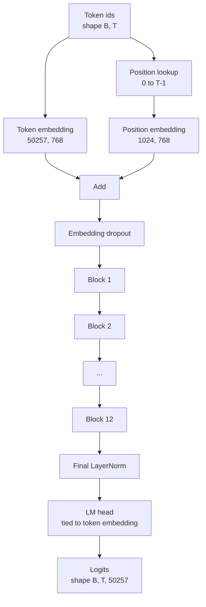
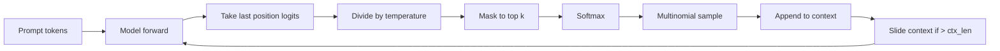

# GPT Model Koşulları

> 12 blok yığılmış, bir simge yerleştirme, öğrenilmiş bir pozisyon yerleştirme, son bir LayerNorm ve bağlanmış bir dil model başı. Bu tüm 124 milyon parametre GPT modeli. Bu ders bu parçaları bir işçi sınıfına birleştirir, modelin referans 124M şekliyle uyumlu olduğunu doğrulamak için parametreleri sayır ve çoklu numune, sıcaklık ve üst-k ile metin üretir.

**Type:** Build
**Languages:** Python
**Prerequisites:** Phase 19 lessons 30 to 34
**Time:** ~90 minutes

## Öğrenme Hedefleri

- Ders 34'ten dönüştürücü blokunu tam bir GPT modeli olarak birleştirin: token yerleştirme, pozisyon yerleştirme, N bloklar, son LayerNorm, dil model başlığı.
- 124 milyon parametre yapılandırmasını yeniden üretin: sözcük 50257, bağlam 1024, 768, on iki baş, on iki katman yerleştirir.
- Dil modelinin baş ağırlıklarını simge gömülmesine bağlayın ve bu ölçekte neden ~ 38 milyon parametre koruduğunu açıklayın.
- Multomial örnekleme, sıcaklık ölçeklemesi ve üst-k kesim ile bir sürükleyici penceresi ile bağlam uzunluğu ile bir istekten metin oluşturun.
- Parametre sayısını ve ileri geçiş maliyetini 124M hedefine karşı ölçün.

## Sorun

Bir transformatör bloğu kendi başına hiçbir şey yapmaz. Token ID'leri vektörlere dönüştürmek, konum bilgileri karıştırmak, onları yığın boyunca çalıştırmak ve kelime depolama logitlerine geri projekt etmek gerekir. Bu dört adımın herhangi birini unut ve model ya ileriye doğru ilerlemeyi başaramaz, konum bilgileri sürüklenir veya konuşamaz.

Modelin şekli de önemlidir. Referans GPT-2 küçük 124 milyon parametre tam yukarıdaki yapılandırmada. Sayılar sihirli değil. 50257 çarpı kelimesi 768'i yerleştirmek simge masasıdır. 1024 çarpı 768 pozisyon tablosudur. Her biri yaklaşık 7 milyon parametre olan 12 blok 84 milyon. Son baş, simge masasını ağırlık bağlayarak tekrar kullanır. Parçaları toplayıp 124 milyonu elde edersin. Parametre sayısının referansla aynı olmadığı bir model oluşturmak yanlış bir şey yaptığının bir göstergesidir.

## Anlaşım



Token idler, simge vektörleri haline gelir. Pozisyon idleri pozisyon vektörleri haline gelir. İkisi de eklenir ve yığın yoluyla gönderilir. Son LayerNorm, her modern variantın hayatta kalan blokların dışında bir parçadır. LM başı simge gömme matrisiyi yeniden kullanır, bu da ağırlık bağlamayı ifade eder.

### Ağırlık bağlama

İşaretleme gömülmesi şekillidir .`(vocab, d_model)`Dil model başlığı `d_model`Geri dön .`vocab`Bu iki metrin birbirinin transposedleri. İkisini bağlamak kelimenin tam anlamıyla aynı parametre tensoru anlamına gelir, iki kez kullanılır. 50257 ve d_model 768 sözcüklerinde matris 38 milyon parametre. Bağlantısız, iki kez ödeme yaparsınız. Bağlantılı, bir kez ödeme yaparsınız ve ayrıca yerleşim ve baş güncelleştirme birlikte biraz daha temiz bir gradient sinyali elde edersiniz.

### Konum yerleşimi öğrenilmiştir, sinusoidal değil.

GPT-2 öğrenilen pozisyon ekleme gönderir.`(1024, 768)`. Model, her ileriye doğru 0'dan T-1'e kadar pozisyonları arar ve belirti gömülmesine bakış ekler. Bu pozisyon şemelerinden en basitidir (RoPE, ALiBi, T5 nispetel önyargısı alternatiflerdir) ve 124M referansında kullanıldığı şey budur.

### Nesil: sıcaklık, üst-k, çoklu

Genreasyon autoregresivdir. Her adımda, model her pozisyonda tüm kelime birikimi üzerinde logitler gönderir. Sadece son pozisyonu alır, sıcaklığa göre bölünür, seçeneği olarak en üst k logitleri hariç tümünü negatif sonsuzluk, olasılıkları elde etmek için softmax'a maske eder ve elde edilen dağılımdan bir token örneğini alırsınız.



Üç düğme, üç farklı davranış. sıfır yakın sıcaklık açgözlülük olarak çöker. Bir sıcaklık modelin doğal dağılımına uygular. Top-k bir açgözlülüktir. Top-k kırk uzun kuyruğu filtrelemektedir.

```figure
cc-gpt-assembly
```

## Yapın

`code/main.py`Uygulamaları:

- `class GPTConfig`124M varsayılanlar ile veri sınıfı: `vocab_size=50257`- Evet .`context_length=1024`- Evet .`d_model=768`- Evet .`num_heads=12`- Evet .`num_layers=12`- Evet .`mlp_expansion=4`- Evet .`dropout=0.1`- Evet .`use_bias=True`- Evet .`weight_tying=True`- Evet .
- `class GPTModel`- İşaret yerleştirme, pozisyon yerleştirme, yerleştirme, düşme, on iki `TransformerBlock`S, son LayerNorm ve bir `lm_head`Bayrak kurulduğunda simgeyi yerleştirmeye bağlayan.
- A.`count_parameters`eşsiz parametreler sayısını geri veren yardımcı (böylece ağırlık bağlanması sayıda sayılır).
- A.`generate`Bu, sıcaklık, üst-k, çoklu ve kaydırıcı pencereler bağlamını yapan bir işlevdir.
- Model oluşturan bir demo, referans 124M'nin yanında parametreler sayısını yazdırırır ve boru hattının sonlarını sonuna kadar göstermek için sabit bir istekle kısa bir dizini oluşturur.

Çek şunu:

```bash
python3 code/main.py
```

Çıktı: 124M referansı yanında parametreler sayımı, rastgele bir istekle oluşturulan token kimlikleri ve LM başının ve token gömülmesinin bağlama sırasında depolama payı olduğunu doğrulanması.

Demo'yu hızlı tutmak için senaryo ayrıca küçük bir yapılandırma (`d_model=64`- Evet .`num_layers=2`124M yapılandırması oluşturulur, ancak sadece parametrelerinin sayımı ve bir ileri geçiş uygulanır.

## Yüküm

- `torch`Tansor matematik, otograd ve modül tesisat için.
- `code/main.py`Ders 34'ten aynı blok modelini yerel olarak yeniden uyguluyor.

## Doğada üretim biçimleri

Üç model, çalışkan ve giden model arasında fark yaratır.

**Initialize the residual projections small.**MLP'nin ikinci ve ikinci liner bir dikkat projeksiyonu doğrudan bir geri kalan eklemeye gıda sağlar. Diğer her liner gibi aynı standart sapma ile olanları başlatmak derinlik ile büyüyen ve son LayerNorm'i sıcak bir rejime itici bir geri kalan akış sağlar.`1 / sqrt(2 * num_layers)`Bu iki projeksiyon için; kalan akım on iki katın boyunca akılda kalır.

**Cache the position id tensor, do not recompute.** `torch.arange(T)`Her ileriye yeni bir hafıza ayırır.`__init__`maksimum bağlam için her çağrıda ilk T girişlerini kes ve tahsisci dönüş yolculuğunu atlayın.

**Tie weights at parameter level, not just by copying.**Yapılandırma`lm_head.weight = token_embedding.weight`Bu sayede, bir grafik, bir parametreyi güncelleme ihtiyacı vardır. Eğer kopyalarsanız, başı yerleşimden uzaklaşır ve ağırlık bağlamak size hiçbir şey satın almaz.

## Kullan

- Bu dersdeki model sınıfın şekli, bir sonraki dersten gelen sınıfın şekliyle aynıdır.
- RoPE ile öğrenilen pozisyonu değiştirmek, blok veya kafana dokunmadan size LLaMA ailesini verir.
- GELU'yu SiLU ile değiştirmek ve LayerNorm'u RMSNorm ile değiştirmek LLaMA ailesinin geri kalanını sağlar.
- Yükleme işlevi sadece bu model değil, her logit kaynağı ile de çalışır. 37 dersinde önceden eğitilmiş bir GPT-2 dosyasından logit çıkarıp aynı nesil döngüsünü tekrar kullanabilirsiniz.

## Egzersizler

1. LM başını simge gömülmesinden çıkar ve delta'nın 50257 çarpı 768 = 38 milyon olduğunu kontrol et.
2. Öğrenilen pozisyon yerleştirmesini inşaat sırasında hesaplanmış sinusoidal bir masa ile değiştirin.
3. Bir ekle`greedy=True`Örneklemeyi atlayan ve argmax'i seçen jenerasyona işaret edin.
4. Bir ekle`repetition_penalty`prompt veya oluşturulan geçmişte herhangi bir token'un logitini softmax'den önceki sabitle bölen düğme.
5. Ekle`top_p`(yüklü) örnekleme `top_k`. İki satırlı kontrol , saklanan tokenların olasılıklarının toplamının çok daha fazla olduğunu gösterir .`top_p`- Evet .

## Anahtar Terimler

| Term | What people say | What it actually means |
|------|-----------------|------------------------|
| Weight tying | "Tied embeddings" | The LM head and the token embedding share the same parameter tensor; saves vocab times d_model parameters and matches the GPT-2 reference |
| Position embedding | "Learned positions" | A separate table of shape (context length, d_model) added to token vectors; learned end to end |
| Sliding window context | "Context cap" | When the prompt plus generated tokens exceed the context length, drop the oldest tokens so the active window fits |
| Top-k sampling | "K truncation" | Keep the K logits with the highest values, mask the rest to negative infinity, softmax over the remainder |
| Temperature | "Sampling temperature" | Divide logits by T before softmax; T less than 1 sharpens, T equal to 1 keeps the natural distribution, T greater than 1 flattens |

## Daha Fazla Okumak

- Bu modelin yığınları için 19. aşama ders 34.
- Bu modelin çapraz entropi kaybı ile çalışan eğitim döngüsü için Fase 19 ders 36.
- Eğitim öncesi GPT-2 ağırlıklarını bu tam mimarlığa yüklemek için Fase 19 Ders 37.
- 7. Fase ders 07 (GPT sebepli dil modelleştirme) bir sonraki belirti tahmininin matematiği için.
- Eğitim öncesi mini GPT (Eğitim öncesi ders) 10. aşama aynı mimari üzerinde orijinal eğitim prosedürü için.
