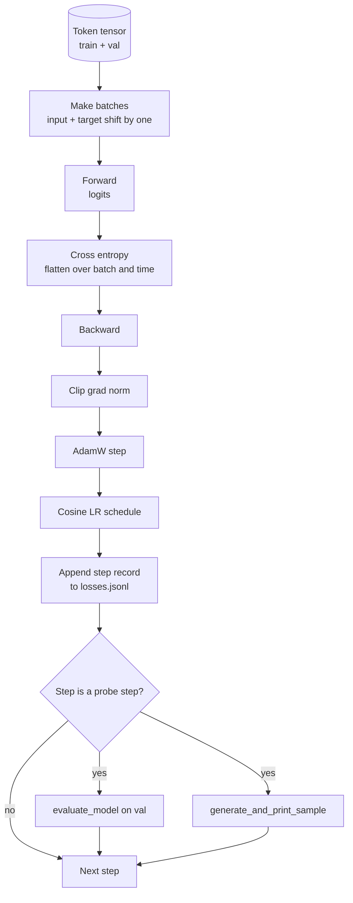

# Eğitim Çeviri ve Değerlendirme

> Ölçmeyen bir döngü, yalanlı bir döngüdür. Bu ders GPT modelini yönlendiren eğitim döngüsünü oluşturur: AdamW ağırlık düşüş bölümü, ısınma artı cosine öğrenme hızı programı, `calc_loss_batch`yardımcı, bir `evaluate_model`Değişmiş verileri aktarmak,`generate_and_print_sample`K adımlarını bir kaliteli araştırmak ve sonra çizdiğiniz kayıpların JSONL kayıtlarını oluşturmak.

**Type:** Build
**Languages:** Python
**Prerequisites:** Phase 19 lessons 30 to 35
**Time:** ~90 minutes

## Öğrenme Hedefleri

- Bir sonraki token tahmininde doğru giriş ve hedef ayarıyla çapraz entropi kaybını hesaplayan bir eğitim döngüsü oluşturun.
- AdamW'yi LayerNorm veya önyargı tensörlerine değil, ağırlık tensörlerine uygulanan ağırlık kaybı ile yapılandırın.
- Düzsel ısınma ve kosinus bozulması ile öğrenme hızı programını uygulayın ve elde edilen LR'yi zaman içinde okuyun.
-  ile uzun süreli bir bölünme üzerinde değerlendirin`evaluate_model`Yani değer kaybı, çalışmalar arasında karşılaştırılabilir.
- Her K adımı ile kaliteli bir örnek oluşturun `generate_and_print_sample`Kayıp eğri olmadan önce ayrımcılığı yakalamak için.
- JSONL'e her adım kayıp için devam edin böylece eğitim günlüğünü yeniden yükleyebilir, çizer ve teslimat olarak gönderebilirsiniz.

## Sorun

Kayıpları yazdırıp başka bir şey yapmayan bir eğitim senaryosu üç şekilde başarısız olur. Kayıpların doğru nedenlerle azalıp azalmadığını söyleyemez (modelle eğitim setini aşarak asla öğrenemez). Bir ayrım başladığını söyleyemez (kayıp bir adım için tırmanıp toparlanabilir veya bir adım ve çöküşebilir). Modelin ne öğrendiğini söyleyemez (kayıp bir skalar; üretilen örnek bir paragraf). Bu üç başarısızlık da, döngü ölçülmedikçe saklanır.

Bu dersdeki döngü üç şekilde ölçülür. Eğitim partisinin her adımı kaybedilmektedir. K adımları her atışta bir sürüklenmiş partiyi kaybedilmektedir. K adımları her atışta sabit bir istekle oluşturulan bir devam. Eğitim logu JSONL'de yer alır, böylece eser döngünün tanıklığıdır.

## Anlaşım



İki açık olmayan parça, kayıp düzeni ve AdamW parçalanması bölümü.

### Kayıp Düzeltme

Modeldeki her pozisyonda bir sonraki token tahmin edilir.`[t0, t1, t2, t3]`, hedef parti `[t1, t2, t3, t4]`- Çelişki entropisi düz şekilde hesaplanır .`(batch * seq, vocab)`Düz hedef karşısında `(batch * seq,)`Değişimi unut ve modelin kendini tahmin etmesini eğit. Bu da hiçbir işe yaramaz bir şey öğrenirken sıfır kayıplara dönüşür.

### AdamW parçalanması bölünmüştür

Ağırlık çöküşü ağırlık tenzorlarını düzenleştiriyor ancak normallaşma ölçekleri veya önyargıları değil. LayerNorm ölçeğinde çöküş yavaş yavaş ölçeği sıfıra doğru sürükler ve normallaşma kırılır. Bir önyargıya çöküş matematik açısından zararsızdır ancak döngüleri harcamaktır. Standart bölünme: matris şekilli tenzorlar (lineer ağırlıklar, yerleştirme tabloları) çökür, bir ölçek veya kayma gibi görünen her şey çökmez.

### Sıcaklık artı kosin programı

İğneleme, öğrenme hızını birkaç yüz adımdan önce sıfırdan hedefe yükseltir böylece optimizer durumunun doldurulacak vakti var. Kosin bozulması kalan adımlarda öğrenme hızını sıfıra düşürür böylece son aşamada ağırlıkları küçük bir adım boyutunda ince ayarlar. Bu kombinasyon açık ağırlıklı LLM eğitiminde en yaygın programdır, çünkü ilk bin adım ve son bin adımdaki kırılgan anların çoğunu ortadan kaldırır.

### Değerlendirme yapıldı

`evaluate_model`Bu sayı, aynı tohum ve aynı bölünme verildiğinde, aynı atışlar boyunca yeniden üretilebilir. Eğitim kaybının yanında devam eden kayıpları rapor etmek, aşırı uyumunu nasıl tespit ettiğidir.

### İlk sinyal olarak kalite örneklemesi

Eğitim kaybı güzel düşen ancak üretilen örnekleri aynı simge olan bir model kırılır. Kayıp eğri düz görünen ancak üretilen örnekleri tutarlı kelimelere keskinleştiren bir model öğrenme. Kaliteli sonda tam eğriyi okumaktan daha hızlı çalışır ve skalar kayıpları modlarını yakalar.

```figure
cap-training-loop
```

## Yapın

`code/main.py`Uygulamaları:

- `make_batches(token_ids, batch_size, context_length)`Bu uzun bir tanzoru giriş ve hedef çiftlere ayırır.
- `calc_loss_batch(model, inputs, targets)`Bu da, ilerleyip düzeltir ve skalar çapraz entropiyi geri verir.
- `evaluate_model(model, val_loader, max_batches)`Bu da, hiçbir derece olmadan sabit sayıda onay partiyi tekrarlar ve ortalama kaybı gönderir.
- `generate_and_print_sample(model, prompt, max_new_tokens)`Ders 35 jenerasyon fonksiyonunu sabit bir çağrıda çalıştırır ve sonucu yazdırırır.
- `build_param_groups(model, weight_decay)`Bu da iki gruplu AdamW parametresi listesini oluşturur.
- `cosine_with_warmup(step, warmup_steps, total_steps, max_lr, min_lr)`Bu da belirli bir aşamada LR'yi gönderir.
- `train(...)`Bu da devam ediyor.`outputs/losses.jsonl`, ve değer kaybını ve bir örnek her `eval_every`Adımlar.
- Küçük bir sayıdaki adım için sentetik veriler üzerinde küçük bir model eğitilen bir demo, JSONL günlüğü yazar ve değer kaybını ve bir örnekte bir örnek yazdırır.

Çek şunu:

```bash
python3 code/main.py
```

Çıktı: her adım kaybı çizgisi, değer kaybı her araştırma adım, üretilen bir örnek her araştırma adım ve son `outputs/losses.jsonl`- Yapabilirsin .`json.loads`Satır başına.

## Yüküm

- `torch`Autograd, optimizer ve modüller için.
- `main.py`dersini yeniden uyguluyor 35 `GPTModel`ve yerel olarak destekleme modülleri.

## Doğada üretim biçimleri

Üç örneğe göre ders kitabı döngüsünü bir gece boyunca çalıştırmak için bırakabilirsin.

**Gradient norm clipping is non negotiable.**Kötü bir parti (anomal veriler, LR spike, sayısal kenarlık) saatlerce eğitim yapan büyük bir eğilimi üretir. `torch.nn.utils.clip_grad_norm_(params, max_norm=1.0)`Sonra .`backward`Ve daha önce .`step`Klip değeri serbest bir parametredir; bir tanesi çoğu ayarın hayatta kalması için varsayılan parametredir.

**Resumable JSONL logging, not pickled state.**Adım kaybı kayıtları olarak`{"step": int, "train_loss": float, "lr": float}`JSONL'deki çizgiler dayanıklıdır: herhangi bir çöküş okunur bir eser bırakır, grep yapabilirsiniz, otuz satır Python ile çizelge yapabilirsiniz ve son adımı okuyarak eğitiminizi devam ettirebilirsiniz.

**Eval batches drawn from a fixed slice.**Valideasyon jetonları, sürüm başlatıldığında değil, uçuşta seri olarak kesilir. Tekrar üretilebilirlik, eval serilerinin çalışmadan çalışmaya benzer olması ile bağlıdır; aksi takdirde iki çalışmanın arasındaki eval kaybını karşılaştırmak, seri karışımını model kadar ölçer.

## Kullan

- Bu dersdeki döngü, 124M modelini gerçek veriler üzerinde eğiten aynı iskelet.`datasets`-Style şarjı ve döngü değişmez.
- JSONL günlük, bir eğitim koşusunu kanıt haline getiren bir teslimat kaynağıdır.
- Kaliteci örnek sondası, skalar kaybının yerini alamayacağı bir şey.

## Egzersizler

1. Ekle`weight_decay_groups()`Ölçek ve tarafsızlık parametrelerini onaylayan birim testleri, bozulma grubunda yerleşecek ve doğrusal ve yerleştirme ağırlıkları bozulma grubunda yerleşecek.
2. Sintez rastgele jetonları küçük bir metin dosyasından baytlarla değiştirin, böylece demo okunur bir şeye çalıştırılır. Yaratılan örneği dosyada bulunan karakterleri kullanırken doğrulayın.
3. Bir ekle`min_lr`% 10 ' un zemin`max_lr`- Evet. - Evet.
4. Her seferinde bir kontrol noktası bırak .`eval_every`JSONL loguna ek olarak adımlar.`resume_from`Modelle ve optimizer durumunu yeniden yükleyen bayrak.
5. Kayıpın yanında adımlık geçiş (saniye başına belirtiler) kayıpın sabit bir bantta kaldığını onaylayın.

## Anahtar Terimler

| Term | What people say | What it actually means |
|------|-----------------|------------------------|
| Loss alignment | "Shift by one" | Input tokens at positions 0..T-1, target tokens at positions 1..T; cross entropy is computed on flattened shapes |
| Decay split | "Two groups" | AdamW receives matrix shaped tensors with weight decay and scale or bias tensors with none |
| Warmup | "Ramp" | The learning rate climbs from zero to its target over a fixed number of steps so the optimizer state can populate |
| Eval batches | "Held out batches" | A fixed slice of the validation token tensor, sliced once at script start, used identically every probe |
| Qualitative probe | "Sample print" | A short generation from a fixed prompt printed every K steps to catch failure modes loss alone hides |

## Daha Fazla Okumak

- Eğlence sürücü model için 19. aşama ders 35.
- Eğitim öncesi ağırlıkları aynı modele yüklemek için 19. aşama ders 37.
- Gerçek veriler için 10. aşama ders 04 (öğrenmeden önce mini GPT)
- Evalüasyon aşamasında, aşama 10 ders 10 (değerlendirme) çapraz entropi kaybından daha geniş değerlendirme yüzeyine göre.
