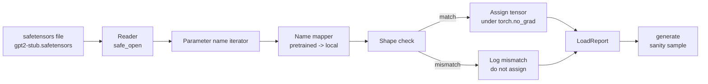

# Önceden Eğitim Almış Ağırlıkları Yüklemek

> 124 milyon parametre modeliyi sıfırdan eğitmek bütçe kararıdır; yayınlanan bir kontrol noktasını yüklemek Salı günüdür. Bu ders, önceden eğitilmiş GPT-2 stil ağırlıklarını bir güvenlik sensör dosyasından 35 dersinden tam mimariye yükler, parametrelerin isimlerini haritasını parça parça yürütür ve akıl gücü yükün çalıştığını kanıtlamak için bir devam oluşturur. Ağ, üçüncü taraf yükleyicileri, bulanık bir büyü yok.

**Type:** Build
**Languages:** Python
**Prerequisites:** Phase 19 lessons 30 to 36
**Time:** ~90 minutes

## Öğrenme Hedefleri

-   ile bir defter dosyasını oku`safetensors`Python kütüphanesi ve tensör isimlerini ve şekillerini kontrol et.
- Her önceden eğitilmiş parametre adını ders 35 GPT modelinin içindeki bir parametreye yerleştirin.
- Yayınlanan GPT-2 ağırlıkları ve bu pistteki model arasında farklı olan iki isim sözleşmesini yönetin: `wte/wpe/h.N.attn.c_attn/c_proj`ve `mlp.c_fc/c_proj`Yerel olarak adlandırılanlara karşı `tok_embed/pos_embed/blocks.N.attn.qkv/out_proj`ve `mlp.fc1/fc2`- Evet .
- Ağırlık atanması olmadan önce şekil eşleşmemesi ile açık bir hatayı tespit edin ve reddedin.
- Yüklü ağırlıklarla kısa bir devam oluşturun ve belirtilerin rastgele başlatılan birinden değil, yüklü dağılımdan geldiğini onaylayın.

## Sorun

Yayınlanan ağırlıklar mimarinize göre paketlenmez.`transformer.h.0.attn.c_attn.weight`şekli ile`(2304, 768)`Modeliniz bekliyor .`blocks.0.attn.qkv.weight`şekli ile`(2304, 768)`(Diğer bir düzenleme kurulunda aynı matris) veya modeliniz kullanır `nn.Linear`Aynı parametrenin üç farklı kimlik (ad, şekil, bayt düzen) ile gösterilmesi ve yükleyici üçü de uyumlandırması gerekir.

Bir yüklemeci körü körü körü doğru tenzoru yanlış yere koyar ve saçmalık üreten bir model elde edersiniz. Şekil farklı olduğunda kopyalamayı reddeden fakat hiçbir şey kaydetmeyen bir yüklemeci hangi tenzorun düşmediğini tahmin etmenizi sağlar. Bu dersdeki yüklemeci açıkça: her görev kaydedilir, her şekil kontrol edilir ve bir`LoadReport`Başarılı olanları okuyabilmeniz için, vurguları, kaçırmaları ve uyumsuzlukları özetler.

## Anlaşım



İsim haritası sadece bir işlevdir. Şekle kontrolü bir if. Görev içeride gerçekleşir `torch.no_grad()`Raporda her isim sonuçları bulunur.

### GPT-2 isimlendirme sözleşmesi

Yayınlanan GPT-2 ağırlıkları şu isimlerle yaşar:

| Pretrained name | Shape | Meaning |
|-----------------|-------|---------|
| `wte.weight` | (50257, 768) | Token embedding |
| `wpe.weight` | (1024, 768) | Position embedding |
| `h.N.ln_1.weight` | (768,) | LayerNorm 1 scale at block N |
| `h.N.ln_1.bias` | (768,) | LayerNorm 1 shift at block N |
| `h.N.attn.c_attn.weight` | (768, 2304) | Fused QKV linear weight |
| `h.N.attn.c_attn.bias` | (2304,) | Fused QKV linear bias |
| `h.N.attn.c_proj.weight` | (768, 768) | Attention output projection |
| `h.N.attn.c_proj.bias` | (768,) | Attention output projection bias |
| `h.N.ln_2.weight` | (768,) | LayerNorm 2 scale |
| `h.N.ln_2.bias` | (768,) | LayerNorm 2 shift |
| `h.N.mlp.c_fc.weight` | (768, 3072) | MLP fc1 weight |
| `h.N.mlp.c_fc.bias` | (3072,) | MLP fc1 bias |
| `h.N.mlp.c_proj.weight` | (3072, 768) | MLP fc2 weight |
| `h.N.mlp.c_proj.bias` | (768,) | MLP fc2 bias |
| `ln_f.weight` | (768,) | Final LayerNorm scale |
| `ln_f.bias` | (768,) | Final LayerNorm shift |

Planlamak için iki sürpriz var.`c_attn`- Evet .`c_proj`- Evet .`c_fc`Linearlar , matrisin ne ile karşılaştırıldığında depolanır `nn.Linear.weight`LM başlığı dosyada hiç bulunmuyor; model ağırlık bağlanmasına dayanıyor `wte`, böylece başı bir kez isimle ayarlanır .`wte`- Ülkeler.

### Yerel isimlendirme kongresi

Bu pistteki model tanımlayıcı isimler kullanıyor:

| Local name | Meaning |
|------------|---------|
| `tok_embed.weight` | Token embedding |
| `pos_embed.weight` | Position embedding |
| `blocks.N.ln1.scale` | LayerNorm 1 scale at block N |
| `blocks.N.ln1.shift` | LayerNorm 1 shift |
| `blocks.N.attn.qkv.weight` | Fused QKV |
| `blocks.N.attn.qkv.bias` | Fused QKV bias |
| `blocks.N.attn.out_proj.weight` | Attention output projection |
| `blocks.N.attn.out_proj.bias` | Output projection bias |
| `blocks.N.ln2.scale` | LayerNorm 2 scale |
| `blocks.N.ln2.shift` | LayerNorm 2 shift |
| `blocks.N.mlp.fc1.weight` | MLP fc1 |
| `blocks.N.mlp.fc1.bias` | MLP fc1 bias |
| `blocks.N.mlp.fc2.weight` | MLP fc2 |
| `blocks.N.mlp.fc2.bias` | MLP fc2 bias |
| `final_ln.scale` | Final LayerNorm scale |
| `final_ln.shift` | Final LayerNorm shift |

Haritalama sabit bir fonksiyon. Ders onu yükleme cihazının tekrarladığı bir dikt olarak gönderir.

### Çubuklar

Gerçek GPT-2 ağırlıkları 0.5 GB'dır. Demo onları indirmemiştir; ilk çalışmada küçük bir güvenlik sensör takımı oluşturur, tam GPT-2 isimlendirme konvensiyonu ve 768 yerine d_model 192'de 12 bloklu bir model için uygun şekiller ile. Takım, yüklemecideki her kod yolunu uygulamak için doğru yapıya sahiptir. Takımı gerçek dosya için değiştirir ve yüklemeci değiştirilmeden çalışır.

```figure
cc-weight-remap
```

## Yapın

`code/main.py`Uygulamaları:

- Dersin küçük bir kopyası 35 `GPTModel`Bu yüzden bu ders kendi kendine kapsamlıdır.
- `make_pretrained_to_local(num_layers)`Bu da katmanlık girişleri genişletiyor.
- `load_safetensors(model, path)`isimleri tekrarlayan, harita yapan, şeklini kontrol eden, conv1d tarzı ağırlıkları transpose eden ve `torch.no_grad()`- Bir `LoadReport`- Evet .
- `make_stub_safetensors(path, cfg)`Bu da, önceden eğitilmiş isimlendirme kuralı ile bir dosya oluşturur.
- Bir demo oluşturur `outputs/gpt2-stub.safetensors`ilk atışta yeni bir model oluşturur, rastgele init'ten üretilen bir devamı yakalar, bir diğer devamı yakalar, her ikisini de yazdırır ve ikisi de farklı olduğunu doğruluyor (koşuş aslında modeli değiştirdi).

Çek şunu:

```bash
python3 code/main.py
```

Çıktı: sabit yol, isim başına yükleme logu, a `LoadReport`Toplam, yükden önce bir devam, yükden sonra bir devam ve kasıtlı olarak kötü bir tensörle birlikte bir form eşleşmemesi, böylece başarısızlık yolu uygulanır.

## Yüküm

- `safetensors`disk biçimi ve akış okuma cihazı için.
- `torch`Model ve görev matematikleri için.
- Hayır .`transformers`Hayır .`huggingface_hub`- Hayır, ağ görüşmeleri yok.

## Doğada üretim biçimleri

Üç örneğe göre yükleme cihazı, sizin yaratmadığınız ağırlıklar ile temas halinde hayatta kalır.

**Always validate the file before any assignment.**Dosyayı açın, her tenzor adını dtipi ve şekli ile listelenin, şekil kontrolleriyle tam haritalamayı çalıştırın ve yalnızca başarıyla tahsis etmeye başlayın.

**Log every assignment with the source name and the destination name.**Bir şey yanlış görünce, kayıt size hangi tenzorun nerede olduğunu söyler; alternatif olarak altı tanelikleri okumaktır.`LoadReport`Bu dersdeki veri sınıfı izleri `loaded`- Evet .`missing`- Evet .`unexpected`ve`shape_mismatch`listeler ve sonunda bir özet basar.

**The LM head is a weight tying alias, not a separate copy.**Yapılandırma`model.lm_head.weight = model.tok_embed.weight`yüklenmeden sonra`tok_embed`Bu, kanonik bir örnektir.`lm_head.weight`Parametre bağlamayı keser ve parameter sayınızı sessizce ikiye katlar.

## Kullan

- Kayıtlayıcı, önceden eğitilmiş isimlendirme kavramını kullanan herhangi bir güvenlik tescileri dosyası için çalışır. Gerçek GPT-2 dosyaları (küçük / orta / büyük / xl) kod değişiklikleri olmadan çalışır; sadece model yapılandırması farklıdır.
- Aynı model, isim haritasını güncellediğinizde LLaMA, Mistral, Qwen ağırlıklarına da uzanır.
- Bir yüklenmeden sonra akıl sağlığı üretimi hızlı bir kapıdır: yüklenmeden sonraki örnekler yüklenmeden önceki örneklere benziyordu, yük modelini değiştirmedi, yani haritalama sessizce her tenzoru kaçırmış oldu.

## Egzersizler

1. Bir ekle`dtype`Her tenzorun hedefli d tipiye atılan yüklemeci için argüman (`bfloat16`- Evet .`float16`- Evet .`float32`Görev sırasında bir onay`float32`model aşağı düşebilir `bfloat16`Ve yine de üretmek.
2. Bir ekle`expected_layers`Bir kontrol noktasını yüklemeyi reddeden bir argüman`h.N`İndeksler modelin göstergelerine uymuyor `num_layers`- Evet .
3. Yüklemeciyi ders 35 jenerasyon fonksiyonuna bağlayın ve iki yan yan örnek oluşturun: bir tanesi rastgele init'ten, bir tanesi yüklü sabitden.
4. Bir ihracat yolu ekleyin: önceden eğitilmiş isimlendirme kavramını kullanarak mevcut model durumunu yeni bir sakatansör dosyasına yazın.
5. Uzaklaştırma`NAME_MAP`LLaMA isimlendirme kuralı (aykırılık yok, RMSNorm, birleşik qkv düzen) ve yüklemeciyi oluşturduğunuz bir LLaMA sabitleme üzerinde yeniden çalıştırmak.

## Anahtar Terimler

| Term | What people say | What it actually means |
|------|-----------------|------------------------|
| Name map | "Key remapping" | The function from pretrained tensor names to local parameter names; usually a literal dict with one entry per layer index expanded over a loop |
| Shape mismatch | "Bad shape" | The pretrained tensor exists under the mapped name but its dimensions disagree with the local parameter; the loader refuses to assign and logs the pair |
| Transpose-on-load | "Conv1d layout" | Published GPT-2 stores attention and MLP projections in the transpose of what nn.Linear expects; the loader transposes during assignment |
| Weight tying alias | "Shared LM head" | Setting model.lm_head.weight = model.tok_embed.weight so the head and embedding share storage; the head is not in the file because of this |
| Load report | "Coverage summary" | A small dataclass that tracks loaded, missing, unexpected, and shape_mismatch lists; printing it is how you tell whether the load succeeded |

## Daha Fazla Okumak

- 19 aşama, ağırlıkları alan mimarlık için ders 35.
- Eğitim döngüsü için 19. aşama ders 36 aynı şekil bir kontrol noktası üretir.
- Faz 10 ders 11 (kvantisa) hafıza sıkıntısı olduğunda yüklü ağırlıklarla ne yapılması gerektiği.
- Eğitim ve sonuçlama etrafında tüm yaşam döngüsü için 10 aşama ders 13 (tam LLM boru hattı oluşturmak).
