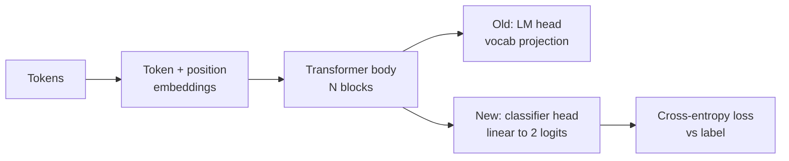
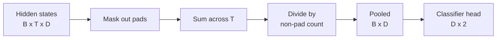
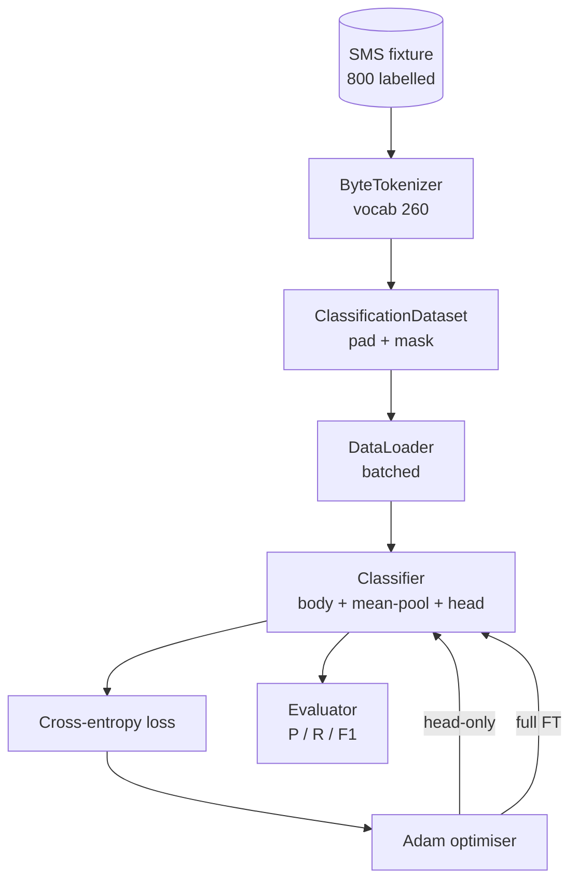

# Capstone Ders 38: Sınıflandırıcı Baş Düzeltme

> B'nin ilk son taşı. Önceden eğitilmiş bir dil modeli, bir işaret-bunuş başında sona eren bir dizi kendine dikkat blokudur. Spam vs. jambon istediğinizde, kafa yanılıyor ama vücut çoğunlukla doğru. Bu ders başını koparır, birleştirilmiş temsil üzerine iki sınıflı bir çizgi katmanı yapıştırır ve sınıflandırıcıyı iki farklı şekilde eğitir: sadece son katman ve tam ince ayarlama. Değerlendirme, doğrulama, hatırlama ve F1'in uzun süren bir bölünme. Her stratejinin size ne kazandırdığını ve ne kadar maliyetini öğrenirsiniz.

**Type:** Build
**Languages:** Python (torch, numpy)
**Prerequisites:** Phase 19 lessons 30-37 (NLP LLM track: tokenizer, embedding table, attention block, transformer body, pre-training loop, checkpointing, generation, perplexity)
**Time:** ~90 minutes

## Öğrenme Hedefleri

- Diller model başını, vücudu yeniden başlatmadan sınıflandırma başıyla değiştirin.
- İki eğitim rejimi uygulanır: dondurulmuş vücut (sadece baş) ve tek bir eğitim döngüsünü paylaşarak tam ince ayarlama.
- Tokeniser'e karşı bilgi hattı oluşturun ki bu da tokenizi kapatır, tokenizi maske eder ve dikkat çıkışını bir araya getirir.
- Bilgisayar doğruluğu, hatırlama, F1 ve çiğ logitlerden karışıklık matrisi.
- Parametre sayımı, eğitim süresi ve baş odası arasındaki anlaşmazlık hakkında bir neden.

## Sorun

Bir küçük transformayı genel bir korpus üzerinde önceden eğitmişsiniz. Çıkış başlığı son gizli durumu 1000 token sözlüküne gönderir. Şimdi spam veya jambon etiketli 800 SMS mesajınız var ve ikili sınıflandırıcı istiyorsunuz. Üç seçenek var.

Yanlış seçenek, yeni bir sınıflandırıcıyı sıfırdan 800 örnek üzerinde eğitmek. Önceden eğitilmiş modelin vücudu zaten kullanışlı bir yapıyı kodlar: kelime kimliği, konum, basit bir eşleşme. Atmak onu yapan hesaplamaları harcamaktadır.

İki doğru seçenek, dondurulmuş vücutla baş değiştirme ve eğitilebilir vücutla baş değiştirme. Sadece baş eğitim hızlıdır, hafıza neredeyse serbest ve nadiren bu küçük veriyle aşırı derecede. Tam ince ayarlama daha yavaş, küçük veri üzerinde fazla uyum sağlayabilir, ancak aşağıdaki alanın eğitim öncesi corpus'tan çekildiğinde daha yüksek doğruluğa ulaşır.

Bu ders her ikisini de oluşturur, böylece onları aynı cihazda karşılaştırabilirsiniz.

## Anlaşım



Modeldeki bir fonksiyon.`f_theta(tokens) -> hidden_states`Baş bir işlevdir .`g_phi(hidden) -> logits`Başları değiştirmek , tutmak demektir .`theta`ve değiştirmek için`g_phi`- Bedenin parametreleri pahalı bir parça.

İki eğitimli parametreler önemli:

- `theta`Dikkat blokuna on binlerce ağırlık.
- `phi`(başını):`hidden_dim * num_classes`Ağırlık artı önyargı.

Sadece baş eğitiminde , `phi`Ve onlara karşı sıfırlayın.`theta`PyTorch bunu ayarlayarak yapmanı sağlar .`requires_grad=False`Optimizer sadece başı görür ve vücut dondurulur.

Tam ince ayarlama sırasında, gradientlerin tüm yığın boyunca geri akmasına izin verilir. Vücut ağırlıkları sınıflandırma hedefine uygun olarak hareket eder. Küçük verileri unutma tehlikesi felaketlidir: vücutın önceden eğitiminin aşırı uygun gürültü ile yıkanması.

## Toplantı Sorusu

Bir sınıflandırıcı için bir sekans için bir vektör gereklidir, bir token için bir vektör değil.

- **Mean pool**: sırada gizli durumların ortalaması, dikkat maskası ile ağırlaştırılmış.
- **CLS pool**Bu, BERT'in yaptığı bir şey.
- **Last-token pool**GPT sınıflandırıcıların yaptığı bu.

Bu ders açık bir dikkat maskası ağırlığı ile ortalama birleştirmeyi kullanır. En basit, dizi uzunluklarında istikrarlı bir sinyal verir ve bir CLS token'ı önceden eğitmeyi gerektirmez.



## Veriler

800 SMS mesajı, 400 spam ve 400 jambon dengelenmiş olarak belirleyici olarak üretilir.`code/main.py`. Generatör sabit bir tohum kullanır, şablonları seçer ve slot doldurmalarını değiştirir ve 5 ila 25 jeton uzunluğundaki mesajlar gönderir. Gerçek veri kümeleri bu cihazın gürültüsüne sahip değildir.

Veriler 80/20: 640 tren, 160 test. Bölümler stratifiye edilir, böylece test kümesi 50/50 dengesini korur. Bilinen dengesi olan bir uzun süren kümesi, hassasiyet ve hatırlamaları dürüst sayı olarak okunabilir.

## Metrikler

1 sınıfı pozitif sınıf olarak ikili sınıflandırma (spam).

- `TP`Önceden tahmin edilen spam, spam.
- `FP`Önceden tahmin edilen spam, jambon.
- `FN`- İsteyen jambon, spam.
- `TN`- Evet. - Evet.

Üç başlık ölçüsü:

- `precision = TP / (TP + FP)`Spam işaretli mesajlardan, ne kadarı var?
- `recall = TP / (TP + FN)`Gerçek spam'in ne kadarını model bayrak yaptı?
- `F1 = 2 * P * R / (P + R)`- İkisinin harmonik ortalaması.

Bir karıştırma matrisi dört sayıyı 2x2 bir şebeke olarak yazdırır.

```figure
cap-classifier-head-swap
```

## Mimarlık



Vücut kasıtlı olarak küçük bir transformatördür: sözcük 260, gizli 64, 4 baş, 2 blok, maksimum dizisi 32.`pretrain_quick`yardımcı, beş dönem LM eğitimini aynı cihazın metnini yapar ve vücuda önemsiz bir başlangıç noktası verir.

## Ne yapacaksın?

Uygulama bir şey.`main.py`Ek olarak bir test modülü (`code/tests/test_main.py`)

1. `ByteTokenizer`: haritalar, baytlar, kimlikler, bir kart kimliği rezervasyonu.
2. `Block`: çok başlı bir dikkat ve ileriye giden bir katman ile bir transformatör blok.
3. `LMBody`: token + position embeddings artı bir blok yığın. Gizli durumları geri verir.
4. `MeanPool`: maske ağırlığındaki sırayla aksanın ortalaması.
5. `Classifier`Vücut, havuz, doğrusal baş. Vücut, rejimler arasında aynı durumdur.
6. `freeze_body`ve `unfreeze_body`: toggle `requires_grad`Vücut parametreleri.
7. `train_classifier`Modelle ve hangi parametreler grubu için yapılandırılmış bir optimizer'i kabul eder.
8. `evaluate`: test setini çalıştırır ve gönderir `Metrics(precision, recall, f1, confusion)`- Evet .
9. `run_demo`: vücudu kısa bir süre önceden eğitir, sonra sadece başla eğitilir ve değerlendirir, sonra da tam, her iki rapor da basar ve sıfırdan çıkır.

## Neden karşılaştırma önemlidir?

Sadece başlı rejim genellikle daha hızlı eğitim alır ve daha zarif bir şekilde daha uygun değildir. Bu cihazda tipik olarak 0.9 yakın bir hassasiyet görürsünüz ve sadece başlı eğitimden yirmi dönem sonra 0.85 yakın bir hatırlama görürsünüz. Tam ince ayarlama yaklaşık üç kat daha uzun sürer ve rastgele tohumdan bağlı olarak her iki şekilde birkaç noktaya kadar yer alır.

Ders bir kazanan seçmez. Sayıları ve maliyetleri okumayı öğretir. 800 örnek ve küçük bir vücut üzerinde, sadece baş doğru bir çağrıdır. 80.000 örnek ve daha büyük bir vücut üzerinde, tam ince ayarlama ödemek başlar. Bu dersten aldığınız sözleşme API: aynı `train_classifier`işlevi her ikisini de ele alır ve anahtar bir çağrıdır.

## Hedefleri belirle

- Bu, bazen kısmi ince ayarlama olarak adlandırılır. Tam FT'den daha az maliyetli ve sadece baştan daha fazlasını öğrenir.
- Başta bir cosine programı ve vücutta daha küçük sabit bir oranı ortak bir üretim ayarıdır.
- Ortalama birleştirmeyi öğrenilmiş bir dikkat havuzuyla değiştirin: küçük bir dikkat katmanı bir öğrenilmiş sorgu ile. Bu genellikle daha uzun dizilerde ortalama birleştirmeyi yener.

Uygulama sana haklar verir, testler sözleşmeyi sabitler, numaralar senin.
