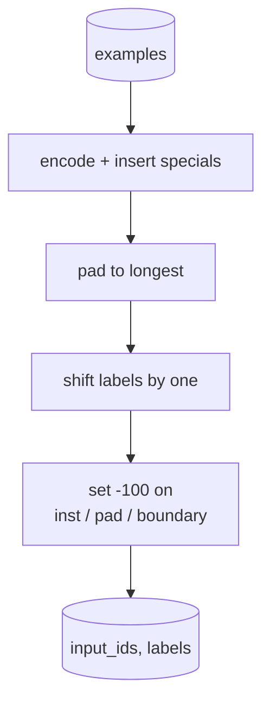
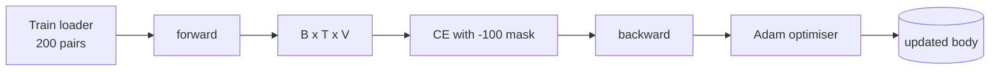

# Capstone Dersi 39: Gözetimli Güzel Düzenleme Yönteminde Öğretim Düzenleme

> Önceden eğitilmiş bir temel model bir diziyi uzatır, ancak bir talimata uymayır. Denetim altındaki ince ayarlama, bunu düzelten en küçük değişikliktir: bir talimat ve istenen bir yanıt örneğini modelle çiftleştirerek besleyin ve vücudun yanıt işaretlerini tahmin etmeyi eğitsin. İşin sırrı, sadece kaybın cevap sayılmasını, talimat sayılmasını istemesi. Bu ders , talimat tokenlerini maskeleyen özel bir collate işlevi ile Alpaca tarzı SFT döngüsü oluşturur .`ignore_index=-100`, 200 talimat- yanıt çiftinde trenler ve tam eşleşme kullanarak bir uzun süreli bölünme üzerinde değerlendirir.

**Type:** Build
**Languages:** Python (torch, numpy)
**Prerequisites:** Phase 19 lessons 30-37 (NLP LLM track: tokenizer, embedding table, attention block, transformer body, pre-training loop, checkpointing, generation, perplexity)
**Time:** ~90 minutes

## Öğrenme Hedefleri

- Çiftli talimat- yanıt verilerini açık sınır belirtileri ile tek bir sebeplik sırasına biçimlendirin.
- Eğitim tokenlerini gizleyen bir collate işlevi oluşturun böylece çapraz entropiy sadece cevap tokenlerini sayır.
- SFT hedefi altında küçük bir transformatör vücudu eğit ve eval metrik hareketini izle.
- Cevap başlangıç sınırına saygı gösteren açgözlülükle ve sıcaklık örneklemesi ile üretilen üretim uygulanmalıdır.
- Yüklenen tamamlamalarda tam eşleşme hesaplama.

## Sorun

Bir sonraki belirti tahminine eğitimli bir temel model, talimatın ne olduğunu bilmiyor.`"What is the capital of France?"`Bu modelin dili var ama format sözleşmesi yoktur.

SFT sözleşmesi bir dizilme şablonu. Her eğitim örneği üç bölge ile tek bir dizine dönüşür:

```text
<INST> What is the capital of France? <RESP> The capital of France is Paris.
```

Sınır simgelerinin eğitim sırasında rezerve edilen özel simgeler olduğunu öğrenir.`<RESP>`Bas modelinin bir sonraki belirtilen hedefi hala geçerlidir; sadece her örneğin bu şekli olan bir korpus üzerinde eğitilir.

Ama bir sıkıntı var. Eğer tüm dizini bir vanilya çapraz entropisi kaybına beslerseniz, modelin talimat işaretlerini de tahmin etmesini eğitmiş olursunuz. talimat verilir. Bu pozisyonlarda sıfır gradient istiyorsunuz.

## Anlaşım


`ignore_index``torch.nn.functional.cross_entropy`- Hedef pozisyonu `ignore_index`PyTorch'daki konvansiyon,`-100`. Collate işlevi iki tenzor oluşturur örneğin: `input_ids`(tam sırası) ve `labels`(Türkiye'nin bir kopyası)`input_ids``-100`)

Model ileri geçiş sırasında tüm dizini görür; dikkat talimata bakabilir. Kayıp sadece cevap işaretlerini sayır. Tam olarak istediğiniz budur: talimatın koşulunu, cevabı tahmin edin.

## Veriler

200 talimat- yanıt çiftleri deterministik olarak üretilir `main.py`Bu görevler altı türü kapsamaktadır:

- Gerçek bir tek çekim (X başlığı)
- aritmetik
- listeler çıkarımı
- Bir cümle özet
- kod (baskı, sıralama)
- tanımlama

Her görev bir şablonlu talimat ve bir belirleyici yanıtına sahiptir. Bu kasten basit. Tam eşleşme kırılgandır ve derste doğru cevabın belirli bir dizilere ait olduğu bir ayar kullanılır. Gerçek SFT veri kümeleri bulanık ölçümlere ihtiyaç duyar; ilke aynıdır.

160 tren, 40 test. Test setinde altı görev türü de kapsamaktadır.

## Tokenizasyon ve Padding

Tokeniser üç özel rezervasyonla bayt seviyesindedir:

- `INST_ID = 256`: talimat bölgesi başlıyor.
- `RESP_ID = 257`: talimat ve yanıt arasındaki sınırı belirler.
- `PAD_ID = 258`: değişken uzunluklu partiler için dolgulama.

Sırası bu.`[INST] inst_bytes [RESP] resp_bytes [PAD]*`. Kolat fonksiyonu:

1. Her örneği simgeledi.
2. Parçadaki her örneği parçadaki en uzun dizine kapatır.
3. Yapı yapılıyor `labels`= `input_ids`Bir (kötüsel LM hedefi) ile değiştirilmiştir:
   - Bu bölge  ile değiştirildi .`-100`- Evet .
   - Dönüşüm bölgesi, `-100`- Evet .
   - - Evet .`RESP_ID`Sınır pozisyonu kendisi `-100`(Modelle sınır işaretini tahmin etmeyi öğretmiyorsunuz; o, sonraki şeyi tahmin ediyor).



Değişiklik standart sebepsal numara: pozisyon.`i``input_ids`konum tahmin eder `i+1`- Evet .`labels[i] = input_ids[i+1]`Maske, doğru konumlara inmek için kaydırıldıktan sonra uygulanır.

## Eğitim



Bu döngü standart PyTorch SFT döngüdür. Adam, bu sabit üzerinde 3e-4 ile 1e-3 arasında öğrenme hızı, on ila yirmi dönem, programlayıcı yoktur.

Her beşinci dönemde döngü, tutulan set üzerinde küçük bir değerlendirme geçişini yapar ve tam eşleşimi basar.

## Nesil

Değerlendirme zamanında model talimat prefiksini alır `[INST] inst_bytes [RESP]`ve her ikisine kadar token üretir:

- Sırada ulaşır `max_len`veya
- Model özel bir durak heuristik gönderir: iki ardılı cümle bitirici bayt (`.`- Evet .`!`- Evet .`?`)

Ders açgözlülükle kodlama ve seçmeli bir sıcaklık örneklemesi ile birlikte çalıştırılır. Tam eşleşme açgözlülük kullanır çünkü sıcaklık metrik stohastıksız hale getirir. Gerçek sistemler genellikle örnek alır, sonra da belirsizce yargılar; bu boru hattı ders 41.

## Tam Uygunluk Değerlendirme

Tam uyum en sıkı metrik metriktir. Önceden tahmin edilen yanıt dizisi normallaştırılır (azı yazısı, çizgi beyaz alan, çöküş çift alanlar) ve referans yanıtla karşılaştırıldığında aynı şekilde normallaştırılır. Metrik ya 1 veya 0 örneğin.

Gerçek SFT boru hattları, simge seviyesindeki F1 (dersi 41) ve yargıç modeli ile tam eşleşmeyi tamamlar. Tam eşleşme belirsiz olduğu için yararlı kalır; 0.7 diyorsa, test talimatlarının tam olarak yüzde 70'i karakter için altın yanıt karakteri üretti.

```figure
cc-sft-loss-mask
```

## Ne yapacaksın?

Uygulama bir şey.`main.py`Ayrıca testler.

1. `InstructionTokenizer`: byte seviyesinde özel özel kodlar. Ya bir talimat prefiksi ya da tam bir çift kodlar.
2. `make_dataset`: sabit bir tohum ile altı görev türü üzerinde 200 çift üretir.
3. `SFTDataset`: geri dönüşler `(input_ids, labels)`Örneğin, zaten maske hazırlanmış.
4. `sft_collate`: dinamik dolgu, parti tensörü oluşturur, setler `-100`talimat ve ped pozisyonları.
5. `TinyGPT`: transformatör vücudu ve bağlı veya çözülmüş LM başı.
6. `train_sft`: SFT döngüsü, per-epoch eval hakları ile.
7. `generate`: açgözlülük veya örneklenmiş bir öntanımdan sebeplik dekod, durma heuristik ile.
8. `exact_match`: normal bir diziler karşılaştırması, geri dönüşler yüzer `[0, 1]`- Evet .
9. `run_demo`: verileri oluşturur, yirmi dönem için trenler, değerlendirir, kategorilerle bir bölünme basar, başarıyla sıfırdan çıkıyor.

## Neden maske önemli?

Maske olmadan, kayıp talimat işaretlerini hedef olarak görür. Model talimatları tahmin etmeyi öğrenir. Bu farklı bir hedef ve iki şekilde daha kötü bir model üretir. İlk olarak, kullanıcı her zaman sağladığı girişleri yeniden yapılandırarak model kapasitesi boşa çıkar. İkincisi, cevap kaybı gradient toplamında daha küçüktür çünkü talimat işaretleri çoğu partide cevap işaretlerinden daha fazla sayıda; optimizeci'nin ilgilendiğiniz kısımdaki etkili öğrenme oranı planladığınızdan daha düşüktür. Maske bir polish değil, amacımız.

## Hedefleri belirle

- Öğrenme hızının ısınmasını ve sonra kosin çöküşünü ekleyin.
- Token başına kayıp kaydı ekleyin ve eğitim boyunca kayıp eğriyi çizin.`<RESP>`, ortak önlükler) ve daha sonraki dönemler gerçek cevap belirtiler tarafından baskın olmuştur.
- BLEU-1 veya chrF'ye kadar değerlendirmeyi uzatın.
- Çok dönüşlü biçimlendirme ile sohbet şablonu ekle ve takipleri içeren bir ayar üzerinde çalış.

Uygulama size biçim sözleşmesi, maske ve döngü verir. Temel modelden talimat takipçisine objektif değişim bir toplama işlevi.
