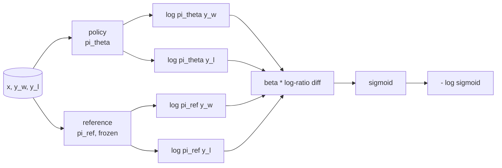
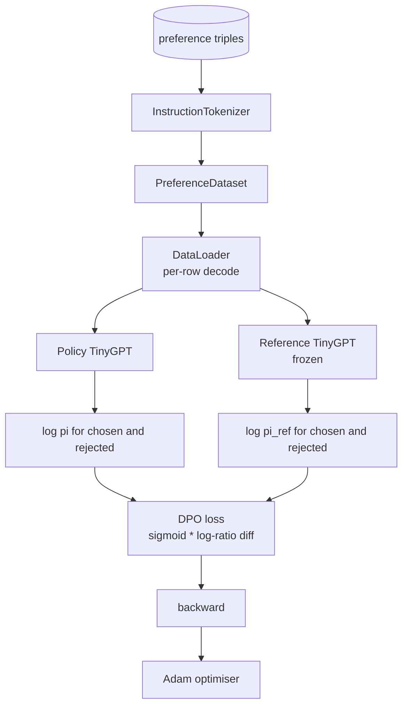

# Capstone Dersi 40: Düzgün Tercihleri Optıma Baştan

> Ödül modelleri ve PPO klasik RLHF yığınıdır. DPO, bu yükü tek bir denetim altında olan bir kayıp olarak düşürür. Bu ders, DPO kaybını ödül farkı kimliğinden çıkarır, çalışma referans modeli ile politika modeli gönderir, her token log- olasılıklarını hesaplar ve seçilen ve reddedilen tamamlamaların tercih ayarına küçük bir transformatörü eğitir. Testler kayıp matematikini ve gradient yönünü belirler böylece uygulamanın kağıda uyuştuğunu bilirsin.

**Type:** Build
**Languages:** Python (torch, numpy)
**Prerequisites:** Phase 19 lessons 30-37 (NLP LLM track: tokenizer, embedding table, attention block, transformer body, pre-training loop, checkpointing, generation, perplexity)
**Time:** ~90 minutes

## Öğrenme Hedefleri

- DPO kaybını bir sigmoid olarak ölçeklenmiş bir log- oran farkı üzerinde çıkarın ve onu içten ödül ile bağlayın.
- Dondurulmuş bir referans ve eğitimlenebilir bir politika ile bir referans modeli + politika modeli çiftini oluşturun.
- Her iki modelde de sırayla seviye log- olasılıklarını hesaplayın, hızlı jetonları gizleyin.
- Politikayı eğit `(prompt, chosen, rejected)`Üç kat daha fazla ve seçilen log-prob'un reddedilenlere göre yükselmesini izle.
- Kayıp matematik, gradient işareti ve referans invariansı üzerinde testlerle pin davranışı.

## Sorun

SFT modeli vardır. talimatları izler, ancak çıkışları eşit değildir; bazı tamamlamalar net, bazıları kelimeci veya yanlışdır. Ayrıca küçük bir tercih çiftleri verisi var: aynı istek için, bir insan bir tamamlamayı seçtiği ve diğerini reddettiği olarak işaretler.

Klasik RLHF cevabı iki aşamalı bir boru hattıdır. Tercihlere göre bir ödül modeli eğit. ödülle karşı politikayi PPO ile optimize edin. Bu çalışır ancak pahalıdır: PPO sırasında hafıza içinde iki model, referansın yakınında politika tutmak için KL kontrolü, ödül modeli kırılgan olduğunda ödül hackleme.

DPO, her iki aşamayı tek bir denetimli kayıpla değiştirir. Ödül modeli asla açıkça yoktur. Politikası doğrudan tercih çiftlerinde eğitimlidir, açık bir KL cezası ile SFT referansı ile. Bradley-Terry tercih modeli altında aynı optimal çözüm, çok daha az kod.

## Anlaşım

Bradley-Terry modelinden başlayalım.`x`Ve iki tamamlama.`y_w`(seçilip) ve `y_l`(Redeni) insan için en iyi olasılık.`y_w`-

```text
P(y_w > y_l | x) = sigmoid( r(x, y_w) - r(x, y_l) )
```

nerede`r`RLHF öncelikle uyumludur.`r`- Bu, bir politika eğitimi.`pi`Maksimumlandırmak için`r`KL demirle:

```text
max_pi   E_{x, y~pi} [ r(x, y) ] - beta * KL(pi || pi_ref)
```

DPO'nun çıkarımı , en iyi politika `pi*`Bu amaç altında, kapalı bir biçimde `r`- ...

```text
pi*(y | x) = (1/Z(x)) * pi_ref(y | x) * exp( r(x, y) / beta )
```

Dönüştürme`r`- ...

```text
r(x, y) = beta * ( log pi*(y | x) - log pi_ref(y | x) ) + beta * log Z(x)
```

- Evet .`log Z(x)`İkisi için de aynı termindir `y_w`ve `y_l`(Bunun üzerine kurulur)`x`- Hayır .`y`), bu yüzden tercih farkını hesapladığınızda iptal edilir:

```text
r(x, y_w) - r(x, y_l) = beta * ( log pi_theta(y_w|x) - log pi_ref(y_w|x)
                                - log pi_theta(y_l|x) + log pi_ref(y_l|x) )
```

Bradley-Terry sigmoid'e yer değiştir ve tercih çiftlerine karşı negatif log olasılığını alın:

```text
L_DPO(theta) = - E_{(x, y_w, y_l)} [
  log sigmoid( beta * ( log pi_theta(y_w|x) - log pi_ref(y_w|x)
                       - log pi_theta(y_l|x) + log pi_ref(y_l|x) ) )
]
```

Bu kayıp. Bu bir tek skalar üzerinde bir sigmoid örneğin, dört log- olasılıklardan hesaplanmıştır. ayrı ödül modeli yoktur.



## Değilme İşareti

Eğitim koşusundan önce akıl sağlığı kontrolü yapın.`log pi_theta(y_w | x)`- ...

```text
d L_DPO / d log pi_theta(y_w | x) = - beta * (1 - sigmoid(z))
```

nerede`z`Bu, herkes için negatif.`z`, yani: politikanın seçilen tamamlama log-probabiliyetini arttırmak kayıpları azaltır.`log pi_theta(y_l | x)`Bu nedenle, bu süreçte, bir süre önce, bir süre önce, bir süre sonra, bir süre sonra, bir süre sonra, bir süre sonra, bir süre sonra, bir süre sonra, bir süre sonra, bir süre sonra, bir süre sonra, bir süre sonra, bir süre sonra, bir süre sonra, bir süre sonra, bir süre sonra, bir süre sonra, bir süre sonra, bir süre sonra, bir süre sonra, bir süre sonra, bir süre sonra, bir süre sonra, bir süre sonra, bir süre sonra, bir süre sonra, bir süre sonra, bir süre sonra, bir süre sonra, bir süre sonra, bir süre sonra, bir süre sonra, bir süre sonra, bir süre sonra, bir süre sonra, bir süre sonra, bir süre sonra, bir süre sonra, bir süre sonra, bir süre sonra, bir süre sonra, bir süre sonra, bir süre sonra, bir süre sonra, bir süre sonra, bir süre sonra, bir süre sonra, bir süre sonra, bir süre sonra, bir süre sonra, bir süre sonra, bir süre sonra, bir süre sonra, bir süre sonra, bir süre sonra, bir süre sonra, bir süre sonra, bir süre sonra, bir süre sonra, bir süre sonra, bir süre sonra, bir süre sonra, bir süre sonra, bir süre sonra, bir süre sonra, bir süre sonra, bir süre sonra, bir süre sonra, bir süre sonra, bir süre sonra, bir sürece bir sürece bir sürece bir sürece, bir sürece, bir sürece, bir sürece bir sürececececececececececececececececececececececececececececececececececececececececececececececececececececececececececececececececececececececececececececececececececececececececececececececececececececececececececececececececececececececececececececececececececececececececececececececececececececececececececececececececececececececececececececececececececececececececececececececececececececece

## Veriler

12 tercih, ders ile birlikte üç katlı bir gemiyle.`(prompt, chosen, rejected)`Seçilen tamamlama kısa ve doğru. reddedilen kelimeler, konuyla ilgili olmayan veya yanlış. Çiftler ders 39 ile aynı görev ailelerini kapsar (başlık, aritmetik, list) bu nedenle SFT tabanından başlayan bir politika makul bir başlangıç noktasına sahiptir.

DPO, üretimde on binlerce çift üzerinde çalışır; burada, nokta, kayıp matematiğinin ve döngünün küçük bir veri kümesi üzerinde sonundan sonuna kadar çalışması ve seçilen karşı reddedilen log-prob boşluğu görünür olarak büyümesidir.

## Referans Değişiklikleri

DPO uygulaması referans modelini dikkatle kullanmalıdır. Referans, yerinde donmuş SFT modelidir.

- Referans parametreleri asla gradient almaz.
- Referans log olasılığı dönemler arasında asla değişmez.
- Politika referans ile aynı ağırlıklardan başlar.`theta`referans ve öğrenilmiş bir güncelleme; politikayı referans kopyası olarak başlatmak iyi tanımlanmış başlangıçtır.)

Uygulama bunları aşağıdaki yollarla zorlar:

- Referansı `torch.no_grad()`Ön geçişleri sırasında.
- Yapılandırma`requires_grad=False`Her referans parametre üzerinde.
- Politikayı oluşturmak `policy.load_state_dict(reference.state_dict())`referans oluşturulduğunda.

```figure
cap-dpo-preference
```

## Mimarlık



Modeldeki TinyGPT'nin 39 dersinde kullanılan aynı modeli vardır (sadece dekodör, sebepli, bayt tokeniser).

## Ne yapacaksın?

Uygulama bir şey.`main.py`Ayrıca testler.

1. `InstructionTokenizer`: byte tokeniser ile `INST`ve `RESP`Özeller, ders 39'ın şekliyle aynı.
2. `TinyGPT`Bu da ders 39'u atladığınızda bile ders kendiliğinden oluşur.
3. `make_preferences`: 12 ' i geri verir `(prompt, chosen, rejected)`Üç kat.
4. `sequence_log_prob`: model, bir önbellek ve bir tamamlama verildiğinde, tamamlama üzerinden bir sonraki belirti log olasılığının toplamını gönderir (önbellek konum katkı yok).
5. `dpo_loss`: dört log- olasılıkları alır ve `beta`, örnek başına kayıp tensörü ve kayıt için içerikli ödül delta'sını gönderir.
6. `train_dpo`: politikası ve referans altında seçilen ve reddedilen log-probları hesaplayan, kayıp uyguladığı ve adımları Adam.
7. `evaluate_margins`: politikası kapsamındaki herhangi bir noktada seçilen ortalama reddedilen kayıt olasılık marjını gönderir.
8. `run_demo`: küçük bir ısınma öncesi trenden referans ve politika oluşturur, ağırlıkları kopyalar, otuz adım için trenler, adım başına kayıp ve marj yazdırırır ve başarıyı sıfırdan çıkarır.

## DPO'nun neden işe yarıyor

DPO, ödül parametreleşmesine kadar, Bradley-Terry tercih modeli altında matematiksel olarak RLHF'ye eşittir.`r(x, y) = beta * (log pi(y|x) - log pi_ref(y|x))`                                                                                                                                                                                                                                                                                                                                                                                                                                                                                                                             `x`Kapalı form politikası açık ödül modeli atlamayı sağlar. KL kısıtlaması yapısal olarak uygulanır:`pi`-`pi_ref`Bu, sigmoid'in doymuş olması ve politika çok ileri gittiğinde gradiyenti dümdüz etmesi anlamına gelir.

## Hedefleri belirle

- Log-probability toplamına uzunluk normallendirme ekleyin: tamamlama uzunluğu ile bölün. Uzunluk önyargısı, modelin mutlak anlamda log-probabiliteleri daha büyük olduğu için daha kısa tamamlamaları tercih ettiği bilinen bir DPO başarısızlık modudur.
- Kayıpın IPO varianını ekleyin: sigmoid + log'u  ile değiştirin`(z - 1)^2`- Düzeltme üzerinde birleştiği bir kıyasla.
- Zor seçilen reddedilen etiket ve bir düz 0.5 arasında bir interpolasyon oluşturan bir etiket-süzleme parametresi ekleyin.
- Referansı daha küçük ve daha ucuz bir modelle değiştirin (bilgi destillasyon lezzeti).

Uygulama size kayıp, referans değişkenliği ve eğitim döngüsünü verir. Matematik dersdir.
