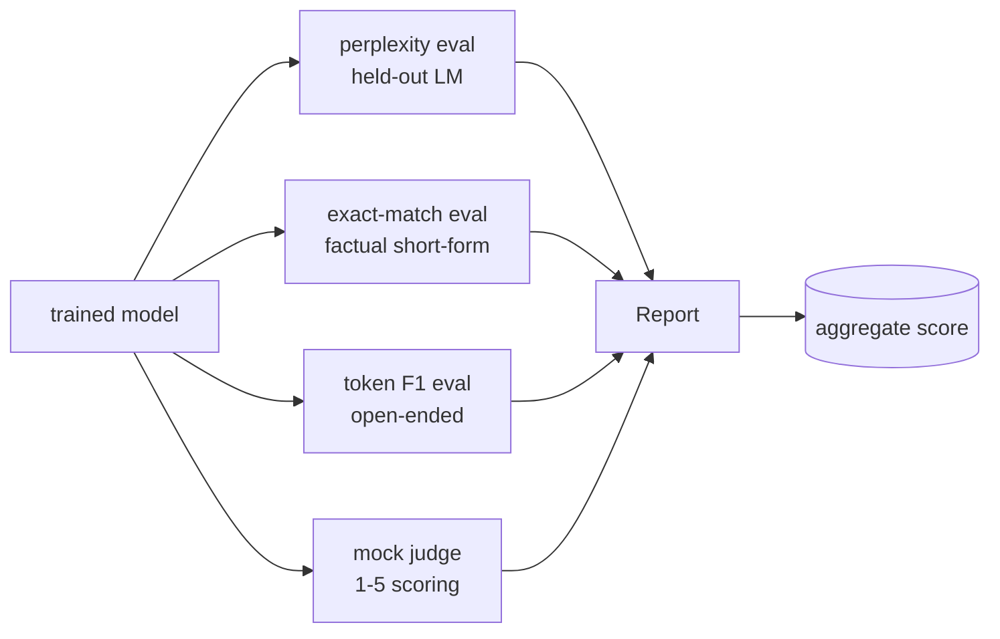
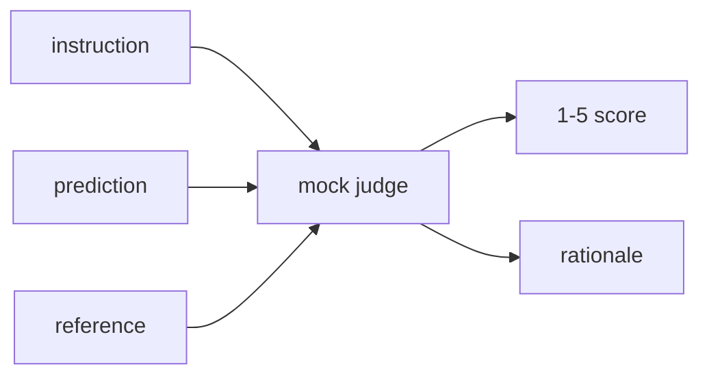
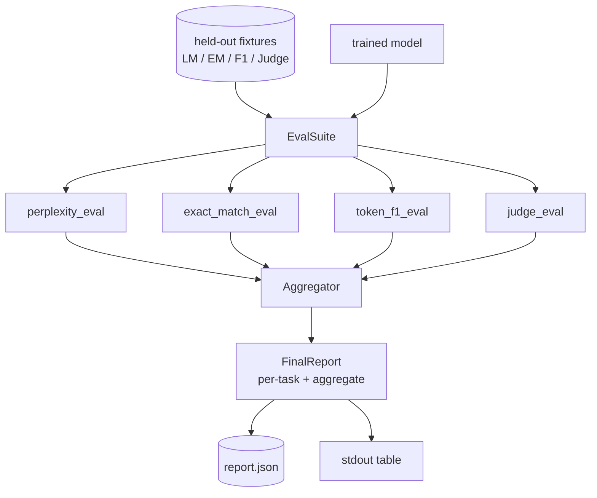

# Capstone Dersi 41: Tam Değerlendirme Kökü

> Eğitim, kayıp eğrilikleriyle izleyebileceğiniz bir bölümdür. Değerlendirme, tasarlaman gereken bir parçası. Bu ders, eğitimli dil modelini alan, dört heterogen değerlendirme yapan, sonuçları bir görev raporuna toplayan ve yerel bir hakim olarak bir LLM simgesel gönderdiği bir değerlendirme borusunu oluşturur. Böylece döngü bir ağ olmadan çalışır. Dört değerlendirme, her nakliye modelinin ihtiyaç duyduğu boyutları kapsar: dil modelleme (kafası karışıklık), kısa biçim doğruluğu (tam eşleşme), açık biçim benzerliği (F1 işaret), ve nitelik puanlaması (hakkim).

**Type:** Build
**Languages:** Python (torch, numpy)
**Prerequisites:** Phase 19 lessons 30-37 (NLP LLM track: tokenizer, embedding table, attention block, transformer body, pre-training loop, checkpointing, generation, perplexity)
**Time:** ~90 minutes

## Öğrenme Hedefleri

- Küçük bir transformatörde maskeli bir simge hesaplaması ile kalıcı karmaşıklığı hesaplayın.
- Kısa bir gerçekliğe uygun bir değerlendirme yapın.
- Normalleşme ile öngörülen ve referans dizileri arasında token seviyesinde F1 hesaplayın.
- 1-5 ölçeğinde model sonuçları notlayan yerel bir hakim olarak LLM yapın.
- Dört değerlendirmeyi tek bir ağırlıklı rapor olarak birleştirin.

## Sorun

Tek bir metrik dil modelini asla tanımlamaz. Kafasızlık, modelin dil dağılımına ne kadar uygun olduğunu söyler ama soruların cevaplandığı konusunda hiçbir şey söylemez. Tam eşleşme, modelin altın ip ürettiğini söyler ama doğru parafrasyeleri cezalandırır. F1 simgesi parafrasi bağışlar ama yanlış içeriğe sahip bir sözcük örtbasıyla kandırılır. Yargıç olarak LLM niteliksel boyutları yakalar ancak pahalı ve stohastiktir.

Bu, bir diğer değerlendirme yapımının bir parçasıdır. Bu değerlendirme yapımının bir diğer değerlendirme yapımının bir parçasıdır. Bu değerlendirme yapımının bir diğer değerlendirme yapımının bir diğer değerlendirme yapımının bir diğer değerlendirme yapımının bir diğer değerlendirme yapımının bir diğer değerlendirme yapımının bir diğer değerlendirme yapımının bir diğer değerlendirme yapımının bir diğer değerlendirme yapımının bir diğer değerlendirme yapımının bir diğer değerlendirme yapımının bir diğer değerlendirme yapımının bir diğer değerlendirme yapımının bir diğer değerlendirme yapımının bir diğer değerlendirme yapımının bir diğer değerlendirme yapımına sahip bir değerlendirme yapımının bir diğer değerlendirme yapımına sahip bir değerlendirme yapımına sahip bir değerlendirme yapımına sahip bir değerlendirme yapımına sahip bir değerlendirme yapımına sahip bir değerlendirme yapımına sahip bir değerlendirme yapım yapımına sahip bir değerlendirme yapım yapımına sahip bir değerlendirme yapım yapımına sahip bir değerlendirme yapım yapımına sahip bir değerlendirme yapım yapım yapımına sahip bir değerlendirme yapım yapım yapımına sahip bir değerlendirme yapım yapım yapım yapım yapabileceğiniz bir değerlendirme yapım yapım yapım yapım yapım yapabileceğiniz bir değerlendirme yapım yapım yapım yapım yapım yapım yapım yapabileceğiniz bir değer değer değer değer değer değerlendirme yapım yapım yapım yapım yapım yapım yapım yapım yapım yapım yapım yapabileceğiniz bir değer değer değer değer değer değer değer değer değer değer değer değer değer değer değer değer değer değer değer değer değer değer değer değer değer değer değer değer değer değer değer değer değer değer değer değer değer değer değer değer değer değer değer değer değer değer değer değer değer değer değer değer değer değer değer değer değer değer değer değer değer değer değer değer değer değer değer değer değer değer değer değer değer değer değer değer değer değer değer değer değer değer değer değer değer değer değer değer değer değer değer değer değer değer değer değer değer değer değer değer değer değer değer değer değer değer değer değer değer değer değer değer değer değer değer değer değer değer değer değer değer değer değer değer değer değer değer değer değer değer değer değer değer değer değer değer değer değer değer değer değer değer değer değer değer

Bu ders, bu boru hattını, sonuna sonuna kadar, tek dosyada inşa eder.

## Anlaşım



Her eval , `(model, dataset) -> EvalResult`Sonuç, ölçüm değerini, örneğe göre denetleme için detayları ve toplamın adını taşır.

## Kafası karışık, doğruca sayılır

Kafası karışık .`exp(mean negative log-likelihood per token)`Uygulama iki tuzağa düşüyor:

- Ortalama, seri * sırası üzerinde değil, gerçek simge pozisyonları üzerinde olmalıdır.
- Modeldeki bir sonraki simgeyi tahmin ediyor, bu yüzden pozisyonunu belirliyor.`i`İşaretleri pozisyonda tahmin et .`i+1`Burada birer hata sessiz: kayıp hala trenler, ama metrik anlamsız hale gelir.

Evaluasyon , bir seri başına `-log p(token)`Bu sayı, sayısal olarak her partiye göre karmaşıklıkların ortalamasından daha güvenli (ki kısa diziler ağırlığı altında) ve ders kitabının tanımına uymaktadır.

## Normalleşme ile tam eşleşme

Harness, tahmin ve referansları karşılaştırmadan önce hem normalleştirir:

- Küçük yazılar.
- Beyaz alanın çevresindeki çizgi.
- İç boşluk çöküşü tek bir boşlukta.
- Arka arkadan giden terminal kesinti (`.`- Evet .`!`- Evet .`?`) iki taraf da sadece noktalama ile farklılık gösterir.

Normalleşme, tam eşleşmeyi pratikte kullanışlı hale getirir.`"Paris"`Doğru, diyor.`"Paris."`Aynı zamanda haklı; diyor ki`"  paris  "`Metrik, normalleşmeden sonra cevapların aynı bir dizilin olması gerektirir.

## F1 simgesi, doğru yolu.

F1 simgesi, simgeler çantası üzerinde hesaplanan hassaslık ve hatırlama armonik ortalamasıdır.

1. Öncüleri ve referansları normalleştir (tıpkı tam eşleşme kuralları gibi).
2. Her birini bir token listesine ayırın (beyaz alan belirtileri).
3. Çoklu kesim sayın.
4. Kesinlik = `intersection_count / len(pred_tokens)`- Hatırlayın = `intersection_count / len(ref_tokens)`F1 = Harmonik ortalama.

Eğer hem tahmin hem de referans boşsa, F1 1 (vacuous match) olur. Eğer sadece bir tane boşsa, F1 0 olur. Bu desen SQuAD değerlendirme referansına uyuyor ve parafrasyelerde sabit sayılar üretir.

## Yerel Sahte Yargıçlık Yüksek Lisansı

Gerçek bir yargıç bir API arkasındaki bir sınır modelidir. Bu ders için yargıç çevrimdışı çalıştırmalı. Sahte yargıç bir belirleyici skorlamacıdır.`{1, 2, 3, 4, 5}`Bir satırlı bir mantık daha.

- 5 normal tahmin normal referans ile eşittir.
- 4 eğer tahmin ve referans arasındaki F1 simgesi en az 0,8 ise.
- 3 eğer F1 simgesi var `[0.5, 0.8)`- Evet .
- 2 eğer F1 simgesi `[0.2, 0.5)`- Evet .
- - Bir tane.

Bu gerçek bir yargıç değil ama doğru bir arayüzü var.



## Toplantı

Toplam, normal değerlendirme puanlarının ağırlanan ortalamasıdır.`[0, 1]`- ...

- Kafası karışık: normalleşir.`1 / (1 + log(perplexity))`1 haritadan 1'e kadar karmaşıklık, sonsuz haritadan 0'a kadar.
- Tam eşleşme: zaten var.`[0, 1]`- Evet .
- F1 simgesi: zaten var `[0, 1]`- Evet .
- Yargıç: beşle bölün.

Ağırlıklar yapılandırılabilir. Öntanımlı karışım 0.2 karmaşıklık, 0.3 tam eşleşme, 0.3 simge F1, 0.2 yargıç. Ağırlıkların seçimi bir ürün kararıdır; dersi düğmeyi ortaya çıkarır, böylece deney yapabilirsiniz.

```figure
cg-eval-quadrant
```

## Mimarlık



- Evet .`EvalSuite`Her bireysel değerlendirme, bir ücretsiz fonksiyon.`(model, tokenizer, dataset, config)`ve bir `EvalResult`- Ne ?`Aggregator`Bu, sonuçları toplar ve son raporu üretir. Demo tabloyu yazdırır ve aşağıdaki CI'nin yuttuğu JSON kopyasını yazar.

## Ne yapacaksın?

Uygulama bir şey.`main.py`Ayrıca testler.

1. `TinyGPT`: 38-40 derslerinde kullanılan aynı dekoderli mimarlık dahil, böylece ders kendi başına duruyor.
2. `InstructionTokenizer`: INST / RESP / PAD özel özellikleri ile bayt tokenizer.
3. Dört cihaz: LM corpus, EM set, F1 set ve bir yargıç set.
4. `perplexity_eval`: geri dönüşler `EvalResult`Kafası karışıklık değerini ve bir token başına kayıp histogramını gösterir.
5. `exact_match_eval`: geri dönüşler EM ortalama ve örnek kayıtları.
6. `token_f1_eval`: F1 simgesi ortalama ve örnek kayıtları gönderir.
7. `mock_judge`ve `judge_eval`: örnek başına puan ve mantık, toplamda ortalama puan.
8. `Aggregator.normalise`: her yıl normalleşme kuralları.
9. `Aggregator.aggregate`: ağırlıklı ortalama ve toplanmış rapor.
10. `run_demo`: kısaca küçük bir model eğitir, dört değerlendirmeyi de yürütür, rapor tablosunu yazdırır ve JSON'u yazar, başarıyla sıfırdan çıkıyor.

## Rapor okuyuyor

Rapor üç katmanlı. Üst kısmı toplam puan. Alt tarafta dört değer değerli rakamlar bulunur. Alt tarafta teşhis için örnekler için ayrıntılar bulunur. Başarısız bir CI çalışması genellikle toplamı istiyor, ancak gerileme peşinde olan bir inceleyicinin modelin hangi girişleri yanlış yaptığını görmek için örnekler için ayrıntılar olmasını istiyor.

JSON atma makinesi, sabit anahtarlar kullanır, böylece bir CI arac tablosu, sürümler arasında trend çizgilerini çizer.

## Hedefleri belirle

- Kalibrasyon değerlendirmesini ekleyin: modelin softmax olasılığı doğruluğuna eşleşir mi?
- Güç değerini ekleyin: Her örneği bir rahatsızlık ile etiketleyin (tip, parafrase, dikkat dağıtıcı) ve her rahatsızlık için metrik düşüş rapor edin.
- HTTP çağrısı arkasındaki gerçek bir modelle sahte yargıçı değiştirin.
- Görev başına ağırlık öğrenimi ekleyin: sabit ağırlıkların yerine, modellere göre hedef tercih sırasına ağırlıkları uygulayın.

Uygulama size dört değerlendirme, bir toplamlayıcı ve rapor verir. Gerçek değerlendirme boruları üstte daha fazla boyut katıyor; örneği aynı kalıyor: değerlendirme başına bir işlev, bir toplamlayıcı, bir rapor.
