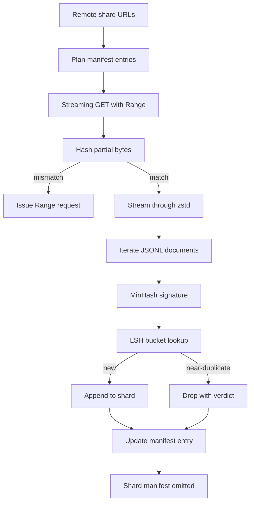

# Büyük Corpus Downloader

> Dil modelini eğitmek ilk ileri geçişten çok önce başlar. Corpus diskte yerleşmek zorunda, sıkıştırılmış, kopyalanmış ve adreslenebilir, ve kurulum hikayesi ağın yüzde 4 düşmeden önce hazırlanmıştır. Bu ders, sıkıştırılmış parçaları çeken, Zstandard ile uçan şekilde sıkıştırılan, MinHash ve yerellikle hasselenen hashing aracılığıyla neredeyse kopyalanan parmak izi olan ve boru hattının geri kalanının güvenebileceği bir parça manifestoyu yazacak bir akış indiricisi oluşturur.

**Type:** Build
**Languages:** Python
**Prerequisites:** Phase 19 lessons 30-37
**Time:** ~90 minutes

## Öğrenme Hedefleri

- Uzak parçaları  ile akışlat`urllib`ve  ile dekompresyon`zstandard`Tüm dosyayı hafızaya buffer yapmadan.
- HTTP ile kısmi indirmeyi yeniden başlat `Range`doğrulanmış bayt taksitine karşı talepler.
- Her belgeye bir MinHash imzası yapın ve LSH ile bucket yapın ki neredeyse kopyalılar çarpışsın.
- İçeriğin hash, bayt boyutu, belge sayısı ve dedup hükümü ile bir parça manifesti yayınlayın.

## Sorun

İlk kez 200 GB bir corpus üzerinde eğitim verdiğinde ağ % 41 düşer ve senaryo bir `urllib`Ancak, bu durumun birincisi, birincisi, birincisi, birincisi, birincisi, birincisi, birincisi, birincisi, birincisi, birincisi, birincisi, birincisi, birincisi, birincisi, birincisi, birincisi, birincisi, birincisi, birincisi, birincisi, birincisi, birincisi, birincisi, birincisi, birincisi, birincisi, birincisi, birincisi, birincisi, birincisi, birincisi, birincisi, birincisi, birincisi, birincisi, birincisi, birincisi, birincisi, birincisi, birincisi, birincisi, birincisi, birincisi, birincisi, birincisi, birincisi, birincisi, birincisi, birincisi, birincisi, birincisi, birincisi, birincisi, birincisi, birincisi, birincisi, birincisi, birincisi, birincisi, birincisi, birincisi, birincisi, birincisi, birincisi, birincisi, birincisi, birincisi, birincisi, birincisi, birincisi, birincisi, birincisi, birincisi, birincisi, birincisi, birincisi, birincisi, birincisi, birincisi, birincisi, birincisi, birincisi, birincisi, birincisi, birincisi, birincisi, birincisi, birincisi, birincisi, birincisi, birincisi, birincisi, birincisi, birincisi, birincisi, birincisi, birincisi, birincisi, birincisi, birincisi, birincisi, birincisi, birincisi, birincisi, birincisi, birincisi, birincisi, birincisi, birincisi, birincisi, birincisi, birincisi, birincisi, birincisi, birincisi, birincisi, birincisi, birincisi, birincisi, birincisi, birincisi, birincisi, birincisi, birincisi, birincisi, birincisi, bir`requests.get`Dişleri büyüyenler.

Resume bir HTTP sorunu.`Range`Bu işlemden sonra, verifiye edilmiş verifiye edilmiş verifiye edilmiş verifiye edilmiş verifiye edilmiş verifiye edilmiş verifiye edilmiş verifiye edilmiş verifiye edilmiş verifiye edilmiş verifiye edilmiş verifiye edilmiş verifiye edilmiş verifiye edilmiş verifiye edilmiş verifiye edilmiş verifiye edilmiş verifiye edilmiş verifiye edilmiş verifiye edilmiş verifiye edilmiş verifiye edilmiş verifiye edilmiş verifiye edilmiş verifiye edilmiş verifiye edilmiş verifiye edilmiş verifiye edilmiş verifiye edilmiş verifiye edilmiş verifiye edilmiş verifiye edilmiş verifiye edilmiş verifiye edilmiş verifiye edilmiş verifiye edilmiş verifiye edilmiş verifiye edilmiş verifiye edilmiş verifiye edilmiş verifiye edilmiş verifiye edilmiş verifiye edilmiş verifiye edilmiş verifiye edilmiş verifiye edilmiş verifiye edilmiş verifiye edilmiş verifiye edilmiş verifiye edilmiş verifiye edilmiş verifiye edilmiş verifiye edilmiş verifiye edilmiş verifiye edilmiş verifiye edilmiş verifiye edilmiş verifiye edilmiş verifiye edilmiş verifiye edilmiş verifiye edilmiş verifiye edilmiş verifiye edilmiş verifiye edilmiş verifiye edilmiş verifiye edilmiş verifiye edilmiş verifiye edilmiş verifiye edilmiş verifiye edilmiş verifiye edilmiş verifiye edilmiş verifiye edilmiş verifiye edilmiş verifiye edilmiş verifiye edilmiş verifiye edilmiş verifiye edilmiş verifiye edilmiş verifiye edilmiş verifiye edilmiş verifiye edilmiş verifiye edilmiş verifiye edilmiş verifiye edilmiş verifiye edilmiş verifiye edilmiş verifiye edilmiş verifiye edilmiş verifiye edilmiş verifiye edilmiş verifiye edilmiş verifiye edilmiş verifiye edilmiş verifiye edilmiş verifiye edilmiş verifiye edilmiş verifiye edilmiş verifiye edilmiş verifiye edilmiş verifiye edilmiş verifiye edilmiş verifiye edilmiş verifiye edilmiş verifiye edilmiş verifiye edilmiş verifiye edilmiş verifiye edilmiş verifiye edilmiş verifiye edilmiş verifiye edilmiş verifiye edilmiş verifiye edilmiş verifiye edilmiş verifiye edilmiş verifiye edilmiş verifiye edilmiş verifiye edilmiş verifiye edilmiş verifiye edilmiş verifiye edilmiş verifiye edilmiş verifiye edilmiş verifiye edilmiş verifiye edilmiş verifiye edilmiş veri

Deduplik bir imza sorunu. Exact-hash dedup neredeyse kopyaları kaçırır: Aynı Wikipedia makalesi üç farklı kayalık ayakkabı ile, farklı bir lisans başlığı ile aynı kod dosyası, her bağlantıda izleme parametresi olan aynı blog yazısı ile görünür. MinHash artı LSH bunları alt çizgiden maliyetle yakalar.

## Anlaşım



### Akışta `urllib`

Standart kütüphanesi .`urllib.request.urlopen`Dosya benzeri bir nesneyi gönderir.`zstandard.ZstdDecompressor().stream_reader`Bu işlemler, bir süre önce, bir bilgisayarın bir bilgisayarı ile birlikte, bir bilgisayarın bir bilgisayarı ile birlikte, bir bilgisayarın bir bilgisayarı ile birlikte, bir bilgisayarın bir bilgisayarı ile birlikte, bir bilgisayarın bir bilgisayarı ile birlikte, bir bilgisayarın bir bilgisayarı ile birlikte, bir bilgisayarın bir bilgisayarı ile birlikte, bir bilgisayarın bir bilgisayarı ile birlikte, bir bilgisayarın bir bilgisayarı ile birlikte, bir bilgisayarın bir bilgisayarı ile birlikte, bir bilgisayarın bir bilgisayarı ile birlikte, bir bilgisayarın bir bilgisayarı ile birlikte, bir bilgisayarın bir bilgisayarı ile birlikte, bir bilgisayarın bir bilgisayarı ile birlikte, bir bilgisayarın bir bilgisayarın bir bilgisayarı ile birlikte, bir bilgisayarın bir bilgisayarın bir bilgisayarın bir bilgisayarın bir bilgisayarı ile birlikte, bir bilgisayarın bir bilgisayarın bir bilgisayarın bir bilgisayarın bir bilgisayarın bir bilgisayarın bir bilgisayarın bir bilgisayarın bir bilgisayarı ile birlikte, bir bilgisayarın bir bilgisayarın bir bilgisayarın bir bilgisayarın bir bilgisayarın bir bilgisayarın bir bilgisayarın bir bilgisayarın bir bilgisayarın bir bilgisayarın bir bilgisayarı ile bir bilgisayarın bir bilgisayarın bir bilgisayarın bir bilgisayarın bir bilgisayarın bir bilgisayarın bir bilgisayarın bir bilgisayarın bir bilgisayarın bir bilgisayarına geçirdi.

### Başvuru:`Range`

İndiricisi her parça için iki dosya yazar: parça kendisi ve bir `.partial.json`Kontrol noktası, kontrol noktası kayıtları.`verified_bytes`- Evet .`expected_size`- Evet .`sha256_prefix`(İlk sayfada hesaplanmıştır `verified_bytes`Başlatıldığında indirimci kontrol noktasını okuyor, yeniden hesaplar `sha256_prefix`Disk üzerinde olan baytlar üzerinde, ve yeniden hesaplanan hash eşleşirse yeniden başlar. Eğer hash yanlış ise kısmi atılır ve indirme sıfır bayttan yeniden başlar. Sessiz bozukluk mümkün değildir çünkü doğrulanmış baytlar kontrol edilir, varsayılmıyor.

### MinHash artı LSH

MinHash, sabit alanlarda iki setin Jaccard benzerliğini tahmin eder.Bir belge için, bir set metnin şindlesidir (tıpkı n-gramlar üst üstlenir). İmza `k`En az bir hash değeri, bağımsız bir hash fonksiyonu başına bir.`s`- Bir olasılık var .`s`İmzanın herhangi bir bileşenini kabul etmek.

LSH sonra `k``b``r`her bir sırada, nerede `k = b * r`İki belge en az bir bantta çarpışır .`1 - (1 - s^r)^b`, bu da `s`Sen sesini dinle .`(b, r)`Tipik bir corpus dedup için eşiği `s = 0.8`, LSH araştırma literatürü tarafından ulaştırılıyor.`k = 128`- Evet .`b = 32`- Evet .`r = 4`- Evet .

### Sözleşme olarak parçacık manifesto

İndiricinin tek dayanıklı çıkışı, manifesto. Manifeste, her parçacık için URL, sıkıştırılmış bayt sayısı, belge sayısı, dedup sonrası eşsiz belge sayısı ve son parçacık dosyasının sha256'sı bulunmaktadır. Aşağıdaki tokenizasyon, listelenme listesi değil, manifesti okuyor. Eğer bir parçacık eksikse veya şekli256 yanlışsa, manifesto, sonraki aşamaya başlamayı reddetmesini söyler. Manifesto, "veriler indirilmiş" ve "veriler indirilmiş ve doğrulanabilir" arasındaki belirleyici kenardır.

```figure
cap-corpus-downloader
```

## Yapın

`code/main.py`Uygulamaları:

- `ShardPlanner`- parçacık URL listesi okuyor ve planlanmış manifest girişlerini oluşturur.
- `StreamingDownloader`- bir açar `urllib`Seçeneği olan akış `Range`, geçici bir dosyaya yazıyor, `.partial.json`Her parçada kontrol noktası ve CV'deki Sha256 önlüğünü doğrulayın.
- `ZstdDocIterator`- dosya benzeri akışı içine sarar `zstandard.ZstdDecompressor`ve her satırda bir belge verir.
- `MinHasher`- bir `k`- sabit bir hash tohumları ailesini kullanan bir ip için bileşen imzası.
- `LSHIndex`- Çekilen imzaları ve çarpışmalar raporları.
- `Dedup`- her belgeyi etiketlemek için hasher ve indeks kombinasyonu `keep`veya `near_duplicate`Eşleşen parça kimliği ile birlikte.
- `ManifestWriter`- her payı istatistik toplar ve yazar `manifest.json`- Evet .

Dosyanın altındaki bir demo, küçük bir sentetik corpus oluşturur diske,`zstandard`, bir `file://`URL, kopyasını kopyalanır ve manifesti basar.

Çek şunu:

```bash
python3 code/main.py
```

Senaryo sıfırdan çıkıp açık bir özet basıyor.

## Üretim Şekilleri

Dört örnektir bu dersi gerçek korporaya kadar ölçeklendirirler.

**Checkpoint before write.**- Evet .`.partial.json`Olmalı .`fsync`-ed bytes parçacıklara eklenmeden önce. Aksi takdirde bir güç kaybı sırayı tersine çevirir: disk üzerinde parçacık bytes, kontrol noktası olmadan, bir sonraki özetleme daha az doğrulanmış bytes olduğunu düşünüyor, ikili ek bytes dosyayı bozar.

**Sharded LSH index.**Tüm corpus üzerinde tek bir LSH endeksi 200 GB ölçeğinde RAM'e uymuyor. LSH endeksini ilk bant haş ile bölün, diskte bölümleri saklayın ve yalnızca yeni bir imza yerleşecek olan partisiyonu kontrol edin.

**Tombstone, not delete.**Kaybedilen kopyalar , kararla birlikte belgeye kaydedilmiştir .`near_duplicate`Bu yüzden, bu sayede, bir veriyi kaydetmek ve bir veriyi kaydetmek, bir veriyi kaydetmek için bir veriyi kaydetmek, bir veriyi kaydetmek ve bir veriyi kaydetmek için bir veriyi kaydetmek.

**Per-shard sha256 in the manifest, plus a manifest sha256.**Manifesto'nun kendisi bir içerik hash alır. Aşağıdaki aşamalar, her parçacık girişlerine güvenmeden önce manifest hashini doğruluyor. Bu olmadan manifesto sessiz saldırı yüzeyidir: tek bir dosyayı düzenleyebilen bir saldırgan tüm boru hattını bozabilir.

## Kullan

Üretim biçimleri:

- **Resume on every CI run.**İK çalıştırıcıları geçici, indiriciler her çalıştırma sırasında yeni bir disk almalı ve önbellekten veya uzaktan kurtarmalıdır.`--cache-dir`Birinci sınıf bayrak.
- **Dedup before tokenization.**Tokenizasyon pahalı. Aynı belge üzerinde iki kez çalıştırmak aynı kayıp eğri için iki kat daha pahalıdır. Dedup tokenizasyonun akışında, akışta değil.
- **Manifest as merge gate.**Eğitim çalışması, bir sabit commit'den manifest sha256'yi okuyor. Yeni bir veri kümesi sürümünde yeni manifest commit gerekmektedir.

## Gönder

`outputs/skill-corpus-downloader.md`Gerçek bir proje üzerinde, indiren kişiyi hangi URL'ler tarafından besleniyor, kontrol noktaları dizini nasıl düzenlenmektedir, hangi şingle genişliği ve `(k, b, r)`Bu ders motorun gemisini taşıyor.

## Egzersizler

1. Bir ekle`--shingle-width`Fırtına ve ölçüm dedup hüküm genişliklerinde nasıl değişiyor 3, 5, 9. Seçilen özelleştirme savunmak.
2. Zstd'nin yanında sihirli baytları koklayarak gzip desteğini ekleyin.
3. Bir ekle`--resume-only`Bir çalışmanın 200 GB'yi kazara yeniden çekmesini önlemek için kullanışlı bir CI.
4. LSH indeksini raf veya sqlite dosyasına taşı ve akılda bulunan variansı karşılıksızlık ölç.
5. Açılışta sha256 kontrolü bir manifesto ekleyin. Disk üzerindeki manifesto, manifesto hash ile aynı fikirde değilse indiricisi kapanmamalıdır `manifest.lock`- Evet .

## Anahtar Terimler

| Term | What people say | What it actually means |
|------|-----------------|------------------------|
| Shard | "A file" | A self-contained slice of the corpus with its own sha256, used as the unit of resume and dedup |
| MinHash signature | "Fingerprint" | A `k`-component sketch of a set, where each component is the minimum of one independent hash over the set |
| LSH band | "Bucket" | A group of `r` signature components used as a single bucket key for collision detection |
| Verified bytes | "Resume offset" | Bytes on disk whose sha256 prefix matches the checkpoint; the only safe offset to resume from |
| Manifest | "The index" | The single durable record of what the downloader produced, including content hashes |

## Daha Fazla Okumak

- [RFC 7233](https://datatracker.ietf.org/doc/html/rfc7233)- HTTP Aralık istekleri, devam protokolü
- [Zstandard format specification](https://datatracker.ietf.org/doc/html/rfc8478)- Akışlı sıkıştırmayı güvenli hale getiren çerçeve biçimi
- [MinHash](https://en.wikipedia.org/wiki/MinHash)- bu ders kullanan imza ailesi
- [Locality-sensitive hashing](https://en.wikipedia.org/wiki/Locality-sensitive_hashing)- eksiklik eşiğinin arkasındaki gruplama sistemi
- 19 · 43 aşaması - HDF5 tokenize corpus indiricisi besliyor
- 19 · 44 aşaması - korpus üzerinde çalışacak kosinus programı
- 19 · 45 aşaması - programı tüketen AMP döngüsü
