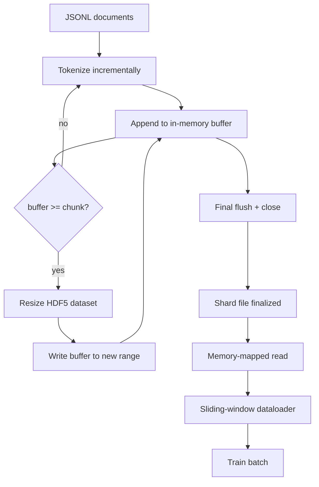

# HDF5 Tokenized Corpus

> İndirilen corpus, eğitmenin çizgi hızında akışabileceği bir düzene sahip olmalı. Diskte JSONL 16 veri yüklemeci işçiyi hayatta tutmuyor. HDF5'in boyutlandırılabilir, parçalanmış tam sayı verisi var. Bu ders, akışlı bir HDF5 veri kümesine akışlı bir tokenize oluşturur, birden fazla dosya üzerinde parçalara ayrılmış yazılar, eğitim sırasında hafıza haritası ile okunur ve doğru paketle sabit uzunluklı diziler üreten kaydırıcı bir pencere veri yükleyicisi.

**Type:** Build
**Languages:** Python
**Prerequisites:** Phase 19 lessons 30-37
**Time:** ~90 minutes

## Öğrenme Hedefleri

- Belgeler, deterministik parçalanma ile boyutlandırılabilir HDF5 tam sayı verisi setiye akışır.
- Yazıyı birden fazla HDF5 dosyasına parçalayın, böylece hata sınırlıdır ve paralellik mümkündür.
- HDF5'in sayfa kaşesi desteklenen parçalara ayrılmış düzeninden tokenleri okuyun böylece veri yükleyicisi sadece seri zamanında seri tamponlarına kopyalar.
- Açık bir paketleme kuralları ile sabit uzunluklı eğitim dizilerini yayınlayan kaydırıcı pencerenin bir veri yükleyicisi uygulanmalıdır.

## Sorun

Modern dil model eğitim programı, saniyede yüz binlerce numune ile düzinelerce işçi için simgeler okuyor. Diskte JSONL ilk soğuk saklama sayfası hatası sırasında ölür: JSON tarayıcı yavaş, belge sınırları adreslenebilir değildir ve "4,217,884" örneğini aramak için dosyayı tarama gerekir. Parquet bile iyi sıkıştırılır, çünkü antrenör sütun istemez; O(1) rastgele erişimle düz bir token akışı ister.

HDF5, kısımlı, boyutlandırılabilir, sadece sayfaları depolama dostu olan bir veri kümesi sunar.`tokens[3,200,000 : 3,200,8192]`HDF5 ve HDF5 talep edilen hiperlabı sayfa önbelleğinden yeni tahsis edilen NumPy dizisine kopyalar.

Yapım sorunu yazma tarafını dürüst kılmak. Ölçülebilir veri kümeleri kötüye kullanımı kolaydır: bir seferde bir belge yazın ve HDF5 dosyası kullanılamaz bir noktaya kadar parçalanır. Tüm belgeleri tek boyutta yaz ve bir süreç ölümü tüm parçayı kaybeder. Doğru disiplin, tampon-sonra-genişleme, parça boyutuna eşleşen bir tampon boyutu ve parça yazısı ile dosyalara iş yükünü bölüyor, böylece bir çöküş en fazla bir parça kaybeder.

## Anlaşım



### Ölçülebilir HDF5 doğru yapıldı

İşaret verileri  ile oluşturulur.`maxshape=(None,)`Ve sabit bir `chunks=(chunk_size,)`. NumPy uzunluk aralığında tokenleri tamponlayarak gelir yazmak `chunk_size`Bufer doldurulduğunda veri kümesi tam olarak `chunk_size`Bu arada, bufer, yeni aralıkta yazılır. Bölümün sonunda kalan tampon son kısmi aralıkta yazılır.`token_count`Çizgiliklerin HDF5 özelliklerinde.

### Parçalama yazısı

Tek bir HDF5 dosyası tek bir başarısızlık noktasıdır. Kök hattı paralel olarak parçalar yazar: Fase 19 dersinden her giriş parça 42'den bir HDF5 çıkış parça üretir.`shards.json`İndeks kayıtları, parça başına, dosya yolu, simge sayısı, belge sayısı ve simgeler üzerinde sha256'sı.`shards.json`Küresel tazminatları hesaplamak ve corpus'u onaylamak için.

### Hatıra haritası okuyucu

Eğitim sırasında her işçi HDF5 dosyalarının payını açar.`swmr=True`mod ve sorular `tokens[start:stop]`HDF5'in parça düzenlemesi, parça sıcak olduğunda bu sayfayı bir kez daha önbelleğe alır. İşçi asla tüm dosyayı gerçekleştirilemez: parça veri yükleyici'nin parti tamponuya kopyalanır, ardından veri yükleyici, seri zamanında sabit bir hafıza eğitim tensörüne kopyalanır. Hot Path'in her parça geçiş için bir sistem çağrısı vardır; geri kalan her şey RAM erişimi.

### Çekilme penceresi veri yükleyici

Veriler yükleyici, eğitim sekansının uzunluğunu bilen tek aşamadır.`window_size + 1`Tokenler ve geri dönüşler `(input, target) = (tokens[:-1], tokens[1:])`. Belge sınırları uygulanmaz: bir pencerede açık bir şekilde iki belgeye yerleştirilebilir.`boundary_token_id`Bu standart paketleme kuralıdır; aynı zamanda bir yeni başlayanın unuttuğu kuralıdır ve sonunda bir korpus oluşur.

```figure
cc-hdf5-corpus
```

## Yapın

`code/main.py`Uygulamaları:

- `Tokenizer`- bir bayt seviyesinde belirleyici simgesi gösterim için yeterli.`encode(text) -> list[int]`ve `vocab_size`- Evet .
- `HDF5ShardWriter`- boyutlandırılabilir tam sayı verisi seti açar, tokenleri parça boyutuna kadar tamponlar, boyutlarını değiştirir ve sabit boyutlu adımlar olarak yazar, kayıtlar `token_count`ve `sha256`HDF5 özellikleri gibi yakın.
- `ShardedTokenizationPipeline`- giriş belgeleri tekrarlar, yazarı yönlendirir ve bir `shards.json`İndeks.
- `MmapTokenStore`- hafıza haritası okuyucular için parçacık dosyalarını açar, küresel sıfırlamaları hesaplar, tek bir `get_slice(start, stop)`- API.
- `SlidingWindowDataloader`- küresel akıştan rastgele pencereler seçer ve verileri verir `(input_ids, target_ids)`NumPy dizileri.

Dosyanın altındaki bir demo, küçük bir hafıza korpusunu oluşturur, iki parçaya ayırır, onları hafıza haritası üzerinden açar, veriler yüklemeciyi 10 parti için çalıştırır ve her parti şekli ve bir çek sumasını basar.

Çek şunu:

```bash
python3 code/main.py
```

Senaryo sıfırdan çıkıyor ve seri çek toplamlarını basıyor.

## Üretim Şekilleri

Dört örnektir bu dersi gerçek bir eğitim koşusu haline getirmek.

**Chunk size equals the typical read.**Eğitmen okuyor .`window_size + 1`HDF5 parçacığını bir katı olarak ayarlayın `window_size`Bu sayfalar, sayfa-cache sırasıyla uyumlu değil.

**Token count in attributes, not in the dataset.**Veriler kümesinin arka kesimi kısmen dolu olabilir çünkü parça boyutu belge sınırını bölmüyor.`token_count`Bu durumun ardından, okumacı sıfır tokenlere doğru ilerler ve model sıfır tahmin etmeyi öğrenir.

**Sharded sha256 with parallel verification.**Her parçacıkın simge baytları üzerinde kendi sha256'sı vardır. Eğitmen eğitim başlamadan önce tüm parçacıkları paralel olarak doğrulayabilir. Yanlış sha256 16 saat sonra üç dönemde değil, erken koşmada başarısız olur.

**`swmr=True` on both sides, with `libver="latest"` on the writer.**Tek Yazar- Çoklu Okuyucu modunda yazarın açmasını gerektirir `libver="latest"`, her veri kümesini önceden oluşturup sonra ayarlayın `file.swmr_mode = True`Sonra yazar aramalı .`dataset.flush()`her boyut değişiminden sonra okuyucu işçiler (açılı `swmr=True`) tutarlı verileri gör.`libver="latest"`veya yapısal değişikliklerden sonra SWMR'i etkinleştirmek, "dosya kilitlendi" hatalarının yaygın bir kaynağıdır.

## Kullan

Üretim biçimleri:

- **One HDF5 per source shard.**İndiricisi (düşünme 42) URL başına bir parça yayar; simgeselleştirme (bu ders) kaynak parça başına bir HDF5 yayar. 1:1 haritası, devamı ve kısmi başarısızlık kurtarma önemsiz hale getirir.
- **Boundary token id.**Sınır işaretleri, tokenizer sözcükünün bir parçasıdır ve veri yükleyicisi enjekte eden tek işaretlerdir.
- **`shards.json` as the source of truth.**Yeni bir parça eklemek, HDF5'i yazmak, sha256'ını hesaplamak ve bir giriş eklemek demektir. Eğitmen dosyayı başlangıçta bir kez okuyor ve dizine listesine asla dokunmaz.

## Gönder

`outputs/skill-hdf5-tokenized-corpus.md`Gerçek bir proje üzerinde hangi tokenizer'in boru hattını beslediğini, hangi parça boyutunun eğitmenin penceresine uygun olduğunu, nerede olduğunu açıklar.`shards.json`Bu ders motorun gemisini açıyor.

## Egzersizler

1. Bir ekle`--compression gzip`HDF5 yazıcısına işaretleyin ve demo korpusunda geçiş maliyetini ölçün. Seçilen özelleştirmeyi savunun.
2. Çekilme penceresinin veri yüklemesine bir belirleyici tohum ekleyin ve aynı tohum üreten iki atışın aynı parti ürettiğini doğrulayın.
3. Bir ekle`--validate`Her parçayı okuyan, ş256'yi simgelerinden yeniden hesaplayan ve karşılaştırma yapan mod.`shards.json`- CI bunu eğitimden önce kontrol etmeli.
4. Verita yükleme kapasitesini pencerenin büyüklüğünün yarısı ve iki katına eşit olan parça boyutlarında karşılaştırın.
5. Bir ekle`--max-document-tokens`Yazıldığı zaman çok uzun belgeleri kısaltan bir bayrak.

## Anahtar Terimler

| Term | What people say | What it actually means |
|------|-----------------|------------------------|
| Resizable dataset | "Append-only" | An HDF5 dataset with `maxshape=(None,)` that grows via `resize` calls in chunk-sized strides |
| Chunked layout | "How HDF5 stores it" | Fixed-size on-disk pages that the kernel can memory-map and the dataloader can read contiguously |
| `swmr` mode | "Read-while-write" | Single-Writer-Multiple-Reader mode that lets dataloader workers share the file safely |
| Shard index | "shards.json" | The durable index of all token shards with offsets and content hashes |
| Sliding window | "Training sample" | A fixed-length slice of the global token stream that the trainer pairs with its shift-by-one target |

## Daha Fazla Okumak

- [HDF5 chunking documentation](https://support.hdfgroup.org/documentation/hdf5/latest/hdf5_chunking.html)- bu dersde kullanılan parçalara ayrılmış, boyutlandırılabilir veri kümesi düzenlemesi
- [h5py user guide](https://docs.h5py.org/en/stable/)- HDF5 için Python bağlamaları
- [NumPy memory mapping](https://numpy.org/doc/stable/reference/generated/numpy.memmap.html)- okuman tarafındaki primitif HDF5 h5py yoluyla açığa çıkarır
- 19 · 42 aşaması - bu ders çıkışı işaretlenen indirici
- 19 · 44 aşaması - bu veri yükleyicisini tüketen cosine programı
- Eğitim aşamasını tamamlayan AMP döngüsü
