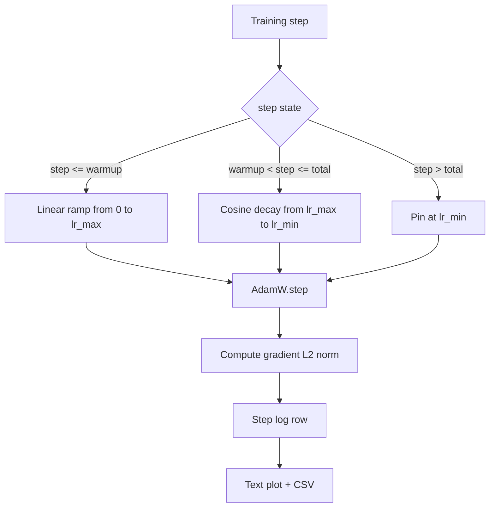

# Lineer ısıtma ile Kosine LR

> Öğrenme oranı programı, kayıp fonksiyonundan sonra ikinci en önemli karardır. AdamW, bir kosinus çöküşü ve bir doğrusal ısınma ile dil model eğitimi için modern standarttır çünkü modelin kırılgan ilk bin güncelleme sırasında küçük bir etkin adım boyutunu görmesine, yapılandırılmış bir zirveye kadar yükselmesine ve sıfıra doğru düzgün bir şekilde geri düşmesine izin verir. Bu ders, bu programı oluşturur, egzersiz adımları üzerinde eğri çizer, programın yanında gradient normlarını kaydeder ve programın ısınma, zirve ve çöküş sınırlarını onurlandırdığını kanıtlar.

**Type:** Build
**Languages:** Python
**Prerequisites:** Phase 19 lessons 30-37
**Time:** ~90 minutes

## Öğrenme Hedefleri

- Düzsel ısınma ile cosine öğrenme oranı programına kablolu bir AdamW optimizer uygulayın.
- Her adımda, çizelgenin tam değerini, koşular boyunca kaygan nokta kaydırılmadan hesaplayın.
- Log gradient L2 normı öğrenme oranının yanında, böylece eğitim sağlığı gözlemlenebilir.
- Programı göz okuyabilen bir metin planına ve herhangi bir araç tüketebilen bir CSV'ye gönderin.

## Sorun

İlk bin eğitim güncellemesi en gürültülü. Modelin ağırlıkları hala başlangıç noktasına yakın. Optimizer'in ikinci anlık tahminleri istikrarlı değil. Değişiklik normları büyük ve gürültülü. Eğer öğrenme oranı bu güncellemeler sırasında en yüksek seviyede ise model ya tamamen farklılaşır ya da asla kaçamayacak bir kayıp platoya yerleşir. İki iyi bilinen düzeltme, Eğitim 45'in konusu olan Eğitme 19 dersi ve küçük ve yükselen bir öğrenme oranı programıdır.

Cosine-with-warmup programı üç bölgeye sahiptir.`warmup_steps`Öğrenme oranı sıfırdan yapılandırılmış zirveye lineer olarak değişir `lr_max`- Adımdan.`warmup_steps`Yürümeye .`total_steps`Öğrenme oranı, bir kosinus eğrisinin üst yarısını takip eder, `lr_max`- ...`lr_min`- Sonra .`total_steps`Öğrenme oranı `lr_min`Bu yüzden yanlış yapılandırılmış bir antrenör, aşırı atışlar yaparak programı sessizce terk etmez.

Yapım sorunu, programların bir kişi tarafından yanlış yapılması kolay olmasıdır. Bir kişi tarafından yapılması kolay olan bir program, bir eğitim koşusunda altı saat boyunca öğrenme oranı olarak gösterilmektedir.

## Anlaşım



### Sıcaklık formülü

- Evet .`step`İçeride`[0, warmup_steps]`- Evet .`warmup_steps > 0`, öğrenme oranı `lr_max * step / warmup_steps`- Dejeneryenler .`warmup_steps = 0`"Sıcaklık yok" olarak değerlendirilir: program doğrudan `lr_max`Bir takım test harmanları geçiyor.`warmup_steps = 0`Programı kontrol etmek hala kullanılabilir bir eğri üretir.

### Kosin formülü

- Evet .`step`İçeride`(warmup_steps, total_steps]`Öğrenme oranı `lr_min + 0.5 * (lr_max - lr_min) * (1 + cos(pi * progress))`nerede`progress = (step - warmup_steps) / max(1, total_steps - warmup_steps)`- Ne ?`step = warmup_steps`cosine değerlendiriyor `cos(0) = 1`, yani `lr_max`...şapıtma son noktasına tam olarak uymuş.`step = total_steps`cosine değerlendiriyor `cos(pi) = -1`, yani `lr_min`...birbirine tam olarak uyumlu.

İki uç noktasında da süreklilik tesadüfen değildir.`step`Bir yapışkan program ilk kez bir sınır kaybeder.`lr_max`Değişti.

### Toplam adımlardan sonra zemin

- Evet .`step > total_steps`Öğrenme oranı `lr_min`. Sözleşme açık: program hata yapmaz ve ekstrapolasyon yapmaz; yere dikilir ve eğitmenin bir uyarı kaydetmesine izin verir.`total_steps`- Çelişki değil.

### Rate ile birlikte dereceli norm kaydı

Program, eğitim sağlığının yarısıdır. Gelişme normı diğer yarısıdır. Eğitim döngüsü her adım için her ikisini de kaydediyor. Ayrıca bir eğitim koşusu, kayıptan önce gelişme normının zirvesini gösterir; iyi ayarlanmış bir ısınma normı hızla çizgi olarak yükseltilmesini sağlar; ısınmadan sonra yüksek kalır.`step, lr, grad_l2_norm, loss`CSV'nin tek kalıcı kayıtları.

```figure
cap-cosine-warmup
```

## Yapın

`code/main.py`Uygulamaları:

- `CosineWithWarmup`- devletsiz bir fonksiyon`lr(step) -> float`Yapılmış program üzerinde.
- `TrainState`- bir model sarıyor, bir `AdamW`optimizer, ve programı tek bir adımlı işlevi.
- `TrainState.step`- bir ileri geçiş, bir geri geçiş yapar, L2 derecesi normunu kaydeder ve uygulanır `lr(step)`Optimizeci'ye.
- `plot_schedule_ascii`- programı gözün okuyabileceği bir metin planı olarak gösterir.
- `write_schedule_csv`- öğrenme oranıyla birlikte her adımda bir satır yayınlar.

Dosyanın altındaki bir demo küçük bir yapı oluşturur.`nn.Linear`Modelle, sabit bir giriş parti üzerinde 20 adım boyunca trenler ve adım başına öğrenme hızını, gradient normunu ve kaybı yazdırır.

Çek şunu:

```bash
python3 code/main.py
```

Senaryo sıfırdan çıkıyor ve her adım için bir eğitim günlüğü ve program planını basıyor.

## Üretim Şekilleri

Dört model programı bir üretim eserine dönüştürüyor.

**Schedule lives in a config, not in code.**Eğitmen okuyor .`warmup_steps`- Evet .`total_steps`- Evet .`lr_max`- Evet .`lr_min`Git'e bağlı olan bir YAML veya JSON yapılandırmasından. Program yapılandırması içeriğe yönelik olduğundan yeniden üretilebilir; program yapılandırması PR farkının bir parçası olduğundan denetlenir.

**Step counter is monotonic and decoupled from epochs.**Bazı çerçeveler, veri kümesi parçalanırken veya veri yüklemeci yeniden başlatıldığında adım ve dönem arasında karıştırma yapmaktadır.`global_step`Eğitmenin kontrol noktasından değil, yerel bir sayıcıdan.

**Schedule plot in the run directory.**Her eğitim kursu yazıyor .`outputs/lr_schedule.png`Bu ders, bir yorumcuyu çalıştırma dizisine gönderir. bir yorumcu, bir şeyi tekrar çalıştırmadan programı kontrol edebilir. Bu, PR zamanında yanlış yapılandırılmış program sınıfı hataları yakalar.

**Log row schema is fixed.** `step, lr, grad_l2_norm, loss`Bir aşağıdaki not defteri veya araci tablo şema okuyor; bir versiyonu çarpmadan bir sütunun adını değiştirmek mevcut tüm araci tabloları geçersiz kılar.

## Kullan

Üretim biçimleri:

- **Sweep peak before sweeping anything else.** `lr_max`Önce küçük bir modelde tarayın.`lr_max`model boyutları ile zayıf ölçekler, bu yüzden küçük model süpürme güçlü bir önlemdir.
- **Warmup is a fraction of total steps, not an absolute count.**2000 ısıtma adımıyla 200 milyon adımlı bir koşuk neredeyse hemen zirvede başlar; aynı sayıyla 20.000 adımlı bir koşuk yüzde 10'a ısıtılır.
- **`lr_min` is non-zero on purpose.**% 10'luk bir zemin.`lr_max`Uzun kuyruğun içinde optimizer'in öğrenmesini sağlar.`lr_min = 0`Program, bir planda harika görünen bir eğitim eğri ve aslında eğitim bitmemiş bir model üretir.

## Gönder

`outputs/skill-cosine-warmup.md`Gerçek bir proje üzerinde hangi yapılandırmanın programı taşıdığını, küresel sayıcı hangi eğitim adımından okunurduğunu ve neyi açıklar.`lr_max`Bu ders motorun gemisini gönderir.

## Egzersizler

1. Programın ters kare kökü olan bir varianti ekle ve 200 adımlık oyuncak eğitim koşusunda karşılaştır.
2. Bir ekle`--restart`Bayrak ikinci bir                  `total_steps / 2`Oyuncak koşusunda sıcak yeniden başlatmaların iyileşip zarar vermediğini savun.
3. Birim testi ekle: programın sürekli olduğunu gösterin: her adım için `[0, total_steps]`Farklılık`|lr(step+1) - lr(step)|` ile sınırlıdır`lr_max / warmup_steps`- Evet .
4. Programı bir `torch.optim.lr_scheduler.LambdaLR`Bu yüzden çerçeve koduyla oluşur. Ders basit bir adım fonksiyonunu kullanır.
5. Bir ekle`--plot-png`Gerçek bir planı yazmış bir bayrak .`matplotlib`. Dersin metin planı veya PNG'nin CI çalışmalar için daha iyi standard olup olmadığını savun.

## Anahtar Terimler

| Term | What people say | What it actually means |
|------|-----------------|------------------------|
| Warmup | "Slow start" | Linear ramp from zero to `lr_max` over the first `warmup_steps` updates |
| Cosine decay | "Smooth drop" | Upper-half cosine curve from `lr_max` to `lr_min` over the remaining steps |
| Floor | "After training" | The fixed `lr_min` value the schedule pins at past `total_steps` |
| Gradient norm | "L2 of grads" | The Euclidean norm of the concatenated gradient vector, logged each step |
| Global step | "Schedule axis" | A monotonic step counter that survives restarts and drives the schedule |

## Daha Fazla Okumak

- [Loshchilov and Hutter, SGDR: Stochastic Gradient Descent with Warm Restarts (arXiv 1608.03983)](https://arxiv.org/abs/1608.03983)- cosine programının referans kağıdı
- [Loshchilov and Hutter, Decoupled Weight Decay Regularization (arXiv 1711.05101)](https://arxiv.org/abs/1711.05101)- AdamW'nin referans kağıdı
- [PyTorch torch.optim.lr_scheduler](https://docs.pytorch.org/docs/stable/optim.html#how-to-adjust-learning-rate)- aşamalı fonksiyonların çerçeve programcılarıyla nasıl birleştiği
- 19 · 42 aşaması - bu programın korpusunu tüketen indirimci
- 19 · 43 aşaması - veriler yükleyici
- 19 · 45 aşaması - gradient kesimi ve AMP, döngünün bir sonraki katmanı
