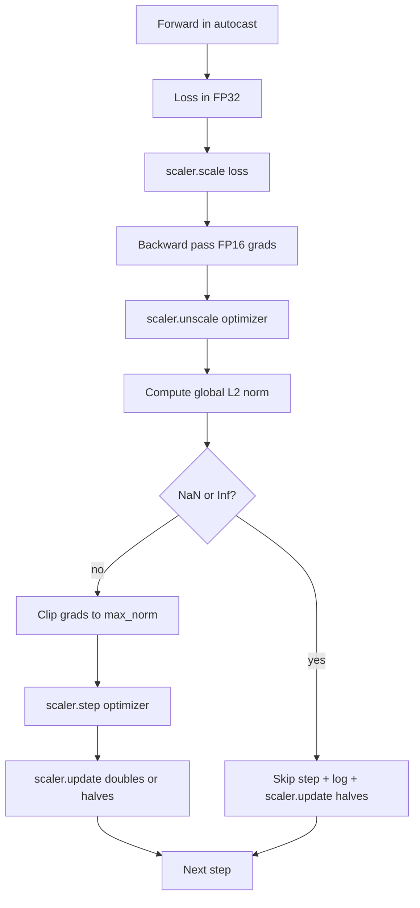

# Aralıklı Kesim ve Karışık Kesinlik

> Önceki dersdeki optimizer ve program, gradientlerin aklı başında olduğunu varsayıyor. Genellikle değiller. Tek kötü bir parti, gradient normunu üç büyüklük derecesiyle artırabilir. Karışık hassaslık eğitimi, FP16'nın kayıp tarafında aşırı akışla bunu artırır. Bu ders, üretim eğitiminin gönderemediği iki güvenlik kemerini oluşturur: gradient kılıcı yapılandırılmış küresel L2 normuna, ve NaN ve Inf'i algılayan ve adımları temiz atlayan ve forensik için ölçekleme faktörünü kaydeden otomatik atlama ve GradScaler ile karıştırılmış hassaslık döngüsü.

**Type:** Build
**Languages:** Python
**Prerequisites:** Phase 19 lessons 30-37
**Time:** ~90 minutes

## Öğrenme Hedefleri

- Yapılandırılmış bir eşiği aşırırken yer alan tüm parametre gradiyenti ve klipi üzerine küresel L2 normunu hesaplayın.
- Otomatik bir atışla bir eğitim adımını toplayın. GradScaler'ı da takın. Böylece FP16'ın ileri ve geri geçişleri aşırı akışta hayatta kalacak.
- Kayıp veya gradientte NaN ve Inf'i tespit edin, optimizer adımını atlayın ve atlamayı kaydetin.
- GradScaler'ın ölçekleme faktörünü her adım rapor edin. Böylece uzun bir atlama dizisi hemen görünür.

## Sorun

Dün temiz bir şekilde yapılan bir antrenman, 8.217'e doğru dikey bir kayıp eğri oluşturdu. Suçlu, bir tek partidir. Onun derecesi 4.200'dir. Optimizer, modelin önceki saatte yaptığı her öğrenimi yeniden ayarlayan bir adım uyguluyor. L2 global klipi norm 1.0'da olan zaman, aynı parti birim norm güncelleme katkıda bulunur; kaybı trend çizgisinde kalır; koşus hayatta kalır.

Karışık hassaslık eğitimi, FP16'da ileri geçişi ve geri geçişi hesaplayarak geçişin 2-3 katını artırır. Maliyet, FP16'nın dar bir gösterge aralığı olmasıdır. FP16'da aşırı akış yapan tipik bir gradient, sonraki katmanlardan NaN olarak yayılan Inf'e değerlendirilir, bu da bir sonraki optimizer adımında her ağırlığı NaN'e ayarlar. PyTorch'un GradScaler'i, kayıpları geriye geçmeden önce büyük bir ölçekleme faktörü ile çarparak ve gradientleri optimizer adımından önce aynı faktörle bölerek çözür. Eğer herhangi bir gradient ölçeklenmeyen zamanda Inf veya NaN ise, ölçeklemeci adım atıp ölçekleme faktörünü yarıya düşürür; önceki N adımlar temizse, ölçeklemeci faktörü ikiye katlar. Eğitim sırasında, FP16 aralığı izin verdiği en yüksek değeri bulur.

Bu iki şeyi doğru şekilde kablolamak yapılandırma sorunu. Klip ölçeklenmeden önce ve eşiğin ölçeklenmiş gradientler üzerinde; Klip ölçeklenmeden sonra ve GradScaler'deki işlemlerin sırası önemli. Doğru sırası: `scaler.scale(loss).backward()`O zaman ...`scaler.unscale_(optimizer)`O zaman ...`clip_grad_norm_`O zaman ...`scaler.step(optimizer)`O zaman ...`scaler.update()`Başka bir düzen sessizce kırılmış bir döngü oluşturur.

## Anlaşım



### Küresel L2 normı

Küresel L2 normı, birer parametre normı değil, zincirlenmiş gradient vektörünün Euclidean normudur.`torch.nn.utils.clip_grad_norm_(parameters, max_norm)`. Fonksiyon, "her adımda kesiyoruz" teşhisi için gerekli olan hem doğal hem de kesilmiş değerleri kayıt edebilmesi için pre-clip normunu iade eder.

### otomatik atış ve GradScaler

`torch.amp.autocast(device_type)`FP16'da seçkin bir şekilde uygun işlemler (genellikle matmul sınıfı işlemler) yapan bağlam yöneticisi. `torch.amp.GradScaler(device_type)`Bu, bir sonraki aşamada kayıpları artarken ve tersine, optimizer adımından önce gradientleri ölçeyen yardımcıdır.

Ders CPU otomatik kasıt kullanıyor çünkü bu CI'de çalıştırılan şeydir; aynı kalıp değiştirerek CUDA'ya sözcük anlamda aktarır `device_type="cpu"`- ...`device_type="cuda"`CPU'daki GradScaler bir stüptür (CPU otomatikcast zaten varsayılan olarak BF16'da çalışır ve kayb ölçeklemesine ihtiyaç duymaz), ancak ders çağrı sitelerini içerir, bu nedenle kablolama GPU döngüsü ile aynıdır.

### NaN ve Inf tespit edilmesi

İlk olarak kaybın kendisi kontrol edilir.`torch.isfinite`Bir Inf veya NaN kaybı yararlı gradientler üretmez ve optimizer girmeden atlanır.`scaler.unscale_(optimizer)`Ders , ölçülmemiş gradientleri tarar .`has_non_finite_grad(...)`Bu iki kontrol, hem ileri geçiş hem de geri geçiş başarısızlık modlarını kapsar.

### Ölçekleme faktörü teşhisleri

Ölçekleme faktörü GradScaler'ın iç durumudur.`scaler.get_scale()`Sağlıklı bir koşuşturma, ölçekleme faktörünün iki güçte yükselmesini gösterir.`2^17`veya `2^18`. Bir yanlış davranış gösterisi, yüksek ve düşük değerler arasında dalgalanan faktörü gösterir, bu da modelin gradientlerinin bazen aralığında ve bazen olmadığını gösterir.

```figure
grad-clip-monitor
```

## Yapın

`code/main.py`Uygulamaları:

- `clip_global_l2_norm`- bir ambalajla .`torch.nn.utils.clip_grad_norm_`Bu, hem pre-clip hem de post-clip normunu geri verir.
- `has_non_finite_grad`- NaN ve Inf için gradientleri tarayan bir yardımcı.
- `AmpTrainState`- bir model sarıyor, bir `AdamW`Optimizer, GradScaler ve otomatik döküm cihazı.`step(inputs, targets)`Bu, tüm kesim, ölçeklendirme ve NaN borusunu atlamak için.
- `StepLog`ve `SkipLog`- adım adım kayıtları.
- Küçük bir çocuk eğitimi veren bir demo .`nn.Linear`20 adımlık model, atlama yolunu yürütmek için 5 adımdaki eğilime bir Inf enjekte eder ve elde edilen günlük basar.

Çek şunu:

```bash
python3 code/main.py
```

Skenar sıfırdan çıkıyor ve her satırla etiketlenen bir adım günlük basıyor `STEP`veya `SKIP`; en az bir satır bir `SKIP`- Evet .

## Üretim Şekilleri

Dört örnektir, döngüyü üretim eğitim aşamasına çıkarır.

**Skip counter as an alert, not a log line.**Epoha başına yüzlerce atlama zor bir uyarıdır: model FP16'nın tutamadığı bir rejimde ve döngü sessizce başarısız oluyor. Ders 1000 adım atlama oranını takip eder ve üretim sırasında yüzde 5'den fazla bir oranda sayfa alır.

**Clip threshold lives in the config.** `max_norm = 1.0`Bu, dil model eğitimi için modern standarttır. Önce küçük bir model üzerinde tarayın; daha büyük eşiği modelin gerçekten zor serilerden kurtulmasına izin verir; daha küçük eşiği en kötü durumda gürültülü bir kayıp eğri masrafı karşılığında sınırlandırır. Eşiği ders 44'ten gelen programla aynı YAML veya JSON yapılandırmasında yer alır.

**Norm log goes to a CSV with the schedule.**CSV sütunları `step, lr, grad_l2_pre_clip, grad_l2_post_clip, loss, skipped, skip_reason, scaler_scale`Dosyayı açan bir inceleyicinin programı, gradient hikâyesini, ölçekleme faktörünü ve atlama sonucu (saçını ile) bir satırda görür.

**`scaler.update()` runs every step, even on skip.**Bir temiz adımda ölçer, sayıcının bilgi eksikliği sayısını okuyor, arttırır ve muhtemelen faktörü ikiye katlar. Atlanmayan bir adımda ölçer, faktörü yarıya düşürür ve sayıcıyı yeniden ayarlar.`update()`Atlamak yolunda "skalame faktörü asla değişmedi" üreten bir hata var.

## Kullan

Üretim biçimleri:

- **Autocast device matches optimizer device.** `torch.amp.autocast(device_type="cuda")`GPU eğitimi için; `torch.amp.autocast(device_type="cpu")`CPU için. Karıştırma cihazları, bir sessiz tip hatası üretir. Bu da iyi görünen bir kayıp eğri olarak ortaya çıkar.
- **Loss check before backward.** `torch.isfinite(loss).all()`Bu, bir tanzor azaltması, maliyet önemsiz ve NaN kaybı tasarruf tüm bir eğitim adımdır.
- **`set_to_none=True` in `zero_grad`.**  Değişiklikleri ayarlar`None`Bu, optimizörün etkilenmeyen parametreler grupları için hesaplamayı atlamasına izin verir.

## Gönder

`outputs/skill-clip-amp.md`Bu ders motorun gemisini gönderir.

## Egzersizler

1. Sintez Inf enjeksiyonunu gerçek bir kayıp tırnakla değiştirin (bir parti hedefini 1e8 ile çarpın) ve atlama yolu tetikleyicilerini doğrulayın.
2. Bir ekle`--bf16`FP16 yerine otomatik yayın BF16'a geçiş yapan mod. BF16'ın FP16'dan daha geniş bir gösterge aralığı vardır ve nadiren kayıp ölçeklemesine ihtiyaç duyulur; aynı demo'da atlama oranının sıfıra düştüğünü doğrulayın.
3. Birim testi ekleyin ki gradient-klipp kapakları, hiçbir klippürme olmadığı zaman pre-klipp ve post-klipp normunu doğru şekilde gönderir.
4. Bir ruling-window atlama oranı hesaplama ve sürüm 100 adım ardına yapılandırılmış bir eşiği aşırırsa çalışmayı başarısız eden bir CLI bayrağı eklenir.
5. Kanonik CSV'yi yazmak için döngüyü bağlayın (`step, lr, grad_l2_pre_clip, grad_l2_post_clip, loss, skipped, skip_reason, scaler_scale`) ve dosyanın her satırdan sonra kırılmasını sağlayarak bir Ctrl-C'de kalmasını onaylayın.

## Anahtar Terimler

| Term | What people say | What it actually means |
|------|-----------------|------------------------|
| Global L2 norm | "Clip target" | Euclidean norm of the concatenated gradient vector across all trainable parameters |
| autocast | "Mixed precision" | Selective FP16 (or BF16) execution of eligible operations inside a `with` block |
| GradScaler | "Loss scaler" | Helper that multiplies the loss before backward and inverse-scales gradients before the optimizer step |
| Skip | "Bad step" | An optimizer step refused because the gradient or loss was non-finite; the scaler halves the factor |
| Scaling factor | "Scaler state" | The GradScaler's current multiplier; doubles after clean stretches and halves on every skip |

## Daha Fazla Okumak

- [Micikevicius et al., Mixed Precision Training (arXiv 1710.03740)](https://arxiv.org/abs/1710.03740)- orijinal kayıp ölçekleme önerisi
- [Pascanu, Mikolov, Bengio, On the difficulty of training recurrent neural networks (arXiv 1211.5063)](https://arxiv.org/abs/1211.5063)- gradient kesim referans kağıdı
- [PyTorch torch.amp.GradScaler](https://docs.pytorch.org/docs/stable/amp.html)- bu dersin kapsamı
- [PyTorch torch.nn.utils.clip_grad_norm_](https://docs.pytorch.org/docs/stable/generated/torch.nn.utils.clip_grad_norm_.html)- bu ders için kullanılan kesimsel
- 19 · 42 aşaması - korpusunun döngüyü beslediği indirme cihazı
- 19 · 43 aşaması - döngü tüketen veri yükleyicisi
- 19 · 44 aşaması - bu döngü oluşturduğu zaman çizelgesi
