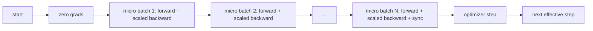
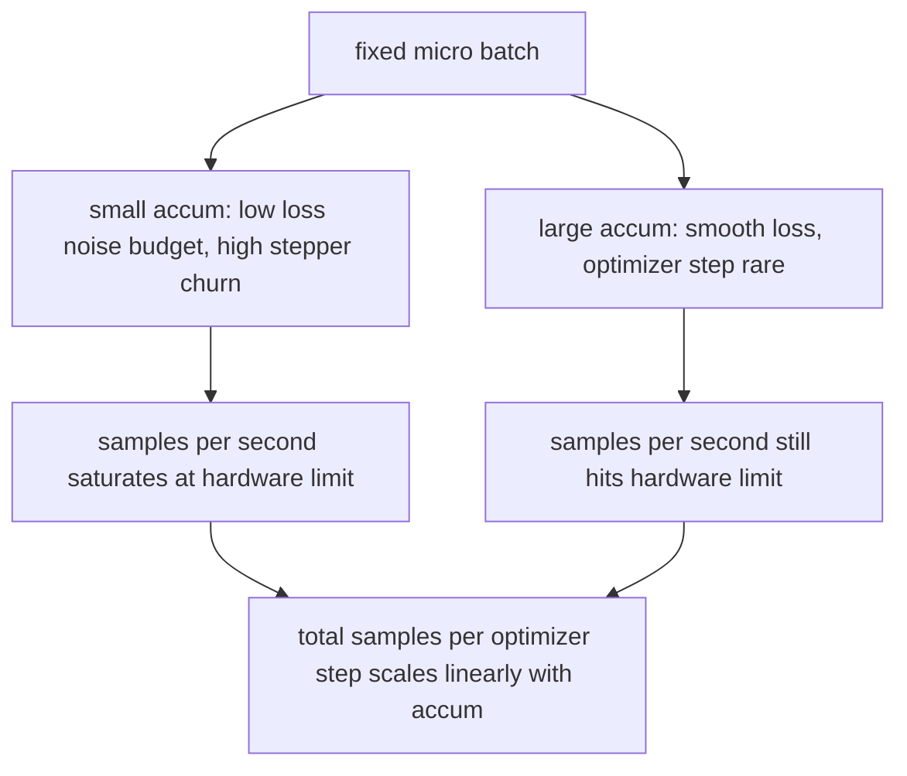

# Gelişmiş Bir Toplanma

> Yapabileceğin en iyi partide, bir mikrokortide bir tren yap, kaybı ölçe, optimizer adımını tut ve gradientlerin toplanmasına izin ver.

**Type:** Build
**Languages:** Python
**Prerequisites:** Phase 19 lessons 42 to 45
**Time:** ~90 minutes

## Öğrenme Hedefleri

- Etkin parti kimliğini çıkar: `effective_batch = micro_batch * accum_steps`- Evet .
- Mikro-batch kaybı ölçeklemesini uygulayın, böylece toplanan gradient tek bir tam batch geriye eşleşir.
- Son mikro-batch'e kadar optimizer senkronizasyonunu atlayın (son adımla senkronize).
- Etkin parti eğriyle bir geçiş oranını okuyun ve düşen geri dönüşü açıklayın.

## Sorun

512'nin etkili bir seriyle antrenmanızı istiyorsunuz çünkü kayıp eğri daha düzgün ve optimizer adım bu ölçekte daha mantıklı. Masadaki hızlandırıcıda 32 örnek var. Hatıra bitmeden önce. Parçayı ikiye katlamak bir seçenek değil. Modelin yarısını kesmek bir seçenek değil. Alanın 2017'de ulaştığı ve kullanmayı hiç bırakmadığı bir hile, 16 geri geçiş yapmaktır, gradientlerin parametre tamponları içinde birikmesine izin vererek, sayım hedefe ulaştığında optimizer'i sadece adım atmaktır.

Risk, daha büyük bir partide olduğu gibi kaybın artık aynı sayı olmamasıdır. Saçmaca toplamlanan 16 mini-batch'ın çapraz entropi bir tam batch'ın kaybının 16 katıdır. Ölçütülmeden, eğilime yönü doğru ama büyüklüğü yanlış, optimizer adım 16 kat fazla büyüktür. Düzeltme bir bölünme. Düzeltme de unutmak kolaydır.

## Anlaşım



Sözleşme kısa:

- Her mikro parti için kaybı  ile bölünür.`accum_steps`Daha önce`backward()`PyTorch gradientleri `param.grad`Varsayılan olarak; bölünme, giderek devam eden toplamı doğru ölçekte geri itmektedir.
- Optimizer adım, son mikro-batch'ın geriye doğru atılmasından sonra etkin bir seri için bir kez ateş eder.
- Optimizer'in durumu (momentum buffers, Adam anları) mikro-batch için değil, etkili adım başına bir kez ilerler.
- Tek bir cihazda bu muhasebeciliktir.`no_sync`Bu, bir geçit sırasında tüm gradientleri azaltır ve son mikro seri, ağ maliyetini N kat ödemek yerine, bir geçit içinde toplam gradientleri azaltır.

### Koddaki eşdeğerlik kanıtı

```python
loss = criterion(model(x_full), y_full)
loss.backward()
opt.step()
```

eşdeğer

```python
for x, y in chunks(x_full, y_full, n):
    scaled = criterion(model(x), y) / n
    scaled.backward()
opt.step()
```

Bu da bir dizi dizileme ile aynı derecede değişir. Bu da bir dizileme ile aynı derecede değişir.`equivalence_check`- Evet .

### Maliyet nereye gider?

Her mikro seri bir ileri ve bir geriye maliyetini ödüyor.`outputs/accum-curve.json`Etkin parti büyüdükçe sabit mikro partide ne olduğunu gösterir:



Ücretsiz öğle yemeği yok.`accum_steps`Bu nedenle, bu sayede, bir divarın daha fazla optimizasyon yapması için daha fazla zaman harcanır.

```figure
cc-grad-accumulation
```

## Yapın

`code/main.py`Bu, üç şeyi yapar.

### Adım 1: Dengelilik kontrolü

`equivalence_check()`Bu işlem aynı ağın aynı tohumla iki kopyasını oluşturur. Birinde bir ileri geçitte 16 örnek parti görüyoruz. Diğerinde 4 örnek parçacığı görüyoruz.`max_abs_diff < 1e-4`- Evet .

### Adım 2: Son Adımla Sinkronlama Patronu

`train_one_optimizer_step`Sonuncusu hariç her mikro parti için.`no_sync_context(model)`. Tek bir süreçte bağlam bir işlemi yapmaz; DDP'de tüm azaltma eğilimi atlatılır.`sync_counter`No_sync alanını kaç kez terk ettiğimizi kaydeder; N mikro seri için sayım etkin adım başına bir, N değil.

### Adım 3: Çıktıran eğri

`sweep_effective_batches`Aynı modelde sabit bir mikro seri ve birikim adımlarının bir listesini kullanır.

- `samples_per_sec`: duvar zamanına göre görülmüş toplam örnekler
- `median_step_ms`: Etkin adım başına 50 .
- `sync_calls`: Kullanılan kolektif puanlar
- `avg_loss`: tarama optimizer adımları boyunca ortalama

Üretim `outputs/accum-curve.json`ve bir defterden tekrar kullanılabilir.

Çek şunu:

```bash
python3 code/main.py
```

Skenar eşdeğerlik farkını, sonra tarama tablosunu, sonra JSON yolunu yazdırır.

## Kullan

Üretim eğitiminde, gradient birikimi bir düğmenin arkasında yaşar. PyTorch'un örneği `accumulation_steps = effective_batch // (micro_batch * world_size)`Burada kullanılamayacağınız çerçeveler aynı döngüyi sarar, ama adımlar aynıdır: kayıpları ölçeklendirir, son olmayan mikroskoblarda senkronize edilmeyi atlar, biriktirir, bir adım.

Vahşi yaşamda üç örneğe sahibiz:

- Küçük olan bir şey hızlandırıcı döngüleri atıyor, büyük olan bir şey çöküyor.
- Etkili parti öğrenme oranı bir programdan seçilir. Büyük etkili partiler ölçekli öğrenme oranlarına ve ısınmaya ihtiyaç duyar; bu 2017'den beri konuşulan çizgi ölçekleme kuralıdır.
- Toplama sayısı, iki taneyle birlikte, veri yükleyicisini yeniden yazmadan çalıştırma sırasında ayarlayabileceğiniz tek düğme arasındaki köprüdür.

## Gönder

`outputs/skill-gradient-accumulation.md`Tarifi yakalar , böylece bir rekabeti yeni bir repo'ya bırakabilir .`accum_steps`, son olmayan mikrolarda optimizer senkronizasyonunu atlayın, etkin parti başına optimizer'i bir kez basın, etkin partiye karşı çıkışını JSON olarak kaydetin böylece ticaret görünür.

## Egzersizler

1. Aramaları tekrar yap .`--num-steps 100`Ve saniyede gerçek partiye karşı çizgi örnekleri.
2. Yanlış bir ölçekleme variansı ekleyin (divisiyon yok) ve referans karşısında 1 adımdaki fark parametresini gösterin.
3. SGD'yi AdamW'ye değiştirin ve optimizer durumunun ilerlemesini, mikro-batch için değil, etkili bir adım başına bir kez onaylayın.
4. Gerçek bir `DistributedDataParallel``no_sync_context`Sync_calls'ın etkin bir parti başına N-1 düştüğünü doğrulayın.
5. İki farklı mikro bölümü (2 x 8 vs 4 x 4) karşılaştırmak için eşdeğerlik kontrolünü değiştirin ve gevşekleşmeniz için gereken herhangi bir tolerans açıklayın.

## Anahtar Terimler

| Term | What people say | What it actually means |
|------|-----------------|------------------------|
| Micro batch | The batch you forward | The slice that fits in memory in a single forward pass |
| Accum steps | Backward passes per step | Number of backwards summed before one optimizer step |
| Effective batch | The batch | Micro batch times accum steps times data parallel world size |
| Loss scaling | Divide by N | Per-micro-batch division so summed gradients match full batch |
| Sync on last | Skip the rest | Only run the gradient collective on the last backward in the window |

## Daha Fazla Okumak

- PyTorch dokları `DistributedDataParallel.no_sync`Son aşamada senkronize hilesi için üretim versiyonu.
- Goyal et al., 2017, büyük parti eğitim için doğrusal ölçekleme, etkili parti ilgilenmek için kanonik neden.
- PyTorch, karışık hassaslık ile gradient birikimi etkileşimleri üzerinde izleme cihazı.
- Fase 19 dersleri 42 ila 45'te, bu dersdeki model, veri yükleyici, optimizer ve eğitmen asfaltı kapsamaktadır.
- Fase 19 ders 47 kontrol noktasını ve devamı kapsar. Uzun bir birikim koşusu, duvar saatinin kapısını geçirir.
