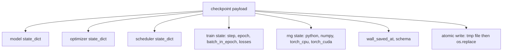
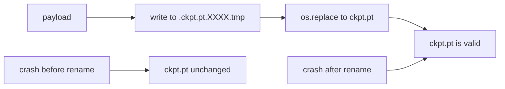
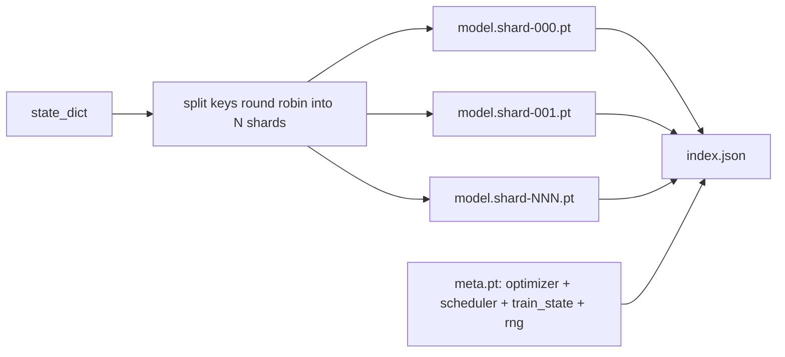

# Kontrol Noktası Kaydet ve Yeniden Başlat

> Tren kesintiler öldürme çalışmalar; kontrol noktaları devam etmelerini sağlar. Model, optimizer, programlayıcı, kayıp geçmişi, adım sayıcı ve RNG durumu, atomik olarak kaydetir, böylece bir öldürme herhangi bir anda geçerli bir dosyayı disk üzerinde bırakır.

**Type:** Build
**Languages:** Python
**Prerequisites:** Phase 19 lessons 42 to 45
**Time:** ~90 minutes

## Öğrenme Hedefleri

- Tam eğitim durumunu yeni bir sürece yeniden yüklenebilecek tek bir pay yüküne dönüştürün.
- Atomik kaydetmeyi yazma ile uygulayın ve sonra adını değiştirin. Böylece bir çöküş yarı yazılmış bir dosya bırakmaz.
- Python, NumPy ve PyTorch için RNG durumunu geri yükleyin, böylece devam sonrası kayıp kesintisiz başlangıç çizgisine eşleşir.
- Artık tek dosyayaya uymayan modeller için parçalara ayrılmış bir kontrol noktası düzenini oluşturun, hash doğrulanmış parçalara ve JSON indeksi ile.

## Sorun

18 saatlik bir eğitim işi ayarladın. Duvar saati kapısı 4 saat. Kluster saat 11'de yeniden başlıyor çünkü maaş derecenizin üstündeki biri çekirdek yükseltmesini onayladı. Kontrol noktaları olmadan yeniden başlıyorsun. Yeniden başvurmadan ilk 11 saat boyunca öğrenmek için gereken optimizer durumunu da kaybediyorsunuz. Yani model ağırlıkları hayatta kalmış olsa bile, AdamW anları gitti ve bir sonraki adım eğitim yörüngesinin geçmiş olduğu bir yöne doğru gizlenir.

Doğru eseri, devam etmek için gereken her şeyi tutan tek bir dosyadır: model parametreleri, optimizer durumu, programcı durumu, planlar için kayıp geçmişi, mevcut adım ve dönem ve seri-epoca sayıcıları ve her rastlantı kaynağı için RNG durumu. RNG durumu olmadan, yeniden başlatılan kayıp eğri farklı bir eğridir. Aynı model, aynı veriler, farklı karıştırma, farklı çıkış maskesi, farklı numara.

Atomic save sözleşmenin diğer yarısını oluşturur. Son dosya adına yazmak, bir çökme orta yazısı bozuk bir dosya bırakır demektir; curriculum çöpe okur. Aynı dizide geçici bir dosyaya yazmak ve sonra yeniden adlandırmak, önceki iyi dosyayı dokunulmamış bir çökme orta yazısı anlamına gelir. Yeniden adlandırmak POSIX dosya sistemlerinde atomiktir.

## Anlaşım



### Beş devlet kovaları

| Bucket | Why it matters |
|--------|----------------|
| Model | Weights and buffers; what the model is. |
| Optimizer | Momentum and adaptive moments; without these the next step is a different optimization problem. |
| Scheduler | Where the learning rate is on its curve; cosine schedules in particular care. |
| Train counters | Step, epoch, batch-in-epoch, plus the loss history that draws the dashboard. |
| RNG state | Determinism for dropout, data shuffling, and any sampling inside the model. |

### Atomik kaydetme



İki kural. Birincisi, geçici dosya hedef ile aynı dizinde yaşar, böylece yeniden isim aynı dosya sisteminde kalır; cihazlar arası yeniden isimler atomik değildir. İkincisi, geçici isim bir girişim için benzersizdir, bu nedenle iki yazar ayak basmaz.

### Parçalara ayrılmış kontrol noktaları

Model büyük olduğunda tek dosya pay yükü hızlı yüklenmek için çok büyük, denemek için çok büyük ve bir ağ orta okuyuşluklarda hiccup paylaşırken çok acı verici hale gelir.



İndeks, parça sayısını, her parçaın sha256'sını ve meta dosyasının sha256'sını kaydeder. Herhangi bir hash eşleşmezse yüklemeci yüksek sesle başarısız olur.

### Özetleme döneminin ortasında devam ediyor

Bir sonraki çağın başlangıcına doğru bir öykü, bir dakika ve bir gün arasında bir atık.`(epoch, batch_in_epoch)`yüklenmesinden sonra, eğitim döngüsü rastgele sayı üreticisini mevcut dönemde tüketilen partilerin ötesine hızla ilerler ve devam eder.`batch_in_epoch`Ders kodu tam olarak bunu yapar; iddiada, devam sonrası kayıp yörüngesinin 1e-4'te kesintisiz bir başlangıç çizgisine eşleşmesi bulunmaktadır.

```figure
cc-atomic-checkpoint
```

## Yapın

`code/main.py`Dört primitif ve bir demo sürücüsü sunuyor.

### Adım 1: RNG durumunu yakalamak ve geri getirmek

`capture_rng_state`Python'un bir diktesini gönderir.`random.getstate`NumPy'nin.`np.random.get_state`, PyTorch CPU ve CUDA RNG baytları.`restore_rng_state`CPU tensörü PyTorch'un RNG'inin nasıl tükettiğini bildiği bir Uint8 byte tamponu.

### Adım 2: Atomik kurtarma

`atomic_save`hedefi dizindeki geçici dosyalara yararlı yükü yazar, sonra `os.replace`Son adı ile değiştirir.`atomic_write_json`Parçalama endeksi için de aynı şeyi yapar.

### Adım 3: Tam kontrol noktası geri dönüş yolculuğu

`save_checkpoint`model, optimizer, programlayıcı, tren durumu ve RNG'yi tek bir dikte paketler. `load_checkpoint`tersine çevirir ve bir `TrainState`Şema alanı yükseltme hokudur: Gelecek biçim değişiklikleri versiyon dizini ve yüklemeci gönderir.

### 4. adım: parçalanmış variant

`save_sharded_checkpoint`N parçalar boyunca parametre anahtarlarını yuvarlaklaştırır, her parça kendi atomik kaydetmesi ile yazılır, optimizer ve programlayıcı ve tren durumu ile bir meta dosyası yazar ve JSON indeksiyi parça sha256s ile yazar. `load_sharded_checkpoint`Birleştirmeden önce her parçayı doğruluyor.

### Adım 5: Yeniden başlatma gösterimi

`run_resume_demo`küçük bir model trenleri için`total_steps`, kontrol noktasını saklıyor .`interrupt_at`Bu işlem, bir sonraki kontrol noktasını yeniden oluşturur ve kalan adımları yürütür. Bu işlem, iki kayıp yoldaki maksimum mutlak farkı, kesinti noktasından sonra gönderir.

Çek şunu:

```bash
python3 code/main.py
```

Tek dosya ve parçalanmış demolar her ikisi de 1e-4 altında maksimum farkı ifade eder.`outputs/resume-demo.json`- Evet .

## Kullan

Üretim eğitiminde, geminin kontrol noktasını eğitmenin bir parçası olarak yığar. Şekili aynıdır: model + optimizer + planlayıcı + sayıcı + RNG, atomik olarak yazılmış, en sonunu bulmak kolay olması için adım adım adlandırılmıştır.

Üç örneği uygulayacak:

- **Schema is a string in the payload.**Bu olmadan eski yolları kırmadan formatı geliştiremezsin.
- **Sha256 every shard.**Sessiz bir şekilde kısaltılmış bir indirme en kötü tür hata; yükleme cihazı hızlı veya geç geç başarısız olur.
- **Keep checkpoint cadence honest.**Her N adımını ve her saat dakikasını, hangisi daha kısa olursa, sakla yoksa çarpışan uzun adım, işin tam bir penceresini boşa harcar.

## Gönder

`outputs/skill-checkpoint-save-resume.md`Bu yeni eğitim senaryoları için tarif: payload şekli, atom yazısı, RNG yakalama, parçalanmış indeks.`save_checkpoint`Periodik kaydetme sitesinde, tel `load_checkpoint`Başlatıldığında, kaçış öldürülmeden sağ kalır.

## Egzersizler

1. Dört-robin parçalanmasını parametre grubuna göre parçalanmaya (sınıflar `.weight`vs `.bias`Her bir düzen ne zaman tercih edilir?
2. Son K kontrol noktalarını tutmak için kaydet döngüsünü uzatın ve eski noktaları kesin.
3. Bir ekle`--ckpt-every-seconds`Sadece adım sayımı değil, bir divar saati aralığında bir kurtarma tetikleyen bayrak.
4. Başlatma sırasında çalışkan bir kontrol miktarı doğrulama yolu ekleyin, dizindeki her kontrol noktasını tarar ve hangilarının bozuk olduğunu bildirir.
5. A.`migrate_v1_to_v2`Bu, yeni bir alan ekleyen ve şema dizisini çarpatan bir işlevi oluşturur.

## Anahtar Terimler

| Term | What people say | What it actually means |
|------|-----------------|------------------------|
| Atomic save | "Write and pray" | Write to a temp file in the same directory, then os.replace into the target name |
| State dict | "The weights" | Model parameters and buffers, keyed by parameter name |
| Sharded checkpoint | "Big model file" | Multiple files, one per shard, plus a meta file and a JSON index with sha256s |
| RNG state | "Random seed" | Captured state for python random, numpy, torch CPU, torch CUDA; not just the seed |
| Mid-epoch resume | "Restart" | Fast-forward the RNG and continue from the next batch in the same epoch |

## Daha Fazla Okumak

- POSIX `rename`Atomiklik için semantik iddiaları `os.replace`- Bu da güvenilir.
- PyTorch belgesi `torch.save`ve `torch.load`, içinde `map_location`Cihazlar arası restorasyonlar için.
- Fase 19 ders 46 bu ders için kontrol noktası yararlı yükü hayatta kaldığı gradient birikimi kapsar.
- Fase 19 ders 48 bu düzenlemeyi uygulayan devlet belirti biçimindeki dağıtılan ambalajları kapsar.
- Linux çekirdeği `fsync`Atomik isim değiştirmenin arkasındaki dayanıklılık garantisi için belgeler.
