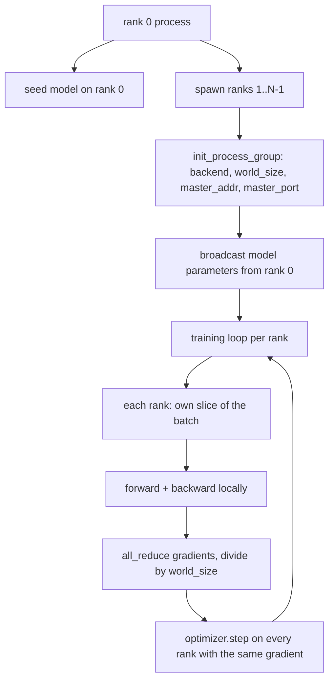
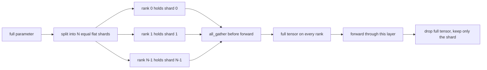

# Paylaştırılmış Veri Paralel ve FSDP sıfırdan

> Çok sıralı eğitim iki kolektif ve bir kuraldır. Başlatma sırasında parametreleri yayınlayın, geriye doğru gradientleri ortalamalayın, asla sıraların hangi adım üzerinde oldukları konusunda anlaşmazlığa düşmesine izin vermeyin.

**Type:** Build
**Languages:** Python
**Prerequisites:** Phase 19 lessons 42 to 45
**Time:** ~90 minutes

## Öğrenme Hedefleri

- N sıralar boyunca bir süreç grubu oluşturun `gloo`Arka uç, özel donanım yok.
- Yapım sırasında parametreleri yayınlayan ve geriye doğru gittikten sonra gradientleri tamamen azaltan minimal bir DDP kapak uygulamak.
- Rank başına gradientlerin tümüyle azaltıldığını, bir zincirlenmiş giriş üzerinde tek süreç gradienti ile eşleştirdiğini kanıtlayın.
- Sketch FSDP parametre parçalanması: her sıra bir parça tutar, tüm tenzor ileri geçiş için toplanır ve sonra düşürülür.

## Sorun

Model tek bir cihaze uyar. Veriler kümesi değil. Optimize bütçesi, bir saniyelik bir duvar saatine N çarpı örnekleri görmek istediğinizi söylüyor. İlk kaldıraç veri paralelidir: her sıra, partide farklı bir parçada aynı modeli çalışır, ardından optimizer adımı öncesinde gradientlerin ortalamalarını hesaplar. İkinci kaldıraç FSDP'dir: model bir cihaze de uymuyor, bu nedenle her sıra her parametrenin bir kısmını tutar ve ileri geçiş sırasında tam tenzor katmanını katman-katman yeniden oluşturur.

Bu yüzden, bu konularda bir sürü şey var: bir sürü şey, bir sürü şey, bir sürü şey, bir sürü şey, bir sürü şey, bir sürü şey, bir sürü şey, bir sürü şey, bir sürü şey, bir sürü şey, bir sürü şey, bir sürü şey, bir sürü şey, bir sürü şey, bir sürü şey, bir sürü şey, bir sürü şey, bir sürü şey, bir sürü şey, bir sürü şey, bir sürü şey, bir sürü şey, bir sürü şey, bir sürü şey, bir sürü şey, bir sürü şey, bir sürü şey, bir sürü şey, bir sürü şey, bir sürü şey, bir sürü şey, bir sürü şey, bir sürü şey, bir sürü şey, bir sürü şey, bir sürü şey, bir sürü şey, bir sürü şey, bir sürü şey, bir sürü şey, bir sürü şey, bir sürü şey, bir sürü şey, bir sürü şey, bir sürü şey, bir sürü şey, bir sürü şey, bir sürü şey, bir sürü şey, bir sürü şey, bir sürü şey, bir sürü şey, bir sürü şey, bir sürü, bir sürü, bir sürü, bir sürü, bir sürü, bir sürü, bir sürü, bir sürü, bir sürü, bir sürü, bir sürü, bir sürü, bir sürü, bir sürü, bir sürü, bir sürü, bir sürü, bir sürü, bir sürü, bir sürü, bir sürü, bir sürü, bir sürü, bir sürü, bir sürü, bir sürü, bir sürü, bir sürü, bir sürü, bir sürü, bir sürü, bir sürü, bir sürü, bir sürü, bir sürü, bir sürü, bir sürü, bir sürü, bir sürü, bir sürü, bir sürü, bir sürü, bir sürü, bir sürü, bir sürü, bir sürü, bir sürü, bir sürü, bir sürü, bir sürü, bir bir sürü, bir sürü, bir bir sürü, bir bir bir, bir sürü, bir bir, bir, bir bir bir bir, bir bir, bir bir bir bir, bir, bir bir bir bir, bir bir, bir bir, bir bir, bir bir, bir bir, bir bir, bir bir, bir, bir, bir, bir, bir, bir, bir, bir, bir, bir, bir, bir, bir, bir, bir, bir, bir, bir, bir, bir, bir, bir, bir, bir, bir, bir, bir, bir, bir, bir, bir, bir, bir, bir, bir, bir,

Bu ders CPU'da çalışmaktadır. CUDA'nın varsayılmadığı.`gloo`PyTorch ' un inşa ettiği ve kabul ettiği her arka uç gemisi .`torch.multiprocessing`İşçiler; aynı kod `nccl`Bir çok GPU düğümünde yapı değişmeden.

## Anlaşım



### Önemli olan iki kolektif

| Collective | What it does | When |
|------------|--------------|------|
| `broadcast` | Copy a tensor from one rank to all others | Parameter init, scheduler state, any one-to-all sync |
| `all_reduce` | Sum (or mean, or max) a tensor across all ranks, every rank gets the result | Gradient averaging after backward |
| `all_gather` | Each rank contributes a tensor, every rank gets the concatenation | Logits collection, FSDP parameter unshard |

DDP sözleşmesi:`broadcast`İnşaat ve`all_reduce`FSDP çizelgesinde eklenir.`all_gather`Her katmanın ileriye geçişinden önce.

### Gradyent ortalama eşleşir tek süreç gradienti

N*B'nin bir parti üzerinde tek bir süreç eğitimi ile aynı gradient üretmek zorunda. Hile, bir sıra gradientlerini toplamak ve N ile bölmek ortalama kayıp gradienti verir.`max-abs-diff < 1e-3`El tüm azaltma gradiyenti ile referans tek süreç gradiyenti arasında.

### FSDP çizelgesi



Hatırlama kazancı tamdır: parametreler için sıralama hafızası 1/N'ye düşer. Maliyet her ileri geçişle ödenen toplanma. Üretim FSDP toplanma ile önceki katmanın hesaplamasıyla örtüşür, bu nedenle duvar saatinin maliyeti naif muhasebe tahminlerinden çok daha küçüktür. Ders her parametrede geri dönüş yapar ve yeniden inşaatın orijinaline biraz eşit olduğunu iddia eder.

### CPU ve kötü arka uç

CUDA üretim hedefi, ama aynı kod yolları CPU'da var. `gloo`CPU'nun kolektif arka uçları.`nccl`Bu, bir dizi metin ile yapılmış bir işlemdir.`backend="gloo"`Ve sıralar doğar.`torch.multiprocessing`- Hayır .`torchrun`İkisi de aynı anda biter .`torch.distributed`Bir çok GPU düğümünde, tek değişiklikler `backend="nccl"`, cihaz tenzorları ve `torchrun`Başlatmak için.

```figure
cg-allreduce-ring
```

## Yapın

`code/main.py`- Bu, kullanılabilir eser.

### Adım 1: İşlem grubu ortaya çıkar

```python
os.environ["MASTER_ADDR"] = "127.0.0.1"
os.environ["MASTER_PORT"] = str(port)
dist.init_process_group(backend="gloo", rank=rank, world_size=world_size)
```

`MASTER_ADDR`ve `MASTER_PORT`Her sıra aynı makineyi paylaşırken çarpışmalardan kaçınmak için bir bağlama ve kapatma hilesi ile serbest bir port seçer.

### İkinci adım: İnşaat sırasında yayın

`MinimalDDP.__init__`Her parametreyi ve tamponu ve çağrıları yürütür .`dist.broadcast(tensor, src=0)`0'nun değerleri kanonik init olur. Bu olmadan, her sıra kendi tohumlarıyla başlatılır ve sıralar adım birinden ayrılır.

### Adım 3: Geriye dönükten sonra tüm gradientleri azaltın

```python
def all_reduce_grads_(module, world_size):
    for p in module.parameters():
        if p.grad is None:
            p.grad = torch.zeros_like(p.data)
        dist.all_reduce(p.grad.data, op=dist.ReduceOp.SUM)
        p.grad.data.div_(world_size)
```

Her sıra aynı ortalama gradiyenti ile sonuçlanır. Optimizer adım şimdi her sıra üzerinde aynı giriş fonksiyonu, bu nedenle parametreler çalışmanın boyunca senkronize kalır.

### 4. Adım: Eşdeğerliği kanıtlayın

`manual_all_reduce_matches_single_process`aynı modeli 0 sırada inşa eder ve tüm azaltma sonrası gradiyentiyi tek bir işlemin birlikte girişi üzerinde hesaplayacağı gradiyenti karşılaştırır.

### Adım 5: FSDP geri dönüş yolculuğu

`fsdp_round_trip_sketch`her parametreyi düzeltir, bir katı `world_size`Bu, parçalanmamış adımdır; tersine (geriye parçalanmış olan) toplanan tensörün bir parçasıdır.

Çek şunu:

```bash
python3 code/main.py
```

Öntanımlı dünya boyutu 2'dir. İki CPU işlemleri doğurulur, birbirleriyle konuşurlar.`gloo`, ve sıfır çıkış.`outputs/ddp-demo.json`Her sıralama için parametreler toplamını, tüm azaltma sonrası gradient normunu, FSDP geri dönüş sonucu ve manuel karşı referans gradient farkını yakalar.

## Kullan

Üretim eğitim yığınları aynı ilkeleri çağırıyor.`DistributedDataParallel`Ekler: geriye dönük tüm azaltma ile üst üste olan, birkaç küçük gradientleri bir kolektif olarak birleştiren geriye dönük, kovalı tüm azaltma ile üst üste olan geriye dönük gradient hakları ve `no_sync`46 ders kullanıldı.

PyTorch'in FSDP ekliyor: katman başına düz bir parametre görünümü böylece her sıra bir bitişik tamponu tutar, bir sonraki katmanın parçalanmamışının şimdiki katmanın hesaplama ile örtüşmesi ve parçalanmalar için seçmeli CPU yükü.

Şekil aynı kalır: başlangıçta yayın, geriye doğru azaltıldıktan sonra, artık uyumsuz olduklarında parçalama parametreleri.

## Gönder

`outputs/skill-distributed-fsdp-ddp.md`Yeni bir eğitim senaryosu için tarif: süreç grubunu `gloo`CPU ve `nccl`GPU için, modeli inşaat sırasında yayınlayan ve geriye doğru azaltan bir DDP kabuğuna sarın, seçeneğiyle FSDP çizgisinden tüm_gather örneği ile parametreleri parçalayın.

## Egzersizler

1. Çabuk koş .`--world-size 4`ve param spread'in koşuşturma boyunca 1e-3'ün altında kalmasını onaylayın.
2. Kılavuz ortalama ile değiştirin `dist.all_reduce(op=dist.ReduceOp.AVG)`Zaman farkı.
3. DDP kapakına bir arka arkaya bir hak ekleyin, böylece tüm azaltma geri kalanıyla örtüşebilir; duvar saati iyileştirmesini ölçün.
4. FSDP yeniden parçalanma adımı uygulayın: ileri geçişten sonra, tam tensörü yeniden yerel parçalanma ile değiştirin.
5. Arka uçları `nccl`CUDA kutusunda hangi çevre değişkenlerinin değişip hangi değişkenlerin aynı kalıpta kaldığını not edin.

## Anahtar Terimler

| Term | What people say | What it actually means |
|------|-----------------|------------------------|
| Backend | "gloo or nccl" | The library that implements the collective ops; gloo is CPU, nccl is GPU |
| World size | "Total ranks" | Number of processes in the group; the group is the unit collectives operate on |
| Rank | "Worker id" | Process identifier within the group, zero indexed |
| All-reduce | "Sum the grads" | Sum a tensor across all ranks, every rank ends with the same result |
| Unshard | "Gather the params" | Reconstruct the full tensor from per-rank slices via all_gather |

## Daha Fazla Okumak

- PyTorch `torch.distributed`Bu ders, kolektif semantik için belgeler oluşturur.
- - Evet .`gloo`Kütüphane kolektif listesi, CUDA tarafından desteklenen listelerle aynı şekilde `nccl`- İlkeler.
- DDP'yi bütünüyle azaltan gradient birikimi kalıbı için 46 ders .`no_sync`- Evet .
- DDP ve FSDP çalışmalar sonrası kontrol nokta düzenlemesi için 19. aşama ders 47.
- Burada çizilen parametre parçalanma üretim uygulaması için PyTorch FSDP belgesini.
