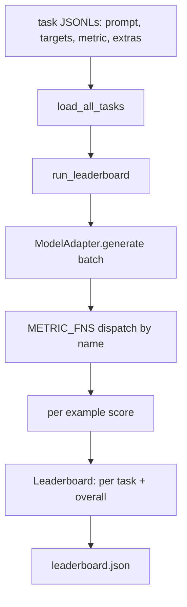
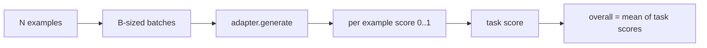

# Dil Değerlendirme Model Harness

> Bir görevde iyi bir performans gösteren bir model, tesadüfen iyi bir performans gösteren bir modeldir.

**Type:** Build
**Languages:** Python
**Prerequisites:** Phase 19 lessons 42 to 45
**Time:** ~90 minutes

## Öğrenme Hedefleri

- Bir görevi JSONL dosyası olarak tanımlayın `prompt`- Evet .`targets`- Evet .`metric`, ve seçmeli `extras`Örneğin.
- Beş ölçüm uygulamak: tam eşleşme, rouge-l F1, yürütülebilir kontrol, çoklu seçim ve alt kat içerik.
- Görev başına örnekler toplayan ve değiştirilebilir bir model adaptörüne gönderen bir koşucu oluşturun.
- Bir göreve puan, gecikme ve yeniden üretilebilir genel bir ortalama ile bir lider tablosu JSON gönderin.

## Sorun

Her hafta yeni bir dil modeli geliyor. Pazarlama iddiası iyi yapıyor. Dürüst bir soru: ne? Dürüst bir cevap kendi yazdığın sıralama tablolarıdır, çünkü satıcının sıralama tabloları onlar tarafından uyarlanmıştır.

Repo'da bir harness olmadan iki modeli vibes ile karşılaştırırsınız. bir harness ile sabit bir metrikle sabit bir görev kümesi üzerinde puan ile karşılaştırırsınız, bir JSON çıkışında farklılık gösterebilirsiniz. Harness dün çalışması ile bugünkü çalışması arasındaki sözleşmedir.

Tuzak, kemerleri tek bir modele fazla bağlıyor. Düzeltme aynı tersine bir tuzak: harnes on beş dakika içinde okunacak kadar küçük, görevler repo'da gönderilmek için yeterince küçük, ölçümler sıfırdan yazılır böylece bir meslektaş onları denetleyebilir ve adapter model-specifik kodun yaşadığı tek yerdir. Adaptörü değiştir, lider çizelgesi hareket eder; görevleri değiştir, lider çizelgesi hareket eder. Başka hiçbir şey hareket etmesin.

## Anlaşım



### Görev özellikleri

Her örnek bir JSONL satırıdır:

```json
{"id": "arith-00", "prompt": "compute: 2 + 2", "targets": ["4"], "metric": "exact_match"}
```

Skorlama yardımcılarına ihtiyaç duyan ölçümler için,`extras`Yan paylı yük taşıyor:

```json
{
  "id": "code-00",
  "prompt": "python: write a function f that doubles its input",
  "targets": ["ok"],
  "metric": "code_exec",
  "extras": {"io_pairs": [[1, 2], [3, 6]]}
}
```

Bir görev bir görevdir .`.jsonl`Dosya:`outputs/tasks/`Dosya adı görev adı. Dosyadaki tüm örnekler bir metrik paylaşır.

### Beş sabit görev

| Task | Metric | What it tests |
|------|--------|---------------|
| arithmetic | exact_match | Token-level correctness on a deterministic answer |
| summary | rouge_l | Longest common subsequence F1 against a one-line reference summary |
| code-exec | code_exec | Executable test: the predicted function must satisfy a list of input-output pairs |
| multiple-choice | multiple_choice | First letter of the prediction must match an allowed letter |
| generation | substring_contains | Free-form text must contain at least one target substring |

### Metrik sözleşme

Her metrik bir fonksiyon .`(prediction, targets, extras) -> float in [0.0, 1.0]`Harness, bir görev puanı elde etmek için örnek başına ortalama puanlar, sonra genel puan almak için ortalama puanlar verir.

- `exact_match`: küçük harfler, çöküş beyaz alan, eşitlik.
- `substring_contains`: aynı normallaşma, alt kat test.
- `multiple_choice`: ilk karakter üstü.
- `rouge_l`: LCS uzunluğu tahmin ve referans uzunlukları, F1 doğruluk ve geri çağırma uzunlukları ile bölünmüştür.
- `code_exec`: tahminini kısıtlı isim alanında gerçekleştirin, çağrı `f(x)`Her giriş-çıçıktı çiftinde, eşleşmeler sayın.

Code_exec metrik, tahminleri bir boşluğun içinde çalıştırır.`import os`patlar çünkü`os`isim alanında değil; bir kod öngörüsü ile dosya sistemine ulaşamazsınız.

### Modelleştiricisi

```python
class ModelAdapter(Protocol):
    def generate(self, prompts: Sequence[str]) -> List[str]: ...
    @property
    def name(self) -> str: ...
```

Adaptör dikiş, ders gemileri.`ToyAdapter`, bir deterministik kalıp eşleşicisi. Bu kalıplardaki her bir istekle ilgili doğru cevabı verir. Gerçek bir adaptör modelini çağırır ve çıkışını gönderir.

### Koşucu

`run_task`seri`batch_size`bir anda uyarlar ve metrik fonksiyona gönderir. `run_leaderboard`Her görevi ve ortalamayı yapıyor.`write_leaderboard`gelecek biçim değişiklikleri için bir şema dizisi ile JSON yayar.



```figure
eval-harness-matrix
```

## Yapın

`code/main.py`- Bu, kullanılabilir eser.

### Adım 1: Tohum sabitleme görevleri

`seed_fixture_tasks(target_dir)`Beşini yazıyor.`.jsonl`Dosyaların ilk seri.`main.py`Dizin boş olduğunda onları tohumlandırır.

### Adım 2: yükleme görevleri

`load_all_tasks(task_dir)`Her şeyi okuyor .`.jsonl`ve görev adı ile bir diktı listesine gönderir `Example`Kayıtlar.`#`ve boş satırlar atlatılır böylece katılımcılar dosyaları notlayabilirler.

### Adım 3: Ölçümleri uygula

Her metrik birim testi ile küçük bir fonksiyondur. Dersin test kümesi normallaşmayı, kısmi örtüşmeyi, kod icrasını ve güvenli olmayan kod reddetmeyi kapsayan 13 vaka içerir.

### Dördüncü adım: Koşucuyu yaz

`run_task`seriyi tekrarlar ve bir `TaskResult`Not, doğru sayım, toplam sayım ve gecikme ile.`run_leaderboard`Tüm görevleri yürütür ve bir `Leaderboard`Genel ortalama ile.

### Adım 5: JSON gönder

`write_leaderboard`- Taşınmayı seriye yaptırıyor.`--include-per-example`Bayrak örnek kayıtlarını atıyor böylece puanlar hareket ederken önceki koşuya karşı tahminleri farklılaştırabilirsiniz.

Çek şunu:

```bash
python3 code/main.py
```

Senaryo ilk atışta armatürleri topuyor, oyuncak adaptörü ile puanlar veriyor (her armatürü doğru tutuyor) ve yazıyor `outputs/leaderboard.json`Oyuncak adaptörü ile toplam puan 1.0 .`test_main.py`Adaptör cevap veremediğinde aynı kemer 0.0 üretir.

## Kullan

Gerçek bir model bağlamak için bir adaptör yaz.

```python
class HttpAdapter:
    name = "vendor.v1"

    def __init__(self, endpoint, api_key):
        self.endpoint = endpoint
        self.api_key = api_key

    def generate(self, prompts):
        out = []
        for prompt in prompts:
            response = http_post(self.endpoint, prompt, self.api_key)
            out.append(response["text"])
        return out
```

Değişme`ToyAdapter`için`HttpAdapter`En üstte `main()`- Harness, görevler, ölçümler ve sıralama çizelgesi aynı kalır.

Gerçek bir proje için harness'i gönderirken uygulanması gereken üç örneğe sahipsiniz:

- **Pin the task files.**Rangerboard.json, hashle tıklanmış görev içeriğini taşıyor veya JSONL'leri yan yana taşıyor; aksi takdirde puan, görev dosyası yaparken hareket eder ve hangisini söyleyemezsiniz.
- **Diff predictions, not just scores.**- Evet .`--include-per-example`Bayrak, puan düştüğü gün modelin ne dediğini görmenizi sağlar.
- **Cap the batch size.**Gerçek adaptörlerin hız sınırları vardır. Küçük bir parti boyutu, satıcılar arasında harness'i uyumlu tutar.

## Gönder

`outputs/skill-lm-eval-harness.md`Reçeti taşıyor: JSONL görev spesifikasyonu, beş metrik, değişebilir adaptör, serici koşucu, lider tablosu JSON ile şema dilimleri.`outputs/tasks/`Bu, bir başlangıç olarak gerçek bir projeye kopyalamak için gerekli olan bir cihaz.

## Egzersizler

1. Yeriğinden yazmak istediğiniz özel bir metrikle altıncı bir görev ekleyin (BLEU gibi örtüşmeler, BLEURT gibi referans puanlamaları, net bir sözleşme olan her şey).
2. Uzaklaştırma`code_exec`Stdout'u yakalamak ve beklenen stdouts'un bir listesini hedef olarak kabul etmek.
3. Bir sıralama çizelgesi farklılığı komutunu ekleyin: iki verildi `leaderboard.json`Dosyaları, hangi görevlerin taşındığını ve ne kadarını yazdırır.
4. Örneğin, bir zaman kesimi ile adaptör çağrısını sarın; ayrı bir yüzey `timeouts`Rütbeler tablosundaki sütun.
5. İş içeriğini sıralama tablosunda sha256 ile işaretle, böylece gelecek okuyucu aynı görevleri notladıklarını doğrulayabilir.

## Anahtar Terimler

| Term | What people say | What it actually means |
|------|-----------------|------------------------|
| Task spec | "The eval format" | JSONL file with prompt, targets, metric, optional extras per example |
| Metric | "How you score" | Function from (prediction, targets, extras) to a float in [0, 1] |
| Adapter | "The model client" | Object with a generate(prompts) -> list[str] method; the only model-specific code |
| Leaderboard | "The scoreboard" | JSON with per-task scores, total counts, latency, and an overall average |
| Code exec metric | "Run it and check" | Execute the prediction in a restricted namespace, compare against input-output pairs |

## Daha Fazla Okumak

- Üretim referansı için orijinal lm değerlendirme harnesini, çok daha büyük ama aynı şekil.
- HuggingFace'ın aynı sözleşmenin alternatif bir uygulaması için açıklaması.
- Eğitim aşamasında kullanılan gradient birikimi kalıpları, harness puanları kapsamaktadır.
- Fase 19 ders 47 puan aldığınız kontrol noktası formatını kapsar.
- Fase 19 ders 48 test altında olan modelin üretilen dağıtılmış eğitim yığını kapsar.
