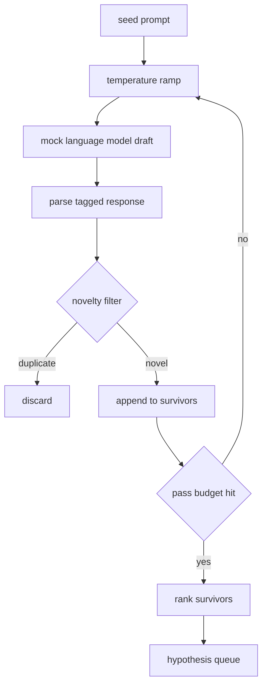

# Hipotez Generatörü

> Aynı soruyu iki kez soran bir araştırma ajanı, para kaybeder ve her çekim yeni bir yere düşer.

**Type:** Build
**Languages:** Python
**Prerequisites:** Phase 19 Track A lessons 20-29
**Time:** ~90 minutes

## Öğrenme Hedefleri
- Bir tohum sorgulamasından bir örnek alıcıyı çalıştırın ve çıkışlarını tiplenmiş hipotez kayıtlarına çevirin.
- Her geçit üzerinde örnekleme sıcaklığını yükselt, böylece bir sonraki çekim sonundan daha uzaklaşır.
- Küçük bir yerleştirme modeli ve cosine mesafe eşiği ile çiftliklere yakın filtreleme.
- Hayatta kalanları yenilik, spesifiklik ve test edilebilirliği birleştiren bir puanlama işlevi ile sıralayın.
- Her adımı belirleyici tutun, böylece aynı tohum her zaman aynı sırayı üretir.

## Neden üretir, sonra filtre eder?

Bir planlayıcı bir modelden bir kez soruyorsa bir hipotezi alır. Bu çalışılmış bir örnek için iyi. Bir araştırma döngüsü için yanlış şekildir. döngü derinliği ile sıralanmış bir kuyruk istiyor, bu yüzden ilk hipotezin başarısız olduğu zaman koşucu bir sonraki örnekleme geçişini ödemeyerek hazırdır.

Bu sırayı oluşturmak için iki fikir birleşiyor. Birincisi sıcaklık yükseltmesidir: örnekleme cihazından her geçişi sıcaklığı bir not yükseltir, bu nedenle daha sonraki taslaklar dolaşmaya teşvik edilir. İkincisi yenilik filtrelenmesidir: her taslaktan sonra jeneratör, önceki hayatta kalanlardan yerleştirme mesafesini ölçer ve kümenin içindeki herhangi bir şeyi reddeder.

Ders, sabit istekler için yazılı belirtiler dizisini geri veren bir sahte dil modeli gönderir. Sınav tam yolu egzersiz etmek için yeterlidir: tohum istekleri, sıcaklık rampası uygulanır, adaylar analiz edilir, yenilik filtresi çalıştırılır, sıra sıra dışı sırada yer alır.

## Hipotez şekli

```text
Hypothesis
  id             : int           (monotonic within a run)
  text           : str           (the claim)
  variables      : list[str]     (what changes between conditions)
  metric         : str           (what the runner will measure)
  baseline_ref   : str | None    (which paper or run the comparison cites)
  draft_pass     : int           (which sampler pass produced this)
  temperature    : float         (the sampler setting at draft time)
  novelty_score  : float         (distance from prior survivors, 0..1)
  rank_score     : float         (weighted sum used for ordering)
```

`variables`ve `metric`Bu alanlar, deney yapılandırmasını oluştururken, 52 dersindeki koşucu bu alanları doğrudan okuyor.

`baseline_ref`Eğer bir değerlendirme teorisi geçersizse değerlendirici aynı metrikte önceki çalışmaya geri döner.

```figure
cg-novelty-ramp
```

## Mimarlık



İlginç olan her kutuda zor bir sözleşme vardır.

## Temperatür rampası

Başlayın .`t_min`, sonunda `t_max`, adım `(t_max - t_min) / (n_passes - 1)`. Her geçiş, numuneyi mevcut sıcaklıkta çağıracak ve `n_passes`                `GeneratorConfig.schedule()`. Sahte model , küçük bir dizi senaryolu cevap arasında geçiş yaparak sıcaklığı onurlandırır .`(prompt, temp_bucket)`Bu nedenle, sıcaklıkta küçük bir değişiklik farklı bir kova seçer ve farklı bir tasma üretiyor.`temperature=t`Geçti.

Öntanımlı program 6 geçişten `0.2`- ...`1.2`Altı, yenilik filtresi tarafından reddedilecek olan örnekler için ödeme yapmadan sırayı doldurmak için yeterli.`0.2`Model tohumları geri bırakır.`1.2`Cevaplar konuyu terk eder ve analizciyi başarısız eder.

## Yenilik Filtresi

Her taslak analiz edildikten sonra, jeneratör metni yerleştirir ve kabul edilen her hipotezle karşılaştırır. Yerleştirme, birim uzunluğuna normalleştirilen küçük bir kelime simgesi torbasıdır. İki birim vektörü arasındaki kozine mesafe `1 - dot(a, b)`Bir taslak , önceki hayatta kalanlardan en az uzaklığından daha fazlasa geçer .`novelty_threshold`Öntanımlı olarak `0.25`- Evet .

Hashed gömülme süslü değildir. Deterministiktir, sıfır bağımlılıklara sahiptir ve açık durumun yakalanması için yeterlidir: çoğu isimlerini paylaşan iki taslak. Bir üretim dağıtımı küçük bir cümle modelinde değişir. Arabirim aynı kalır.

## Rank puanı

```text
rank_score = w_novelty * novelty_score
           + w_specificity * specificity_score
           + w_testability * testability_score
```

Üç alt puan.`novelty_score`- Önceki hayatta kalanlardan en az yerleşim mesafesi.`specificity_score`- Hütütede bulunan belirli değişkenlerin sayı, hedef sayı ile bölünür.`testability_score`Eğer hipotez hem bir metrik hem de bir temel çizgiyi belirtirse, sadece bir metrik varsa yarısı, aksi takdirde sıfırdır.

Öntanımlı ağırlıklar `0.4`- Evet .`0.3`- Evet .`0.3`Ağırlıklar jeneratör yapılandırmasında yaşıyor böylece aşağıdaki dersler kodu kırmadan değiştirebilir.

## Sahte dil modeli

```python
class MockLLM:
    def sample(self, prompt: str, temperature: float, seed: int) -> str:
        ...
```

Örneklemeci bir  `(prompt, temperature, seed)`Triple.Screptli bir cevap tablosunu klavye ile açar.`(prompt_signature, temperature_bucket)`Tablonun bir anahtar için giriş bulunmadığı takdirde, örneklemeci bir arıza gönderir ve analizci başarısız olur.

Tohum tepkiye karışır .`(prompt, temperature)`Testlerde, sonuçları yeniden üretilebilir hale getirmek için tohumları sıkıştırırız. Gerçek bir dağıtımda tohum bir sistem saatinden veya bir sayıcıdan gelir.

## Çıktı sırası

Çıktı listesi `Hypothesis`Kayıtlar `rank_score`52 dersindeki koşucu başını vurur, deneyi yürütür ve 53 dersindeki değerlendirici bir hüküm yazar. Eğer hüküm hipotezin yanlış olduğunu söylerse koşucu bir sonraki hipotezi vurur.

Sıradışı bir şekilde boş kalırsa orkeströr ya tohum sorguyu genişletebilir ve jeneratörü tekrar çalıştırır ya da durdurup bütçenin tükendiğini bildirir.

## Şifreyi nasıl okuyabilirsiniz

`code/main.py`tanımlar `Hypothesis`- Evet .`MockLLM`- Evet .`HypothesisGenerator`Bu bir tek bir tane ortaya çıkarır.`run(seed_prompt)`Sorunlu bir kuyruk gönderir; geçiş sayısı `GeneratorConfig.n_passes`Bu, bir argüman olarak geçerli olmaktan daha çok. İçeri gömülme bir hashed torbası simgeler. Yenilik filtresi tek bir fonksiyon.`numpy`Matematikler tamamen STDlib'dir. Bu yüzden ders taşınabilir kalır.

`code/tests/test_generator.py`Düzsel yol, çift reddetme yolu, analizçi başarısızlığı yolu, sıcaklık ramp sınırları ve sıra sıralamasını kapsar.

## Bu boşluklar nerede

Beşinci ders sırayı oluşturur. Beşinci ders sıradan başını alır ve onu doğrulamak veya reddetmek için bir literatür arama yapar. Beşinci ders aynı başı alır ve gerçek bir deney yapar. Beşinci ders hem çıkışları okuyor hem de bir hüküm yazar. Dört ders, bir insan olmadan bir araştırma döngüsüne dönüşür; bir insan herhangi bir sınırda adım atabilir.
