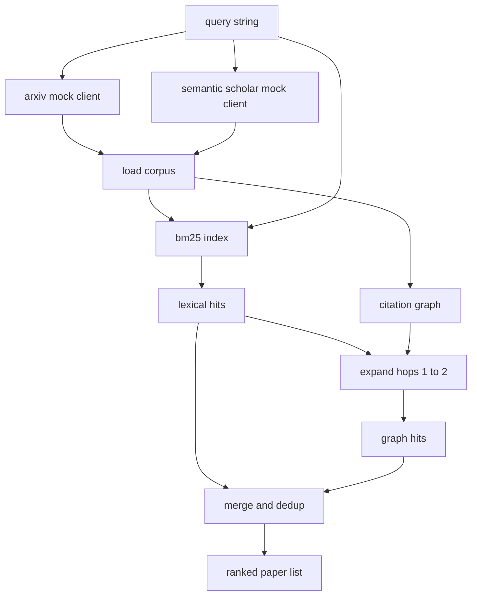

# Yayınları Aramak

> Bir hipotez ucuz. Birinin bunu kanıtladığını bilmek pahalı bir şeydir.

**Type:** Build
**Languages:** Python
**Prerequisites:** Phase 19 Track A lessons 20-29
**Time:** ~90 minutes

## Öğrenme Hedefleri
- Çubuk aşağıya doğru okuyacakları alanlarla küçük bir kağıt kaydı modeline.
- Sadece stdlib veri yapıları ile özetler üzerine BM25 indeksi oluşturun.
- Sözcük aramaları kayıp olan kağıtların yüzeyine alıntı grafikini yürüyün.
- Deduplikat, leksik ve grafik üzerinde sabit bir kağıt kimliği ile geçer.
- İki sahte dış API'yi tek bir istemcinin arkasına sarın, böylece gerçek uç noktalar yerleştikten sonra yukarıdaki arama sitesi aynı kalır.

## Neden iki tane çıkış geçiyor?

Özetler üzerinde anahtar kelime arama, sorunun kelime birikimi ile paylaşan makaleleri gönderir. Bu yüzeyin büyük kısmını kaplar. İki davayı kaçırmış. İlk olarak, temel makale farklı kelime birikimi kullanırken; örneğin "sparse attention" sorusu "transformer yönlendirmeinde blok seçimi" başlıklı bir makaleyi kaçırır.

Ders, iki geçişi de oluşturur. BM25 özetler üzerinde leksik hitleri yakalar. Bir alıntı grafi geçişi bir veya iki hop ile ileriye ve geriye atılan bir tohumun genişletilmesini sağlar. Birlik kağıt id ile çoğaltılır ve küçük bir kombinasyon puanı ile sıralanır.

## Kağıt şekli

```text
Paper
  id          : str           (stable identifier, "p001" for the mock corpus)
  title       : str
  abstract    : str
  year        : int
  authors     : list[str]
  references  : list[str]     (paper ids this paper cites)
  citations   : list[str]     (paper ids that cite this paper)
  source      : str           (which mock api supplied it, "arxiv" or "s2")
```

Referans ve alıntı alanları yönlendirilmiş alıntı grafikini oluşturur. İki sahte API üst üstelik aynı alanları değil, böylece corpus loader onları birleştirir.`id`- Evet .

```figure
cg-citation-hops
```

## Mimarlık



Arama istemcisi hem geçiş hem de birleşme sahibi. Çağrıcı ona bir sorgu verir ve her giriş için kağıt puan alanları bulunan sıralama listesi alır (`bm25_score`- Evet .`graph_distance`- Evet .`recency_score`- Evet .`final_score`) sıralamayı açıklar.

## BM25 sıfırdan

Uygulama standart Okapi BM25 standartı ve varsayılan parametrelerle `k1=1.5`- Evet .`b=0.75`İndeks iki sözlükten oluşur:`term -> doc_frequency`ve `term -> list of (doc_id, term_count)`. Belge uzunluğu, soyutun simge sayısını oluşturur. Ortalama belge uzunluğu indeks oluşturma süresinde bir kez hesaplanır. Bir sorguyu puanlamak sorgu terimlerinin toplamıdır `idf * tf_norm`nerede`tf_norm`BM25 uzunluğu standart normalanmış term frekansıdır.

- İşaretçi .`lower`Bir üretim sistemi küçük bir votörde değişir.

```text
idf(t)      = log((N - df + 0.5) / (df + 0.5) + 1.0)
tf_norm(t)  = (f * (k1 + 1)) / (f + k1 * (1 - b + b * dl / avgdl))
score(d, q) = sum over t in q of idf(t) * tf_norm(t)
```

## İfadeler grafik geçiş

Graf bir kere korpustan yapılır. Ön kenarları bir kağıttan referanslarına gider. Geri kenarları bir kağıttan alıntılarına gider. Geçit, en üst BM25 vurmaları tarafından tohumlanmış bir genişlik ilk arama, iki hop'da kapalıdır.

İki hop, kasıtlı bir tavandır. Bir hop çok sığdır; ajan genellikle yakın ata veya soyluyu ister. Üç hop, bağlantılı bir grafikte sonuç boyutunu patlatır ve konuyu saptırmaya eğilimlidir. Ders hop sınırını bir yapılandırma düğmesi olarak ortaya koyar, böylece aşağıdaki bir döngü onu sıkılaştırabilir.

## Depo ve sıralama

İki geçiş üst üste olan setleri geri verir. Kağıt kimliği üzerinde birleşme anahtarları. Her kağıt için son puan ağırlıklı bir karışımdır.

```text
final_score = w_bm25 * bm25_score_norm
            + w_graph * graph_score
            + w_recency * recency_score
```

`bm25_score_norm`BM25 puanı birleşik setdeki maksimum BM25 puanı ile bölünür (böylece alan sıfırdan bire kadar yaşar). `graph_score`- Bu doğrudan leksikal saldırı için bir şey.`0.6`Bir atış için,`0.3`İki at için sıfır.`recency_score`en az yılın sıfırından en fazla birine kadar bir çizgi rampadır.

Öntanımlı ağırlıklar `0.5`- Evet .`0.3`- Evet .`0.2`Ağırlıklar bir şekilde ayarlanmıştır; eski bir konu, sonuncuları yavaşlatabilirken hızlı hareket eden bir konu onu yükseltebilir.

## Sahte corpus

Bu kitap 100 makaleden oluşuyor.`build_corpus()`. Her makale beş konudan biri üzerine el yazılı bir başlık ve özet vardır: dikkat kısıtlılığı, geri alma artışı, düşük sıralama adaptörleri, veri kümesi destilasyonu ve değerlendirme harneleri. İpuçlar ve alıntılar kablo yapılmıştır, böylece her konu birkaç çapraz konu kenarıyla bağlantılı bir alt grafik oluşturur.

İki sahte API istemcisi (`ArxivMockClient`- Evet .`SemanticScholarMockClient`Arxiv, başlık, özet, yıl, yazarları gönderir. Semantic Scholar referans ve alıntılar ekler. ID'deki istemci birlikleri; istemci çapındaki anlaşmazlıkların ele alınması bir takip dersi için ertelenir.

## 52 ve 53 dersleri neyi okuyor

52 dersindeki koşucu okuyor .`paper.id`- Evet .`paper.title`Bu deney için en üst üç cümleyi özetleyerek deney için bir bağlam oluşturur.`paper.year`ve `paper.references`Bir baselineyi belirli bir makaleye atfetmek için.

Arama istemcisi bir `RetrievalResult`Hem sıralama listesi hem de her sorgu ölçümleri ile: vurma sayısı, ortalama puan, en yüksek puan, toplam duvar süresi.

## Şifreyi nasıl okuyabilirsiniz

`code/main.py`tanımlar `Paper`- Evet .`ArxivMockClient`- Evet .`SemanticScholarMockClient`- Evet .`BM25Index`- Evet .`CitationGraph`- Evet .`RetrievalClient`BM25 uygulaması bir sınıf, altmış satır. Grafik geçiş bir yöntemdir.

`code/tests/test_retrieval.py`Leksikal yolu, grafik yolu, birleşim, dedup ve boş sorguyu kapsar.

## Bu boşluklar nerede

Beşinci ders bir hipotezi üretir. Beşinci ders birinci ders, bu hipotezin zaten çözülüp çözülmediğini görmek için literatürde araştırır. Beşinci ders, eğer çözülmediyse deneyi yürütür. Beşinci ders, hem geri alınma sonucu hem de yargıyı yazmak için deney metriklerini okuyor. Geri alınma istemcisi dört aşamalın en ucuzudur ve orkestratorda ilk çalışır.
