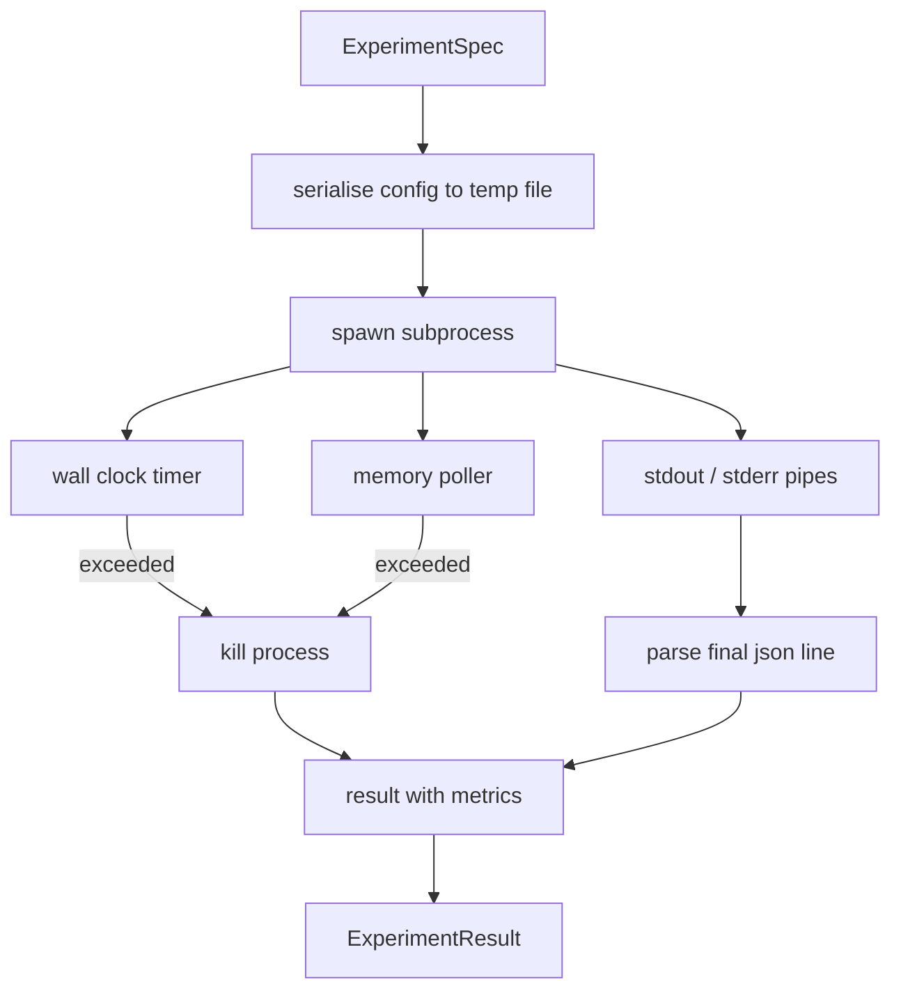

# Deneyim Koşucu

> Bu döngü ölçümleri kadar dürüstdür. Bir spesifikasyon alan, kum kutu alt işleminde uygulanıp değerlendiriciye güvenebilecek bir json metrik blob gönderir.

**Type:** Build
**Languages:** Python
**Prerequisites:** Phase 19 Track A lessons 20-29
**Time:** ~90 minutes

## Öğrenme Hedefleri
- Bir deneyi, koşucu'nun bir alt işlemde seriye edebileceği bir tipleme özellik olarak kodlayabilir.
- Sert bir duvar saat vakti ve yumuşak bir hafıza kapısı ile bir alt işlem başlatın ve her ikisi de terminal koşullar olarak ortaya çıkın.
- Stdout, stderr ve yapılandırılmış metrikleri tek bir sonuç kaydına yerleştirin.
- Bir defada bir yapılandırma düğmesine sabit bir temel spesifikasyon üzerinde tarayan bir ablation tablosu oluşturun.
- Her sonucu bir tohum vererek belirleyici tutun, böylece değerlendirici aynı sayıları koşular boyunca görür.

## Neden bir alt işlem

Bir araştırma döngüsü güvenilmeyen kod çalıştırır. Hipotez bir örneklemeciden geldi, deney senaryosu aynı yoldan geldi; işlem içinde güvenli olarak tedavi etmek orkestrayı aşağıya çeken bir çöküş gerektirir. Alt işlemler dil gemileri en basit izolasyondur: ayrı bir süreç, bağımsız bir adres alanı, ana tarafta bir sinyal elini.

Bu durumda, koşucunun tam sandboxing uygulaması yoktur. Cgroup, seccomp filtre, isim alanı yeniden düzenlemesi yoktur. Yaptığı şey bir duvar saat zamanlaması, hafıza büyümesi için bir oylama döngüsü ve her iki sınırda da süreci sona erdiren bir öldürme yolu. Bu, daha karmaşık bir kum kutu uzattıkça koşuş zaman sözleşmesidir. Ders sözleşmeyi bir oturma içinde okuyacak kadar küçük tutar.

## ExperimentSpec şekli

```text
ExperimentSpec
  spec_id        : str            (stable id, "exp_001")
  hypothesis_id  : int            (link back to the queue from lesson 50)
  script_path    : str            (path to the python script to run)
  config         : dict           (passed to the script as one json arg)
  seed           : int            (deterministic seed for the experiment)
  wall_timeout_s : float          (hard timeout, killed on exceed)
  memory_cap_mb  : int            (soft cap, polled; killed on exceed)
  metric_keys    : list[str]      (which fields the evaluator will read)
```

Scenari disk üzerinde yaşar; koşucu, senaryo okuyan bir geçici dosya yoluna yapılandırmayı yazar.`metric_keys`Stdout'ta kalan her şey kaydedildi ama metrik analizörü tarafından göz ardı edildi.

```figure
cg-runner-limits
```

## Mimarlık



Yarışçı, bir sınıf ve bir ana yöntemdir.Soru sorgulaması, her seçim aralığında bir kez uyanıp alt işlemleri okuyan küçük bir ipektir.`psutil`Proc dosya sisteminden eşdeğer, mevcut olduğunda, platform tarafından açıklanmadığında hiçbir iş yapılmıyor.

## Neden yumuşak bir hafıza kapağı

Hard hafıza kapakları lazım .`resource.setrlimit`Sınıf, bir süreci kontrol ederken, bir süreci kontrol altına alabilir ve sadece POSIX'de çalıştırır. Ders taşınabilir bir yaklaşım sunuyor: platformdan oturan set boyutunu sorgulamak ve kapıyı aşarsa alt işlemleri öldürmek. Kapı yumuşak çünkü sorgulamada sıfır dışı bir ara vardır; bir süreç, seçimler arasındaki kapın üzerinde tırmanıp sonra geri düşebilir. Koşucu, gözlemlenen maksimum RSS kaydeder, böylece değerlendirici koşunun sınırına ne kadar yakın olduğunu görebilir.

Proces denetimi desteği olmayan sistemlerde, sorguya alınan bir kez uyarı kaydeder ve kendini devre saatinin zamanlaması hala geçerlidir.

## Yaptığım şey ve yaptığım şey

Koşucu, tamamlandığında boşaltılan her iki boruyu da okuyor. Stdout çizgi çizgi olarak taralır; gereken tüm ile json olarak analiz eden son satır.`metric_keys`Daha önceki json çizgiler sonuçta`intermediate_metrics`; değerlendirici bunları öğrenme eğrilikleri için kullanabilir.

Stderr, sonuçta sözcük anlamda yer alır. Koşucu asla sıfır dışı çıkış kodu üzerinde yükseltmez; bunun yerine, sonuçta kodu kaydeder.`"crash"`Eğer bir metrik yazılırsa, değerlendirici kısmi çalışmalar için default olarak hatalar yapar.

## Ablation tablosu

```python
def ablate(base: ExperimentSpec, knob: str, values: list[Any]) -> list[ExperimentSpec]:
    ...
```

Bir temel spesifikasyon ve bir düğme adı verildiğinde, yardımcı,  ile değer başına bir spesifikasyon gönderir.`config[knob]`Her bir özellik bir türev alır.`spec_id`(`f"{base.spec_id}_{knob}_{value}"`                                                                                                                                                                                                                                                                                                                                                                                                                                                                                                                             `AblationRunner`Bu da onları düzenleyip bir `AblationTable`Kürek değeri ile belirlenmiş.

Neden bir düğme bir seferde. Tam faktorial sweeps eksponensel olarak patlar ve değerlendirici yorumlayamayan sonuçlar üretir. Bir düğme bir seferde değerlendirici çizebilen temiz bir ekseni üretir. Ders sadece tekrarlanan tek düğme ablations olarak multi-knob sweeps destekler.

## Determinizm

Her spec bir tohum taşır. koşucun tohumları konfig dikt yoluyla yazıya aktarır (`config["__seed"] = spec.seed`                                                                                                                                                                                                                                                                                                                                                                                                                                                                                                                             `code/experiments/`Bu, bir dizi dizi dizi dizi dizi dizi dizi dizi dizi dizi dizi dizi dizi dizi dizi dizi dizi dizi dizi dizi dizi dizi dizi dizi dizi dizi dizi dizi dizi dizi dizi dizi dizi dizi dizi dizi dizi dizi dizi dizi dizi dizi dizi dizi dizi dizi dizi dizi dizi dizi dizi dizi dizi dizi dizi dizi dizi dizi dizi dizi dizi dizi dizi dizi dizi dizi dizi dizi dizi dizi dizi dizi dizi dizi dizi dizi dizi dizi dizi dizi dizi dizi dizi dizi dizi dizi dizi dizi dizi dizi dizi dizi dizi dizi dizi dizi dizi dizi dizi dizi dizi dizi dizi dizi dizi dizi dizi dizi dizi dizi dizi dizi dizi dizi dizi dizi dizi dizi dizi dizi dizi dizi dizi dizi dizi dizi dizi dizi dizi dizi dizi dizi dizi dizi dizi dizi dizi dizi dizi dizi dizi dizi dizi dizi dizi dizi dizi dizi dizi dizi dizi dizi dizi dizi dizi dizi dizi dizi dizi dizi dizi dizi dizi dizi dizi dizi dizi dizi dizi dizi dizi dizi dizi dizi dizi dizi dizi dizi dizi dizi dizi dizi dizi dizi dizi dizi dizi dizi dizi dizi dizi dizi dizi dizi dizi dizi dizi dizi dizi dizi dizi dizi dizi dizi dizi dizi dizi dizi dizi dizi dizi dizi dizi dizi dizi dizi dizi dizi dizi dizi dizi dizi dizi dizi dizi dizi dizi dizi dizi dizi dizi dizi dizi dizi dizi dizi dizi dizi dizi dizi dizi dizi dizi dizi dizi dizi dizi dizi dizi dizi dizi dizi dizi dizi dizi dizi dizi dizi dizi dizi dizi dizi dizi dizi dizi dizi dizi dizi dizi dizi dizi dizi dizi dizi dizi dizi dizi dizi dizi dizi dizi dizi dizi dizi dizi dizi dizi dizi dizi dizi dizi dizi dizi dizi dizi dizi dizi dizi dizi dizi dizi dizi dizi dizi dizi dizi dizi dizi dizi dizi dizi dizi dizi dizi dizi dizi dizi dizi dizi dizi dizi dizi dizi dizi dizi dizi dizi dizi dizi dizi dizi dizi dizi dizi dizi dizi dizi dizi dizi dizi dizi dizi dizi dizi dizi dizi dizi dizi dizi dizi dizi dizi dizi dizi dizi dizi dizi dizi dizi dizi dizi dizi dizi dizi dizi dizi dizi dizi dizi dizi dizi dizi dizi dizi dizi dizi dizi dizi dizi dizi dizi dizi dizi dizi dizi dizi dizi dizi dizi dizi dizi dizi dizi dizi dizi dizi dizi dizi dizi dizi dizi dizi dizi dizi dizi dizi dizi dizi dizi dizi dizi dizi dizi dizi dizi dizi dizi dizi dizi dizi dizi dizi dizi dizi dizi dizi dizi dizi dizi dizi dizi dizi dizi dizi dizi dizi dizi dizi dizi dizi dizi dizi dizi dizi dizi dizi dizi dizi dizi dizi dizi dizi dizi dizi dizi dizi dizi dizi dizi dizi dizi dizi dizi dizi dizi dizi dizi dizi dizi dizi dizi dizi dizi dizi dizi dizi dizi dizi dizi dizi dizi dizi dizi dizi dizi dizi dizi dizi dizi dizi dizi dizi dizi dizi dizi dizi dizi dizi dizi dizi dizi dizi dizi dizi dizi dizi dizi

## Sahte deney senaryosu

Ders bir deney senaryosunu gönderir:`code/experiments/sparsity_experiment.py`Bu, yapılandırma dosyasını okuyan, küçük bir eğitim koşusunu numpy rastgele geçişle simüle eden ve bir json metrik blob'u yazdırırır.`sleep_s`Test zamanları için düğme ve `allocate_mb`Hatırlama sorgulamasını test etmek için bir düğme.

Simülasyon gerçek bir şey eğitmiyor. Bu bir eğitim döngüsünün şeklini taklit eden bir sayısal hesaplama: bir kayıp eğri, son karışıklık, bir duvar zaman. Dersin amacı simülasyon değil, koşucu. Gerçek bir deney senaryosu bir model ithal eder.

## Sonuç şekli

```text
ExperimentResult
  spec_id              : str
  hypothesis_id        : int
  exit_code            : int
  terminal             : "ok" | "timeout" | "oom" | "crash"
  wall_time_s          : float
  peak_rss_mb          : float | None
  metrics              : dict
  intermediate_metrics : list[dict]
  stdout_tail          : str
  stderr_tail          : str
```

Değerlendirici okur `metrics`ve `terminal`İlk olarak, terminalden başka bir şey varsa...`"ok"`deney başarısız bir çalışmadır ve değerlendirici kararı otomatikdir.

## Şifreyi nasıl okuyabilirsiniz

`code/main.py`tanımlar `ExperimentSpec`- Evet .`ExperimentResult`- Evet .`ExperimentRunner`- Evet .`AblationRunner`Bu, bir sınıfın alt işlem yönetiminin bir parçasıdır.

`code/experiments/sparsity_experiment.py`Argv'den yapılandırma dosyası yolunu okuyor ve tamamlandığında tek bir json metrik satırı yazar.

`code/tests/test_runner.py`Başarılılık yolu, zaman çıkış yolu, çarpışma yolu, ablasyon tablosu ve iki koşuda belirleme kontrolünü kapsar.

## Bu boşluklar nerede

Beşinci ders hipotezi oluşturur. Beşinci ders bir edebiyatın zaten karar verdiği her şeyi filtreliyor. Beşinci ders iki deneyi kalanlar için çalışır. Beşinci ders üç sonucu okuyor, anlam testi yürütüyor ve orkeströrün hipotezi id karşıdaki hüküm yazıyor.
